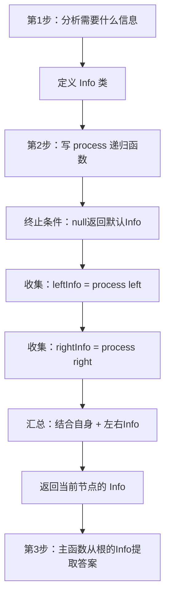

# 树形DP详解
## 一、什么是树形DP？
**树形DP = 在树上做动态规划**。每个节点向左右孩子**收集信息**，汇总后**向上汇报**，最终根节点拿到全局答案。
**一句话定义**：自底向上，每个节点问孩子要信息，加上自己的信息，打包向上汇报。
## 二、用公司汇报来理解
```
想象一个公司，CEO想知道"全公司谁工资最高"：
CEO不会直接问每个员工（暴力遍历）
而是：
  1. 各部门经理先汇总自己部门的最高工资  ← 子问题
  2. 把结果报告给副总裁
  3. 副总裁汇总后报告给CEO
  4. CEO从汇总的信息里得出全公司最高工资  ← 最终答案
每一层只关心"孩子汇报上来的信息" + "自己的信息"
不需要知道更底层的细节
```
```
         CEO（汇总全公司）
        /              \
    副总裁A              副总裁B
    (汇总A部门)          (汇总B部门)
    /       \            /      \
  经理1    经理2       经理3    经理4
  (汇总组1) (汇总组2)  (汇总组3) (汇总组4)
信息从底层员工 → 经理 → 副总裁 → CEO，层层汇报
```
## 三、树形DP的通用套路
### 三步走
```
第1步：定义 Info 类 — 每个节点需要向上汇报什么信息？
第2步：写递归函数 — 收集左右孩子的 Info，结合自身，生成自己的 Info
第3步：主函数 — 调用递归，从根节点的 Info 中提取答案
```
### 通用代码模板
```java
// 第1步：定义信息类
class Info {
    // 需要向上汇报的所有信息
    int xxx;
    boolean yyy;
    // ...
    Info(int xxx, boolean yyy) {
        this.xxx = xxx;
        this.yyy = yyy;
    }
}
// 第2步：递归函数（后序遍历）
Info process(TreeNode node) {
    // 终止条件：空节点返回默认Info
    if (node == null) {
        return new Info(默认值);
    }
    // 向左右孩子收集信息
    Info leftInfo = process(node.left);
    Info rightInfo = process(node.right);
    // 结合自身 + 左右信息，生成当前节点的Info
    int xxx = 根据leftInfo, rightInfo, node.val 计算;
    boolean yyy = 根据leftInfo, rightInfo 判断;
    return new Info(xxx, yyy);
}
// 第3步：主函数
int answer(TreeNode root) {
    Info rootInfo = process(root);
    return rootInfo.xxx;  // 从根节点的Info中提取答案
}
```
## 四、用经典题目理解
### 例1：LC104 二叉树最大深度（最简单的树形DP）
```
需要汇报的信息：深度（一个int就够了，不需要Info类）
Info = int（深度）
收集：左深度、右深度
汇总：max(左, 右) + 1
```
```java
int maxDepth(TreeNode root) {
    if (root == null) return 0;          // 空节点：深度0
    int left = maxDepth(root.left);       // 收集左
    int right = maxDepth(root.right);     // 收集右
    return Math.max(left, right) + 1;     // 汇总
}
```
> LC104 太简单了，Info 就是一个 int，不需要专门定义类。但本质上就是树形DP。
### 例2：LC543 二叉树直径（需要两种信息）
```
需要汇报的信息：深度（给父节点用）
额外需要维护的信息：最大直径（全局答案）
这里用全局变量代替了 Info 类
```
```java
int max = 0;
int dfs(TreeNode node) {
    if (node == null) return 0;
    int left = dfs(node.left);
    int right = dfs(node.right);
    max = Math.max(max, left + right);    // 额外信息：更新直径
    return Math.max(left, right) + 1;     // 汇报信息：深度
}
```
> 返回值是"给父节点的信息"，全局变量是"额外维护的答案"。如果用 Info 类可以把两者统一。
### 例3：LC236 最近公共祖先（完整的Info类）
```
需要汇报的信息：
  - findA：是否找到了节点A
  - findB：是否找到了节点B
  - node：LCA节点是谁
```
```java
class Info {
    boolean findA;   // 这棵子树里有没有A
    boolean findB;   // 这棵子树里有没有B
    TreeNode node;   // LCA（如果已经找到的话）
}
Info process(TreeNode x, TreeNode a, TreeNode b) {
    if (x == null) return new Info(false, false, null);
    // 收集左右
    Info leftInfo = process(x.left, a, b);
    Info rightInfo = process(x.right, a, b);
    // 汇总
    boolean findA = (x == a) || leftInfo.findA || rightInfo.findA;
    boolean findB = (x == b) || leftInfo.findB || rightInfo.findB;
    TreeNode ans = null;
    if (leftInfo.node != null) ans = leftInfo.node;
    else if (rightInfo.node != null) ans = rightInfo.node;
    else if (findA && findB) ans = x;
    return new Info(findA, findB, ans);
}
```
### 例4：LC110 平衡二叉树（Info包含两种信息）
```
需要汇报的信息：
  - 高度：父节点需要知道子树高度
  - 是否平衡：左右高度差不超过1
```
```java
class Info {
    int height;
    boolean isBalanced;
    Info(int h, boolean b) { height = h; isBalanced = b; }
}
Info process(TreeNode node) {
    if (node == null) return new Info(0, true);
    Info left = process(node.left);
    Info right = process(node.right);
    int height = Math.max(left.height, right.height) + 1;
    boolean balanced = left.isBalanced && right.isBalanced
                    && Math.abs(left.height - right.height) <= 1;
    return new Info(height, balanced);
}
```
## 五、怎么设计 Info 类？
### 思考方法：问自己两个问题
```
问题1：这个节点需要向父节点汇报什么？
  → 这些就是 Info 的字段
问题2：要算出这些信息，需要从左右孩子那里知道什么？
  → 通常和问题1的答案一样（左右孩子也汇报同样的信息）
```
### 常见 Info 字段
| 题目 | Info 字段 | 说明 |
|------|----------|------|
| LC104 最大深度 | `int depth` | 太简单，直接用返回值 |
| LC543 直径 | `int depth` + 全局`max` | 深度汇报 + 额外维护直径 |
| LC110 平衡二叉树 | `int height, boolean balanced` | 高度 + 是否平衡 |
| LC236 LCA | `boolean findA, findB, TreeNode node` | 是否找到A/B + LCA |
| LC337 打家劫舍III | `int rob, int notRob` | 偷这个节点的最大值 / 不偷的最大值 |
| LC124 最大路径和 | `int maxGain` + 全局`max` | 单边最大贡献 + 全局最大路径 |
## 六、树形DP vs 普通递归的区别
```
普通递归（如LC104）：
  返回值就是答案本身
  一个 int 就够了
树形DP（如LC236）：
  返回值是"信息包"（Info）
  包含多个字段，父节点需要多种信息才能做判断
  Info 类就是"汇报表"
```
```
判断标准：
  如果一个 int 返回值就够 → 普通递归就行
  如果需要返回多种信息   → 用 Info 类 = 树形DP
```
## 七、树形DP流程图

## 八、一句话总结
```
树形DP = 后序遍历 + Info信息收集
每个节点：
  1. 问左右孩子要 Info（收集）
  2. 结合自己的信息（汇总）
  3. 打包成新的 Info 向上汇报（返回）
根节点的 Info 就是最终答案
记住：自底向上，层层汇报，就像公司的汇报体系
```