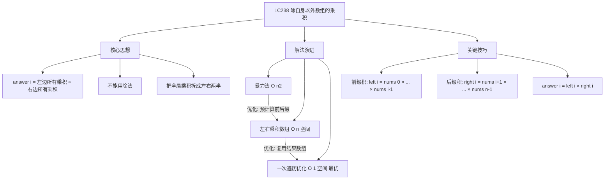
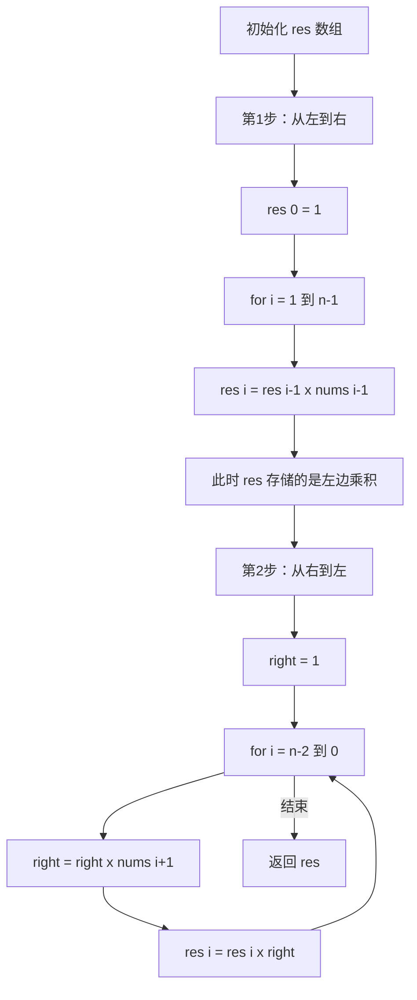

# LC238 除自身以外数组的乘积
## 一、题目描述
给你一个整数数组 `nums`，返回数组 `answer`，其中 `answer[i]` 等于 `nums` 中除 `nums[i]` 之外其余各元素的乘积。
题目数据**保证**数组中任意元素的全部前缀元素和后缀的乘积都在 32 位整数范围内。
**不能使用除法**，且要求 O(n) 时间复杂度。
**示例1：**
```
输入：nums = [1,2,3,4]
输出：[24,12,8,6]
解释：
answer[0] = 2×3×4 = 24
answer[1] = 1×3×4 = 12
answer[2] = 1×2×4 = 8
answer[3] = 1×2×3 = 6
```
**示例2：**
```
输入：nums = [-1,1,0,-3,3]
输出：[0,0,9,0,0]
```
**约束：**
- 2 <= nums.length <= 10^5
- -30 <= nums[i] <= 30
- 不能使用除法
- **进阶**：在 O(1) 额外空间复杂度内完成（输出数组不算额外空间）
---
## 二、解法概览
### 解法对比表
| 解法 | 时间复杂度 | 空间复杂度 | 面试推荐 |
|------|-----------|-----------|---------|
| 暴力法 | O(n²) | O(1) | ❌ 不推荐 |
| 左右乘积数组 | O(n) | O(n) | ✅ 普通解法 |
| **一次遍历优化** | O(n) | O(1) | ✅ **最优解** |
### 思维导图

---
## 三、记忆口诀
```
除自身乘积不用除，左乘右乘分两步
先从左到右扫一遍，前缀乘积存结果
再从右到左扫一遍，后缀乘积乘上去
一个变量累积右，空间优化到O1
```
---
## 四、解法一：暴力法（不推荐）
### 思路
对每个位置 i，遍历数组中除了 i 以外的所有元素，累乘得到结果。
### 核心公式
```
answer[i] = nums[0] × nums[1] × ... × nums[i-1] × nums[i+1] × ... × nums[n-1]
```
### 图解过程
```
nums = [1, 2, 3, 4]
i=0: 跳过nums[0], 2×3×4 = 24
i=1: 跳过nums[1], 1×3×4 = 12
i=2: 跳过nums[2], 1×2×4 = 8
i=3: 跳过nums[3], 1×2×3 = 6
每个位置都遍历 n-1 个元素，效率低
```
### 代码示例
```java
public int[] productExceptSelf(int[] nums) {
    int n = nums.length;
    int[] res = new int[n];
    for (int i = 0; i < n; i++) {
        int product = 1;
        for (int j = 0; j < n; j++) {
            if (j != i) {
                product *= nums[j];
            }
        }
        res[i] = product;
    }
    return res;
}
```
### 复杂度分析
- 时间复杂度：**O(n²)**，双重循环
- 空间复杂度：**O(1)**，不计结果数组
### 优缺点
| 优点 | 缺点 |
|-----|------|
| 思路直观 | 时间复杂度高，会超时 |
| 代码简单 | 面试不接受 |
---
## 五、解法二：左右乘积数组
### 思路
核心观察：`answer[i] = i左边所有元素的乘积 × i右边所有元素的乘积`。
分别用两个数组预计算：
- `left[i]`：`nums[0] × nums[1] × ... × nums[i-1]`（i 左边的乘积）
- `right[i]`：`nums[i+1] × nums[i+2] × ... × nums[n-1]`（i 右边的乘积）
最后 `answer[i] = left[i] × right[i]`。
### 核心公式
```
left[0] = 1（左边没有元素）
left[i] = left[i-1] × nums[i-1]
right[n-1] = 1（右边没有元素）
right[i] = right[i+1] × nums[i+1]
answer[i] = left[i] × right[i]
```
### 图解过程
```
nums = [1, 2, 3, 4]
━━━━━━━━━━━━━━━━━━━━━━━━━━━━━━━━━━━━━━━━
第1步：从左到右，计算左边乘积 left[]
left[0] = 1          （左边没有元素）
left[1] = left[0] × nums[0] = 1 × 1 = 1
left[2] = left[1] × nums[1] = 1 × 2 = 2
left[3] = left[2] × nums[2] = 2 × 3 = 6
left = [1, 1, 2, 6]
含义：
  left[0]=1     → nums[0]左边无元素
  left[1]=1     → nums[1]左边: 1
  left[2]=2     → nums[2]左边: 1×2
  left[3]=6     → nums[3]左边: 1×2×3
━━━━━━━━━━━━━━━━━━━━━━━━━━━━━━━━━━━━━━━━
第2步：从右到左，计算右边乘积 right[]
right[3] = 1          （右边没有元素）
right[2] = right[3] × nums[3] = 1 × 4 = 4
right[1] = right[2] × nums[2] = 4 × 3 = 12
right[0] = right[1] × nums[1] = 12 × 2 = 24
right = [24, 12, 4, 1]
含义：
  right[0]=24   → nums[0]右边: 2×3×4
  right[1]=12   → nums[1]右边: 3×4
  right[2]=4    → nums[2]右边: 4
  right[3]=1    → nums[3]右边无元素
━━━━━━━━━━━━━━━━━━━━━━━━━━━━━━━━━━━━━━━━
第3步：左 × 右 = 结果
下标   left   right   answer
 0      1   ×  24   =  24
 1      1   ×  12   =  12
 2      2   ×   4   =   8
 3      6   ×   1   =   6
answer = [24, 12, 8, 6] ✅
```
### 代码示例
```java
public int[] productExceptSelf(int[] nums) {
    int n = nums.length;
    int[] left = new int[n];   // 左边乘积
    int[] right = new int[n];  // 右边乘积
    int[] answer = new int[n];
    // 计算左边乘积
    left[0] = 1;
    for (int i = 1; i < n; i++) {
        left[i] = left[i - 1] * nums[i - 1];
    }
    // 计算右边乘积
    right[n - 1] = 1;
    for (int i = n - 2; i >= 0; i--) {
        right[i] = right[i + 1] * nums[i + 1];
    }
    // 左 × 右
    for (int i = 0; i < n; i++) {
        answer[i] = left[i] * right[i];
    }
    return answer;
}
```
### 复杂度分析
- 时间复杂度：**O(n)**，三次遍历
- 空间复杂度：**O(n)**，两个额外数组 left[] 和 right[]
### 优缺点
| 优点 | 缺点 |
|-----|------|
| 思路清晰，容易理解 | 需要O(n)额外空间 |
| 三步分离，不容易出错 | 不满足进阶要求 |
---
## 六、解法三：一次遍历优化（最优解 ✅）
### 思路
在解法二的基础上优化空间：
1. **复用结果数组**：先用 `res[]` 存储左边乘积（代替 left 数组）
2. **用一个变量代替右边数组**：从右到左遍历时，用变量 `right` 累积右边乘积，直接乘到 `res[i]` 上
这样就省去了 left[] 和 right[] 两个额外数组。
### 核心公式
```
第1步：res[i] = 左边乘积（从左到右累积）
第2步：res[i] *= right（从右到左，right 不断累积）
```
### 图解过程
```
nums = [1, 2, 3, 4]
━━━━━━━━━━━━━━━━━━━━━━━━━━━━━━━━━━━━━━━━
第1步：从左到右，res[] 存储左边乘积
res[0] = 1
res[1] = res[0] × nums[0] = 1 × 1 = 1
res[2] = res[1] × nums[1] = 1 × 2 = 2
res[3] = res[2] × nums[2] = 2 × 3 = 6
res = [1, 1, 2, 6]  ← 此时等于 left[]
━━━━━━━━━━━━━━━━━━━━━━━━━━━━━━━━━━━━━━━━
第2步：从右到左，用变量 right 累积右边乘积
初始 right = 1
i=2: right = right × nums[3] = 1 × 4 = 4
     res[2] = res[2] × right = 2 × 4 = 8
i=1: right = right × nums[2] = 4 × 3 = 12
     res[1] = res[1] × right = 1 × 12 = 12
i=0: right = right × nums[1] = 12 × 2 = 24
     res[0] = res[0] × right = 1 × 24 = 24
━━━━━━━━━━━━━━━━━━━━━━━━━━━━━━━━━━━━━━━━
变化过程汇总表：
  i     res(左积)  right(右积)  res×right(最终)
  3       6          1            6
  2       2          4            8
  1       1          12           12
  0       1          24           24
res = [24, 12, 8, 6] ✅
```
### 算法流程图

### 代码示例
```java
public int[] productExceptSelf(int[] nums) {
    int n = nums.length;
    int[] res = new int[n];
    // 第1步：从左到右，res[i] = 左边所有元素的乘积
    res[0] = 1;
    for (int i = 1; i < n; i++) {
        res[i] = res[i - 1] * nums[i - 1];
    }
    // 第2步：从右到左，right 累积右边乘积，乘到 res[i] 上
    int right = 1;
    for (int i = n - 2; i >= 0; i--) {
        right *= nums[i + 1];
        res[i] *= right;
    }
    return res;
}
```
### 复杂度分析
- 时间复杂度：**O(n)**，两次遍历
- 空间复杂度：**O(1)**，只用了一个 right 变量（结果数组不算额外空间）
### 优缺点
| 优点 | 缺点 |
|-----|------|
| 时间O(n)，空间O(1) | 第二步需要理解"复用"思想 |
| 代码简洁 | 不如解法二直观 |
| 面试首选 | 无 |
### 关键点总结
| 关键点 | 说明 |
|-------|------|
| 为什么 res[0]=1？ | 下标0左边没有元素，乘积为1 |
| 为什么 right 初始=1？ | 最右边元素右边没有元素，乘积为1 |
| 第一步 res 存了什么？ | 每个位置左边所有元素的乘积 |
| 第二步做了什么？ | 把右边乘积乘上去，左×右=最终答案 |
| 为什么不能用除法？ | 题目限制，且数组可能含0（除数为0） |
---
## 七、为什么不能用除法？
看似可以：`总乘积 / nums[i] = answer[i]`，但有两个问题：
```
问题1：题目明确禁止使用除法
问题2：数组可能包含0
  nums = [1, 2, 0, 4]
  总乘积 = 0
  answer[0] = 0 / 1 = 0 ❌（正确应该是 2×0×4=0... 等等，answer[0]=2×0×4=0）
  answer[2] = 0 / 0 → 除零异常 ❌
```
所以左右乘积的思路才是正解：**把乘积拆成左半段×右半段，绕开了 nums[i] 本身**。
---
## 八、面试回答模板
### 1. 开场：理解题意
> 这道题要求每个位置的结果是数组中除了自身以外所有元素的乘积，而且不能用除法。
### 2. 思路：左右乘积
> 核心观察是 `answer[i] = 左边所有元素的乘积 × 右边所有元素的乘积`。我先从左到右计算每个位置的前缀积，再从右到左计算后缀积，两者相乘就是答案。
### 3. 空间优化
> 为了省空间，我用结果数组本身来存储前缀积，然后从右到左遍历时用一个变量累积后缀积，直接乘到结果数组上。这样额外空间就是 O(1)。
### 4. 举例说明
> 比如 `[1,2,3,4]`。第一步从左到右得到前缀积 `[1,1,2,6]`。第二步从右到左，right 依次为 4、12、24，乘到前缀积上得到 `[24,12,8,6]`。
### 5. 复杂度
> 时间复杂度 O(n)，两次遍历。空间复杂度 O(1)，只用了一个额外变量。
---
## 九、相关题目
| 题号 | 题目 | 关系 | 难度 |
|-----|------|------|-----|
| LC42 | 接雨水 | 同样用左右预处理思想 | 困难 |
| LC152 | 乘积最大子数组 | 数组乘积变体 | 中等 |
| LC560 | 和为K的子数组 | 前缀和（类比前缀积） | 中等 |
| LC304 | 二维区域和检索 | 前缀和二维扩展 | 中等 |
| LC724 | 寻找数组的中心下标 | 左右前缀和 | 简单 |
