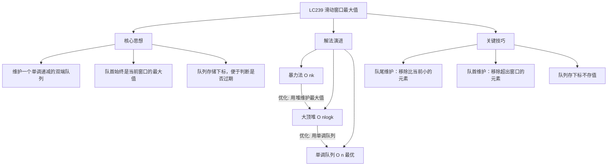
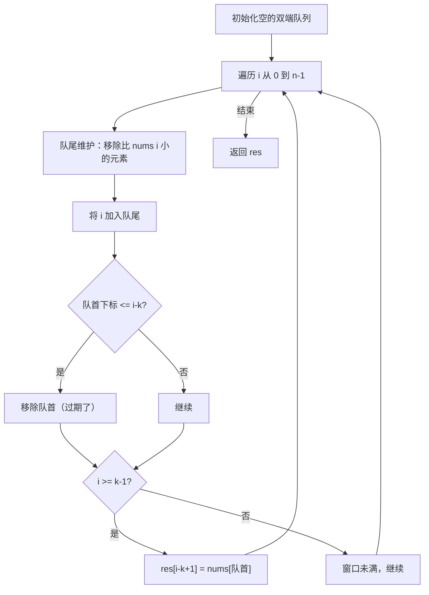

# LC239 滑动窗口最大值
## 一、题目描述
给你一个整数数组 `nums`，有一个大小为 `k` 的滑动窗口从数组的最左侧移动到数组的最右侧。你只可以看到在滑动窗口内的 `k` 个数字。滑动窗口每次只向右移动一位。返回**每个窗口中的最大值**。
**示例：**
```
输入：nums = [1,3,-1,-3,5,3,6,7], k = 3
输出：[3,3,5,5,6,7]
窗口位置                最大值
---------------        -----
[1  3  -1] -3  5  3  6  7       3
 1 [3  -1  -3] 5  3  6  7       3
 1  3 [-1  -3  5] 3  6  7       5
 1  3  -1 [-3  5  3] 6  7       5
 1  3  -1  -3 [5  3  6] 7       6
 1  3  -1  -3  5 [3  6  7]      7
```
**约束**：
- 1 <= nums.length <= 10^5
- 1 <= k <= nums.length
---
## 二、解法概览
### 解法对比表
| 解法 | 时间复杂度 | 空间复杂度 | 面试推荐 |
|------|-----------|-----------|---------|
| 暴力法 | O(n×k) | O(1) | ❌ 不推荐 |
| 大顶堆 | O(n×logk) | O(k) | ✅ 一般 |
| **单调队列** | O(n) | O(k) | ✅ **最优解** |
### 思维导图

---
## 三、记忆口诀
```
滑动窗口求最大，单调队列是利器
队列从大到小排，队首就是最大值
新元素从队尾进，小的全部踢出去
过期元素从队首出，下标判断是否过期
```
---
## 四、解法一：暴力法（不推荐）
### 思路
对于每个窗口位置，遍历窗口内的 k 个元素，找到最大值。
### 核心公式
```
for i in range(n - k + 1):
    max_val = max(nums[i:i+k])
    result.append(max_val)
```
### 图解过程
```
nums = [1, 3, -1, -3, 5, 3, 6, 7], k = 3
窗口0: [1, 3, -1] → 遍历3个元素 → max = 3
窗口1: [3, -1, -3] → 遍历3个元素 → max = 3
窗口2: [-1, -3, 5] → 遍历3个元素 → max = 5
...
每个窗口都要遍历k次，效率低
```
### 代码示例
```java
public int[] maxSlidingWindow(int[] nums, int k) {
    int n = nums.length;
    int[] res = new int[n - k + 1];
    for (int i = 0; i <= n - k; i++) {
        int max = nums[i];
        for (int j = i + 1; j < i + k; j++) {
            max = Math.max(max, nums[j]);
        }
        res[i] = max;
    }
    return res;
}
```
### 复杂度分析
- 时间复杂度：**O(n × k)**，n 个窗口，每个窗口遍历 k 次
- 空间复杂度：**O(1)**，不计结果数组
### 优缺点
| 优点 | 缺点 |
|-----|------|
| 思路直观 | 时间复杂度高 |
| 代码简单 | 大数据量会超时 |
---
## 五、解法二：大顶堆（一般）
### 思路
用大顶堆维护窗口内的元素，堆顶就是最大值。但需要处理过期元素。
### 核心公式
```
堆中存储 (值, 下标)
每次取堆顶时，检查下标是否在窗口内
如果过期了，弹出继续取下一个
```
### 图解过程
```
nums = [1, 3, -1, -3, 5, 3, 6, 7], k = 3
i=2: 堆 = [(3,1), (1,0), (-1,2)]，堆顶 (3,1) 在窗口内 → max = 3
i=3: 堆 = [(3,1), (1,0), (-1,2), (-3,3)]
     堆顶 (3,1)，下标1 >= 3-3+1=1 → 在窗口内 → max = 3
i=4: 堆 = [(5,4), (3,1), ...]
     堆顶 (5,4) 在窗口内 → max = 5
...
```
### 代码示例
```java
public int[] maxSlidingWindow(int[] nums, int k) {
    int n = nums.length;
    // 大顶堆：存储 (值, 下标)，按值降序
    PriorityQueue<int[]> heap = new PriorityQueue<>((a, b) -> b[0] - a[0]);
    // 初始化第一个窗口
    for (int i = 0; i < k; i++) {
        heap.offer(new int[]{nums[i], i});
    }
    int[] res = new int[n - k + 1];
    res[0] = heap.peek()[0];
    for (int i = k; i < n; i++) {
        heap.offer(new int[]{nums[i], i});
        // 移除过期元素（下标不在窗口内）
        while (heap.peek()[1] <= i - k) {
            heap.poll();
        }
        res[i - k + 1] = heap.peek()[0];
    }
    return res;
}
```
### 复杂度分析
- 时间复杂度：**O(n × logn)**，最坏情况堆大小为 n
- 空间复杂度：**O(n)**，堆的大小
### 优缺点
| 优点 | 缺点 |
|-----|------|
| 思路清晰 | 时间复杂度不是最优 |
| 容易理解 | 需要处理过期元素 |
---
## 六、解法三：单调队列（最优解 ✅）
### 思路
维护一个**单调递减的双端队列**，队列中存储元素的**下标**：
1. **队首**：始终是当前窗口的最大值的下标
2. **队尾**：新元素入队前，移除所有比它小的元素
3. **过期处理**：如果队首下标超出窗口范围，从队首移除
### 核心公式
```
// 队尾维护：保持单调递减
while (!queue.isEmpty() && nums[queue.peekLast()] <= nums[i]):
    queue.pollLast()
queue.offerLast(i)
// 队首维护：移除过期元素
if (queue.peekFirst() <= i - k):
    queue.pollFirst()
// 记录结果
if (i >= k - 1):
    result[i-k+1] = nums[queue.peekFirst()]
```
### 为什么存下标而不是值？
```
存下标的好处：
1. 可以判断元素是否过期（下标 <= i - k 就过期了）
2. 可以通过 nums[下标] 获取值
如果只存值，无法判断这个值是否已经滑出窗口
```
### 图解过程
以 `nums = [1, 3, -1, -3, 5, 3, 6, 7]`, `k = 3` 为例：
```
队列存储下标，括号内是对应的值
━━━━━━━━━━━━━━━━━━━━━━━━━━━━━━━━━━━━━━━━━━━━━━━━
i=0, num=1
    队列为空，直接入队
    队列：[0(1)]
    窗口未满，不记录
━━━━━━━━━━━━━━━━━━━━━━━━━━━━━━━━━━━━━━━━━━━━━━━━
i=1, num=3
    队尾 nums[0]=1 < 3，弹出 0
    队列为空，入队 1
    队列：[1(3)]
    窗口未满，不记录
━━━━━━━━━━━━━━━━━━━━━━━━━━━━━━━━━━━━━━━━━━━━━━━━
i=2, num=-1
    队尾 nums[1]=3 > -1，不弹出
    入队 2
    队列：[1(3), 2(-1)]
    窗口已满，队首 nums[1]=3 → res[0]=3
    nums: [1  3  -1] -3  5  3  6  7
           └──窗口──┘
    队列值: [3, -1] 单调递减
━━━━━━━━━━━━━━━━━━━━━━━━━━━━━━━━━━━━━━━━━━━━━━━━
i=3, num=-3
    队尾 nums[2]=-1 > -3，不弹出
    入队 3
    队列：[1(3), 2(-1), 3(-3)]
    检查过期：队首 1 > 3-3=0，未过期
    队首 nums[1]=3 → res[1]=3
    nums: 1 [3  -1  -3] 5  3  6  7
             └──窗口──┘
    队列值: [3, -1, -3] 单调递减
━━━━━━━━━━━━━━━━━━━━━━━━━━━━━━━━━━━━━━━━━━━━━━━━
i=4, num=5
    队尾 nums[3]=-3 < 5，弹出 3
    队尾 nums[2]=-1 < 5，弹出 2
    队尾 nums[1]=3 < 5，弹出 1
    队列为空，入队 4
    队列：[4(5)]
    队首 nums[4]=5 → res[2]=5
    nums: 1  3 [-1  -3  5] 3  6  7
              └──窗口──┘
    5 比窗口内所有元素都大，清空队列
━━━━━━━━━━━━━━━━━━━━━━━━━━━━━━━━━━━━━━━━━━━━━━━━
i=5, num=3
    队尾 nums[4]=5 > 3，不弹出
    入队 5
    队列：[4(5), 5(3)]
    队首 nums[4]=5 → res[3]=5
    nums: 1  3  -1 [-3  5  3] 6  7
                  └──窗口──┘
━━━━━━━━━━━━━━━━━━━━━━━━━━━━━━━━━━━━━━━━━━━━━━━━
i=6, num=6
    队尾 nums[5]=3 < 6，弹出 5
    队尾 nums[4]=5 < 6，弹出 4
    入队 6
    队列：[6(6)]
    队首 nums[6]=6 → res[4]=6
    nums: 1  3  -1  -3 [5  3  6] 7
                       └──窗口──┘
━━━━━━━━━━━━━━━━━━━━━━━━━━━━━━━━━━━━━━━━━━━━━━━━
i=7, num=7
    队尾 nums[6]=6 < 7，弹出 6
    入队 7
    队列：[7(7)]
    队首 nums[7]=7 → res[5]=7
    nums: 1  3  -1  -3  5 [3  6  7]
                          └──窗口──┘
━━━━━━━━━━━━━━━━━━━━━━━━━━━━━━━━━━━━━━━━━━━━━━━━
最终结果：[3, 3, 5, 5, 6, 7]
```
### 算法流程图

### 代码示例
```java
public int[] maxSlidingWindow(int[] nums, int k) {
    if (nums == null || nums.length < k || k < 1) {
        return new int[]{};
    }
    // 双端队列：存储下标，对应的值从大到小排列
    Deque<Integer> queue = new LinkedList<>();
    int[] res = new int[nums.length - k + 1];
    int index = 0;
    for (int i = 0; i < nums.length; i++) {
        // 1. 队尾维护：移除比当前元素小的（保持单调递减）
        while (!queue.isEmpty() && nums[queue.peekLast()] <= nums[i]) {
            queue.pollLast();
        }
        queue.offerLast(i);
        // 2. 队首维护：移除超出窗口范围的元素
        if (queue.peekFirst() <= i - k) {
            queue.pollFirst();
        }
        // 3. 记录结果（窗口已满时）
        if (i >= k - 1) {
            res[index++] = nums[queue.peekFirst()];
        }
    }
    return res;
}
```
### 复杂度分析
- 时间复杂度：**O(n)**，每个元素最多入队出队各一次
- 空间复杂度：**O(k)**，队列最多存 k 个元素
### 优缺点
| 优点 | 缺点 |
|-----|------|
| 时间复杂度最优 O(n) | 需要理解单调队列 |
| 空间复杂度 O(k) | 代码稍复杂 |
### 关键点总结
| 关键点 | 说明 |
|-------|------|
| 为什么用双端队列？ | 需要从队尾入队、从队尾弹出、从队首弹出 |
| 为什么存下标？ | 便于判断元素是否过期 |
| 为什么单调递减？ | 队首要是最大值 |
| 为什么用 <= 而不是 <？ | 相等时也弹出，保留最新的 |
---
## 七、面试回答模板
### 1. 开场：理解题意
> 这道题要找每个滑动窗口的最大值。窗口大小固定为 k，每次向右滑动一格。
### 2. 思路：单调队列
> 我用单调递减的双端队列来解决。队列存储元素的下标，队首始终是当前窗口最大值的下标。
### 3. 核心逻辑
> 每次新元素入队前，从队尾移除所有比它小的元素，保持单调性。然后检查队首是否过期，如果下标超出窗口范围就移除。最后队首就是当前窗口的最大值。
### 4. 关键细节（如果面试官问）
> 存下标而不是值，是为了判断元素是否已经滑出窗口。
### 5. 复杂度
> 时间复杂度 O(n)，因为每个元素最多入队出队各一次。空间复杂度 O(k)。
---
## 八、相关题目
| 题号 | 题目 | 关系 | 难度 |
|-----|------|------|-----|
| LC155 | 最小栈 | 辅助栈维护最值 | 中等 |
| LC42 | 接雨水 | 单调栈应用 | 困难 |
| LC84 | 柱状图中最大的矩形 | 单调栈应用 | 困难 |
| LC862 | 和至少为K的最短子数组 | 单调队列变体 | 困难 |
| LC1438 | 绝对差不超过限制的最长连续子数组 | 单调队列 | 中等 |
| LC剑指59 | 队列的最大值 | 单调队列设计 | 中等 |
