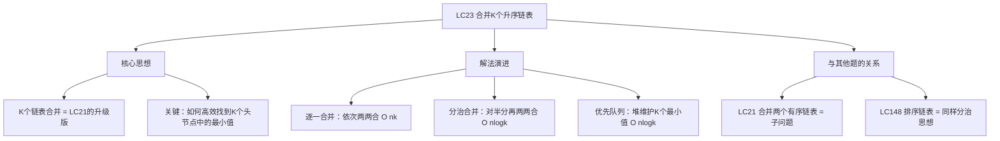
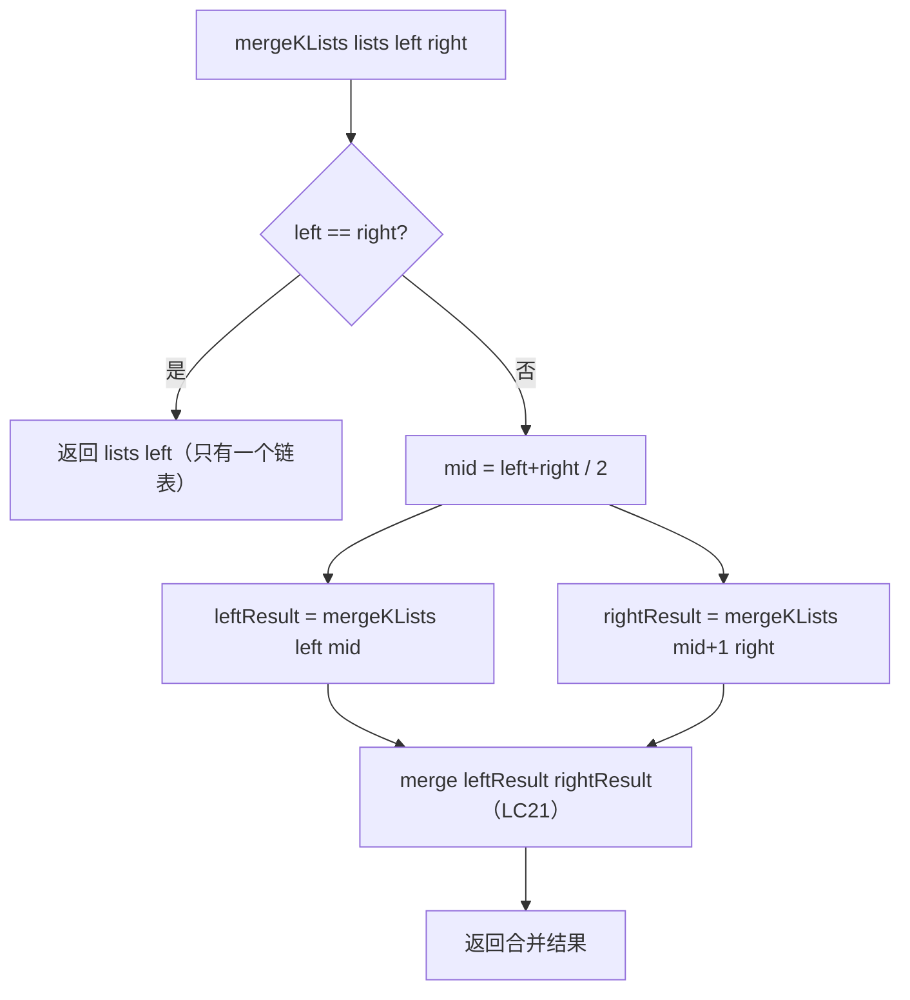

# LC23 合并K个升序链表
## 一、题目描述
给你一个链表数组，每个链表都已经按升序排列。请你将所有链表合并到一个升序链表中，返回合并后的链表。
**示例：**
```
输入：lists = [[1,4,5],[1,3,4],[2,6]]
输出：[1,1,2,3,4,4,5,6]
  链表0: 1 → 4 → 5
  链表1: 1 → 3 → 4
  链表2: 2 → 6
  结果:  1 → 1 → 2 → 3 → 4 → 4 → 5 → 6
```
**约束：**
- k == lists.length，0 <= k <= 10^4
- 0 <= lists[i].length <= 500
- 所有链表的节点总数 n 不超过 10^4
---
## 二、解法概览
### 解法对比表
| 解法 | 时间复杂度 | 空间复杂度 | 面试推荐 |
|------|-----------|-----------|---------|
| 逐一合并 | O(n×k) | O(1) | ❌ 不推荐 |
| **分治合并** | O(n×logk) | O(logk) | ✅ **最优解** |
| **优先队列（小顶堆）** | O(n×logk) | O(k) | ✅ **最优解** |
### 思维导图

---
## 三、记忆口诀
```
K个链表要合并，分治或堆两条路
分治法对半分，两两合并logk层
优先队列也可以，K个头节点进堆里
每次弹出最小的，接上后把下一个入堆
```
---
## 四、解法一：逐一合并（不推荐）
### 思路
把K个链表一个一个合并：先合并前两个，结果再和第三个合并，再和第四个...
### 核心公式
```
result = lists[0]
for i = 1 to k-1:
    result = merge(result, lists[i])   // LC21
```
### 图解过程
```
链表0: 1→4→5,  链表1: 1→3→4,  链表2: 2→6
第1步：merge(链表0, 链表1) = 1→1→3→4→4→5    合并了约10个节点
第2步：merge(结果, 链表2)  = 1→1→2→3→4→4→5→6 合并了约10个节点
问题：第2步的结果链表已经很长了，每次合并工作量越来越大
```
### 代码示例
```java
public ListNode mergeKLists(ListNode[] lists) {
    if (lists == null || lists.length == 0) return null;
    ListNode result = lists[0];
    for (int i = 1; i < lists.length; i++) {
        result = merge(result, lists[i]);
    }
    return result;
}
```
### 复杂度分析
- 时间复杂度：**O(n×k)**，每次合并结果链表越来越长
- 空间复杂度：**O(1)**
### 优缺点
| 优点 | 缺点 |
|-----|------|
| 代码简单 | 时间 O(n×k)，慢 |
| 容易想到 | 结果链表越来越长，后面的合并越来越慢 |
---
## 五、解法二：分治合并（最优解 ✅）
### 思路
不要一个一个合，而是**对半分**再两两合并，就像归并排序的思路：
1. 把K个链表分成左半和右半
2. 递归合并左半的链表，递归合并右半的链表
3. 最后把左右两个结果合并（LC21）
### 核心公式
```
mergeKLists(lists, left, right):
  if left == right → return lists[left]
  mid = (left + right) / 2
  leftResult  = mergeKLists(lists, left, mid)
  rightResult = mergeKLists(lists, mid+1, right)
  return merge(leftResult, rightResult)  // LC21
```
### 为什么分治比逐一合并快？
```
逐一合并（K=4，每个链表n/k个节点）：
  merge(L1, L2)         → 合并约 2n/k 个节点
  merge(结果, L3)        → 合并约 3n/k 个节点（结果越来越长！）
  merge(结果, L4)        → 合并约 4n/k 个节点
  总工作量 ≈ 2n/k + 3n/k + 4n/k = O(n×k)
分治合并（K=4）：
  第1层：merge(L1,L2)=n/2  merge(L3,L4)=n/2  → 总共 n
  第2层：merge(左结果, 右结果)                 → 总共 n
  总工作量 = 2×n = O(n×logk)
```
```
逐一：每次合并一个，结果链表越来越长 → 后面的合并越来越慢
分治：每次两两对等合并，每层总工作量都是n → 只有logk层
```
### 图解过程
```
lists = [L0: 1→4→5,  L1: 1→3→4,  L2: 2→6,  L3: 0→7]
━━━━━━━━━━━━━━━━━━━━━━━━━━━━━━━━━━
第1步：分治拆分
  左半：[L0, L1]    右半：[L2, L3]
━━━━━━━━━━━━━━━━━━━━━━━━━━━━━━━━━━
第2步：递归合并左半
  merge(L0, L1)
  merge(1→4→5, 1→3→4) = 1→1→3→4→4→5
━━━━━━━━━━━━━━━━━━━━━━━━━━━━━━━━━━
第3步：递归合并右半
  merge(L2, L3)
  merge(2→6, 0→7) = 0→2→6→7
━━━━━━━━━━━━━━━━━━━━━━━━━━━━━━━━━━
第4步：合并左右结果
  merge(1→1→3→4→4→5, 0→2→6→7)
  = 0→1→1→2→3→4→4→5→6→7 ✅
```
### 递归树
```
              mergeK([L0,L1,L2,L3])
              /                   \
    mergeK([L0,L1])          mergeK([L2,L3])
       /       \                /       \
      L0       L1             L2        L3
       \       /                \       /
    merge(L0,L1)             merge(L2,L3)
          \                      /
         merge(左结果, 右结果)
              ↓
         最终有序链表
```
### 算法流程图

### 代码示例
```java
public ListNode mergeKLists(ListNode[] lists) {
    if (lists == null || lists.length == 0) return null;
    return mergeList(lists, 0, lists.length - 1);
}
private ListNode mergeList(ListNode[] lists, int left, int right) {
    // 只有一个链表，直接返回
    if (left == right) return lists[left];
    if (left > right) return null;
    // 分治：对半分
    int mid = left + (right - left) / 2;
    ListNode leftResult = mergeList(lists, left, mid);
    ListNode rightResult = mergeList(lists, mid + 1, right);
    // 合并两个有序链表（LC21）
    return merge(leftResult, rightResult);
}
// LC21 合并两个有序链表
private ListNode merge(ListNode l1, ListNode l2) {
    if (l1 == null) return l2;
    if (l2 == null) return l1;
    ListNode dummy = new ListNode(-1);
    ListNode cur = dummy;
    while (l1 != null && l2 != null) {
        if (l1.val <= l2.val) {
            cur.next = l1; l1 = l1.next;
        } else {
            cur.next = l2; l2 = l2.next;
        }
        cur = cur.next;
    }
    cur.next = (l1 != null) ? l1 : l2;
    return dummy.next;
}
```
### 复杂度分析
- 时间复杂度：**O(n × logk)**，logk 层分治，每层合并总量 O(n)
- 空间复杂度：**O(logk)**，递归栈深度
### 优缺点
| 优点 | 缺点 |
|-----|------|
| 时间 O(n logk) 最优 | 需要理解分治 |
| 代码复用 LC21 | 递归栈 O(logk) |
| 面试首选 | 无 |
---
## 六、解法三：优先队列 / 小顶堆（最优解 ✅）
### 思路
核心问题是：**K个链表的当前头节点，哪个最小？**
用一个**小顶堆**维护 K 个链表的头节点，每次弹出最小的接到结果上，然后把该节点的下一个入堆。
### 核心公式
```
把K个链表的头节点全部入堆
while 堆不为空:
    弹出最小的节点，接到结果链表
    如果该节点有 next，把 next 入堆
```
### 图解过程
```
L0: 1→4→5,  L1: 1→3→4,  L2: 2→6
━━━━━━━━━━━━━━━━━━━━━━━━━━━━━━━━━━
初始：把3个头节点入堆
  堆：[1(L0), 1(L1), 2(L2)]  （小顶堆，最小的在顶）
  结果：dummy →
━━━━━━━━━━━━━━━━━━━━━━━━━━━━━━━━━━
弹出1(L0)，接到结果，L0的next=4入堆
  堆：[1(L1), 2(L2), 4(L0)]
  结果：dummy → 1
━━━━━━━━━━━━━━━━━━━━━━━━━━━━━━━━━━
弹出1(L1)，接到结果，L1的next=3入堆
  堆：[2(L2), 3(L1), 4(L0)]
  结果：dummy → 1 → 1
━━━━━━━━━━━━━━━━━━━━━━━━━━━━━━━━━━
弹出2(L2)，接到结果，L2的next=6入堆
  堆：[3(L1), 4(L0), 6(L2)]
  结果：dummy → 1 → 1 → 2
━━━━━━━━━━━━━━━━━━━━━━━━━━━━━━━━━━
弹出3(L1)，接到结果，L1的next=4入堆
  堆：[4(L0), 4(L1), 6(L2)]
  结果：dummy → 1 → 1 → 2 → 3
━━━━━━━━━━━━━━━━━━━━━━━━━━━━━━━━━━
弹出4(L0)，接到结果，L0的next=5入堆
  堆：[4(L1), 5(L0), 6(L2)]
  结果：dummy → 1 → 1 → 2 → 3 → 4
━━━━━━━━━━━━━━━━━━━━━━━━━━━━━━━━━━
弹出4(L1)，接到结果，L1的next=null，不入堆
  堆：[5(L0), 6(L2)]
  结果：dummy → 1 → 1 → 2 → 3 → 4 → 4
━━━━━━━━━━━━━━━━━━━━━━━━━━━━━━━━━━
弹出5(L0)，next=null，不入堆
  堆：[6(L2)]
  结果：... → 4 → 4 → 5
━━━━━━━━━━━━━━━━━━━━━━━━━━━━━━━━━━
弹出6(L2)，next=null，不入堆
  堆：空，结束
  结果：1 → 1 → 2 → 3 → 4 → 4 → 5 → 6 ✅
```
### 代码示例
```java
public ListNode mergeKLists(ListNode[] lists) {
    if (lists == null || lists.length == 0) return null;
    // 小顶堆：按节点值排序
    PriorityQueue<ListNode> heap = new PriorityQueue<>((a, b) -> a.val - b.val);
    // 把K个头节点入堆
    for (ListNode head : lists) {
        if (head != null) {
            heap.offer(head);
        }
    }
    ListNode dummy = new ListNode(-1);
    ListNode cur = dummy;
    while (!heap.isEmpty()) {
        // 弹出最小的
        ListNode min = heap.poll();
        cur.next = min;
        cur = cur.next;
        // 如果该节点有下一个，入堆
        if (min.next != null) {
            heap.offer(min.next);
        }
    }
    return dummy.next;
}
```
### 复杂度分析
- 时间复杂度：**O(n × logk)**，每个节点入堆出堆各一次，每次 O(logk)
- 空间复杂度：**O(k)**，堆中最多 K 个节点
### 优缺点
| 优点 | 缺点 |
|-----|------|
| 时间 O(n logk) 最优 | 需要理解优先队列 |
| 代码直观好理解 | 空间 O(k) 比分治大 |
| 面试高频 | 无 |
---
## 七、三种解法对比
| 对比 | 逐一合并 | 分治合并 | 优先队列 |
|------|---------|---------|---------|
| 时间 | O(n×k) | **O(n×logk)** | **O(n×logk)** |
| 空间 | O(1) | O(logk) | O(k) |
| 思想 | 暴力 | 分治 | 堆 |
| 代码难度 | 简单 | 中等 | 中等 |
| 面试 | 不推荐 | **首选** | **首选** |
```
面试建议：
  分治和优先队列都是最优解，选一个你更熟的
  分治：如果你擅长归并排序/递归
  优先队列：如果你擅长堆/PriorityQueue
  两种都能写出来是加分项
```
---
## 八、面试回答模板
### 1. 开场：理解题意
> 这道题是 LC21 合并两个有序链表的升级版，要合并 K 个。
### 2. 思路一：分治
> 用分治法，把 K 个链表对半分成两组，递归合并每组，最后把两个结果用 LC21 合并。就像归并排序的思想。时间 O(n logk)。
### 3. 思路二：优先队列
> 用小顶堆维护 K 个链表的头节点，每次弹出最小的接到结果上，再把该节点的 next 入堆。堆的大小始终是 K，每次操作 O(logk)。
### 4. 复杂度
> 两种都是时间 O(n logk)。分治空间 O(logk) 递归栈，优先队列空间 O(k)。
---
## 九、相关题目
| 题号 | 题目 | 关系 | 难度 |
|-----|------|------|-----|
| LC21 | 合并两个有序链表 | 子问题 | 简单 |
| LC148 | 排序链表 | 同样分治思想 | 中等 |
| LC88 | 合并两个有序数组 | 数组版子问题 | 简单 |
| LC378 | 有序矩阵中第K小的元素 | 多路归并变体 | 中等 |
| LC355 | 设计推特 | 合并K个有序流 | 中等 |
| LC264 | 丑数II | 多路合并变体 | 中等 |