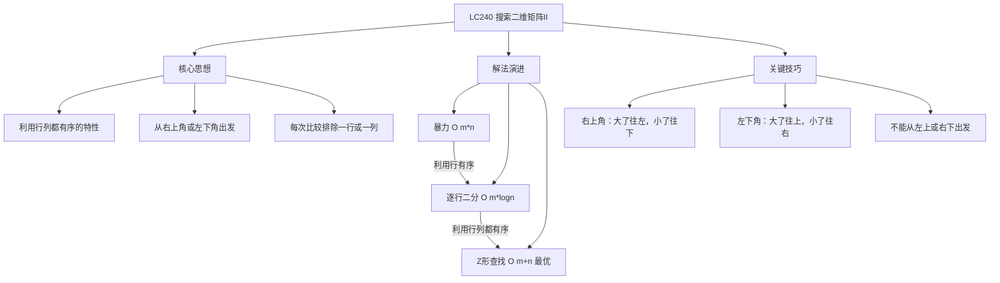
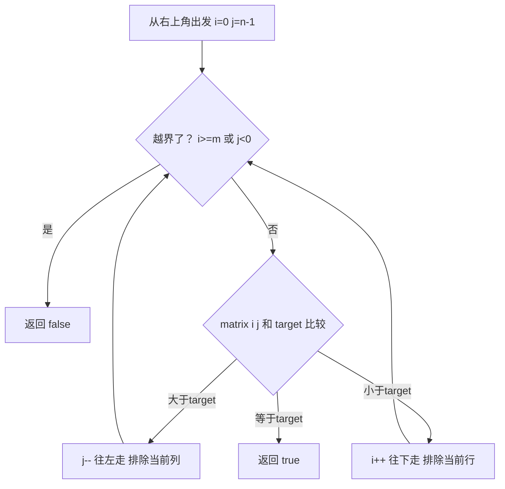

# LC240 搜索二维矩阵II
## 一、题目描述
编写一个高效的算法来搜索 `m x n` 矩阵 `matrix` 中的一个目标值 `target`。该矩阵具有以下特性：
- 每行的元素从左到右升序排列
- 每列的元素从上到下升序排列
**示例：**
```
matrix = [
  [1,  4,  7, 11, 15],
  [2,  5,  8, 12, 19],
  [3,  6,  9, 16, 22],
  [10, 13, 14, 17, 24],
  [18, 21, 23, 26, 30]
]
target = 5  → true
target = 20 → false
```
**约束：**
- m == matrix.length，n == matrix[i].length
- 1 <= m, n <= 300
- -10^9 <= matrix[i][j] <= 10^9
---
## 二、解法概览
### 解法对比表
| 解法 | 时间复杂度 | 空间复杂度 | 面试推荐 |
|------|-----------|-----------|---------|
| 暴力遍历 | O(m×n) | O(1) | ❌ 不推荐 |
| 逐行二分 | O(m×logn) | O(1) | ✅ 普通解法 |
| **Z形查找（右上角/左下角）** | O(m+n) | O(1) | ✅ **最优解** |
### 思维导图

---
## 三、记忆口诀
```
搜索矩阵站角落，右上左下都可以
大了排除一整列，小了排除一整行
每步缩小搜索域，m加n次就搞定
```
---
## 四、解法一：暴力遍历（不推荐）
### 思路
遍历矩阵所有元素，逐个比较。
### 核心公式
```
遍历所有 matrix[i][j]，找到 target 就返回 true
```
### 图解过程
```
逐个扫描：
  1→4→7→11→15→
  2→5 找到！返回 true
完全没利用有序性
```
### 代码示例
```java
public boolean searchMatrix(int[][] matrix, int target) {
    for (int i = 0; i < matrix.length; i++) {
        for (int j = 0; j < matrix[0].length; j++) {
            if (matrix[i][j] == target) {
                return true;
            }
        }
    }
    return false;
}
```
### 复杂度分析
- 时间复杂度：**O(m×n)**，遍历所有元素
- 空间复杂度：**O(1)**
### 优缺点
| 优点 | 缺点 |
|-----|------|
| 代码简单 | 完全没利用有序性 |
| 不容易出错 | 效率低 |
---
## 五、解法二：逐行二分查找
### 思路
每行都是有序的，对每行做一次二分查找。
### 核心公式
```
for 每一行:
    二分查找 target
    找到就返回 true
```
### 图解过程
```
matrix:
  [1,  4,  7, 11, 15]  ← 二分查找5：4<5<7，没找到
  [2,  5,  8, 12, 19]  ← 二分查找5：找到！✅
  [3,  6,  9, 16, 22]  ← 不需要了
  ...
```
### 代码示例
```java
public boolean searchMatrix(int[][] matrix, int target) {
    for (int[] row : matrix) {
        int idx = Arrays.binarySearch(row, target);
        if (idx >= 0) {
            return true;
        }
    }
    return false;
}
```
### 复杂度分析
- 时间复杂度：**O(m × logn)**，m 行各做一次二分
- 空间复杂度：**O(1)**
### 优缺点
| 优点 | 缺点 |
|-----|------|
| 利用了行有序 | 没利用列有序 |
| 二分查找提速 | 不是最优 |
---
## 六、解法三：Z形查找 / 右上角出发（最优解 ✅）
### 思路
从矩阵的**右上角**出发（或左下角），利用行列都有序的特性：
- 当前值 > target → **排除当前列**（往左走）
- 当前值 < target → **排除当前行**（往下走）
- 当前值 == target → 找到了
每一步排除一行或一列，最多走 m+n 步。
### 为什么选右上角或左下角？
```
四个角的特性：
┌──────────────────────────┐
│ 左上角(最小)    右上角 ✅  │
│ 行最小+列最小   行最小+列最大│
│                          │
│ 左下角 ✅      右下角(最大) │
│ 行最大+列最小   行最大+列最大│
└──────────────────────────┘
左上角：往右和往下都变大 → 无法排除行或列 ❌
右下角：往左和往上都变小 → 无法排除行或列 ❌
右上角：往左变小，往下变大 → 可以二选一 ✅
左下角：往右变大，往上变小 → 可以二选一 ✅
```
> 关键：选的起点必须让两个方向的变化趋势**相反**，才能根据大小关系做出唯一选择。
### 核心公式
**右上角出发：**
```
i = 0, j = n-1（右上角）
if matrix[i][j] > target → j--（往左，变小）
if matrix[i][j] < target → i++（往下，变大）
if matrix[i][j] == target → 找到
```
**左下角出发：**
```
i = m-1, j = 0（左下角）
if matrix[i][j] > target → i--（往上，变小）
if matrix[i][j] < target → j++（往右，变大）
if matrix[i][j] == target → 找到
```
### 图解过程（右上角出发）
```
matrix:                   target = 5
  [1,  4,  7, 11, 15]
  [2,  5,  8, 12, 19]
  [3,  6,  9, 16, 22]
  [10, 13, 14, 17, 24]
  [18, 21, 23, 26, 30]
━━━━━━━━━━━━━━━━━━━━━━━━━━━━━━━━━━
起点：i=0, j=4, matrix[0][4]=15
  15 > 5 → 往左，j=3
━━━━━━━━━━━━━━━━━━━━━━━━━━━━━━━━━━
i=0, j=3, matrix[0][3]=11
  11 > 5 → 往左，j=2
━━━━━━━━━━━━━━━━━━━━━━━━━━━━━━━━━━
i=0, j=2, matrix[0][2]=7
  7 > 5 → 往左，j=1
━━━━━━━━━━━━━━━━━━━━━━━━━━━━━━━━━━
i=0, j=1, matrix[0][1]=4
  4 < 5 → 往下，i=1
━━━━━━━━━━━━━━━━━━━━━━━━━━━━━━━━━━
i=1, j=1, matrix[1][1]=5
  5 == 5 → 找到！返回 true ✅
路径轨迹（Z形）：
  1   4   7  11 [15]
  2  [5]  8  12  19     15→11→7→4→5
  3   6   9  16  22     走了5步，远小于25个元素
```
### 图解过程（左下角出发）
```
target = 5，从左下角 matrix[4][0]=18 出发
━━━━━━━━━━━━━━━━━━━━━━━━━━━━━━━━━━
i=4, j=0, matrix[4][0]=18
  18 > 5 → 往上，i=3
━━━━━━━━━━━━━━━━━━━━━━━━━━━━━━━━━━
i=3, j=0, matrix[3][0]=10
  10 > 5 → 往上，i=2
━━━━━━━━━━━━━━━━━━━━━━━━━━━━━━━━━━
i=2, j=0, matrix[2][0]=3
  3 < 5 → 往右，j=1
━━━━━━━━━━━━━━━━━━━━━━━━━━━━━━━━━━
i=2, j=1, matrix[2][1]=6
  6 > 5 → 往上，i=1
━━━━━━━━━━━━━━━━━━━━━━━━━━━━━━━━━━
i=1, j=1, matrix[1][1]=5
  5 == 5 → 找到！返回 true ✅
```
### 算法流程图

### 代码示例（右上角出发）
```java
public boolean searchMatrix(int[][] matrix, int target) {
    if (matrix == null || matrix.length == 0) {
        return false;
    }
    int m = matrix.length, n = matrix[0].length;
    // 从右上角出发
    int i = 0, j = n - 1;
    while (i < m && j >= 0) {
        if (matrix[i][j] > target) {
            j--;  // 大了往左（排除当前列）
        } else if (matrix[i][j] < target) {
            i++;  // 小了往下（排除当前行）
        } else {
            return true;  // 找到了
        }
    }
    return false;
}
```
### 代码示例（左下角出发）
```java
public boolean searchMatrix(int[][] matrix, int target) {
    if (matrix == null || matrix.length == 0) {
        return false;
    }
    int m = matrix.length, n = matrix[0].length;
    // 从左下角出发
    int i = m - 1, j = 0;
    while (i >= 0 && j < n) {
        if (matrix[i][j] > target) {
            i--;  // 大了往上（排除当前行）
        } else if (matrix[i][j] < target) {
            j++;  // 小了往右（排除当前列）
        } else {
            return true;  // 找到了
        }
    }
    return false;
}
```
### 复杂度分析
- 时间复杂度：**O(m+n)**，每步排除一行或一列，最多走 m+n 步
- 空间复杂度：**O(1)**，只用两个指针
### 优缺点
| 优点 | 缺点 |
|-----|------|
| 时间 O(m+n) 最优 | 需要理解起点选择 |
| 代码极简 | 只能从右上或左下出发 |
| 面试首选 | 无 |
### 关键点总结
| 关键点 | 说明 |
|-------|------|
| 为什么选右上角/左下角？ | 两个方向变化趋势相反，才能排除行或列 |
| 为什么不能左上/右下？ | 两个方向都变大或都变小，无法做出选择 |
| 每步排除了什么？ | 大了排除一列，小了排除一行 |
| 走多少步？ | 最多 m+n 步 |
---
## 七、面试回答模板
### 1. 开场：理解题意
> 这道题在一个行列都有序的矩阵中查找目标值。
### 2. 思路：右上角出发
> 从右上角出发，因为往左变小、往下变大，两个方向趋势相反。如果当前值大于 target 就往左走排除一列，小于 target 就往下走排除一行。
### 3. 为什么选右上角
> 左上角往右往下都变大，无法判断该走哪个方向。右上角两个方向一增一减，才能根据大小关系做出唯一选择。左下角同理也可以。
### 4. 复杂度
> 时间 O(m+n)，每步排除一行或一列，最多走 m+n 步。空间 O(1)。
---
## 八、相关题目
| 题号 | 题目 | 关系 | 难度 |
|-----|------|------|-----|
| LC74 | 搜索二维矩阵 | 更强有序性，可展开为一维二分 | 中等 |
| LC378 | 有序矩阵中第K小的元素 | 同样行列有序矩阵 | 中等 |
| LC33 | 搜索旋转排序数组 | 二分查找变体 | 中等 |
| LC34 | 在排序数组中查找元素的首尾位置 | 二分查找应用 | 中等 |
| LC剑指04 | 二维数组中的查找 | 同题 | 中等 |