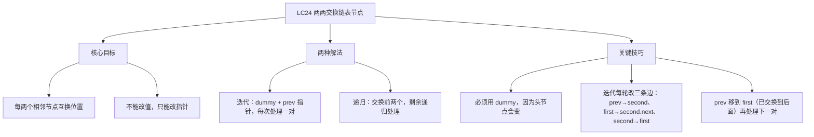
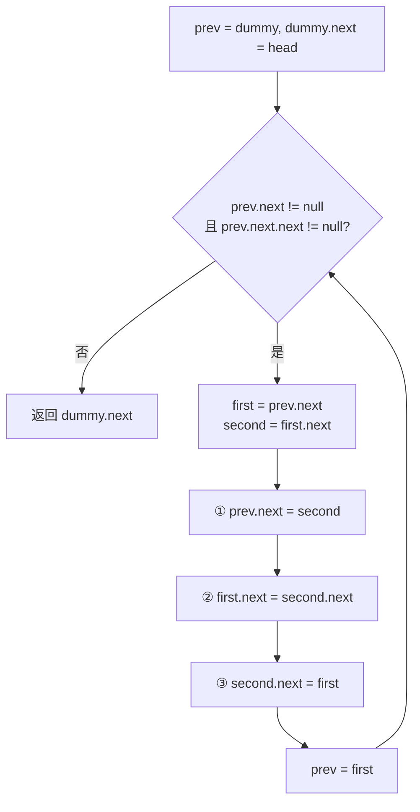
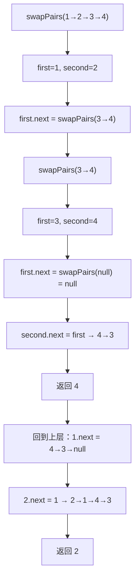

# LC24 两两交换链表中的节点

## 一、题目描述

给你一个链表，两两交换其中相邻的节点，并返回交换后链表的头节点。你必须在不修改节点内部的值的情况下完成本题（即只能进行节点交换）。
**示例：**

```
输入：head = [1,2,3,4]
输出：[2,1,4,3]
```

```
输入：head = []
输出：[]
```

```
输入：head = [1]
输出：[1]
```

**约束：** 链表中节点数目在范围 [0, 100] 内，0 <= Node.val <= 100
---

## 二、解法概览

| 解法              | 时间复杂度 | 空间复杂度 | 面试推荐     |
|-----------------|-------|-------|----------|
| 迭代（dummy + 三指针） | O(n)  | O(1)  | ✅ **首选** |
| 递归              | O(n)  | O(n)  | ✅ 进阶     |

### 思维导图



---

## 三、记忆口诀

```
两两交换用迭代，dummy 打头 prev 带
取出 first 和 second，三条边改顺序换
prev 指 second 打头阵，first 接后 second 接前
prev 跳到 first 继续，两个一组往后赶
```

---

## 四、解法一：迭代 / dummy + 三指针（首选 ✅）

### 思路

建立 dummy 虚拟头，用 `prev` 指针追踪每对节点的前驱。每轮取出相邻两个节点 `first`、`second`，修改三条指针完成交换，然后
`prev` 前进到下一对的前驱位置。

### 核心公式

```
每轮操作（prev → first → second → rest）：
  first  = prev.next
  second = first.next
  ① prev.next  = second      // prev 指向 second
  ② first.next = second.next // first 接上后续
  ③ second.next = first      // second 指向 first
  prev = first               // first 已在后面，成为下一对前驱
```

### 图解过程

```
原链表：dummy → 1 → 2 → 3 → 4 → null
━━━━━━━━━━━━━━━━━━━━━━━━━━━━━━━━━━━━
初始：prev = dummy
  dummy → 1 → 2 → 3 → 4 → null
   ↑
  prev
━━━━━━━━━━━━━━━━━━━━━━━━━━━━━━━━━━━━
第1轮：交换 1 和 2
  first = 1, second = 2
  ① prev.next = second     → dummy → 2
  ② first.next = second.next → 1 → 3
  ③ second.next = first    → 2 → 1
  结果：dummy → 2 → 1 → 3 → 4 → null
  prev = first = 1（下一对前驱）
  dummy → 2 → 1 → 3 → 4 → null
               ↑
              prev
━━━━━━━━━━━━━━━━━━━━━━━━━━━━━━━━━━━━
第2轮：交换 3 和 4
  first = 3, second = 4
  ① prev.next = 4
  ② first.next = null
  ③ second.next = 3
  结果：dummy → 2 → 1 → 4 → 3 → null
  prev = first = 3
  dummy → 2 → 1 → 4 → 3 → null
                        ↑
                       prev
━━━━━━━━━━━━━━━━━━━━━━━━━━━━━━━━━━━━
prev.next == null，循环结束
返回 dummy.next → 2 → 1 → 4 → 3 ✅
```

### 算法流程图



### 代码示例

```java
public ListNode swapPairs(ListNode head) {
  ListNode dummy = new ListNode(-1);
  dummy.next = head;
  ListNode prev = dummy;
  while (prev.next != null && prev.next.next != null) {
    ListNode first = prev.next;
    ListNode second = first.next;
    prev.next = second;
    first.next = second.next;
    second.next = first;
    prev = first;
  }
  return dummy.next;
}
```

### 复杂度分析

- 时间：O(n)，每个节点被访问常数次。
- 空间：O(1)，仅 dummy 与若干指针变量。

### 优缺点

优点：O(1) 空间，逻辑清晰，面试首选。缺点：三条指针修改顺序需记忆，写错一条就断链。
---

## 五、解法二：递归

### 思路

把问题拆成：交换前两个节点 + 递归处理剩余链表。递归终止条件：节点为空或只剩一个节点时直接返回。

### 核心公式

```
base case: head == null || head.next == null → return head
递归体：
  first  = head
  second = head.next
  first.next  = swapPairs(second.next)  // 递归处理后续
  second.next = first                   // second 指向 first
  return second                         // second 是新头
```

### 图解过程



### 代码示例

```java
public ListNode swapPairs(ListNode head) {
  if (head == null || head.next == null) {
    return head;
  }
  ListNode first = head;
  ListNode second = head.next;
  first.next = swapPairs(second.next);
  second.next = first;
  return second;
}
```

### 复杂度分析

- 时间：O(n)，每对节点处理一次。
- 空间：O(n)，递归栈深度为 n/2。

### 优缺点

优点：代码简洁优雅，逻辑对称。缺点：递归栈占用 O(n) 空间，链表极长时有栈溢出风险。
---

## 六、面试回答模板

1. **题意复述**：每两个相邻节点交换位置，不能改值只能改指针，奇数尾节点不动。
2. **思路选择**："两种做法：迭代和递归。我用迭代：建 dummy，用 prev 指针每次取出一对 first、second，改三条边完成交换，prev 前进到
   first 继续下一对。"
3. **边界**：dummy 解决头节点交换后变化的问题；循环条件 `prev.next != null && prev.next.next != null` 保证凑满一对才交换，奇数尾自动跳过。
4. **复杂度**：时间 O(n)，空间 O(1)。
5. **进阶**：可以提递归解法，代码更简洁但空间 O(n)。

---

## 七、相关题目

| 题号    | 题目          | 关联点           | 难度 |
|-------|-------------|---------------|----|
| LC25  | K 个一组翻转链表   | 两两交换是 K=2 的特例 | 困难 |
| LC206 | 反转链表        | 链表指针操作基础      | 简单 |
| LC19  | 删除链表倒数第N个节点 | dummy + 双指针   | 中等 |
| LC92  | 反转链表 II     | 局部反转指针操作      | 中等 |
