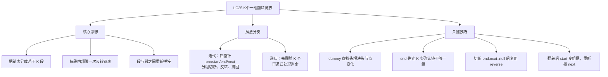
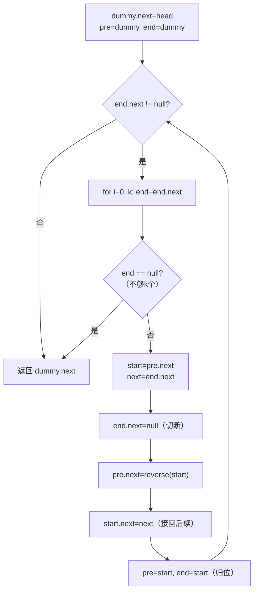
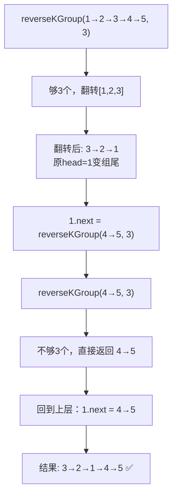

# LC25 K个一组翻转链表

## 一、题目描述

给你链表的头节点 `head`，每 k 个节点一组进行翻转，请你返回修改后的链表。k 是一个正整数，它的值小于或等于链表的长度。如果节点总数不是
k 的整数倍，那么请将最后剩余的节点保持原有顺序。不能只改节点内部的值，需要实际进行节点交换。
**示例：**

```
输入：head = [1,2,3,4,5], k = 2
输出：[2,1,4,3,5]
```

```
输入：head = [1,2,3,4,5], k = 3
输出：[3,2,1,4,5]
```

**约束：** 链表节点数 n，1 <= k <= n <= 5000，0 <= Node.val <= 1000
---

## 二、解法概览

| 解法              | 时间复杂度 | 空间复杂度  | 面试推荐     |
|-----------------|-------|--------|----------|
| 迭代（分组切断 + 反转子链） | O(n)  | O(1)   | ✅ **首选** |
| 递归              | O(n)  | O(n/k) | ✅ 进阶     |

### 思维导图



---

## 三、记忆口诀

```
K组翻转四指针，pre start end next 分
end 先走 K 步探长度，不够直接 break 停
切断 end 把组翻转，pre 接新头 start 接后
pre 和 end 归位 start，下一轮继续往前冲
```

---

## 四、解法一：迭代 / 四指针分组翻转（首选 ✅）

### 思路

将链表视为三个区域：**已翻转区**、**待翻转区 [start, end]**、**未翻转区**。用四个指针 `pre`、`start`、`end`、`next` 定位边界：

1. end 从 pre 出发走 k 步，找到当前组的尾部；不够 k 个直接 break
2. 记录 start = pre.next，next = end.next
3. 切断：end.next = null，调用 reverse(start) 翻转该组
4. 拼接：pre.next = 翻转后新头（原 end），start.next = next（接回后续）
5. pre 和 end 都归位到 start（翻转后的组尾），开始下一轮

### 核心公式

```
每轮操作：pre → [start ... end] → next → ...
  ① end 从 pre 走 k 步
  ② 不够 k 步 → break
  ③ start = pre.next, next = end.next
  ④ end.next = null（切断）
  ⑤ pre.next = reverse(start)（翻转并接上）
  ⑥ start.next = next（原 start 现在是组尾，接回后续）
  ⑦ pre = start, end = start（归位，准备下一轮）
```

### 图解过程

```
原链表：dummy → 1 → 2 → 3 → 4 → 5 → null, k=3
━━━━━━━━━━━━━━━━━━━━━━━━━━━━━━━━━━━━━━━━━━
初始：pre = dummy, end = dummy
  dummy → 1 → 2 → 3 → 4 → 5 → null
   ↑
  pre/end
━━━━━━━━━━━━━━━━━━━━━━━━━━━━━━━━━━━━━━━━━━
第1轮：end 走 3 步 → end=3
  start=1, next=4
  dummy → [1 → 2 → 3] → 4 → 5 → null
   ↑       ↑       ↑     ↑
  pre    start    end   next
  切断 end.next=null → [1 → 2 → 3 → null]
  reverse → [3 → 2 → 1 → null]
  拼接：pre.next=3, start(1).next=4
  结果：dummy → 3 → 2 → 1 → 4 → 5 → null
  归位：pre=1, end=1
  dummy → 3 → 2 → 1 → 4 → 5 → null
                   ↑
                 pre/end
━━━━━━━━━━━━━━━━━━━━━━━━━━━━━━━━━━━━━━━━━━
第2轮：end 从 1 走 3 步 → end 走到 2(第2步)后走到 4(第2步)...
  end走：1→4(第1步) 4→5(第2步) 5→null(第3步时end到null)
  实际：for 循环内 end != null 检查，end 第3步变null
  end == null → break，不够一组，保持原序
━━━━━━━━━━━━━━━━━━━━━━━━━━━━━━━━━━━━━━━━━━
最终结果：dummy → 3 → 2 → 1 → 4 → 5 → null ✅
返回 dummy.next
```

### 算法流程图



### 代码示例

```java
public ListNode reverseKGroup(ListNode head, int k) {
  if (k < 0) {
    return null;
  }
  ListNode dummy = new ListNode(-1);
  dummy.next = head;
  // 四指针: pre [start, end] next
  ListNode pre = dummy;
  ListNode next = null;
  ListNode start = null;
  ListNode end = dummy;
  while (end.next != null) {
    // end 先走 k 步，确定待翻转区间
    for (int i = 0; i < k && end != null; i++) {
      end = end.next;
    }
    if (end == null) {
      break;
    }
    start = pre.next;
    next = end.next;
    // 切断并翻转 [start, end]
    end.next = null;
    pre.next = reverse(start);
    // 翻转后 start 变组尾，接回后续
    start.next = next;
    // 归位，准备下一轮
    end = start;
    pre = start;
  }
  return dummy.next;
}

private ListNode reverse(ListNode head) {
  if (head == null) {
    return null;
  }
  ListNode cur = head;
  ListNode pre = null;
  while (cur != null) {
    ListNode next = cur.next;
    cur.next = pre;
    pre = cur;
    cur = next;
  }
  return pre;
}
```

### 复杂度分析

- 时间：O(n)，每个节点被遍历两次（一次找 end，一次 reverse），总计 O(2n) = O(n)。
- 空间：O(1)，仅用常数个指针变量。

### 优缺点

优点：O(1) 空间，思路模块化（分组 + 复用反转链表），面试高频首选。缺点：四指针 + 切断拼接步骤多，需要仔细处理边界。
---

## 五、解法二：递归

### 思路

先检查从 head 出发是否有 k 个节点，不够直接返回 head。够的话，翻转前 k 个节点，然后对第 k+1 个节点开始递归调用
`reverseKGroup`，把递归结果接到翻转后的组尾。

### 核心公式

```
base case: 从 head 数不够 k 个 → return head
递归体：
  ① 翻转 head 开始的 k 个节点，得到新头 newHead
  ② 翻转后原 head 变成组尾
  ③ head.next = reverseKGroup(第k+1个节点, k)
  ④ return newHead
```

### 图解过程



### 代码示例

```java
public ListNode reverseKGroup(ListNode head, int k) {
  // 检查是否够 k 个
  ListNode check = head;
  for (int i = 0; i < k; i++) {
    if (check == null) {
      return head;
    }
    check = check.next;
  }
  // 翻转前 k 个节点
  ListNode cur = head;
  ListNode pre = null;
  for (int i = 0; i < k; i++) {
    ListNode next = cur.next;
    cur.next = pre;
    pre = cur;
    cur = next;
  }
  // head 现在是组尾，接上递归结果
  head.next = reverseKGroup(cur, k);
  return pre;
}
```

### 复杂度分析

- 时间：O(n)，每个节点被访问常数次。
- 空间：O(n/k)，递归栈深度为分组数。

### 优缺点

优点：代码简洁，逻辑分层清晰（检查→翻转→递归）。缺点：递归栈空间 O(n/k)，k=1 时退化为 O(n)。
---

## 六、面试回答模板

1. **题意复述**：每 k 个节点一组翻转，不够 k 个的尾部保持原序，不能改值只能换指针。
2. **思路选择**："我用迭代做法。建 dummy，维护四个指针 pre、start、end、next。每轮让 end 先走 k
   步确认够不够一组，够就切断 [start, end]，调用 reverse 翻转，再把翻转后的子链拼回主链。pre 和 end 归位到
   start（翻转后的组尾），继续下一轮。"
3. **关键细节**：
    - dummy 解决头节点参与翻转后变化的问题
    - end.next = null 切断后才能安全 reverse，否则会翻转到后面的节点
    - 翻转后 start 变组尾，需要 start.next = next 把后续接回来
    - reverse 就是 LC206 反转链表，完全复用
4. **复杂度**：时间 O(n)，空间 O(1)。
5. **进阶**：可以提递归解法，代码更简洁但空间 O(n/k)；本题是 LC24 两两交换的推广版，k=2 时退化为 LC24。

---

## 七、相关题目

| 题号    | 题目          | 关联点             | 难度 |
|-------|-------------|-----------------|----|
| LC24  | 两两交换链表节点    | K=2 的特例         | 中等 |
| LC206 | 反转链表        | reverse 子函数直接复用 | 简单 |
| LC92  | 反转链表 II     | 局部反转，类似分组切断思想   | 中等 |
| LC19  | 删除链表倒数第N个节点 | dummy + 链表指针操作  | 中等 |
| LC143 | 重排链表        | 链表拆分 + 反转 + 合并  | 中等 |
