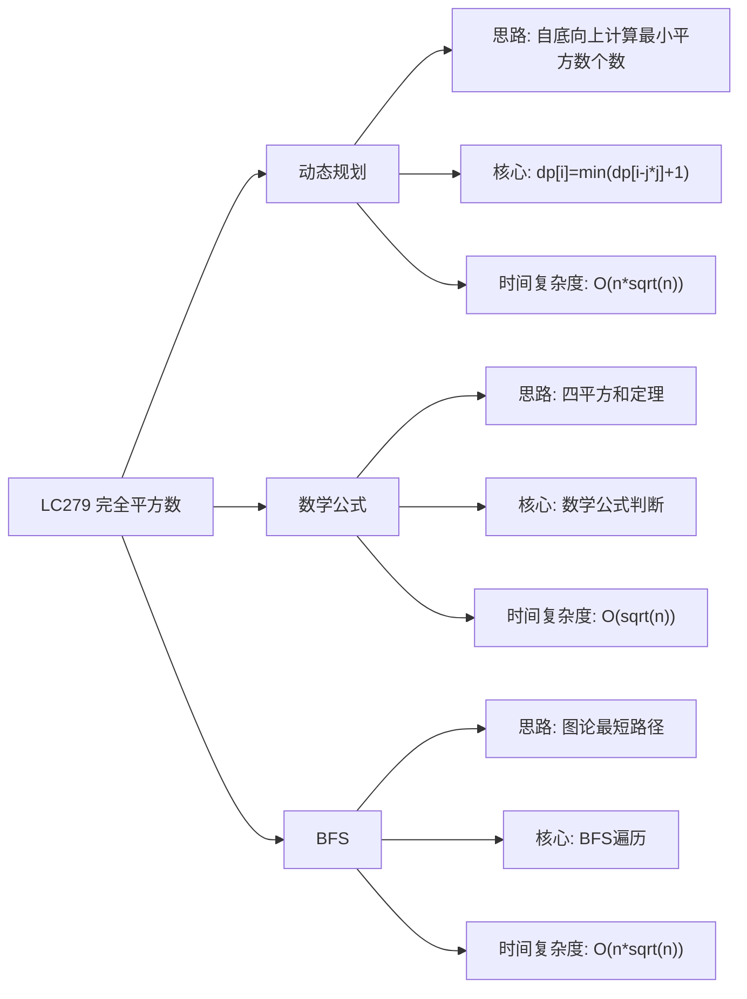

# 03-19-00-00 LC279_完全平方数解法分析
## 题目描述
给定正整数 n，找到若干个完全平方数（比如 1, 4, 9, 16, ...）使得它们的和等于 n。你需要让组成和的完全平方数的个数最少。返回一个整数，表示最少需要多少个完全平方数来表示该数。
**示例：**
输入：n = 12
输出：3
解释：12 = 4 + 4 + 4
输入：n = 13
输出：2
解释：13 = 4 + 9
## 解法概览
### 思维导图

## 记忆口诀
**动态规划：** 自底向上计算，状态转移方程。
**数学公式：** 四平方和定理，直接判断结果。
**BFS：** 图论最短路径，BFS遍历求解。
## 不同解法
### 解法一：动态规划（最优解）
#### 思路
使用动态规划的方法，自底向上地计算。对于正整数i，可以分解为i = j*j + (i - j*j)，其中j从1到sqrt(i)。dp[i]表示组成i所需的最小完全平方数个数。
#### 核心公式
- 状态定义：dp[i] 表示组成i所需的最小完全平方数个数
- 状态转移方程：dp[i] = min(dp[i - j*j] + 1)，其中j从1到sqrt(i)
- 初始条件：dp[0] = 0
#### 图解过程
以n=12为例：
- dp[0] = 0
- dp[1] = min(dp[0] + 1) = 1
- dp[2] = min(dp[1] + 1) = 2
- dp[3] = min(dp[2] + 1) = 3
- dp[4] = min(dp[3] + 1, dp[0] + 1) = min(4, 1) = 1
- dp[12] = min(dp[11] + 1, dp[8] + 1, dp[3] + 1) = min(4, 3, 4) = 3
- 最终结果：3
#### 代码示例（带详细注释）
```java
public int numSquares(int n) {
    int[] dp = new int[n + 1];
    // 初始条件
    dp[0] = 0;
    
    // 自底向上计算
    for (int i = 1; i <= n; i++) {
        dp[i] = i; // 最坏情况：全部由1组成
        // 遍历所有可能的完全平方数
        for (int j = 1; j * j <= i; j++) {
            dp[i] = Math.min(dp[i], dp[i - j * j] + 1);
        }
    }
    
    return dp[n];
}
```
#### 复杂度分析
- 时间复杂度：O(n*sqrt(n))，外层循环n次，内层循环sqrt(n)次
- 空间复杂度：O(n)，需要数组存储状态
#### 优缺点
- **优点：**
  - 逻辑清晰，易于理解
  - 适用性强，不依赖数学定理
- **缺点：** 时间复杂度较高，但对于本题来说足够
### 解法二：数学公式（最优解）
#### 思路
根据四平方和定理（拉格朗日定理），任何正整数都可以表示为最多四个完全平方数的和。因此，答案只能是1、2、3或4。通过数学方法判断n属于哪种情况，可以将时间复杂度优化到O(sqrt(n))。
#### 核心公式
- 四平方和定理：任何正整数都可以表示为最多四个完全平方数的和
- 判断方法：
  - 如果n是完全平方数，返回1
  - 如果n可以表示为两个完全平方数之和，返回2
  - 如果n % 8 == 7，返回4（勒让德三平方定理）
  - 否则返回3
#### 图解过程
以n=12为例：
- 12不是完全平方数
- 12 = 4 + 8，但8不是完全平方数
- 12 % 8 = 4，不等于7
- 返回3
以n=13为例：
- 13不是完全平方数
- 13 = 4 + 9 = 2^2 + 3^2
- 返回2
#### 代码示例
```java
public int numSquares(int n) {
    // 判断是否是完全平方数
    if (isPerfectSquare(n)) {
        return 1;
    }
    
    // 判断是否等于两个完全平方数之和
    for (int i = 1; i * i <= n; i++) {
        if (isPerfectSquare(n - i * i)) {
            return 2;
        }
    }
    
    // 勒让德三平方定理：n = 4^a * (8b + 7)
    while (n % 4 == 0) {
        n /= 4;
    }
    if (n % 8 == 7) {
        return 4;
    }
    
    return 3;
}

private boolean isPerfectSquare(int n) {
    int sqrt = (int) Math.sqrt(n);
    return sqrt * sqrt == n;
}
```
#### 复杂度分析
- 时间复杂度：O(sqrt(n))，只需要遍历到sqrt(n)
- 空间复杂度：O(1)，只需要常数级别的额外空间
#### 优缺点
- **优点：**
  - 时间复杂度最优
  - 空间复杂度低
- **缺点：** 依赖数学定理，理解难度较高
### 解法三：BFS
#### 思路
将正整数n视为图论中的起点，完全平方数视为可以到达的边。使用BFS遍历图，找到到达0的最短路径，即为最少的完全平方数个数。
#### 核心公式
- 使用队列进行BFS遍历
- 每一步减去一个完全平方数
- 记录遍历的层数，即为完全平方数的个数
#### 图解过程
以n=12为例：
- 起始：12
- 第一层：12-1=11, 12-4=8, 12-9=3
- 第二层：从8可以到7, 4, -1；从3可以到2, -1；从11可以到10, 7, 2
- 第三层：找到4 = 2^2
- 返回3
#### 代码示例
```java
public int numSquares(int n) {
    Queue<Integer> queue = new LinkedList<>();
    Set<Integer> visited = new HashSet<>();
    queue.offer(n);
    visited.add(n);
    int level = 0;
    
    while (!queue.isEmpty()) {
        level++;
        int size = queue.size();
        for (int i = 0; i < size; i++) {
            int current = queue.poll();
            for (int j = 1; j * j <= current; j++) {
                int next = current - j * j;
                if (next == 0) {
                    return level;
                }
                if (!visited.contains(next)) {
                    visited.add(next);
                    queue.offer(next);
                }
            }
        }
    }
    
    return level;
}
```
#### 复杂度分析
- 时间复杂度：O(n*sqrt(n))，最坏情况下需要遍历所有节点
- 空间复杂度：O(n)，需要队列和visited集合
#### 优缺点
- 优点：逻辑直观，易于理解
- 缺点：时间复杂度和空间复杂度都较高
## 面试回答模板
**问题：** 请计算组成正整数n所需的最少完全平方数个数。
**回答：**
这是一道经典的动态规划问题，主要有三种解法：
1. **动态规划**：自底向上地计算，使用dp数组存储每个整数的最小完全平方数个数。状态转移方程：dp[i] = min(dp[i - j*j] + 1)。时间复杂度O(n*sqrt(n))，空间复杂度O(n)。
2. **数学公式**：根据四平方和定理（拉格朗日定理），任何正整数都可以表示为最多四个完全平方数的和。通过数学方法判断n属于哪种情况。时间复杂度O(sqrt(n))，空间复杂度O(1)，是本题的最优解。
3. **BFS**：将正整数n视为图论中的起点，完全平方数视为可以到达的边。使用BFS遍历图，找到到达0的最短路径。时间复杂度O(n*sqrt(n))，空间复杂度O(n)。
**最优选择：** 数学公式解法是本题的最优解，因为它在保证时间复杂度O(sqrt(n))的同时，空间复杂度为O(1)。面试中推荐使用数学公式解法，既展示了对数学定理的理解，又能高效解决问题。
## 相关题目
1. **LC279：完全平方数** - 本题
2. **LC70：爬楼梯** - 动态规划的基础应用
3. **LC343：整数拆分** - 动态规划的应用
4. **LC279：完全平方数** - 动态规划的经典应用
这些题目都涉及到动态规划的思想，与LC279_完全平方数有一定的关联性。