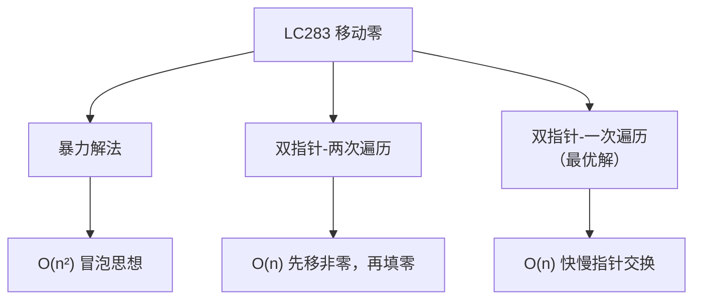
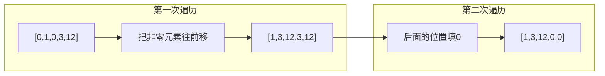
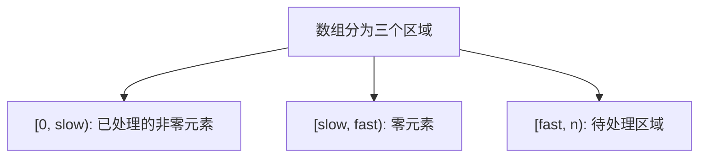

# LC283 移动零 - 面试题解
## 一、题目描述
给定一个数组 `nums`，编写一个函数将所有 `0` 移动到数组的末尾，同时保持非零元素的相对顺序。
**要求**：
- 必须在**原地**修改数组，不能使用额外数组
- 尽量减少操作次数
**示例**：
```
输入：nums = [0, 1, 0, 3, 12]
输出：[1, 3, 12, 0, 0]
```
## 二、解法概览

| 解法 | 时间复杂度 | 空间复杂度 | 操作次数 | 面试推荐 |
|------|------------|------------|----------|----------|
| 暴力冒泡 | O(n²) | O(1) | 多 | ❌ |
| 双指针两次遍历 | O(n) | O(1) | 较多 | ⚠️ 可以 |
| **双指针一次遍历** | **O(n)** | O(1) | **最少** | ✅ **最优解** |
## 三、解法一：双指针两次遍历
### 3.1 思路

### 3.2 代码实现
```java
public void moveZeroes(int[] nums) {
    int j = 0;  // j指向下一个非零元素应该放的位置
    // 第一遍：把所有非零元素往前移
    for (int i = 0; i < nums.length; i++) {
        if (nums[i] != 0) {
            nums[j++] = nums[i];
        }
    }
    // 第二遍：剩余位置填0
    while (j < nums.length) {
        nums[j++] = 0;
    }
}
```
### 3.3 执行过程
```
初始：[0, 1, 0, 3, 12]，j=0
第一遍遍历：
  i=0, nums[0]=0, 跳过
  i=1, nums[1]=1≠0, nums[j]=nums[1], j=1 → [1, 1, 0, 3, 12]
  i=2, nums[2]=0, 跳过
  i=3, nums[3]=3≠0, nums[j]=nums[3], j=2 → [1, 3, 0, 3, 12]
  i=4, nums[4]=12≠0, nums[j]=nums[4], j=3 → [1, 3, 12, 3, 12]
第二遍填零：
  j=3, nums[3]=0 → [1, 3, 12, 0, 12]
  j=4, nums[4]=0 → [1, 3, 12, 0, 0]
```
### 3.4 复杂度
| 复杂度 | 分析 |
|--------|------|
| 时间 | O(n)，两次遍历 |
| 空间 | O(1)，原地修改 |
## 四、解法二：双指针一次遍历（最优解）
### 4.1 核心思想
使用**快慢指针**，一次遍历完成：
- `slow`：指向下一个非零元素应该放的位置（已处理区域的边界）
- `fast`：遍历数组，寻找非零元素

### 4.2 图解过程
```
初始：[0, 1, 0, 3, 12]
      slow=0, fast=0
Step 1: fast=0, nums[0]=0, 不交换, fast++
        [0, 1, 0, 3, 12]
         ↑slow
            ↑fast
Step 2: fast=1, nums[1]=1≠0, 交换nums[slow]和nums[fast], slow++, fast++
        [1, 0, 0, 3, 12]
            ↑slow
               ↑fast
Step 3: fast=2, nums[2]=0, 不交换, fast++
        [1, 0, 0, 3, 12]
            ↑slow
                  ↑fast
Step 4: fast=3, nums[3]=3≠0, 交换, slow++, fast++
        [1, 3, 0, 0, 12]
               ↑slow
                     ↑fast
Step 5: fast=4, nums[4]=12≠0, 交换, slow++, fast++
        [1, 3, 12, 0, 0]
                   ↑slow
                        ↑fast(结束)
```
### 4.3 代码实现
```java
public void moveZeroes(int[] nums) {
    int slow = 0;  // 指向下一个非零元素应放的位置
    for (int fast = 0; fast < nums.length; fast++) {
        if (nums[fast] != 0) {
            // 交换slow和fast位置的元素
            if (slow != fast) {  // 优化：避免自己和自己交换
                int temp = nums[slow];
                nums[slow] = nums[fast];
                nums[fast] = temp;
            }
            slow++;
        }
    }
}
```
### 4.4 更简洁写法
```java
public void moveZeroes(int[] nums) {
    int slow = 0;
    for (int fast = 0; fast < nums.length; fast++) {
        if (nums[fast] != 0) {
            swap(nums, slow++, fast);
        }
    }
}
private void swap(int[] nums, int i, int j) {
    if (i != j) {
        int temp = nums[i];
        nums[i] = nums[j];
        nums[j] = temp;
    }
}
```
### 4.5 复杂度
| 复杂度 | 分析 |
|--------|------|
| 时间 | O(n)，一次遍历 |
| 空间 | O(1)，原地修改 |
## 五、两种双指针解法对比
| 维度 | 两次遍历 | 一次遍历（交换） |
|------|----------|------------------|
| 遍历次数 | 2次 | 1次 |
| 写操作次数 | n次（覆盖+填零） | 最多2k次（k为非零元素数，每次交换2次写） |
| 代码复杂度 | 简单 | 稍复杂 |
| 适用场景 | 都适用 | 零较多时更优 |
**选择建议**：
- 零较少时，两次遍历可能更快（写操作少）
- 零较多时，一次遍历更优（减少填零操作）
- **面试推荐一次遍历**，展示双指针技巧
## 六、解法三：双指针不交换版本（变体）
如果不要求保持非零元素相对顺序，可以用首尾双指针：
```java
// 注意：这个解法不保持相对顺序，仅作了解
public void moveZeroes_TwoEnd(int[] nums) {
    int left = 0, right = nums.length - 1;
    while (left < right) {
        while (left < right && nums[left] != 0) left++;
        while (left < right && nums[right] == 0) right--;
        if (left < right) {
            swap(nums, left++, right--);
        }
    }
}
// [0,1,0,3,12] → [12,1,3,0,0]（顺序变了）
```
**注意**：这个解法**不满足题目要求**（保持相对顺序），仅作为思路拓展。
## 七、面试回答模板
### 7.1 描述思路
> "这道题用双指针解决。我用一个slow指针指向下一个非零元素应该放的位置，用fast指针遍历数组。当fast遇到非零元素时，就和slow位置交换，然后slow前进。这样一次遍历就能把所有非零元素移到前面，零自然就到后面了。"
### 7.2 解释为什么交换有效
> "交换有效是因为：slow左边都是已处理的非零元素，slow到fast之间都是零。当fast找到非零元素时，和slow交换，就是把非零元素移到前面，把零移到后面。"
### 7.3 优化点
> "我加了一个优化：当slow等于fast时不交换，避免自己和自己交换的无效操作。"
## 八、相似题目
| 题号 | 题目 | 关联 |
|------|------|------|
| LC26 | 删除有序数组中的重复项 | 快慢指针 |
| LC27 | 移除元素 | 快慢指针 |
| LC75 | 颜色分类 | 三指针/荷兰国旗 |
| LC80 | 删除有序数组中的重复项II | 快慢指针变体 |
## 九、完整代码（推荐版本）
```java
package com.ssl.note.leetcode.编号刷题.LC283_移动零;
import java.util.Arrays;
public class Solution {
    /**
     * 移动零 - 最优解：双指针一次遍历
     * 时间O(n)，空间O(1)
     */
    public void moveZeroes(int[] nums) {
        int slow = 0;  // 指向下一个非零元素应放的位置
        for (int fast = 0; fast < nums.length; fast++) {
            if (nums[fast] != 0) {
                // 交换：把非零元素移到前面
                if (slow != fast) {
                    int temp = nums[slow];
                    nums[slow] = nums[fast];
                    nums[fast] = temp;
                }
                slow++;
            }
        }
    }
    /**
     * 解法二：两次遍历
     */
    public void moveZeroes_TwoPass(int[] nums) {
        int j = 0;
        // 第一遍：非零元素往前移
        for (int i = 0; i < nums.length; i++) {
            if (nums[i] != 0) {
                nums[j++] = nums[i];
            }
        }
        // 第二遍：填零
        while (j < nums.length) {
            nums[j++] = 0;
        }
    }
    public static void main(String[] args) {
        Solution solution = new Solution();
        int[] nums = {0, 1, 0, 3, 12};
        solution.moveZeroes(nums);
        System.out.println(Arrays.toString(nums));  // [1, 3, 12, 0, 0]
    }
}
```
## 十、记忆口诀
```
移动零，双指针，
slow记位fast去寻。
非零就交换前移，
一遍遍历搞定它。
slow左边非零区，
中间全是零在等，
fast找到非零换，
原地修改不费力。
```
