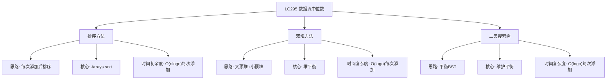

# 03-17-00-00 LC295_数据流中位数解法分析
## 题目描述
中位数是有序列表中间的数。如果列表长度是偶数，中位数则是中间两个数的平均值。
设计一个支持以下两种操作的数据结构：
- void addNum(int num) - 从数据流中添加一个整数到数据结构中
- double findMedian() - 返回目前所有元素的中位数
**示例：**
输入：
addNum(1)
addNum(2)
findMedian() → 1.5
addNum(3)
findMedian() → 2
## 解法概览
### 思维导图

## 记忆口诀
**排序方法：** 每次添加后排序，简单直接但低效。
**双堆方法：** 大小顶堆各一半，堆顶元素是中间。
**二叉搜索树：** 平衡BST维护，中序遍历找中间。
## 不同解法
### 解法一：排序方法（普通解法）
#### 思路
每次添加元素后，对整个数组进行排序，然后根据数组长度的奇偶性返回中位数。
#### 核心公式
- 添加元素：list.add(num)
- 排序：Collections.sort(list)
- 奇数长度：返回list.get(list.size()/2)
- 偶数长度：返回(list.get(list.size()/2-1) + list.get(list.size()/2)) / 2.0
#### 图解过程
以输入序列 [1, 2, 3] 为例：
- addNum(1)：列表 [1]，排序后 [1]
- addNum(2)：列表 [1,2]，排序后 [1,2]，中位数 (1+2)/2 = 1.5
- addNum(3)：列表 [1,2,3]，排序后 [1,2,3]，中位数 2
#### 代码示例
```java
class MedianFinder {
    private List<Integer> list;

    public MedianFinder() {
        list = new ArrayList<>();
    }
    
    public void addNum(int num) {
        list.add(num);
        Collections.sort(list);
    }
    
    public double findMedian() {
        int size = list.size();
        if (size % 2 == 1) {
            return list.get(size / 2);
        } else {
            return (list.get(size / 2 - 1) + list.get(size / 2)) / 2.0;
        }
    }
}
```
#### 复杂度分析
- 时间复杂度：O(nlogn) 每次添加元素，因为需要排序
- 空间复杂度：O(n) 存储所有元素
#### 优缺点
- 优点：代码简单，容易理解
- 缺点：每次添加元素都需要排序，时间复杂度较高，不适合大数据流
### 解法二：双堆方法（最优解）
#### 思路
使用两个堆来维护数据流的中位数：
1. 大顶堆（maxHeap）：存储较小的一半元素
2. 小顶堆（minHeap）：存储较大的一半元素
通过维护两个堆的平衡，使得：
- maxHeap的大小要么等于minHeap的大小，要么比minHeap大1
- maxHeap的堆顶元素小于等于minHeap的堆顶元素
这样，中位数就可以通过两个堆的堆顶元素计算得到。
#### 核心公式
- 添加元素：如果num <= maxHeap.peek()，添加到maxHeap，否则添加到minHeap
- 平衡堆：如果maxHeap.size() > minHeap.size() + 1，将maxHeap的堆顶元素移动到minHeap；如果minHeap.size() > maxHeap.size()，将minHeap的堆顶元素移动到maxHeap
- 计算中位数：如果总元素个数为奇数，返回maxHeap的堆顶；如果为偶数，返回(maxHeap.peek() + minHeap.peek()) / 2.0
#### 图解过程
以输入序列 [1, 2, 3] 为例：
- addNum(1)：maxHeap [1]，minHeap []，平衡后 maxHeap [1]，minHeap []
- addNum(2)：maxHeap [1,2]，minHeap []，平衡后 maxHeap [1]，minHeap [2]
- findMedian()：(1+2)/2 = 1.5
- addNum(3)：maxHeap [1]，minHeap [2,3]，平衡后 maxHeap [1,2]，minHeap [3]
- findMedian()：2
#### 代码示例（带详细注释）
```java
class MedianFinder {
    // 大顶堆：存储较小的一半元素
    private PriorityQueue<Integer> maxHeap;
    // 小顶堆：存储较大的一半元素
    private PriorityQueue<Integer> minHeap;

    public MedianFinder() {
        // 初始化大顶堆，使用自定义比较器
        maxHeap = new PriorityQueue<>((a, b) -> b - a);
        // 初始化小顶堆，使用默认比较器
        minHeap = new PriorityQueue<>();
    }
    
    public void addNum(int num) {
        // 根据元素大小决定添加到哪个堆
        if (maxHeap.isEmpty() || num <= maxHeap.peek()) {
            maxHeap.offer(num);
        } else {
            minHeap.offer(num);
        }
        
        // 平衡两个堆的大小
        // 如果大顶堆比小顶堆大超过1，将大顶堆的堆顶移动到小顶堆
        if (maxHeap.size() > minHeap.size() + 1) {
            minHeap.offer(maxHeap.poll());
        }
        // 如果小顶堆比大顶堆大，将小顶堆的堆顶移动到大顶堆
        else if (minHeap.size() > maxHeap.size()) {
            maxHeap.offer(minHeap.poll());
        }
    }
    
    public double findMedian() {
        // 如果元素个数为奇数，返回大顶堆的堆顶
        if (maxHeap.size() > minHeap.size()) {
            return maxHeap.peek();
        }
        // 如果元素个数为偶数，返回两个堆顶的平均值
        else {
            return (maxHeap.peek() + minHeap.peek()) / 2.0;
        }
    }
}
```
#### 复杂度分析
- 时间复杂度：O(logn) 每次添加元素，因为堆的插入和删除操作都是O(logn)
- 空间复杂度：O(n) 存储所有元素
#### 优缺点
- **优点：**
  - 时间复杂度最优，每次添加元素只需O(logn)时间
  - 适合处理大数据流
  - 实现简单，逻辑清晰
- **缺点：**
  - 需要维护两个堆的平衡，代码稍显复杂
  - 对于非常大的数据流，堆的空间开销可能较大
### 解法三：二叉搜索树（平衡BST）
#### 思路
使用平衡二叉搜索树（如TreeSet或自定义的平衡BST）来维护元素，通过中序遍历找到中位数。
#### 核心公式
- 添加元素：插入到BST中，保持树的平衡
- 查找中位数：如果元素个数为奇数，返回中间节点的值；如果为偶数，返回中间两个节点的平均值
#### 图解过程
以输入序列 [1, 2, 3] 为例：
- addNum(1)：BST [1]
- addNum(2)：BST [1,2]
- findMedian()：(1+2)/2 = 1.5
- addNum(3)：BST [1,2,3]
- findMedian()：2
#### 代码示例
```java
class MedianFinder {
    // 使用TreeSet存储元素，需要包装Integer以处理重复元素
    private TreeSet<Node> set;
    private int size;
    
    private static class Node implements Comparable<Node> {
        int value;
        int id;
        
        Node(int value, int id) {
            this.value = value;
            this.id = id;
        }
        
        @Override
        public int compareTo(Node other) {
            if (this.value != other.value) {
                return this.value - other.value;
            } else {
                return this.id - other.id;
            }
        }
    }

    public MedianFinder() {
        set = new TreeSet<>();
        size = 0;
    }
    
    public void addNum(int num) {
        set.add(new Node(num, size));
        size++;
    }
    
    public double findMedian() {
        if (size == 0) return 0;
        
        Iterator<Node> iterator = set.iterator();
        int mid = size / 2;
        
        // 移动到中间位置
        for (int i = 0; i < mid; i++) {
            iterator.next();
        }
        
        if (size % 2 == 1) {
            // 奇数长度，返回中间元素
            return iterator.next().value;
        } else {
            // 偶数长度，返回中间两个元素的平均值
            int first = iterator.next().value;
            int second = iterator.next().value;
            return (first + second) / 2.0;
        }
    }
}
```
#### 复杂度分析
- 时间复杂度：O(logn) 每次添加元素，O(n) 查找中位数（因为需要遍历到中间位置）
- 空间复杂度：O(n) 存储所有元素
#### 优缺点
- 优点：可以保持元素的有序性，查找中位数相对直观
- 缺点：查找中位数需要O(n)时间，不如双堆方法高效
## 面试回答模板
**问题：** 请设计一个数据结构，支持从数据流中添加元素并快速找到中位数。
**回答：**
这是一道经典的数据流处理问题，主要有三种解法：
1. **排序方法**：每次添加元素后对整个数组进行排序，然后根据数组长度的奇偶性返回中位数。时间复杂度O(nlogn)每次添加，代码简单但效率较低。
2. **双堆方法**：使用大顶堆存储较小的一半元素，小顶堆存储较大的一半元素，通过维护两个堆的平衡，使得中位数可以通过堆顶元素快速计算。时间复杂度O(logn)每次添加，是本题的最优解。
3. **二叉搜索树**：使用平衡二叉搜索树维护元素，通过中序遍历找到中位数。时间复杂度O(logn)添加，O(n)查找，实现相对复杂。
**最优选择：** 双堆方法是本题的最优解，因为它在保证时间复杂度O(logn)每次添加的同时，实现相对简单，逻辑清晰。面试中推荐使用双堆方法，既展示了对堆数据结构的理解，又能高效处理大数据流。
## 相关题目
1. **LC480：滑动窗口中位数** - 双堆应用
2. **LC215：数组中的第K大元素** - 堆排序应用
3. **LC347：前K个高频元素** - 堆排序应用
4. **LC703：数据流中的第K大元素** - 堆应用
这些题目都涉及到堆数据结构的应用，与LC295_数据流中位数有一定的关联性。