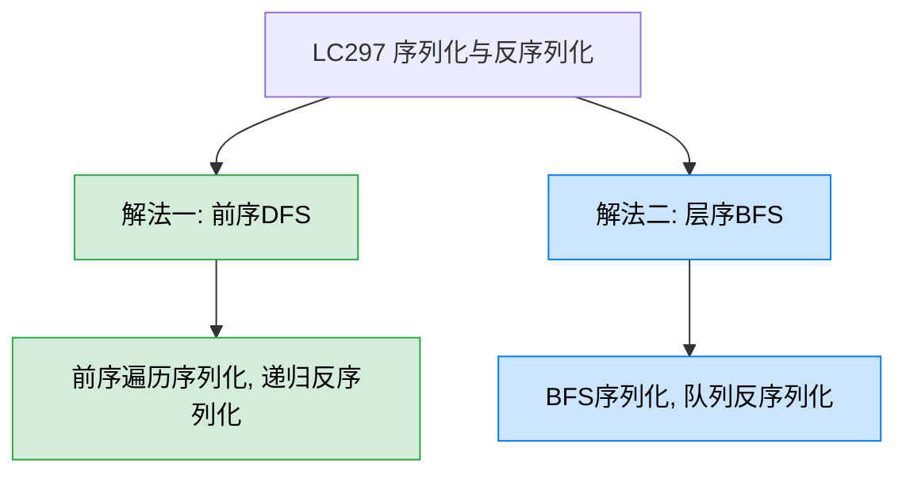
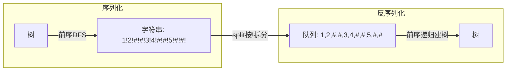
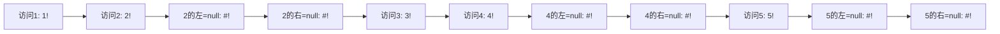

# LC297 二叉树的序列化与反序列化
## 一、题目描述
请设计一个算法来实现二叉树的序列化与反序列化。序列化是将一棵二叉树转换成一个字符串，反序列化是将字符串还原成原来的二叉树。不限定序列化/反序列化的格式，只要保证能正确还原即可。
**示例：** 输入 `root = [1,2,3,null,null,4,5]`，序列化后再反序列化得到原树
**约束：** 节点数 [0, 10^4]，-1000 <= Node.val <= 1000
## 二、解法概览

| 解法 | 时间复杂度 | 空间复杂度 | 难度 | 面试推荐 |
|------|-----------|-----------|------|---------|
| 前序DFS | O(n) | O(n) | ⭐⭐ | 面试首选 |
| 层序BFS | O(n) | O(n) | ⭐⭐ | 备选方案 |
## 三、记忆口诀
> **序列化：遍历整棵树，null用#占位，分隔符隔开。**
> **反序列化：按同样顺序取值，遇#返null，递归建树。**
核心原则：**序列化和反序列化必须用同一种遍历顺序**。前序序列化就前序反序列化，层序序列化就层序反序列化。
## 四、关键设计决策
### 4.1 为什么要记录 null 节点？
普通前序遍历 `[1,2,3]` 无法唯一确定一棵树（LC105 需要前序+中序两个序列）。但如果**把 null 也记录下来**，一个前序序列就能唯一确定一棵树。
```
     1              1
    / \            /
   2   3          2
                   \
                    3
普通前序都是 [1,2,3]，分不清

带null的前序:
左: 1!2!#!#!3!#!#!     右: 1!2!#!3!#!#!#!
完全不同，可以唯一确定
```
### 4.2 分隔符的选择
| 你的代码 | LeetCode常见 | 说明 |
|---------|-------------|------|
| `!` 作分隔符，`#` 表示 null | `,` 作分隔符，`null` 表示 null | 都可以，保持序列化和反序列化一致即可 |
## 五、解法一：前序DFS（面试首选）
### 5.1 思路
**序列化：** 前序遍历整棵树，每个节点值后面加 `!` 作分隔符，null 节点用 `#!` 表示。
**反序列化：** 把字符串按 `!` 拆分成队列，按前序顺序从队列中取值，遇到 `#` 返回 null，否则创建节点并递归建左右子树。

### 5.2 核心公式
**序列化：**
```
serialize(node):
  null → return "#!"
  非null → return node.val + "!" + serialize(left) + serialize(right)
```
**反序列化：**
```
deserialize(queue):
  取队头 → "#" 返回 null
  取队头 → 创建节点, left=deserialize(queue), right=deserialize(queue)
```
### 5.3 图解过程
以树 `[1, 2, 3, null, null, 4, 5]` 为例：
```
        1
       / \
      2   3
         / \
        4   5
```
**序列化过程（前序：根-左-右）：**

结果：`1!2!#!#!3!4!#!#!5!#!#!`
**反序列化过程：**
| 步骤 | 队头取值 | 操作 | 说明 |
|------|---------|------|------|
| 1 | 1 | 创建节点1 | 根节点 |
| 2 | 2 | 创建节点2，作为1的左孩子 | |
| 3 | # | 返回null，2的左=null | |
| 4 | # | 返回null，2的右=null | |
| 5 | 3 | 创建节点3，作为1的右孩子 | |
| 6 | 4 | 创建节点4，作为3的左孩子 | |
| 7 | # | 返回null，4的左=null | |
| 8 | # | 返回null，4的右=null | |
| 9 | 5 | 创建节点5，作为3的右孩子 | |
| 10 | # | 返回null，5的左=null | |
| 11 | # | 返回null，5的右=null | |
### 5.4 代码示例
```java
public class Codec {
    // 序列化：前序遍历，null用#表示，!作分隔符
    public String serialize(TreeNode root) {
        if (root == null) return "#!";
        String res = root.val + "!";
        res += serialize(root.left);
        res += serialize(root.right);
        return res;
    }
    // 反序列化：按!拆分成队列，前序递归建树
    public TreeNode deserialize(String data) {
        String[] values = data.split("!");
        Queue<String> queue = new LinkedList<>();
        for (String val : values) {
            queue.offer(val);
        }
        return dfs(queue);
    }
    private TreeNode dfs(Queue<String> queue) {
        String val = queue.poll();
        if ("#".equals(val)) return null;
        TreeNode node = new TreeNode(Integer.parseInt(val));
        node.left = dfs(queue);
        node.right = dfs(queue);
        return node;
    }
}
```
### 5.5 反序列化为什么用队列？
前序遍历是"根-左-右"，反序列化时也要按这个顺序**从前往后**依次取值。队列天然支持 FIFO（先进先出），poll 一次取一个，完美匹配前序的消费顺序。如果用数组+下标也可以，但下标传递不如队列自然。
### 5.6 复杂度分析
- **时间复杂度：O(n)**，序列化和反序列化各遍历一次所有节点
- **空间复杂度：O(n)**，字符串/队列存 n 个节点 + 递归栈 O(n)
### 5.7 优缺点
| 优点 | 缺点 |
|------|------|
| 代码简洁，递归思路清晰 | 字符串拼接用 `+=` 效率低（可用 StringBuilder） |
| 序列化和反序列化对称 | 递归深度大时可能栈溢出 |
| 面试首选 | 无 |
### 5.8 性能优化：用 StringBuilder
你的代码中 `res += serialize(root.left)` 每次拼接都创建新字符串，可以改用 StringBuilder：
```java
public String serialize(TreeNode root) {
    StringBuilder sb = new StringBuilder();
    dfsSerialize(root, sb);
    return sb.toString();
}
private void dfsSerialize(TreeNode node, StringBuilder sb) {
    if (node == null) {
        sb.append("#!");
        return;
    }
    sb.append(node.val).append("!");
    dfsSerialize(node.left, sb);
    dfsSerialize(node.right, sb);
}
```
## 六、解法二：层序BFS
### 6.1 思路
**序列化：** BFS 逐层遍历，非 null 节点记录值，null 节点记录 `#`。
**反序列化：** 拆分字符串，用队列按层构建，每个父节点依次取两个值作为左右孩子。
### 6.2 代码示例
```java
public class Codec {
    public String serialize(TreeNode root) {
        if (root == null) return "#!";
        StringBuilder sb = new StringBuilder();
        Queue<TreeNode> queue = new LinkedList<>();
        queue.offer(root);
        while (!queue.isEmpty()) {
            TreeNode node = queue.poll();
            if (node == null) {
                sb.append("#!");
            } else {
                sb.append(node.val).append("!");
                queue.offer(node.left);
                queue.offer(node.right);
            }
        }
        return sb.toString();
    }
    public TreeNode deserialize(String data) {
        String[] values = data.split("!");
        if ("#".equals(values[0])) return null;
        TreeNode root = new TreeNode(Integer.parseInt(values[0]));
        Queue<TreeNode> queue = new LinkedList<>();
        queue.offer(root);
        int i = 1;
        while (!queue.isEmpty()) {
            TreeNode node = queue.poll();
            if (!"#".equals(values[i])) {
                node.left = new TreeNode(Integer.parseInt(values[i]));
                queue.offer(node.left);
            }
            i++;
            if (!"#".equals(values[i])) {
                node.right = new TreeNode(Integer.parseInt(values[i]));
                queue.offer(node.right);
            }
            i++;
        }
        return root;
    }
}
```
### 6.3 复杂度分析
- **时间复杂度：O(n)**
- **空间复杂度：O(n)**，队列最多存一层节点
### 6.4 优缺点
| 优点 | 缺点 |
|------|------|
| 和 LeetCode 的序列化格式一致 | 代码比 DFS 长 |
| 无递归，无栈溢出风险 | 反序列化需要用下标 i 手动推进 |
## 七、两种解法对比
| 对比项 | 前序DFS | 层序BFS |
|--------|--------|--------|
| 序列化方式 | 递归 | 队列 |
| 反序列化方式 | 队列+递归 | 队列+下标 |
| 代码量 | 更短 | 更长 |
| 面试推荐 | 首选 | 备选 |
| 序列化结果 | 前序顺序 | 层序顺序 |
## 八、面试回答模板
> **面试官：** 设计二叉树的序列化和反序列化。
**回答要点：**
1. **说思路：** 用前序遍历做序列化。关键是把 null 节点也记录下来（用 # 表示），这样一个前序序列就能唯一确定一棵树，不需要像 LC105 那样两个序列。
2. **序列化：** 前序遍历，非 null 节点记录值加分隔符，null 节点记录 #!。
3. **反序列化：** 按分隔符拆成队列，递归前序建树——取队头，# 返回 null，否则创建节点，递归建左右子树。
4. **复杂度：** 时间 O(n)，空间 O(n)。
5. **优化：** 序列化用 StringBuilder 替代字符串拼接，避免 O(n²) 的拼接开销。
## 九、相关题目
| 题目 | 关联点 |
|------|--------|
| LC449 序列化和反序列化二叉搜索树 | BST 可以不记录 null，利用大小关系恢复 |
| LC105 从前序与中序遍历序列构造二叉树 | 不记录 null 时需要两个序列才能确定树 |
| LC572 另一棵树的子树 | 可以用序列化后的字符串匹配判断子树 |
| LC652 寻找重复的子树 | 用序列化作为子树的唯一标识 |
| LC428 序列化和反序列化N叉树 | 扩展到多叉树 |
