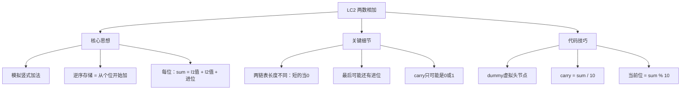
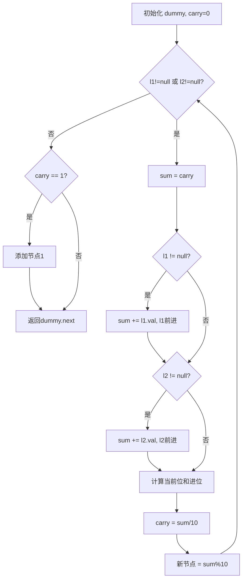

# LC2 两数相加
## 一、题目描述
给你两个**非空**链表，表示两个非负整数。每位数字都是**逆序存储**的，每个节点只存储**一位**数字。请你将两个数相加，并以相同形式返回一个表示和的链表。
**示例1：**
```
输入：l1 = [2,4,3], l2 = [5,6,4]
输出：[7,0,8]
解释：342 + 465 = 807
  l1: 2 → 4 → 3        (表示342)
  l2: 5 → 6 → 4        (表示465)
  结果: 7 → 0 → 8       (表示807)
```
**示例2：**
```
输入：l1 = [9,9,9,9], l2 = [9,9,9]
输出：[8,9,9,0,1]
解释：9999 + 999 = 10998
```
**关键点：**
- 逆序存储：个位在链表头部，所以直接从头开始加就是从低位到高位
- 两个链表长度可能不同
- 最高位可能产生进位（如 999+1=1000）
**约束：**
- 链表长度范围 [1, 100]
- 0 <= Node.val <= 9
- 不含前导零
---
## 二、解法概览
### 解法对比表
| 解法 | 时间复杂度 | 空间复杂度 | 面试推荐 |
|------|-----------|-----------|---------|
| **模拟加法（dummy+carry）** | O(max(m,n)) | O(max(m,n)) | ✅ **标准解法** |
### 思维导图

---
## 三、记忆口诀
```
两数相加模拟算，竖式加法从低位
sum等于两值加进位，当前位取余进位除
链表长短不一样，为空就当零来加
最后别忘检查进位，carry为1再加一位
```
---
## 四、解法：模拟竖式加法
### 思路
就是小学学的**竖式加法**，从个位开始逐位相加，逢十进一。因为链表是逆序存储的，头部就是个位，直接从头开始加即可。
### 核心公式
```
每一位的计算：
  sum = l1的值 + l2的值 + carry（上一位的进位）
  当前位的值 = sum % 10
  进位 = sum / 10
循环条件：l1 或 l2 还有节点
最后：如果 carry == 1，再加一个节点
```
### 竖式加法的对应关系
```
竖式加法：              链表：
    3 4 2               2 → 4 → 3
  + 4 6 5               5 → 6 → 4
  -------               -----------
    8 0 7               7 → 0 → 8
  从右到左加             从左到右加（因为逆序存储）
```
### 图解过程
```
l1: 2 → 4 → 3
l2: 5 → 6 → 4
carry = 0, dummy → null
━━━━━━━━━━━━━━━━━━━━━━━━━━━━━━━━━━
第1位（个位）：
  sum = 2 + 5 + 0(carry) = 7
  当前位 = 7 % 10 = 7
  carry = 7 / 10 = 0
  dummy → 7
━━━━━━━━━━━━━━━━━━━━━━━━━━━━━━━━━━
第2位（十位）：
  sum = 4 + 6 + 0(carry) = 10
  当前位 = 10 % 10 = 0
  carry = 10 / 10 = 1    ← 产生进位！
  dummy → 7 → 0
━━━━━━━━━━━━━━━━━━━━━━━━━━━━━━━━━━
第3位（百位）：
  sum = 3 + 4 + 1(carry) = 8
  当前位 = 8 % 10 = 8
  carry = 8 / 10 = 0
  dummy → 7 → 0 → 8
━━━━━━━━━━━━━━━━━━━━━━━━━━━━━━━━━━
l1和l2都为null，循环结束
carry == 0，不需要额外节点
返回 dummy.next = 7 → 0 → 8 ✅ (表示807)
```
### 长度不同+最高位进位的例子
```
l1: 9 → 9 → 9 → 9    (9999)
l2: 9 → 9 → 9         (999)
━━━━━━━━━━━━━━━━━━━━━━━━━━━━━━━━━━
第1位：9+9+0=18 → 当前位8, carry=1
第2位：9+9+1=19 → 当前位9, carry=1
第3位：9+9+1=19 → 当前位9, carry=1
第4位：9+0+1=10 → 当前位0, carry=1  ← l2已空，当0处理
循环结束，carry=1 → 再加一个节点1
结果：8 → 9 → 9 → 0 → 1 (表示10998) ✅
```
### 算法流程图

### 代码示例
```java
public ListNode addTwoNumbers(ListNode l1, ListNode l2) {
    ListNode dummy = new ListNode(-1);
    ListNode cur = dummy;
    int carry = 0;
    // 只要有一个链表还有节点，就继续
    while (l1 != null || l2 != null) {
        int sum = carry;  // 先加上一位的进位
        if (l1 != null) {
            sum += l1.val;
            l1 = l1.next;
        }
        if (l2 != null) {
            sum += l2.val;
            l2 = l2.next;
        }
        carry = sum / 10;              // 进位（0或1）
        cur.next = new ListNode(sum % 10);  // 当前位
        cur = cur.next;
    }
    // 最高位进位
    if (carry == 1) {
        cur.next = new ListNode(1);
    }
    return dummy.next;
}
```
### 代码逐行理解
```
ListNode dummy = new ListNode(-1);   // dummy：避免头节点特判
ListNode cur = dummy;                // cur：构建结果链表的指针
int carry = 0;                       // carry：进位，只有0或1
while (l1 != null || l2 != null)     // 有一个还有就继续（||不是&&）
    int sum = carry;                 // 先继承进位
    if (l1 != null) sum += l1.val;   // l1有值就加上
    if (l2 != null) sum += l2.val;   // l2有值就加上
    carry = sum / 10;                // 整除10得到进位
    cur.next = new ListNode(sum % 10); // 取余得当前位
if (carry == 1)                      // 最高位还有进位
    cur.next = new ListNode(1);      // 补一个节点
return dummy.next;                   // 跳过dummy返回
```
### 三个容易出错的点
| 易错点 | 错误写法 | 正确做法 |
|-------|---------|---------|
| 循环条件 | `while (l1 != null && l2 != null)` | `while (l1 != null \|\| l2 != null)` |
| 忘记最后进位 | 循环结束直接返回 | `if (carry == 1)` 补一个节点 |
| 空链表取值 | 直接 `l1.val`（空指针） | 先判断 `if (l1 != null)` |
**为什么是 `||` 不是 `&&`？**
```
l1: 9 → 9 → 9 → 9    (4位)
l2: 9 → 9 → 9         (3位)
如果用 &&：第3位算完就退出了，第4位的9没加上 ❌
如果用 ||：l2为空当0，继续处理l1的第4位 ✅
```
### 复杂度分析
- 时间复杂度：**O(max(m,n))**，遍历较长的那个链表
- 空间复杂度：**O(max(m,n))**，结果链表长度为 max(m,n) 或 max(m,n)+1
### 优缺点
| 优点 | 缺点 |
|-----|------|
| 模拟竖式加法，直观 | 无 |
| 代码简洁 | 无 |
| 唯一解法，面试必考 | 无 |
### 关键点总结
| 关键点 | 说明 |
|-------|------|
| 逆序存储的好处？ | 头部就是个位，从头加起正好从低位到高位 |
| carry 的范围？ | 只有 0 或 1（最大 9+9+1=19，进位=1） |
| 链表长度不同？ | 短链表为 null 时当 0 处理 |
| 最后的 carry？ | 别忘了，999+1=1000 多了一位 |
| 为什么用 dummy？ | 统一处理每一位，不需要特判第一个节点 |
---
## 五、面试回答模板
### 1. 开场：理解题意
> 两个链表逆序表示两个数，要求相加返回同样逆序的结果。因为是逆序存储，头部就是个位，直接从头开始加就是从低位到高位。
### 2. 思路：模拟竖式加法
> 用一个 carry 变量记录进位，遍历两个链表，每一位 sum = l1值 + l2值 + carry，当前位取 sum%10，进位取 sum/10。长度不同时短的当0处理。
### 3. 关键细节
> 循环条件是 `||` 不是 `&&`，因为长度不同时短的要当0继续加。循环结束后别忘了检查 carry，最高位可能还有进位。
### 4. 复杂度
> 时间 O(max(m,n))，空间 O(max(m,n))。
---
## 六、相关题目
| 题号 | 题目 | 关系 | 难度 |
|-----|------|------|-----|
| LC445 | 两数相加II | 正序存储，需要栈或反转 | 中等 |
| LC67 | 二进制求和 | 二进制版的竖式加法 | 简单 |
| LC415 | 字符串相加 | 字符串版的竖式加法 | 简单 |
| LC66 | 加一 | 简化版：只加1 | 简单 |
| LC43 | 字符串相乘 | 竖式乘法 | 中等 |
| LC21 | 合并两个有序链表 | 同样双链表遍历+dummy | 简单 |