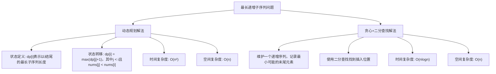

# LC300_最长递增子序列解法分析
## 题目描述
给定一个整数数组 `nums`，找到其中最长严格递增子序列的长度。
**说明：**
- 子序列是由数组派生而来的序列，删除（或不删除）数组中的元素而不改变其余元素的顺序。
- 例如，`[3,6,2,7]` 是数组 `[0,3,1,6,2,2,7]` 的子序列。
**示例：**
- 输入：`nums = [10,9,2,5,3,7,101,18]`
- 输出：`4`
- 解释：最长递增子序列是 `[2,3,7,101]`，因此长度为 4。
## 解法概览

## 记忆口诀
**动态规划解法**：以i结尾看前j，j小则取dp[j]+1。
**贪心+二分解法**：维护递增序列，二分查找插入点。
## 解法一：动态规划
### 思路
1. **状态定义**：`dp[i]` 表示以 `nums[i]` 结尾的最长递增子序列的长度。
2. **初始状态**：所有 `dp[i]` 初始化为 1，因为每个元素自身构成一个长度为 1 的子序列。
3. **状态转移**：对于每个 `i`，遍历所有 `j`（从 0 到 `i-1`），如果 `nums[j] < nums[i]`，则 `dp[i] = max(dp[i], dp[j] + 1)`。
4. **最终结果**：遍历 `dp` 数组，取最大值。
### 核心公式
`dp[i] = max(dp[j] + 1)`，其中 `j < i` 且 `nums[j] < nums[i]`
### 图解过程
以 `nums = [10,9,2,5,3,7,101,18]` 为例：
1. 初始化 `dp = [1,1,1,1,1,1,1,1]`
2. `i=1`（nums[1]=9）：无 `j` 满足 `nums[j] < 9`，`dp[1] = 1`
3. `i=2`（nums[2]=2）：无 `j` 满足 `nums[j] < 2`，`dp[2] = 1`
4. `i=3`（nums[3]=5）：`j=2` 满足 `nums[2] < 5`，`dp[3] = dp[2] + 1 = 2`
5. `i=4`（nums[4]=3）：`j=2` 满足 `nums[2] < 3`，`dp[4] = dp[2] + 1 = 2`
6. `i=5`（nums[5]=7）：`j=2,3,4` 满足条件，`dp[5] = max(2,3,2) + 1 = 3`
7. `i=6`（nums[6]=101）：所有 `j` 都满足条件，`dp[6] = max(dp[0..5]) + 1 = 4`
8. `i=7`（nums[7]=18）：`j=2,3,4,5` 满足条件，`dp[7] = max(2,3,2,3) + 1 = 4`
9. 最终结果：`max(dp) = 4`
### 代码示例
```java
public int lengthOfLIS(int[] nums) {
    if (nums == null || nums.length == 0) {
        return 0;
    }
    // dp[i]：[0..i]组成的最长子序列长度，初始化为1
    int[] dp = new int[nums.length];
    // 初试化：最长连续子序列长度最低为1
    Arrays.fill(dp, 1);
    
    int maxLen = 1;
    for (int i = 1; i < nums.length; i++) {
        for (int j = 0; j < i; j++) {
            if (nums[j] < nums[i]) {
                // 动态规划
                dp[i] = Math.max(dp[i], dp[j] + 1);
                
                maxLen = Math.max(dp[i], maxLen);
            }
        }
    }
    return maxLen;
}
```
### 复杂度分析
- **时间复杂度**：O(n²)，其中 n 是数组的长度。对于每个元素，需要遍历其前面的所有元素。
- **空间复杂度**：O(n)，用于存储 dp 数组。
### 优缺点
- **优点**：实现简单，思路直观。
- **缺点**：时间复杂度较高，对于大数组可能效率不高。
## 解法二：贪心 + 二分查找
### 思路
1. **贪心策略**：维护一个递增序列 `tail`，其中 `tail[i]` 表示长度为 `i+1` 的最长递增子序列的最小末尾元素。
2. **二分查找**：对于每个新元素 `num`，在 `tail` 中找到第一个大于等于 `num` 的位置，替换为 `num`。
3. **最终结果**：`tail` 数组的长度即为最长递增子序列的长度。
### 核心公式
无明确公式，核心是维护递增序列并使用二分查找优化。
### 图解过程
以 `nums = [10,9,2,5,3,7,101,18]` 为例：
1. 初始化 `tail = []`
2. `num=10`：`tail` 为空，添加 10 → `tail = [10]`
3. `num=9`：9 < 10，替换 10 → `tail = [9]`
4. `num=2`：2 < 9，替换 9 → `tail = [2]`
5. `num=5`：5 > 2，添加 5 → `tail = [2,5]`
6. `num=3`：3 < 5，替换 5 → `tail = [2,3]`
7. `num=7`：7 > 3，添加 7 → `tail = [2,3,7]`
8. `num=101`：101 > 7，添加 101 → `tail = [2,3,7,101]`
9. `num=18`：18 < 101，替换 101 → `tail = [2,3,7,18]`
10. 最终结果：`tail.length = 4`
### 代码示例
```java
public int lengthOfLIS(int[] nums) {
    if (nums == null || nums.length == 0) {
        return 0;
    }
    
    int[] tail = new int[nums.length];
    int len = 0;
    
    for (int num : nums) {
        int left = 0, right = len;
        while (left < right) {
            int mid = left + (right - left) / 2;
            if (tail[mid] < num) {
                left = mid + 1;
            } else {
                right = mid;
            }
        }
        
        tail[left] = num;
        if (left == len) {
            len++;
        }
    }
    
    return len;
}
```
### 复杂度分析
- **时间复杂度**：O(nlogn)，其中 n 是数组的长度。对于每个元素，需要进行一次二分查找，时间复杂度为 O(logn)。
- **空间复杂度**：O(n)，用于存储 `tail` 数组。
### 优缺点
- **优点**：时间复杂度较低，适合处理大数组。
- **缺点**：思路较为复杂，不易理解。
## 面试回答模板
**问题**：如何解决最长递增子序列问题？
**回答**：
我会考虑两种解法：动态规划和贪心+二分查找。
首先，动态规划解法。定义 `dp[i]` 表示以 `nums[i]` 结尾的最长递增子序列的长度。初始状态所有 `dp[i]` 为 1，因为每个元素自身构成一个长度为 1 的子序列。然后对于每个 `i`，遍历所有 `j`（从 0 到 `i-1`），如果 `nums[j] < nums[i]`，则 `dp[i] = max(dp[i], dp[j] + 1)`。最终遍历 `dp` 数组取最大值。这种方法的时间复杂度是 O(n²)，空间复杂度是 O(n)。
其次，贪心+二分查找解法。维护一个递增序列 `tail`，其中 `tail[i]` 表示长度为 `i+1` 的最长递增子序列的最小末尾元素。对于每个新元素 `num`，在 `tail` 中找到第一个大于等于 `num` 的位置，替换为 `num`。最终 `tail` 数组的长度即为最长递增子序列的长度。这种方法的时间复杂度是 O(nlogn)，空间复杂度是 O(n)。
在面试中，如果数组长度较小，动态规划解法更直观；如果数组长度较大，贪心+二分查找解法更高效。
## 相关题目
1. **LC673_最长递增子序列的个数**：不仅要计算长度，还要计算有多少个这样的子序列。
2. **LC354_俄罗斯套娃信封问题**：二维版本的最长递增子序列问题。
3. **LC491_递增子序列**：找出所有不同的递增子序列。
4. **LC646_最长数对链**：类似于最长递增子序列，需要满足特定条件。
5. **LC1713_得到子序列的最少操作次数**：与最长公共子序列相关，可转化为最长递增子序列问题。
## 总结
最长递增子序列问题是一个经典的动态规划问题，主要有两种解法：动态规划和贪心+二分查找。动态规划解法思路直观，实现简单，但时间复杂度较高；贪心+二分查找解法时间复杂度较低，适合处理大数组，但思路较为复杂。
通过掌握这两种解法，我们可以更好地理解动态规划、贪心算法和二分查找的应用场景，为解决类似的序列问题打下基础。