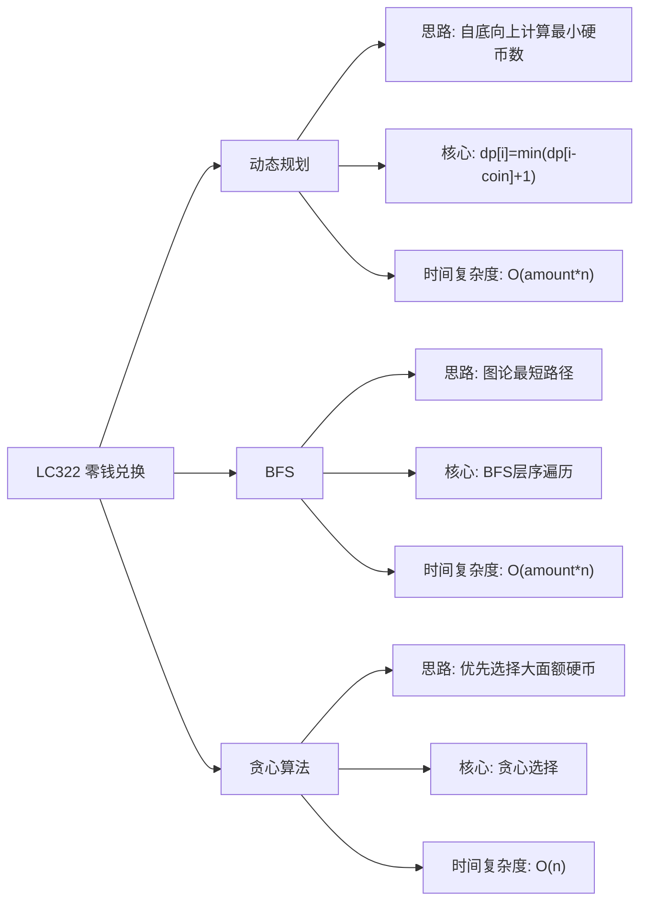

# 03-19-00-00 LC322_零钱兑换解法分析
## 题目描述
给定不同面额的硬币 coins 和一个总金额 amount，计算凑成总金额所需的最少的硬币个数。如果没有任何一种硬币组合能组成总金额，返回 -1。你可以认为每种硬币的数量是无限的。
**示例：**
输入：coins = [1, 2, 5], amount = 11
输出：3
解释：11 = 5 + 5 + 1
输入：coins = [2], amount = 3
输出：-1
输入：coins = [1], amount = 0
输出：0
## 解法概览
### 思维导图

## 记忆口诀
**动态规划：** 自底向上计算，状态转移方程。
**BFS：** 图论最短路径，层序遍历求解。
**贪心算法：** 优先选择大面额硬币，不一定最优。
## 不同解法
### 解法一：动态规划（最优解）
#### 思路
使用动态规划的方法，自底向上地计算。对于金额 i，可以由任意面额的硬币 coin 加上金额 i - coin 组成。dp[i] 表示凑成金额 i 所需的最少硬币个数。
#### 核心公式
- 状态定义：dp[i] 表示凑成金额 i 所需的最少硬币个数
- 状态转移方程：dp[i] = min(dp[i - coin] + 1)，其中 coin 为所有面额的硬币
- 初始条件：dp[0] = 0
#### 图解过程
以 coins = [1, 2, 5], amount = 11 为例：
- dp[0] = 0
- dp[1] = min(dp[0] + 1) = 1
- dp[2] = min(dp[1] + 1, dp[0] + 1) = min(2, 1) = 1
- dp[3] = min(dp[2] + 1, dp[1] + 1) = min(2, 2) = 2
- dp[11] = min(dp[10] + 1, dp[9] + 1, dp[6] + 1) = min(3, 4, 3) = 3
- 最终结果：3
#### 代码示例（带详细注释）
```java
public int coinChange(int[] coins, int amount) {
    if (amount == 0) {
        return 0;
    }
    
    int[] dp = new int[amount + 1];
    // 初始化dp数组为无穷大，表示不可达
    Arrays.fill(dp, amount + 1);
    // 初始条件
    dp[0] = 0;
    
    // 自底向上计算
    for (int i = 1; i <= amount; i++) {
        // 遍历所有硬币面额
        for (int coin : coins) {
            // 如果当前金额减去硬币面额可达
            if (i - coin >= 0) {
                // 状态转移方程
                dp[i] = Math.min(dp[i], dp[i - coin] + 1);
            }
        }
    }
    
    // 如果dp[amount]没有被更新，返回-1
    return dp[amount] > amount ? -1 : dp[amount];
}
```
#### 复杂度分析
- 时间复杂度：O(amount * n)，其中 n 是硬币面额的个数
- 空间复杂度：O(amount)，需要数组存储状态
#### 优缺点
- **优点：**
  - 时间复杂度最优，能找到全局最优解
  - 逻辑清晰，易于理解
- **缺点：** 空间复杂度为 O(amount)
### 解法二：BFS
#### 思路
将金额 amount 视为图论中的起点，硬币面额视为可以到达的边。使用 BFS 遍历图，找到到达金额 0 的最短路径，即为最少的硬币个数。
#### 核心公式
- 使用队列进行 BFS 遍历
- 每一步减去一个硬币面额
- 记录遍历的层数，即为硬币的个数
#### 图解过程
以 coins = [1, 2, 5], amount = 11 为例：
- 起始：11
- 第一层：10, 9, 6
- 第二层：从10到9,8,5；从9到8,7,4；从6到5,4,1
- 第三层：找到0
- 返回3
#### 代码示例
```java
public int coinChange(int[] coins, int amount) {
    if (amount == 0) {
        return 0;
    }
    
    Queue<Integer> queue = new LinkedList<>();
    Set<Integer> visited = new HashSet<>();
    queue.offer(amount);
    visited.add(amount);
    int count = 0;
    
    while (!queue.isEmpty()) {
        count++;
        int size = queue.size();
        for (int i = 0; i < size; i++) {
            int current = queue.poll();
            for (int coin : coins) {
                int next = current - coin;
                if (next == 0) {
                    return count;
                }
                if (next > 0 && !visited.contains(next)) {
                    visited.add(next);
                    queue.offer(next);
                }
            }
        }
    }
    
    return -1;
}
```
#### 复杂度分析
- 时间复杂度：O(amount * n)，最坏情况下需要遍历所有节点
- 空间复杂度：O(amount)，需要队列和 visited 集合
#### 优缺点
- 优点：逻辑直观，易于理解
- 缺点：时间复杂度和空间复杂度都较高
### 解法三：贪心算法（不推荐）
#### 思路
使用贪心算法，每次选择面额最大的硬币，直到凑成总金额。但是，贪心算法不能保证找到最优解，只能作为近似解。
#### 核心公式
- 优先选择面额最大的硬币
- 如果无法凑成，返回 -1
#### 图解过程
以 coins = [1, 2, 5], amount = 11 为例：
- 优先选择5：11 / 5 = 2，剩余1
- 选择1：1 / 1 = 1
- 结果：2 + 1 = 3（恰好找到最优解）
- 但对于某些情况，贪心算法可能找不到最优解
#### 代码示例
```java
public int coinChange(int[] coins, int amount) {
    if (amount == 0) {
        return 0;
    }
    
    // 按面额从大到小排序
    Arrays.sort(coins);
    int count = 0;
    
    for (int i = coins.length - 1; i >= 0; i--) {
        int coin = coins[i];
        count += amount / coin;
        amount %= coin;
    }
    
    return amount == 0 ? count : -1;
}
```
#### 复杂度分析
- 时间复杂度：O(n log n)，排序时间
- 空间复杂度：O(1)，只需要常数级别的额外空间
#### 优缺点
- **优点：**
  - 时间复杂度低
  - 实现简单
- **缺点：** 不能保证找到最优解，只能作为近似解
## 面试回答模板
**问题：** 请计算凑成总金额所需的最少硬币个数。
**回答：**
这是一道经典的动态规划问题，主要有三种解法：
1. **动态规划**：自底向上地计算，使用 dp 数组存储每个金额的最小硬币个数。状态转移方程：dp[i] = min(dp[i - coin] + 1)。时间复杂度 O(amount * n)，空间复杂度 O(amount)，是本题的最优解。
2. **BFS**：将金额视为图论中的起点，硬币面额视为可以到达的边。使用 BFS 遍历图，找到到达金额 0 的最短路径。时间复杂度 O(amount * n)，空间复杂度 O(amount)。
3. **贪心算法**：每次选择面额最大的硬币。时间复杂度 O(n log n)，空间复杂度 O(1)，但不能保证找到最优解。
**最优选择：** 动态规划解法是本题的最优解，因为它在保证时间复杂度 O(amount * n) 的同时，能找到全局最优解。面试中推荐使用动态规划解法，既展示了对问题的深入理解，又能高效解决问题。
## 相关题目
1. **LC322：零钱兑换** - 本题
2. **LC518：零钱兑换 II** - 完全背包问题
3. **LC279：完全平方数** - 动态规划的应用
4. **LC70：爬楼梯** - 动态规划的基础应用
这些题目都涉及到动态规划的思想，与 LC322_零钱兑换有一定的关联性。