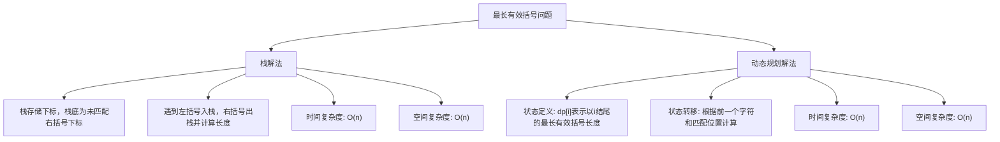

# LC32_最长有效括号解法分析
## 题目描述
给你一个只包含 `'('` 和 `')'` 的字符串，找出最长有效（格式正确且连续）括号子串的长度。
**示例：**
- 输入：`s = ")()())"`
- 输出：`4`
- 解释：最长有效括号子串是 `"()()"`。
## 解法概览

## 记忆口诀
**栈解法**：左括号入栈存下标，右括号出栈算长度，栈底保存未匹配右括号位置。
**动态规划解法**：dp[i]表示以i结尾的最长有效长度，根据前一个字符和匹配位置计算。
## 解法一：栈
### 思路
1. **栈的作用**：存储左括号的下标，以及最后一个未被匹配的右括号的下标。
2. **初始化**：栈底放入 `-1`，作为初始的未匹配右括号位置，避免栈空时的处理。
3. **遍历字符串**：
   - 遇到 `'('`：将其下标入栈。
   - 遇到 `')'`：弹出栈顶元素。
     - 如果栈为空，说明当前右括号未匹配，将其下标入栈作为新的未匹配位置。
     - 如果栈不为空，说明找到匹配的左括号，计算当前有效长度（当前下标 - 栈顶元素）。
4. **更新最大长度**：每次计算有效长度时，更新全局最大值。
### 核心公式
- 有效长度 = 当前下标 `i` - 栈顶元素（即最后一个未匹配位置的下标）
### 图解过程
以 `s = ")()())"` 为例：
1. 初始化栈：`[-1]`，`max = 0`
2. 处理 `i=0`（字符 `')'`）：
   - 弹出栈顶 `-1`，栈空。
   - 将 `0` 入栈。栈：`[0]`
3. 处理 `i=1`（字符 `'('`）：
   - 入栈。栈：`[0,1]`
4. 处理 `i=2`（字符 `')'`）：
   - 弹出栈顶 `1`，栈不为空。
   - 计算长度：`2 - 0 = 2`，`max = 2`。栈：`[0]`
5. 处理 `i=3`（字符 `'('`）：
   - 入栈。栈：`[0,3]`
6. 处理 `i=4`（字符 `')'`）：
   - 弹出栈顶 `3`，栈不为空。
   - 计算长度：`4 - 0 = 4`，`max = 4`。栈：`[0]`
7. 处理 `i=5`（字符 `')'`）：
   - 弹出栈顶 `0`，栈空。
   - 将 `5` 入栈。栈：`[5]`
8. 最终结果：`max = 4`
### 代码示例
```java
public int longestValidParentheses(String s) {
    if (s == null || "".equals(s)) {
        return 0;
    }
    int max = 0;
    // 栈：左括号直接存下标,保证栈底为最后一个没有被匹配的右括号的下标
    LinkedList<Integer> stack = new LinkedList<>();
    // 栈底初始化放坐标=-1，防止只有)括号放入
    stack.push(-1);

    char[] cs = s.toCharArray();
    for (int i = 0; i < cs.length; i++) {
        // 遇到(，栈中存下标
        if (cs[i] == '(') {
            stack.push(i);
        } else if (cs[i] == ')') {
            // 遇到)，出栈
            // 出栈的，其实是不参与长度计算的
            stack.pop();

            // 栈空，说明初始化-1的坐标已取出=)没有成功匹配到(
            if (stack.isEmpty()) {
                // 栈底存最近一个没有匹配成功的右括号下标
                stack.push(i);
            } else {
                // 栈非空，说明()括号匹配成功
                // 更新长度
                max = Math.max(max, i - stack.peek());
            }
        }
    }

    return max;
}
```
### 复杂度分析
- **时间复杂度**：O(n)，其中 n 是字符串的长度。只需要遍历一次字符串。
- **空间复杂度**：O(n)，栈的大小最多为 n。
### 优缺点
- **优点**：思路直观，实现简单，易于理解。
- **缺点**：需要额外的栈空间。
## 解法二：动态规划
### 思路
1. **状态定义**：`dp[i]` 表示以 `i` 结尾的最长有效括号子串的长度。
2. **初始状态**：`dp[0] = 0`（单个字符无法形成有效括号）。
3. **状态转移**：
   - 如果 `s[i] == '('`：`dp[i] = 0`（左括号无法结尾）。
   - 如果 `s[i] == ')'`：
     - 如果 `s[i-1] == '('`：`dp[i] = dp[i-2] + 2`（直接匹配前一个左括号）。
     - 如果 `s[i-1] == ')'`：检查 `i - dp[i-1] - 1` 位置是否为 `'('`，如果是，则 `dp[i] = dp[i-1] + 2 + dp[i - dp[i-1] - 2]`（匹配嵌套的括号）。
4. **最终结果**：遍历 `dp` 数组，取最大值。
### 核心公式
- 当 `s[i] == ')'` 且 `s[i-1] == '('`：`dp[i] = dp[i-2] + 2`
- 当 `s[i] == ')'` 且 `s[i-1] == ')'` 且 `s[i - dp[i-1] - 1] == '('`：`dp[i] = dp[i-1] + 2 + dp[i - dp[i-1] - 2]`
### 图解过程
以 `s = ")()())"` 为例，索引 0-5：
1. 初始化 `dp = [0,0,0,0,0,0]`，`max = 0`
2. 处理 `i=1`（字符 `'('`）：`dp[1] = 0`
3. 处理 `i=2`（字符 `')'`）：
   - `s[1] == '('`，`dp[2] = dp[0] + 2 = 2`，`max = 2`
4. 处理 `i=3`（字符 `'('`）：`dp[3] = 0`
5. 处理 `i=4`（字符 `')'`）：
   - `s[3] == '('`，`dp[4] = dp[2] + 2 = 4`，`max = 4`
6. 处理 `i=5`（字符 `')'`）：
   - `s[4] == ')'`，检查 `i - dp[4] - 1 = 5-4-1=0`，`s[0] == ')'`，不匹配，`dp[5] = 0`
7. 最终结果：`max = 4`
### 代码示例
```java
public int longestValidParentheses(String s) {
    if (s == null || s.length() < 2) {
        return 0;
    }
    int n = s.length();
    int[] dp = new int[n];
    int max = 0;
    
    for (int i = 1; i < n; i++) {
        if (s.charAt(i) == ')') {
            if (s.charAt(i-1) == '(') {
                // 直接匹配前一个左括号
                dp[i] = (i >= 2 ? dp[i-2] : 0) + 2;
            } else if (i - dp[i-1] > 0 && s.charAt(i - dp[i-1] - 1) == '(') {
                // 匹配嵌套的括号
                dp[i] = dp[i-1] + 2 + (i - dp[i-1] >= 2 ? dp[i - dp[i-1] - 2] : 0);
            }
            max = Math.max(max, dp[i]);
        }
    }
    
    return max;
}
```
### 复杂度分析
- **时间复杂度**：O(n)，其中 n 是字符串的长度。只需要遍历一次字符串。
- **空间复杂度**：O(n)，需要一维dp数组。
### 优缺点
- **优点**：使用动态规划，思路清晰，代码简洁。
- **缺点**：状态转移逻辑需要仔细理解，特别是嵌套括号的情况。
## 面试回答模板
**问题**：如何解决最长有效括号问题？
**回答**：
我会考虑两种解法：栈和动态规划。
首先，栈解法。使用栈来存储左括号的下标，以及最后一个未被匹配的右括号的下标。初始化时栈底放入-1，作为初始的未匹配位置。遍历字符串时，遇到左括号入栈，遇到右括号出栈。如果栈为空，说明当前右括号未匹配，将其下标入栈；如果栈不为空，计算当前有效长度（当前下标减去栈顶元素）并更新最大值。这种方法的时间复杂度是 O(n)，空间复杂度是 O(n)。
其次，动态规划解法。定义 `dp[i]` 表示以 `i` 结尾的最长有效括号子串的长度。状态转移时，对于右括号，如果前一个字符是左括号，直接匹配；如果前一个字符也是右括号，检查嵌套的匹配情况。这种方法的时间复杂度是 O(n)，空间复杂度是 O(n)。
在面试中，我会优先选择栈解法，因为它更直观易懂，容易实现。
## 相关题目
1. **LC20_有效的括号**：判断括号是否有效，是最长有效括号的基础。
2. **LC22_括号生成**：生成所有有效的括号组合。
3. **LC1249_移除无效的括号**：移除最少的括号使字符串有效。
4. **LC921_使括号有效的最少添加**：计算最少需要添加的括号数。
5. **LC1614_括号的最大嵌套深度**：计算括号的最大嵌套深度。
## 总结
最长有效括号问题是一个经典的栈和动态规划问题。栈解法通过存储下标并计算长度，直观易懂；动态规划解法则通过状态定义和转移，清晰地处理了各种情况。两种方法的时间复杂度都是 O(n)，空间复杂度都是 O(n)，各有优缺点。
通过掌握这两种解法，我们可以更好地理解栈和动态规划的应用场景，以及如何处理括号匹配这类问题。这不仅有助于解决当前问题，也为解决其他类似的字符串处理问题打下基础。