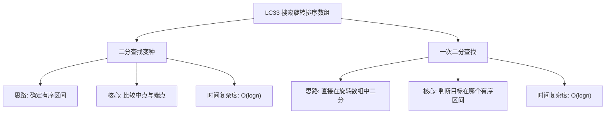

# 03-14-10-00 搜索旋转排序数组解法分析
## 题目描述
假设按照升序排序的数组在预先未知的某个点上进行了旋转。例如，数组 [0,1,2,4,5,6,7] 可能变为 [4,5,6,7,0,1,2]。
搜索一个给定的目标值，如果数组中存在这个目标值，则返回它的索引，否则返回 -1。
你可以假设数组中不存在重复的元素。
你的算法时间复杂度必须是 O(log n) 级别。
**示例：**
输入：nums = [4,5,6,7,0,1,2], target = 0
输出：4
输入：nums = [4,5,6,7,0,1,2], target = 3
输出：-1
## 解法概览
### 思维导图

## 记忆口诀
**搜索旋转排序数组：** 二分查找分两部分，先判哪侧是有序；有序区间用常规法，无序区间递归查。
## 不同解法
### 解法一：一次二分查找（最优解）
#### 思路
使用一次二分查找，通过比较中点与左端点的值，确定哪一侧是有序的，然后在有序的一侧进行常规的二分查找。
#### 核心公式
- 如果 nums[0] <= nums[mid]：左侧有序
  - 如果 target 在 [nums[0], nums[mid]) 范围内，在左侧查找
  - 否则在右侧查找
- 否则：右侧有序
  - 如果 target 在 (nums[mid], nums[n-1]] 范围内，在右侧查找
  - 否则在左侧查找
#### 图解过程
以 nums = [4,5,6,7,0,1,2], target = 0 为例：
1. 初始：left=0, right=6, mid=3, nums[mid]=7
2. nums[0]=4 <= nums[mid]=7，左侧有序
3. target=0 < nums[0]=4，不在左侧，所以在右侧查找：left=4
4. 新的 mid=5, nums[mid]=1
5. nums[4]=0 > nums[mid]=1，右侧有序
6. target=0 < nums[mid]=1，在左侧查找：right=4
7. 新的 mid=4, nums[mid]=0 == target，返回4
#### 代码示例
```java
public int search(int[] nums, int target) {
    if (nums.length == 0) {
        return -1;
    }
    if (nums.length == 1) {
        return nums[0] == target ? 0 : -1;
    }
    int left = 0;
    int right = nums.length - 1;
    while (left <= right) {
        int mid = left + (right - left) / 2;
        if (nums[mid] == target) {
            return mid;
        }
        if (nums[0] <= nums[mid]) {
            if (nums[0] <= target && target < nums[mid]) {
                right = mid - 1;
            } else {
                left = mid + 1;
            }
        } else {
            if (nums[mid] < target && target <= nums[nums.length - 1]) {
                left = mid + 1;
            } else {
                right = mid - 1;
            }
        }
    }
    return -1;
}
```
#### 复杂度分析
- 时间复杂度：O(log n)，每次二分查找将搜索区间缩小一半
- 空间复杂度：O(1)，只使用了常数个变量
#### 优缺点
- 优点：时间复杂度最优，代码逻辑清晰，一次二分查找即可完成
- 缺点：需要处理多种边界情况，逻辑判断稍复杂
### 解法二：先找旋转点，再二分查找（普通解法）
#### 思路
1. 首先找到旋转点（即数组中最小元素的位置）
2. 根据旋转点将数组分为两个有序子数组
3. 判断目标值在哪个子数组中，然后在对应子数组中进行常规二分查找
#### 核心公式
- 旋转点查找：使用二分查找找到最小元素的位置
- 目标值判断：如果 target >= nums[0]，在左子数组查找；否则在右子数组查找
- 常规二分查找：在确定的子数组中查找目标值
#### 图解过程
以 nums = [4,5,6,7,0,1,2], target = 0 为例：
1. 找旋转点：
   - left=0, right=6, mid=3, nums[mid]=7 > nums[right]=2，旋转点在右侧
   - left=4, right=6, mid=5, nums[mid]=1 < nums[right]=2，旋转点在左侧
   - left=4, right=5, mid=4, nums[mid]=0，找到旋转点索引4
2. 判断目标值：target=0 >= nums[0]=4？否，在右子数组查找
3. 在右子数组 [4,6] 中查找 0，找到索引4
#### 代码示例
```java
public int search(int[] nums, int target) {
    if (nums.length == 0) {
        return -1;
    }
    if (nums.length == 1) {
        return nums[0] == target ? 0 : -1;
    }
    int pivot = findPivot(nums);
    if (nums[pivot] == target) {
        return pivot;
    }
    if (pivot == 0) {
        return binarySearch(nums, 0, nums.length - 1, target);
    }
    if (target >= nums[0]) {
        return binarySearch(nums, 0, pivot - 1, target);
    } else {
        return binarySearch(nums, pivot, nums.length - 1, target);
    }
}

private int findPivot(int[] nums) {
    int left = 0, right = nums.length - 1;
    if (nums[left] < nums[right]) {
        return 0;
    }
    while (left <= right) {
        int mid = left + (right - left) / 2;
        if (nums[mid] > nums[mid + 1]) {
            return mid + 1;
        }
        if (nums[mid] < nums[left]) {
            right = mid - 1;
        } else {
            left = mid + 1;
        }
    }
    return 0;
}

private int binarySearch(int[] nums, int left, int right, int target) {
    while (left <= right) {
        int mid = left + (right - left) / 2;
        if (nums[mid] == target) {
            return mid;
        } else if (nums[mid] < target) {
            left = mid + 1;
        } else {
            right = mid - 1;
        }
    }
    return -1;
}
```
#### 复杂度分析
- 时间复杂度：O(log n)，两次二分查找，每次都是 O(log n)
- 空间复杂度：O(1)，只使用了常数个变量
#### 优缺点
- 优点：逻辑更清晰，分步骤解决问题
- 缺点：需要两次二分查找，代码量较大
## 面试回答模板
**问题：** 请在旋转排序数组中搜索目标值。
**回答：**
这是一道经典的二分查找变种题。我主要使用一次二分查找的解法，时间复杂度为 O(log n)。
具体思路是：
1. 使用二分查找，通过比较中点与左端点的值，确定哪一侧是有序的
2. 如果左侧有序，判断目标值是否在左侧范围内，是则在左侧查找，否则在右侧查找
3. 如果右侧有序，判断目标值是否在右侧范围内，是则在右侧查找，否则在左侧查找
4. 重复上述过程，直到找到目标值或搜索区间为空
**示例：** 对于 nums = [4,5,6,7,0,1,2], target = 0，经过二分查找，最终返回索引4。
这种方法的优势在于只需要一次二分查找就能完成搜索，时间复杂度最优，且代码逻辑清晰。
## 相关题目
1. **LC81：搜索旋转排序数组 II** - 允许重复元素的情况
2. **LC153：寻找旋转排序数组中的最小值** - 查找旋转点
3. **LC154：寻找旋转排序数组中的最小值 II** - 允许重复元素的情况
4. **LC34：在排序数组中查找第一个和最后一个位置** - 二分查找变种
这些题目都涉及到二分查找的思想，与LC33_搜索旋转排序数组有一定的关联性。