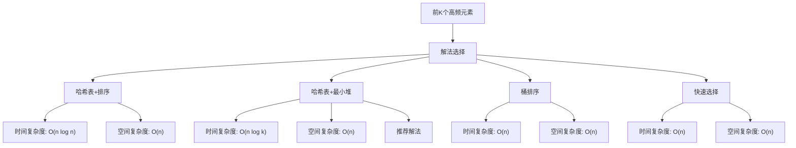

# LC347_前K个高频元素解法分析
## 题目描述
给定一个非空的整数数组，返回其中出现频率前 k 高的元素。
**示例：**
- 输入: nums = [1,1,1,2,2,3], k = 2
- 输出: [1,2]
**提示：**
- 你可以假设给定的 k 总是合理的，且 1 ≤ k ≤ 数组中不同元素的个数。
- 你的算法的时间复杂度必须优于 O(n log n) ，其中 n 是数组的大小。
- 题目数据保证答案唯一，换句话说，数组中前 k 个高频元素的集合是唯一的。
- 你可以按任意顺序返回答案。
## 解法概览

## 记忆口诀
**哈希表+排序**：统计频率后排序，取前k个
**哈希表+最小堆**：统计频率用小堆，维护k个元素
**桶排序**：频率作为桶下标，从高到低取k个
**快速选择**：基于频率的快速选择，找第k大
## 解法一：哈希表+排序
### 思路
使用哈希表统计每个元素的出现频率，然后对频率进行排序，取前k个高频元素。
### 核心公式
- 频率统计：`map.put(num, map.getOrDefault(num, 0) + 1)`
- 排序：根据频率从高到低排序
- 取前k个元素
### 图解过程
```
nums = [1,1,1,2,2,3], k=2

1. 统计频率：
   map = {1:3, 2:2, 3:1}

2. 按频率排序：
   [(1,3), (2,2), (3,1)]

3. 取前k=2个：
   [1, 2]
```
### 代码示例
```java
public int[] topKFrequent(int[] nums, int k) {
    // 统计频率
    Map<Integer, Integer> map = new HashMap<>();
    for (int num : nums) {
        map.put(num, map.getOrDefault(num, 0) + 1);
    }
    
    // 按频率排序
    List<Map.Entry<Integer, Integer>> list = new ArrayList<>(map.entrySet());
    list.sort((a, b) -> b.getValue() - a.getValue());
    
    // 取前k个
    int[] res = new int[k];
    for (int i = 0; i < k; i++) {
        res[i] = list.get(i).getKey();
    }
    return res;
}
```
### 复杂度分析
- **时间复杂度**：O(n log n)，其中 n 是数组的长度。排序的时间复杂度是 O(m log m)，其中 m 是不同元素的个数，最坏情况下 m = n。
- **空间复杂度**：O(n)，需要存储所有元素的频率。
### 优缺点
- **优点**：实现简单，代码清晰。
- **缺点**：时间复杂度为 O(n log n)，不满足题目要求的优于 O(n log n) 的时间复杂度。
## 解法二：哈希表+最小堆
### 思路
使用哈希表统计每个元素的出现频率，然后使用最小堆维护前k个高频元素。当堆的大小超过k时，弹出最小频率的元素。
### 核心公式
- 频率统计：`map.put(num, map.getOrDefault(num, 0) + 1)`
- 最小堆：`PriorityQueue<Map.Entry<Integer, Integer>> minHeap = new PriorityQueue<>((a, b) -> a.getValue() - b.getValue())`
- 维护堆大小：当堆大小超过k时，弹出最小元素
### 图解过程
```
nums = [1,1,1,2,2,3], k=2

1. 统计频率：
   map = {1:3, 2:2, 3:1}

2. 构建最小堆：
   - 加入(1,3) → 堆大小=1 < 2
   - 加入(2,2) → 堆大小=2 == 2
   - 加入(3,1) → 堆大小=3 > 2，弹出最小元素(3,1)
   - 最终堆：[(2,2), (1,3)]

3. 取出堆中元素：
   [2, 1] → 调整顺序为[1, 2]
```
### 代码示例
```java
public int[] topKFrequent(int[] nums, int k) {
    // 统计频率
    Map<Integer, Integer> map = new HashMap<>();
    for (int num : nums) {
        map.put(num, map.getOrDefault(num, 0) + 1);
    }
    
    // 最小堆
    PriorityQueue<Map.Entry<Integer, Integer>> minHeap = 
            new PriorityQueue<>((a, b) -> a.getValue() - b.getValue());
    
    for (Map.Entry<Integer, Integer> entry : map.entrySet()) {
        if (minHeap.size() < k) {
            minHeap.offer(entry);
        } else if (minHeap.peek().getValue() < entry.getValue()) {
            minHeap.poll();
            minHeap.offer(entry);
        }
    }
    
    // 取出结果
    int[] res = new int[k];
    for (int i = 0; i < k; i++) {
        res[i] = minHeap.poll().getKey();
    }
    return res;
}
```
### 复杂度分析
- **时间复杂度**：O(n log k)，其中 n 是数组的长度。遍历数组统计频率的时间复杂度是 O(n)，维护最小堆的时间复杂度是 O(m log k)，其中 m 是不同元素的个数。
- **空间复杂度**：O(n)，需要存储所有元素的频率和最小堆。
### 优缺点
- **优点**：时间复杂度为 O(n log k)，当 k 远小于 n 时，性能优于排序方法。
- **缺点**：实现相对复杂，需要使用堆数据结构。
## 解法三：桶排序
### 思路
使用哈希表统计每个元素的出现频率，然后使用桶排序的思想，将频率作为桶的下标，将元素放入对应的桶中。最后从高频率的桶开始，收集前k个元素。
### 核心公式
- 频率统计：`map.put(num, map.getOrDefault(num, 0) + 1)`
- 桶创建：`List<Integer>[] buckets = new List[nums.length + 1]`
- 元素入桶：`buckets[frequency].add(num)`
- 收集结果：从高频率桶开始，收集前k个元素
### 图解过程
```
nums = [1,1,1,2,2,3], k=2

1. 统计频率：
   map = {1:3, 2:2, 3:1}

2. 创建桶：
   buckets[1] = [3]
   buckets[2] = [2]
   buckets[3] = [1]

3. 收集结果：
   从桶3开始：加入1 → 已收集1个
   从桶2开始：加入2 → 已收集2个
   结果：[1, 2]
```
### 代码示例
```java
public int[] topKFrequent(int[] nums, int k) {
    // 统计频率
    Map<Integer, Integer> map = new HashMap<>();
    for (int num : nums) {
        map.put(num, map.getOrDefault(num, 0) + 1);
    }
    
    // 创建桶
    List<Integer>[] buckets = new List[nums.length + 1];
    for (int i = 0; i < buckets.length; i++) {
        buckets[i] = new ArrayList<>();
    }
    
    // 元素入桶
    for (Map.Entry<Integer, Integer> entry : map.entrySet()) {
        int num = entry.getKey();
        int frequency = entry.getValue();
        buckets[frequency].add(num);
    }
    
    // 收集结果
    List<Integer> result = new ArrayList<>();
    for (int i = buckets.length - 1; i >= 0 && result.size() < k; i--) {
        if (!buckets[i].isEmpty()) {
            result.addAll(buckets[i]);
        }
    }
    
    // 转换为数组
    int[] res = new int[k];
    for (int i = 0; i < k; i++) {
        res[i] = result.get(i);
    }
    return res;
}
```
### 复杂度分析
- **时间复杂度**：O(n)，其中 n 是数组的长度。统计频率和元素入桶的时间复杂度都是 O(n)，收集结果的时间复杂度也是 O(n)。
- **空间复杂度**：O(n)，需要存储所有元素的频率和桶。
### 优缺点
- **优点**：时间复杂度为 O(n)，是最优的解法。
- **缺点**：需要额外的空间来存储桶，且当频率分布很广时，空间利用率可能不高。
## 解法四：快速选择
### 思路
使用哈希表统计每个元素的出现频率，然后将频率和元素存储在数组中，使用快速选择算法找到第k大的频率，然后收集所有频率大于等于该值的元素。
### 核心公式
- 频率统计：`map.put(num, map.getOrDefault(num, 0) + 1)`
- 快速选择：找到第k大的频率
- 收集结果：收集频率大于等于第k大频率的元素
### 图解过程
```
nums = [1,1,1,2,2,3], k=2

1. 统计频率：
   map = {1:3, 2:2, 3:1}

2. 转换为数组：
   elements = [(1,3), (2,2), (3,1)]

3. 快速选择找到第2大的频率：
   第2大的频率是2

4. 收集频率大于等于2的元素：
   [1, 2]
```
### 代码示例
```java
public int[] topKFrequent(int[] nums, int k) {
    // 统计频率
    Map<Integer, Integer> map = new HashMap<>();
    for (int num : nums) {
        map.put(num, map.getOrDefault(num, 0) + 1);
    }
    
    // 转换为数组
    List<Map.Entry<Integer, Integer>> elements = new ArrayList<>(map.entrySet());
    
    // 快速选择找到第k大的频率
    int kthFrequency = quickSelect(elements, 0, elements.size() - 1, k - 1);
    
    // 收集结果
    List<Integer> result = new ArrayList<>();
    for (Map.Entry<Integer, Integer> entry : elements) {
        if (entry.getValue() >= kthFrequency) {
            result.add(entry.getKey());
        }
    }
    
    // 转换为数组
    int[] res = new int[k];
    for (int i = 0; i < k; i++) {
        res[i] = result.get(i);
    }
    return res;
}

private int quickSelect(List<Map.Entry<Integer, Integer>> elements, int left, int right, int k) {
    if (left == right) {
        return elements.get(left).getValue();
    }
    
    int pivotIndex = partition(elements, left, right);
    if (k == pivotIndex) {
        return elements.get(k).getValue();
    } else if (k < pivotIndex) {
        return quickSelect(elements, left, pivotIndex - 1, k);
    } else {
        return quickSelect(elements, pivotIndex + 1, right, k);
    }
}

private int partition(List<Map.Entry<Integer, Integer>> elements, int left, int right) {
    int pivot = elements.get(right).getValue();
    int i = left - 1;
    for (int j = left; j < right; j++) {
        if (elements.get(j).getValue() >= pivot) {
            i++;
            swap(elements, i, j);
        }
    }
    swap(elements, i + 1, right);
    return i + 1;
}

private void swap(List<Map.Entry<Integer, Integer>> elements, int i, int j) {
    Map.Entry<Integer, Integer> temp = elements.get(i);
    elements.set(i, elements.get(j));
    elements.set(j, temp);
}
```
### 复杂度分析
- **时间复杂度**：O(n)，其中 n 是数组的长度。快速选择的平均时间复杂度是 O(n)，最坏情况下是 O(n²)。
- **空间复杂度**：O(n)，需要存储所有元素的频率。
### 优缺点
- **优点**：平均时间复杂度为 O(n)，是最优的解法之一。
- **缺点**：实现复杂，且最坏情况下时间复杂度可能退化到 O(n²)。
## 面试回答模板
**问题**：请你解决 LC347_前K个高频元素 问题。
**回答**：
这个问题是要找出数组中出现频率前k高的元素。我可以提供几种解法：
首先，最直接的解法是使用哈希表统计频率，然后对频率进行排序，取前k个元素。这种方法实现简单，但时间复杂度是 O(n log n)，不满足题目要求。
第二种方法是使用哈希表统计频率，然后使用最小堆维护前k个高频元素。当堆的大小超过k时，弹出最小频率的元素。这种方法的时间复杂度是 O(n log k)，当k远小于n时，性能很好。
第三种方法是使用桶排序的思想，将频率作为桶的下标，将元素放入对应的桶中，然后从高频率的桶开始收集前k个元素。这种方法的时间复杂度是 O(n)，是最优的解法。
第四种方法是使用快速选择算法，找到第k大的频率，然后收集所有频率大于等于该值的元素。这种方法的平均时间复杂度也是 O(n)。
我推荐使用哈希表+最小堆的解法，因为它实现相对简单，且时间复杂度为 O(n log k)，满足题目要求。如果追求最优性能，可以选择桶排序的方法。
## 相关题目
1. **LC215_数组中的第K个最大元素**：使用快速选择或堆来找到第k个最大元素。
2. **LC692_前K个高频单词**：类似于前k个高频元素，但需要处理单词的字典序。
3. **LC451_根据字符出现频率排序**：根据字符出现的频率对字符串进行排序。
4. **LC703_数据流中的第K大元素**：使用最小堆维护数据流中的前k大元素。
5. **LC973_最接近原点的K个点**：使用最小堆或快速选择找到距离原点最近的k个点。