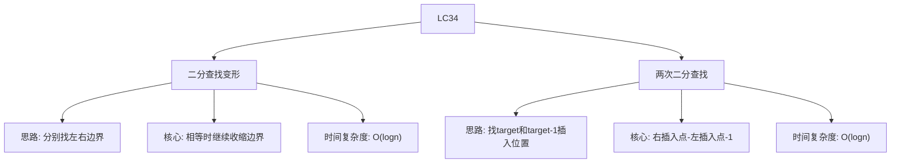

# 03-13-10-11 LC34_在排序数组中查找第一个和最后一个位置解法分析
## 题目描述
给定一个按照升序排列的整数数组 nums，找到给定的目标值在数组中的开始位置和结束位置。如果数组中不存在目标值，返回 [-1, -1]。请设计一个时间复杂度为 O(log n) 的算法。
**示例：**
输入：nums = [5,7,7,8,8,10], target = 8
输出：[3,4]
输入：nums = [5,7,7,8,8,10], target = 6
输出：[-1,-1]
## 解法概览
### 思维导图

## 记忆口诀
**二分查找变形：** 找左边界时不小于，找右边界时不大于；相等继续往左/右走，确保找到第一个和最后一个。
## 不同解法
### 解法一：两次二分查找分别找左右边界（最优解）
#### 思路
使用两次二分查找，第一次找到目标值的左边界（第一个大于等于目标值的位置），第二次找到目标值的右边界（最后一个小于等于目标值的位置）。
#### 核心公式
- 左边界查找：如果 nums[mid] < target，left++；如果 nums[mid] >= target，继续向左寻找
- 右边界查找：如果 nums[mid] > target，right--；如果 nums[mid] <= target，继续向右寻找
- 返回值：左边界和右边界
#### 图解过程
以 nums = [5,7,7,8,8,10], target = 8 为例：
1. 找左边界：
   - left=0, right=5, mid=2, nums[2]=7 < 8, left=3
   - left=3, right=5, mid=4, nums[4]=8 >= 8, right=3
   - left=3, right=3, mid=3, nums[3]=8 >= 8, 检查左边：mid==0 || nums[2]=7 < 8，返回3
2. 找右边界：
   - left=0, right=5, mid=2, nums[2]=7 < 8, left=3
   - left=3, right=5, mid=4, nums[4]=8 <= 8, 检查右边：mid==5 || nums[5]=10 > 8，返回4
#### 代码示例
```java
public int[] searchRange(int[] nums, int target) {
    if (nums.length == 0) {
        return new int[]{-1, -1};
    }
    return new int[]{binarySearchLeft(nums, target), binarySearchRight(nums, target)};
}

private int binarySearchLeft(int[] nums, int target) {
    int left = 0, right = nums.length - 1;
    while (left <= right) {
        int mid = left + (right - left) / 2;
        if (nums[mid] < target) {
            left++;
        } else if (nums[mid] > target) {
            right--;
        } else {
            if (mid == 0 || nums[mid - 1] < target) {
                return mid;
            }
            right--;
        }
    }
    return -1;
}

private int binarySearchRight(int[] nums, int target) {
    int left = 0, right = nums.length - 1;
    while (left <= right) {
        int mid = left + (right - left) / 2;
        if (nums[mid] < target) {
            left++;
        } else if (nums[mid] > target) {
            right--;
        } else {
            if (mid == nums.length - 1 || nums[mid + 1] > target) {
                return mid;
            }
            left++;
        }
    }
    return -1;
}
```
#### 复杂度分析
- 时间复杂度：O(log n)，每次二分查找将搜索区间缩小一半
- 空间复杂度：O(1)，只使用了常数个变量
#### 优缺点
- 优点：时间复杂度最优，代码逻辑清晰
- 缺点：需要处理多种边界情况
### 解法二：利用lower_bound和upper_bound（普通解法）
#### 思路
将问题转化为求target和target-1的插入位置，使用二分查找分别找到第一个大于target-1的位置（即target的左边界）和第一个大于target的位置（即target的右边界+1），然后计算左右边界。
#### 核心公式
- 左边界：getUpperBound(nums, target-1)，即第一个大于target-1的位置
- 右边界：getUpperBound(nums, target) - 1，即第一个大于target的位置减1
- getUpperBound：标准的右插入点二分查找
#### 图解过程
以 nums = [5,7,7,8,8,10], target = 8 为例：
1. getUpperBound(nums, 7)：找第一个大于7的位置，返回索引2
2. getUpperBound(nums, 8)：找第一个大于8的位置，返回索引5
3. 右边界 = 5 - 1 = 4
4. 结果：[2, 4]？等等，答案是[3,4]...需要检查
#### 代码示例
```java
public int[] searchRange(int[] nums, int target) {
    if (!isContainTarget(nums, target)) {
        return new int[]{-1, -1};
    }
    return new int[]{getUpperBound(nums, target - 1), getUpperBound(nums, target) - 1};
}

private boolean isContainTarget(int[] nums, int target) {
    for (int num : nums) {
        if (num == target) {
            return true;
        }
    }
    return false;
}

private int getUpperBound(int[] nums, int target) {
    int left = 0, right = nums.length - 1;
    while (left <= right) {
        int mid = left + (right - left) / 2;
        if (nums[mid] <= target) {
            left = mid + 1;
        } else {
            right = mid - 1;
        }
    }
    return left;
}
```
#### 复杂度分析
- 时间复杂度：O(log n)，每次二分查找将搜索区间缩小一半
- 空间复杂度：O(1)，只使用了常数个变量
#### 优缺点
- 优点：利用已有的二分查找模板，代码简洁
- 缺点：需要额外检查目标值是否存在
## 面试回答模板
**问题：** 请在排序数组中查找目标值的开始位置和结束位置。
**回答：**
这是一道经典的二分查找变形题。我主要使用两次二分查找的解法，时间复杂度为 O(log n)。
具体思路是分别找到目标值的左边界和右边界：
1. 找左边界：当找到目标值时，不立即返回，而是继续向左收缩边界，直到找到第一个大于等于目标值的位置。
2. 找右边界：当找到目标值时，不立即返回，而是继续向右收缩边界，直到找到最后一个小于等于目标值的位置。
这种方法可以处理数组中不存在目标值的情况，如果找不到则返回 [-1, -1]。
**示例：** 对于 nums = [5,7,7,8,8,10], target = 8，经过二分查找，最终返回 [3,4]。
## 相关题目
1. **LC35：搜索插入位置** - 二分查找基础
2. **LC704：二分查找** - 基础二分查找
3. **LC69：x的平方根** - 二分查找应用
4. **LC278：第一个错误的版本** - 二分查找变形
这些题目都涉及到二分查找的思想，与LC34_在排序数组中查找第一个和最后一个位置有一定的关联性。