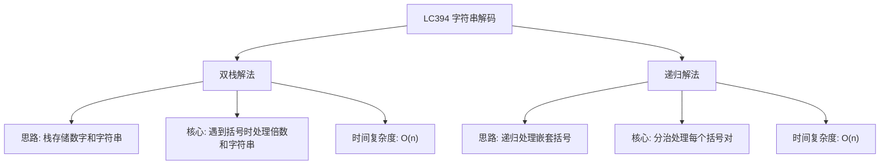

# 03-15-11-00 字符串解码解法分析
## 题目描述
给定一个经过编码的字符串，返回它解码后的字符串。
编码规则为: k[encoded_string]，表示其中方括号内部的 encoded_string 正好重复 k 次。注意 k 保证为正整数。
你可以认为输入字符串总是有效的；输入字符串中没有额外的空格，且输入的方括号总是符合格式要求的。
此外，你可以认为原始数据不包含数字，所有的数字只表示重复的次数 k ，例如不会出现像 3a 或 2[4] 的输入。
**示例：**
输入：s = "3[a]2[bc]"
输出："aaabcbc"
输入：s = "3[a2[c]]"
输出："accaccacc"
输入：s = "2[abc]3[cd]ef"
输出："abcabccdcdcdef"
## 解法概览
### 思维导图

## 记忆口诀
**字符串解码：** 数字入栈倍数存，左括号前串入栈；右括号时倍数出，重复字符串拼接；最终结果自然成。
## 不同解法
### 解法一：双栈解法（最优解）
#### 思路
使用两个栈：一个数字栈存储倍数，一个字符串栈存储已经处理好的字符串。遍历输入字符串，遇到数字时累积计算倍数，遇到左括号时将当前倍数和字符串入栈，遇到右括号时弹出栈顶倍数和字符串，将当前字符串重复相应次数后与弹出的字符串拼接，遇到普通字符时直接追加到当前字符串。
#### 核心公式
- 数字处理：`multi = multi * 10 + (c - '0')`
- 左括号处理：将当前倍数和字符串入栈，重置倍数和当前字符串
- 右括号处理：弹出倍数和字符串，重复当前字符串并与弹出的字符串拼接
- 普通字符处理：直接追加到当前字符串
#### 图解过程
以 s = "3[a2[c]]" 为例：
1. 遇到 '3'，multi = 3
2. 遇到 '['，将 3 压入数字栈，将空字符串压入字符串栈，重置 multi=0，res=""
3. 遇到 'a'，res="a"
4. 遇到 '2'，multi = 2
5. 遇到 '['，将 2 压入数字栈，将 "a" 压入字符串栈，重置 multi=0，res=""
6. 遇到 'c'，res="c"
7. 遇到 ']'，弹出数字 2，重复 res "c" 两次得到 "cc"，弹出字符串 "a"，拼接得到 res="acc"
8. 遇到 ']'，弹出数字 3，重复 res "acc" 三次得到 "accaccacc"，弹出字符串 ""，拼接得到 res="accaccacc"
9. 遍历结束，返回 "accaccacc"
#### 代码示例
```java
import java.util.Deque;
import java.util.LinkedList;

public class Solution {
    public String decodeString(String s) {
        if (s == null) {
            return "";
        }
        // 栈1：保存遇到的倍数数字
        Deque<Integer> numStack = new LinkedList<>();
        // 栈2：保存已经生成好的字符串
        Deque<String> letterStack = new LinkedList<>();

        // multi保存遇到左括号前的数字=倍数
        int multi = 0;
        // res在本方法返回之作为保存[]之间，临时字符的功能
        StringBuilder res = new StringBuilder();

        for (char c : s.toCharArray()) {
            if (c >= '0' && c <= '9') {
                // 遇到数字，累积计算倍数
                multi = multi * 10 + (c - '0');
            } else if (c == '[') {
                // 遇到左括号，将当前倍数和字符串入栈
                numStack.push(multi);
                letterStack.push(res.toString());
                // 重置倍数和当前字符串
                multi = 0;
                res = new StringBuilder();
            } else if (c == ']') {
                // 遇到右括号，弹出倍数和字符串
                StringBuilder temp = new StringBuilder();
                int lastNum = numStack.pop();
                // 重复当前字符串
                for (int i = 0; i < lastNum; i++) {
                    temp.append(res);
                }
                // 与弹出的字符串拼接
                res = new StringBuilder(letterStack.pop() + temp);
            } else {
                // 遇到普通字符，直接追加
                res.append(c);
            }
        }

        return res.toString();
    }
}
```
#### 复杂度分析
- 时间复杂度：O(n)，每个字符只处理一次，重复操作的时间也被计入总时间
- 空间复杂度：O(n)，栈的最大深度取决于嵌套括号的层数
#### 优缺点
- 优点：逻辑清晰，实现简单，处理嵌套括号非常直观
- 缺点：需要使用两个栈，空间使用稍多
### 解法二：递归解法（普通解法）
#### 思路
使用递归的方式处理嵌套括号。遇到左括号时开始递归处理括号内的内容，遇到右括号时返回处理结果和当前位置。递归过程中处理数字和字符串的拼接。
#### 核心公式
- 数字处理：累积计算倍数
- 左括号处理：递归处理括号内的内容，返回处理结果和结束位置
- 右括号处理：返回当前处理结果和位置
- 普通字符处理：直接追加到当前字符串
#### 图解过程
以 s = "3[a2[c]]" 为例：
1. 主函数处理到 '3'，计算倍数为 3
2. 遇到 '['，开始递归处理括号内内容
3. 递归层1：处理到 'a'，添加到结果
4. 处理到 '2'，计算倍数为 2
5. 遇到 '['，开始递归处理括号内内容
6. 递归层2：处理到 'c'，添加到结果
7. 遇到 ']'，返回 "c" 和当前位置
8. 递归层1：将 "c" 重复 2 次得到 "cc"，添加到结果 "a" 后得到 "acc"
9. 遇到 ']'，返回 "acc" 和当前位置
10. 主函数：将 "acc" 重复 3 次得到 "accaccacc"
11. 返回最终结果
#### 代码示例
```java
public class Solution {
    private int index = 0;
    
    public String decodeString(String s) {
        if (s == null) {
            return "";
        }
        return dfs(s);
    }
    
    private String dfs(String s) {
        StringBuilder res = new StringBuilder();
        int multi = 0;
        
        while (index < s.length()) {
            char c = s.charAt(index);
            if (c >= '0' && c <= '9') {
                // 遇到数字，累积计算倍数
                multi = multi * 10 + (c - '0');
                index++;
            } else if (c == '[') {
                // 遇到左括号，开始递归
                index++;
                String temp = dfs(s);
                // 重复字符串
                for (int i = 0; i < multi; i++) {
                    res.append(temp);
                }
                multi = 0;
            } else if (c == ']') {
                // 遇到右括号，返回结果
                index++;
                return res.toString();
            } else {
                // 遇到普通字符，直接追加
                res.append(c);
                index++;
            }
        }
        return res.toString();
    }
}
```
#### 复杂度分析
- 时间复杂度：O(n)，每个字符只处理一次
- 空间复杂度：O(n)，递归栈的深度取决于嵌套括号的层数
#### 优缺点
- 优点：代码简洁，逻辑清晰，易于理解
- 缺点：递归可能在极端情况下导致栈溢出
## 面试回答模板
**问题：** 请实现字符串解码功能，将编码后的字符串转换为原始字符串。
**回答：**
这是一道经典的栈应用问题。我主要使用双栈的解法，时间复杂度为 O(n)。
具体思路是：
1. 使用两个栈，一个数字栈存储倍数，一个字符串栈存储已经处理好的字符串
2. 遍历输入字符串，遇到数字时累积计算倍数
3. 遇到左括号时，将当前倍数和字符串入栈，重置倍数和当前字符串
4. 遇到右括号时，弹出栈顶的倍数和字符串，将当前字符串重复相应次数后与弹出的字符串拼接
5. 遇到普通字符时，直接追加到当前字符串
**示例：** 对于输入 "3[a2[c]]"，处理过程中数字栈会依次压入 3 和 2，字符串栈会依次压入 "" 和 "a"，最终通过弹出栈元素并重复拼接，得到结果 "accaccacc"。
这种方法的优势在于逻辑清晰，能够很好地处理嵌套括号的情况，是解决字符串解码问题的标准解法。
## 相关题目
1. **LC726：原子的数量** - 栈的应用，处理嵌套括号和计数
2. **LC385：迷你语法分析器** - 递归处理嵌套结构
3. **LC224：基本计算器** - 栈的应用，处理表达式计算
4. **LC227：基本计算器 II** - 栈的应用，处理表达式计算
这些题目都涉及到栈的高级应用或递归处理嵌套结构，与LC394_字符串解码有一定的关联性。