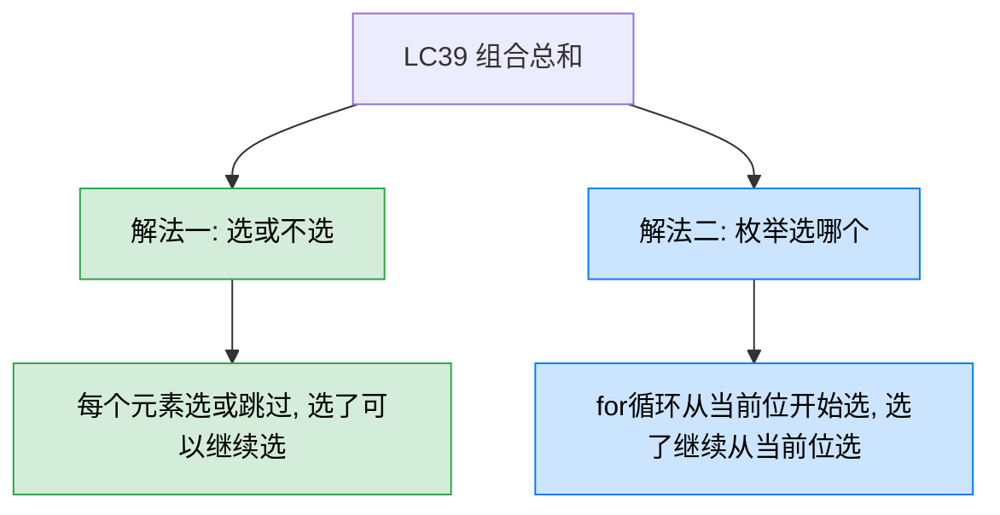
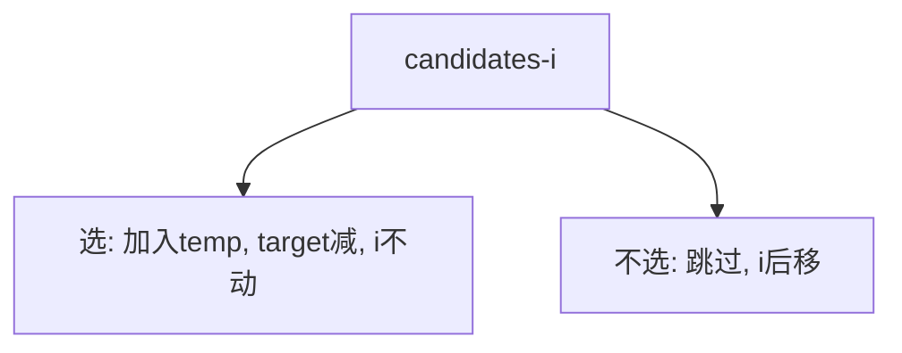
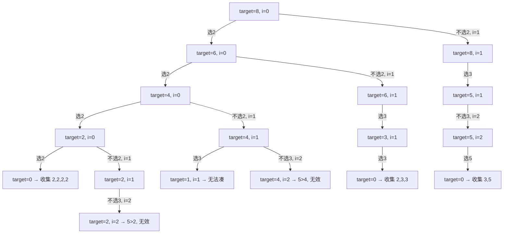
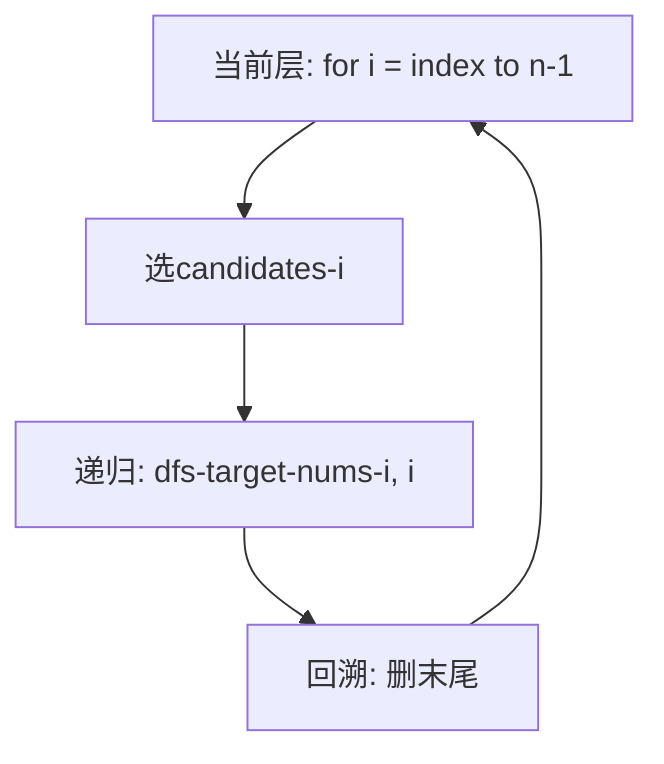
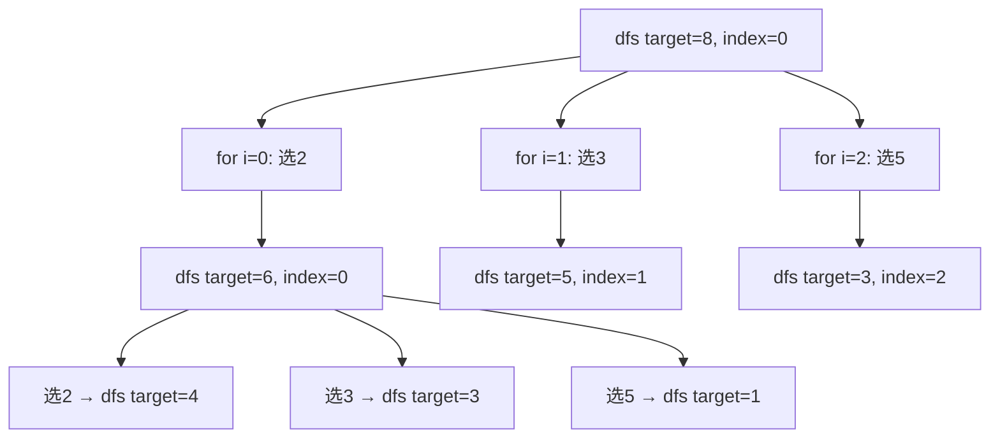

# LC39 组合总和
## 一、题目描述
给你一个**无重复元素**的整数数组 candidates 和一个目标整数 target，找出 candidates 中可以使数字之和为目标数 target 的所有**不同组合**。candidates 中的**同一个数字可以无限制重复被选取**。
**示例：** 输入 `candidates = [2,3,5], target = 8`，输出 `[[2,2,2,2],[2,3,3],[3,5]]`
**约束：** 1 <= candidates.length <= 30，2 <= candidates[i] <= 40，所有元素各不相同，1 <= target <= 40
## 二、解法概览

| 解法 | 时间复杂度 | 空间复杂度 | 难度 | 面试推荐 |
|------|-----------|-----------|------|---------|
| 选或不选 | O(n * 2^t) | O(t) | ⭐⭐ | 你的当前实现 |
| 枚举选哪个 | O(n * 2^t) | O(t) | ⭐⭐ | 面试更常见的写法 |
t = target / min(candidates)，即递归最大深度
## 三、记忆口诀
> **选或不选：选了不动，不选后移。**
> **枚举选哪个：for循环从i开始选，选了从i继续选。**
两种写法都能避免重复组合，关键是**只往后选，不回头**。
## 四、与LC17电话号码组合的对比
| 对比项 | LC17 电话号码 | LC39 组合总和 |
|--------|-------------|-------------|
| 每一层的选择 | 当前数字对应的字母 | 从 i 开始的所有候选数字 |
| 能否重复选 | 不能（每个数字只用一次） | 能（同一个数字可以重复选） |
| 终止条件 | index == digits.length | target == 0 |
| 去重方式 | 天然不重复 | 从 i 开始选，不回头 |
## 五、解法一：选或不选（你的当前实现）
### 5.1 思路
对于 candidates[i]，只有两种决策：
- **选它**：加入路径，target 减小，**i 不动**（因为可以重复选）
- **不选它**：跳过，**i 后移**到下一个候选

### 5.2 核心公式
```
dfs(target, i):
  target == 0 → 收集结果
  i越界 或 target < 0 → 返回
  选: temp.add(nums[i]), dfs(target - nums[i], i)   // i不动，可重复选
  不选: temp.remove(末尾), dfs(target, i + 1)        // i后移，跳过当前数
```
### 5.3 图解过程
以 `candidates = [2,3,5], target = 8` 为例：

### 5.4 代码示例
```java
public List<List<Integer>> combinationSum(int[] candidates, int target) {
    List<List<Integer>> res = new ArrayList<>();
    dfs(candidates, target, 0, new ArrayList<>(), res);
    return res;
}
private void dfs(int[] nums, int target, int i,
                 List<Integer> temp, List<List<Integer>> res) {
    if (target == 0) {
        res.add(new ArrayList<>(temp));
        return;
    }
    if (i >= nums.length || target < 0) return;
    // 选 nums[i]：加入路径，i不动（可重复选）
    temp.add(nums[i]);
    dfs(nums, target - nums[i], i, temp, res);
    // 不选 nums[i]：回溯，i后移
    temp.remove(temp.size() - 1);
    dfs(nums, target, i + 1, temp, res);
}
```
### 5.5 关键细节：`res.add(new ArrayList<>(temp))`
必须 `new ArrayList<>(temp)` 拷贝一份，因为 temp 是同一个对象，后续回溯会修改它。如果直接 `res.add(temp)`，最终所有结果都会变成空列表。
### 5.6 复杂度分析
- **时间复杂度：O(n * 2^(target/min))**，递归树的分支和深度
- **空间复杂度：O(target/min)**，递归栈深度
### 5.7 优缺点
| 优点 | 缺点 |
|------|------|
| 二叉决策树思路清晰 | 不如 for 循环写法通用 |
| 和背包问题思路一致 | 面试中 for 循环写法更常见 |
## 六、解法二：枚举选哪个（面试最常见写法）
### 6.1 思路
用 for 循环枚举当前层选哪个数字。从 index 开始遍历（不回头），选了 candidates[i] 后递归时仍从 i 开始（可重复选），回溯后换下一个。

### 6.2 核心公式
```
dfs(target, index):
  target == 0 → 收集结果
  target < 0 → 返回
  for i = index to n-1:        // 从index开始，不回头
    temp.add(nums[i])
    dfs(target - nums[i], i)   // 从i开始，可重复选
    temp.remove(末尾)           // 回溯
```
### 6.3 图解过程

### 6.4 代码示例
```java
public List<List<Integer>> combinationSum(int[] candidates, int target) {
    List<List<Integer>> res = new ArrayList<>();
    dfs(candidates, target, 0, new ArrayList<>(), res);
    return res;
}
private void dfs(int[] nums, int target, int index,
                 List<Integer> temp, List<List<Integer>> res) {
    if (target == 0) {
        res.add(new ArrayList<>(temp));
        return;
    }
    if (target < 0) return;
    for (int i = index; i < nums.length; i++) {
        temp.add(nums[i]);
        dfs(nums, target - nums[i], i, temp, res);  // 从i开始，可重复选
        temp.remove(temp.size() - 1);
    }
}
```
### 6.5 剪枝优化：先排序
如果先对 candidates 排序，当 `target - nums[i] < 0` 时后面的数更大，可以直接 break：
```java
Arrays.sort(candidates);
// for 循环内加一行:
if (target - nums[i] < 0) break;
```
### 6.6 复杂度分析
- **时间复杂度：O(n * 2^(target/min))**，和解法一相同
- **空间复杂度：O(target/min)**
### 6.7 优缺点
| 优点 | 缺点 |
|------|------|
| 面试最常见写法，通用性强 | 需理解 for 从 index 开始去重 |
| 可加排序+剪枝优化 | 无 |
| 容易扩展到 LC40 等变体 | 无 |
## 七、两种写法的本质对比
| 对比项 | 选或不选 | 枚举选哪个 |
|--------|---------|-----------|
| 决策模型 | 二叉树：选/不选 | 多叉树：选哪个 |
| 递归分支 | 每层2个分支 | 每层 n-index 个分支 |
| 回溯位置 | 两次递归之间删除 | for 循环末尾删除 |
| 类比 | 像 0-1 背包的决策 | 像标准回溯模板 |
| 通用性 | 偏特殊 | 更通用，适合所有组合类题 |
## 八、组合类回溯题的关键区分
| 题目 | 能否重复选 | 有无重复元素 | 递归起点 |
|------|-----------|------------|---------|
| LC39 组合总和 | 能重复选 | 无重复元素 | `dfs(i)` 从i开始 |
| LC40 组合总和II | 不能重复选 | 有重复元素 | `dfs(i+1)` + 跳过相同 |
| LC216 组合总和III | 不能重复选 | 无重复(1-9) | `dfs(i+1)` |
| LC377 组合总和IV | 能重复选+排列 | 无重复元素 | `dfs(0)` 每次从头选 |
**记法：能重复选就从 i 开始，不能就从 i+1 开始，有重复元素就跳过相同值。**
## 九、面试回答模板
> **面试官：** 给定无重复数组和目标值，找出和为目标值的所有组合，同一个数字可以重复使用。
**回答要点：**
1. **说思路：** 回溯法，用 for 循环枚举选哪个数。从 index 开始遍历不回头，避免重复组合。因为可以重复选，递归时仍从 i 开始而不是 i+1。
2. **终止条件：** target == 0 收集结果，target < 0 剪枝返回。
3. **回溯操作：** 加入路径 → 递归 → 删除末尾。
4. **优化：** 先排序，target < nums[i] 时直接 break。
5. **复杂度：** 时间指数级（所有组合），空间 O(target/min) 递归栈。
6. **延伸：** LC40 每个数只能用一次且有重复元素，递归从 i+1 开始并跳过相同值去重。
## 十、相关题目
| 题目 | 关联点 |
|------|--------|
| LC40 组合总和II | 不可重复选 + 有重复元素 + 去重 |
| LC216 组合总和III | 1-9中选k个，不可重复 |
| LC377 组合总和IV | 求排列数（顺序不同算不同），用DP |
| LC77 组合 | 基础组合，从n中选k个 |
| LC17 电话号码组合 | 回溯入门，每层选择不同 |
| LC518 零钱兑换II | 类似问题，但只求组合数量，用DP |
