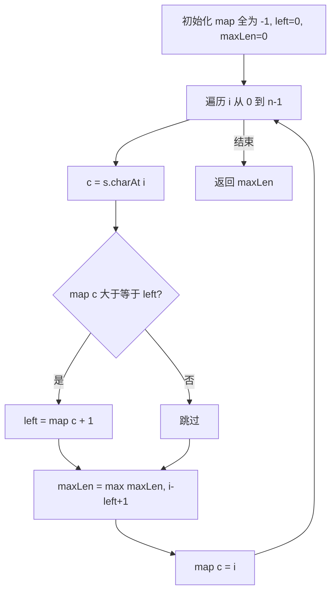
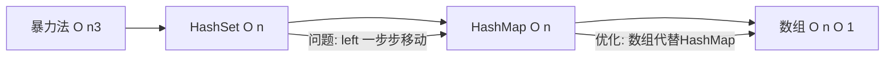

# LC3 无重复字符的最长子串 解法分析 V2
## 题目描述
给定一个字符串 `s`，请你找出其中不含有重复字符的**最长子串**的长度。
**示例：**
| 输入 | 输出 | 解释 |
|-----|------|------|
| `s = "abcabcbb"` | 3 | 最长子串是 `"abc"` |
| `s = "bbbbb"` | 1 | 最长子串是 `"b"` |
| `s = "pwwkew"` | 3 | 最长子串是 `"wke"` |
**关键概念**：
- **子串**：连续的字符序列
- **子序列**：不一定连续的字符序列
---
## 解法总览
| 解法 | 时间复杂度 | 空间复杂度 | 面试推荐 |
|------|-----------|-----------|---------|
| 暴力法 | O(n³) | O(n) | ❌ 不推荐 |
| 滑动窗口 + HashSet | O(n) | O(min(n,m)) | ✅ 推荐 |
| 滑动窗口 + HashMap | O(n) | O(min(n,m)) | ✅ 推荐 |
| **滑动窗口 + 数组** | O(n) | O(1) | ✅ **最优解** |
---
## 核心思想：滑动窗口
**滑动窗口**是一种双指针技巧，维护一个窗口 `[left, right]`，保证窗口内没有重复字符。
```
字符串: a b c a b c b b
        ───────────────
        [─窗口─]
        left   right
当 right 遇到重复字符时，left 需要移动
```
---
## 解法一：暴力法（不推荐）
### 思路
枚举所有子串，检查每个子串是否有重复字符。
### 核心公式
```
对于每个起点 i，终点 j：
    检查 s[i..j] 是否有重复
    maxLen = max(maxLen, j - i + 1)
```
### 代码示例
```java
public int lengthOfLongestSubstring(String s) {
    int n = s.length();
    int maxLen = 0;
    for (int i = 0; i < n; i++) {
        for (int j = i; j < n; j++) {
            if (allUnique(s, i, j)) {
                maxLen = Math.max(maxLen, j - i + 1);
            }
        }
    }
    return maxLen;
}
private boolean allUnique(String s, int start, int end) {
    Set<Character> set = new HashSet<>();
    for (int i = start; i <= end; i++) {
        if (set.contains(s.charAt(i))) return false;
        set.add(s.charAt(i));
    }
    return true;
}
```
### 复杂度分析
- 时间复杂度：**O(n³)**
- 空间复杂度：**O(n)**
### 优缺点
| 优点 | 缺点 |
|-----|------|
| 思路直观 | 会超时 |
---
## 解法二：滑动窗口 + HashSet
### 思路
用 HashSet 记录窗口内的字符。遇到重复时，**一步步移动** left 直到没有重复。
### 核心公式
```
while (set.contains(s[right])):
    set.remove(s[left])
    left++
set.add(s[right])
maxLen = max(maxLen, right - left + 1)
```
### 图解过程
以 `s = "abcabc"` 为例，当 right=3 遇到 'a' 时：
```
字符串:  a  b  c  a  b  c
索引:    0  1  2  3
当前:   [a  b  c] a
         ↑     ↑  ↑
       left    │ right
               └─ 与 left 处的 'a' 重复
HashSet 只知道有重复，不知道在哪
所以只能一步步移除：
  移除 s[0]='a'，left=1
  现在不重复了，停止
```
### 代码示例
```java
public int lengthOfLongestSubstring(String s) {
    int n = s.length();
    int left = 0, maxLen = 0;
    Set<Character> set = new HashSet<>();
    for (int right = 0; right < n; right++) {
        while (set.contains(s.charAt(right))) {
            set.remove(s.charAt(left));
            left++;
        }
        set.add(s.charAt(right));
        maxLen = Math.max(maxLen, right - left + 1);
    }
    return maxLen;
}
```
### 复杂度分析
- 时间复杂度：**O(n)**
- 空间复杂度：**O(min(n, m))**，m 为字符集大小
### 优缺点
| 优点 | 缺点 |
|-----|------|
| 思路清晰 | left 一步步移动，有冗余 |
---
## 解法三：滑动窗口 + HashMap（推荐 ✅）
### 思路
用 HashMap 记录**每个字符最后一次出现的位置**。遇到重复时，**直接跳跃** left 到重复字符的下一位。
### 核心公式
```
if (map.containsKey(c) && map.get(c) >= left):
    left = map.get(c) + 1   // 直接跳跃！
map.put(c, right)
maxLen = max(maxLen, right - left + 1)
```
### HashMap vs HashSet 对比
| 对比项 | HashSet | HashMap |
|-------|---------|---------|
| 存储内容 | 窗口内的字符 | 字符 → 最后出现位置 |
| 遇到重复 | 只知道"有重复" | 知道"重复在哪" |
| left 移动 | 一步步移动 | 直接跳跃 |
### 图解过程
以 `s = "abcabc"` 为例，当 right=3 遇到 'a' 时：
```
字符串:  a  b  c  a  b  c
索引:    0  1  2  3
当前:   [a  b  c] a
         ↑     ↑  ↑
       left    │ right
               └─ 重复
HashMap 知道 'a' 上次在位置 0
直接跳跃：left = 0 + 1 = 1
新窗口:  a [b  c  a] b  c
            ↑     ↑
          left  right
```
### 关键判断：`map.get(c) >= left`
**为什么需要这个条件？**
以 `s = "abba"` 为例：
```
i=0: map={a:0}, left=0
i=1: map={a:0,b:1}, left=0
i=2: 'b' 重复，map[b]=1 >= left=0
     left = 1+1 = 2
     map={a:0,b:2}
i=3: 'a' 在 map 中，位置是 0
     但 0 < left=2，不在当前窗口内！
     这是"历史记录"，不需要移动 left
     字符串:  a  b  b  a
                    ↑  ↑
                  left i
     位置 0 的 'a' 已经在 left 左边了
```
### 代码示例
```java
public int lengthOfLongestSubstring(String s) {
    int n = s.length();
    int left = 0, maxLen = 0;
    Map<Character, Integer> map = new HashMap<>();
    for (int right = 0; right < n; right++) {
        char c = s.charAt(right);
        // 重复字符在窗口内，直接跳跃
        if (map.containsKey(c) && map.get(c) >= left) {
            left = map.get(c) + 1;
        }
        map.put(c, right);
        maxLen = Math.max(maxLen, right - left + 1);
    }
    return maxLen;
}
```
### 复杂度分析
- 时间复杂度：**O(n)**
- 空间复杂度：**O(min(n, m))**
### 优缺点
| 优点 | 缺点 |
|-----|------|
| left 直接跳跃，更高效 | HashMap 有哈希开销 |
---
## 解法四：滑动窗口 + 数组（最优解 ✅）
### 思路
用数组代替 HashMap。因为 ASCII 字符只有 256 个，可以用固定大小的数组存储每个字符最后出现的位置。
### 为什么用数组？
| 对比项 | HashMap | 数组 |
|-------|---------|-----|
| 查找速度 | O(1) 但有哈希计算 | O(1) 直接下标访问 |
| 空间 | 动态分配 O(n) | 固定 256，O(1) |
| 内存 | 有额外开销 | 连续内存，缓存友好 |
### 核心公式
```
map[c] = 字符 c 最后出现的位置（初始化为 -1）
if (map[c] >= left):
    left = map[c] + 1
maxLen = max(maxLen, i - left + 1)
map[c] = i
```
### 图解过程
以 `s = "abcabc"` 为例：
```
初始：map 全为 -1，left = 0，maxLen = 0
━━━━━━━━━━━━━━━━━━━━━━━━━━━━━━━━━━━━━━━━━
i=0, c='a'
    map['a']=-1 < left=0，不移动
    maxLen = 0-0+1 = 1
    map['a'] = 0
    窗口 [0,0] = "a"
━━━━━━━━━━━━━━━━━━━━━━━━━━━━━━━━━━━━━━━━━
i=1, c='b'
    map['b']=-1 < left=0，不移动
    maxLen = 1-0+1 = 2
    map['b'] = 1
    窗口 [0,1] = "ab"
━━━━━━━━━━━━━━━━━━━━━━━━━━━━━━━━━━━━━━━━━
i=2, c='c'
    map['c']=-1 < left=0，不移动
    maxLen = 2-0+1 = 3
    map['c'] = 2
    窗口 [0,2] = "abc"
━━━━━━━━━━━━━━━━━━━━━━━━━━━━━━━━━━━━━━━━━
i=3, c='a' ⭐ 重复
    map['a']=0 >= left=0，在窗口内
    left = 0+1 = 1  【直接跳跃】
    maxLen = max(3, 3-1+1) = 3
    map['a'] = 3
    窗口 [1,3] = "bca"
    字符串:  a  b  c  a
                ↑     ↑
              left    i
━━━━━━━━━━━━━━━━━━━━━━━━━━━━━━━━━━━━━━━━━
i=4, c='b'
    map['b']=1 >= left=1，在窗口内
    left = 1+1 = 2  【直接跳跃】
    maxLen = max(3, 4-2+1) = 3
    map['b'] = 4
    窗口 [2,4] = "cab"
━━━━━━━━━━━━━━━━━━━━━━━━━━━━━━━━━━━━━━━━━
i=5, c='c'
    map['c']=2 >= left=2，在窗口内
    left = 2+1 = 3  【直接跳跃】
    maxLen = max(3, 5-3+1) = 3
    map['c'] = 5
    窗口 [3,5] = "abc"
最终答案：3
```
### 算法流程图

### 代码示例（推荐记忆版）
```java
public int lengthOfLongestSubstring(String s) {
    int[] map = new int[256];
    Arrays.fill(map, -1);           // -1 表示未出现过
    int left = 0, maxLen = 0;
    for (int i = 0; i < s.length(); i++) {
        char c = s.charAt(i);
        // 重复字符在窗口内，left 直接跳跃
        if (map[c] >= left) {
            left = map[c] + 1;
        }
        // 更新最大长度
        maxLen = Math.max(maxLen, i - left + 1);
        // 记录字符位置
        map[c] = i;
    }
    return maxLen;
}
```
### 复杂度分析
- 时间复杂度：**O(n)**，一次遍历
- 空间复杂度：**O(1)**，固定 256 大小数组
### 优缺点
| 优点 | 缺点 |
|-----|------|
| 时间 O(n)，空间 O(1) | 仅适用于有限字符集 |
| 数组访问最快 | - |
| 代码简洁 | - |
---
## 解法演进总结

| 演进 | 解决的问题 |
|-----|-----------|
| 暴力 → HashSet | 避免重复检查子串 |
| HashSet → HashMap | left 直接跳跃，不用一步步移动 |
| HashMap → 数组 | 空间从 O(n) 降到 O(1)，访问更快 |
---
## 记忆口诀
```
无重复子串用滑窗
数组存位置最优解
map[c] >= left 是关键
left 跳到 map[c]+1
长度就是 i-left+1
```
---
## 面试建议
### 推荐讲解顺序
1. 先说**滑动窗口**思想
2. 从 **HashSet** 开始，说明问题
3. 优化到 **HashMap**，解释直接跳跃
4. 最优解 **数组**，解释为什么更快
### 常见追问
| 问题 | 回答 |
|-----|------|
| 为什么用数组不用 HashMap？ | 字符集固定，数组访问更快，空间 O(1) |
| `map[c] >= left` 是什么意思？ | 判断重复字符是否在当前窗口内 |
| 长度为什么是 `i - left + 1`？ | 窗口是 [left, i]，包含两端 |
---
## 相关题目
| 题号 | 题目 | 技巧 |
|-----|------|------|
| LC76 | 最小覆盖子串 | 滑动窗口 |
| LC159 | 至多包含两个不同字符的最长子串 | 滑动窗口 |
| LC340 | 至多包含 K 个不同字符的最长子串 | 滑动窗口 |
| LC438 | 找到字符串中所有字母异位词 | 滑动窗口 |
