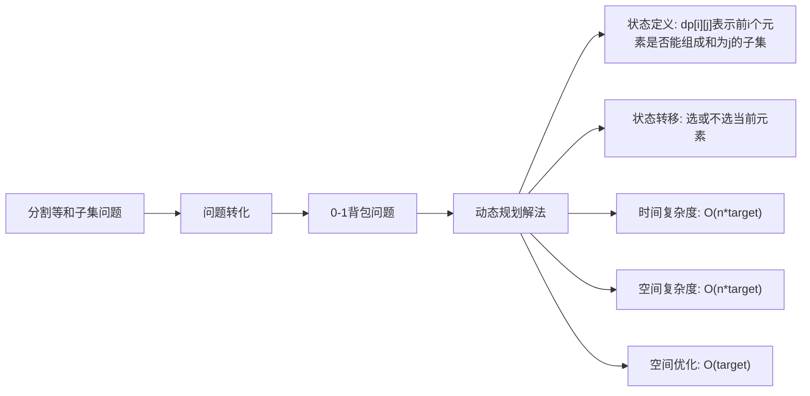

# LC416\_分割等和子集解法分析

## 题目描述

给你一个只包含正整数的非空数组 `nums`。请你判断是否可以将这个数组分割成两个子集，使得两个子集的元素和相等。
**示例：**

- 输入：`nums = [1,5,11,5]`
- 输出：`true`
- 解释：数组可以分割成 `[1, 5, 5]` 和 `[11]` 。

## 解法概览



## 记忆口诀

**动态规划解法**：等和子集先判偶，转化背包找目标，二维dp选或不选，空间优化更高效。

## 解法一：二维动态规划

### 思路

1. **问题转化**：分割等和子集等价于找到一个子集，其和为总和的一半。因此，首先需要判断数组总和是否为偶数，否则直接返回false。
2. **状态定义**：`dp[i][j]` 表示前 `i` 个元素是否能组成和为 `j` 的子集。
3. **初始状态**：
   - `dp[0][0] = true`（空集和为0）
   - 如果 `nums[0] <= target`，则 `dp[0][nums[0]] = true`（第一个元素只能组成和为自身的子集）
4. **状态转移**：对于每个元素 `nums[i]` 和每个可能的和 `j`：
   - 不选择当前元素：`dp[i][j] = dp[i-1][j]`
   - 选择当前元素（如果 `nums[i] <= j`）：`dp[i][j] = dp[i-1][j] || dp[i-1][j-nums[i]]`
5. **最终结果**：`dp[n-1][target]`，其中 `target = sum / 2`。

### 核心公式

- 不选择当前元素：`dp[i][j] = dp[i-1][j]`
- 选择当前元素：`dp[i][j] = dp[i-1][j] || dp[i-1][j-nums[i]]`（当 `nums[i] <= j`）

### 图解过程

以 `nums = [1,5,11,5]` 为例，`sum=22`，`target=11`：

1. 初始化 `dp[0][0] = true`，`dp[0][1] = true`（因为 `nums[0]=1 <= 11`）
2. 处理 `i=1`（nums\[1]=5）：
   - 对于 `j=0`：`dp[1][0] = dp[0][0] = true`
   - 对于 `j=1`：`dp[1][1] = dp[0][1] = true`
   - 对于 `j=5`：`dp[1][5] = dp[0][5] || dp[0][0] = true`
   - 对于 `j=6`：`dp[1][6] = dp[0][6] || dp[0][1] = true`
3. 处理 `i=2`（nums\[2]=11）：
   - 对于 `j=11`：`dp[2][11] = dp[1][11] || dp[1][0] = true`
4. 处理 `i=3`（nums\[3]=5）：
   - 对于 `j=11`：`dp[3][11] = dp[2][11] || dp[2][6] = true`
5. 最终结果：`dp[3][11] = true`

### 代码示例

```java
public boolean canPartition(int[] nums) {
    if (nums == null) {
        return false;
    }
    // 等和子集,数组元素和必须为偶数，否则返回false
    int sum = 0;
    for (int num : nums) {
        sum += num;
    }
    if ((sum & 1) == 1) {
        return false;
    }

    int len = nums.length;
    int target = sum / 2;
    // dp[i][j]:表示在nums[0到i]选择一个正整数，只能用一次，是否能形成j
    boolean[][] dp = new boolean[len][target + 1];

    // 初始化：先填写第0行：第一个数只能让恰好等于它的背包装满
    // j-nums[i]>=0保证下标不越界
    if (nums[0] <= target) {
        dp[0][nums[0]] = true;
    }

    for (int i = 1; i < len; i++) {
        for (int j = 0; j <= target; j++) {
            // 直接从上一行先把结果抄下来，然后再修正
            dp[i][j] = dp[i - 1][j];

            // nums[i]刚好可以组成j
            if (nums[i] == j) {
                dp[i][j] = true;
                continue;
            }

            if (nums[i] < j) {
                // dp[i - 1][j]:不选择nums[i]
                // dp[i - 1][j - nums[i]]:选择nums[i]
                dp[i][j] = dp[i - 1][j] || dp[i - 1][j - nums[i]];
            }
        }
    }

    return dp[len - 1][target];
}
```

### 复杂度分析

- **时间复杂度**：O(n*target)，其中 n 是数组长度，target 是总和的一半。需要填充 n*target 个状态。
- **空间复杂度**：O(n\*target)，需要二维dp数组。

### 优缺点

- **优点**：思路清晰，实现简单，易于理解。
- **缺点**：空间复杂度较高，对于大数组可能需要优化。

## 解法二：一维动态规划（空间优化）

### 思路

1. **状态定义**：`dp[j]` 表示是否能组成和为 `j` 的子集。
2. **初始状态**：`dp[0] = true`（空集和为0）。
3. **状态转移**：对于每个元素 `nums[i]`，从 `target` 逆序遍历到 `nums[i]`，更新 `dp[j] = dp[j] || dp[j-nums[i]]`。
4. **最终结果**：`dp[target]`。

### 核心公式

- `dp[j] = dp[j] || dp[j-nums[i]]`（逆序遍历，从 `target` 到 `nums[i]`）

### 图解过程

以 `nums = [1,5,11,5]` 为例，`target=11`：

1. 初始化 `dp[0] = true`
2. 处理 `nums[0]=1`：
   - 逆序遍历 `j=11` 到 `1`：
     - `j=1`：`dp[1] = dp[1] || dp[0] = true`
3. 处理 `nums[1]=5`：
   - 逆序遍历 `j=11` 到 `5`：
     - `j=5`：`dp[5] = dp[5] || dp[0] = true`
     - `j=6`：`dp[6] = dp[6] || dp[1] = true`
4. 处理 `nums[2]=11`：
   - 逆序遍历 `j=11` 到 `11`：
     - `j=11`：`dp[11] = dp[11] || dp[0] = true`
5. 处理 `nums[3]=5`：
   - 逆序遍历 `j=11` 到 `5`：
     - `j=11`：`dp[11] = true || dp[6] = true`
6. 最终结果：`dp[11] = true`

### 代码示例

```java
public boolean canPartition(int[] nums) {
    if (nums == null) {
        return false;
    }
    int sum = 0;
    for (int num : nums) {
        sum += num;
    }
    if ((sum & 1) == 1) {
        return false;
    }
    
    int target = sum / 2;
    boolean[] dp = new boolean[target + 1];
    dp[0] = true;
    
    for (int num : nums) {
        for (int j = target; j >= num; j--) {
            dp[j] = dp[j] || dp[j - num];
        }
    }
    
    return dp[target];
}
```

### 复杂度分析

- **时间复杂度**：O(n\*target)，与二维解法相同。
- **空间复杂度**：O(target)，大幅优化了空间使用。

### 优缺点

- **优点**：空间复杂度低，适合处理较大的数组。
- **缺点**：状态转移逻辑需要逆序遍历，理解起来稍微复杂。

## 面试回答模板

**问题**：如何解决分割等和子集问题？
**回答**：
我会将这个问题转化为0-1背包问题来解决。
首先，分析问题：分割等和子集等价于找到一个子集，其和为数组总和的一半。因此，首先需要判断数组总和是否为偶数，否则直接返回false。
然后，使用动态规划解法：

- **二维动态规划**：定义 `dp[i][j]` 表示前 `i` 个元素是否能组成和为 `j` 的子集。状态转移时，对于每个元素，要么选择它，要么不选择它。
- **一维动态规划**：为了优化空间，使用一维数组 `dp[j]`，表示是否能组成和为 `j` 的子集。需要逆序遍历，避免重复选择同一元素。
  最终，判断 `dp[target]` 是否为true，其中 `target` 是总和的一半。
  这种方法的时间复杂度是 O(n\*target)，空间复杂度可以优化到 O(target)，非常高效。

## 相关题目

1. **LC494\_目标和**：通过添加正负号，使数组和为目标值，也是0-1背包问题的变体。
2. **LC322\_零钱兑换**：完全背包问题，求最少硬币数。
3. **LC518\_零钱兑换 II**：完全背包问题，求组合数。
4. **LC1049\_最后一块石头的重量 II**：将石头分成两堆，最小化重量差，类似分割等和子集。
5. **LC474\_一和零**：二维背包问题，同时限制0和1的数量。

## 总结

分割等和子集问题是一个经典的0-1背包问题的应用。通过将问题转化为寻找和为总和一半的子集，我们可以使用动态规划来高效解决。二维动态规划思路清晰，易于理解；一维动态规划则优化了空间复杂度，适合处理较大的数组。
这种方法不仅解决了当前问题，也展示了如何将实际问题转化为经典算法模型的能力，是面试中的常见考点。通过掌握这种方法，我们可以更好地理解动态规划的应用场景，以及如何优化空间复杂度。
