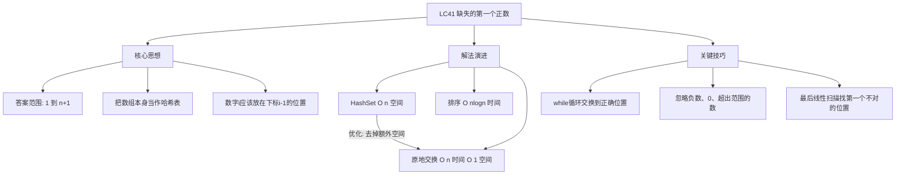
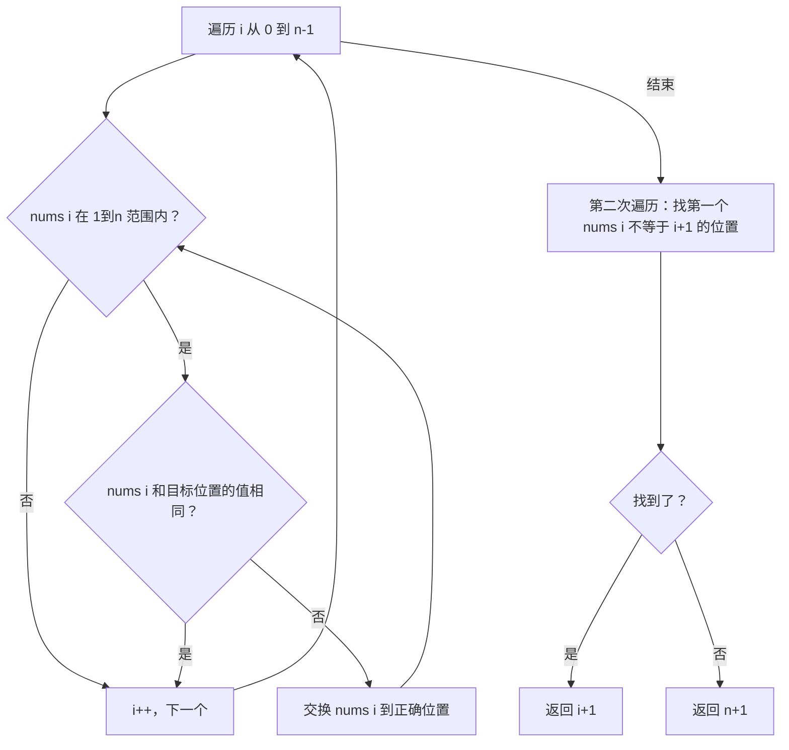

# LC41 缺失的第一个正数
## 一、题目描述
给你一个未排序的整数数组 `nums`，请你找出其中没有出现的**最小的正整数**。
要求：时间复杂度 O(n)，空间复杂度 O(1)。
**示例1：**
```
输入：nums = [1,2,0]
输出：3
解释：1和2都在，缺失的最小正整数是3
```
**示例2：**
```
输入：nums = [3,4,-1,1]
输出：2
解释：1在数组中，但2没有
```
**示例3：**
```
输入：nums = [7,8,9,11,12]
输出：1
解释：最小正整数1都不在，所以答案是1
```
**约束：**
- 1 <= nums.length <= 10^5
- -2^31 <= nums[i] <= 2^31 - 1
**关键观察：** 长度为 n 的数组，答案一定在 `[1, n+1]` 范围内。因为最好情况数组恰好是 [1,2,...,n]，答案才是 n+1。
---
## 二、解法概览
### 解法对比表
| 解法 | 时间复杂度 | 空间复杂度 | 面试推荐 |
|------|-----------|-----------|---------|
| HashSet | O(n) | O(n) | ✅ 普通解法 |
| 排序+遍历 | O(nlogn) | O(1) | ❌ 不推荐 |
| **原地交换（原地哈希）** | O(n) | O(1) | ✅ **最优解** |
### 思维导图

---
## 三、记忆口诀
```
缺失正数原地换，数字i放下标i减一
负数零和超范围，统统跳过不用管
换完之后扫一遍，谁不在位谁是答案
都在位置答案就是n加一
```
---
## 四、解法一：HashSet
### 思路
先把所有数字放进 HashSet，然后从 1 开始逐个检查是否存在，第一个不存在的就是答案。
### 核心公式
```
将所有元素加入 HashSet
从 1 开始检查：1在吗？2在吗？3在吗？...
第一个不在的就是答案
```
### 图解过程
```
nums = [3, 4, -1, 1]
第1步：构建 HashSet = {3, 4, -1, 1}
第2步：从1开始检查
  1 在 set 中？ ✅ → 继续
  2 在 set 中？ ❌ → 找到了！
答案 = 2
```
### 代码示例
```java
public int firstMissingPositive(int[] nums) {
    Set<Integer> set = new HashSet<>();
    for (int num : nums) {
        set.add(num);
    }
    for (int i = 1; i <= nums.length + 1; i++) {
        if (!set.contains(i)) {
            return i;
        }
    }
    return 1;
}
```
### 复杂度分析
- 时间复杂度：**O(n)**，构建 set O(n) + 查找 O(n)
- 空间复杂度：**O(n)**，HashSet 存储所有元素
### 优缺点
| 优点 | 缺点 |
|-----|------|
| 思路简单直观 | 空间 O(n)，不满足题目要求 |
| 代码容易写 | 面试中只能作为第一步 |
---
## 五、解法二：排序+遍历（不推荐）
### 思路
先排序，然后从小到大遍历，跳过非正数和重复数，找到第一个断层的位置。
### 核心公式
```
排序后，从正数部分开始，期望看到 1,2,3,...
第一个缺失的就是答案
```
### 图解过程
```
nums = [3, 4, -1, 1]
排序后：[-1, 1, 3, 4]
跳过负数 -1
期望正数序列：
  nums[1]=1，期望1 ✅
  nums[2]=3，期望2 ❌ → 缺失2
答案 = 2
```
### 代码示例
```java
public int firstMissingPositive(int[] nums) {
    Arrays.sort(nums);
    int expected = 1;
    for (int num : nums) {
        if (num <= 0) continue;
        if (num == expected) {
            expected++;
        } else if (num > expected) {
            return expected;
        }
    }
    return expected;
}
```
### 复杂度分析
- 时间复杂度：**O(nlogn)**，排序
- 空间复杂度：**O(1)**（原地排序的话）
### 优缺点
| 优点 | 缺点 |
|-----|------|
| 思路清晰 | 时间不是 O(n)，不满足要求 |
| 代码简单 | 面试中不接受 |
---
## 六、解法三：原地交换 / 原地哈希（最优解 ✅）
### 思路
**核心思想**：把数组本身当作哈希表，让**数字 i 放到下标 i-1 的位置**。
1. 遍历数组，对每个元素不断交换，直到它到达正确位置或不需要处理
2. 交换完成后，再遍历一次，第一个 `nums[i] != i+1` 的位置，`i+1` 就是答案
3. 如果都正确，答案是 `n+1`
### 核心公式
```
目标：nums[i] == i + 1（数字i+1放在下标i的位置）
等价：数字 val 应该放在下标 val-1 的位置
交换条件：nums[i] 在 [1, n] 范围内，且 nums[i] != nums[nums[i]-1]
```
### 为什么答案一定在 [1, n+1]？
```
数组长度为 n，最多容纳 n 个不同正整数
最好情况：[1, 2, 3, ..., n] → 答案 = n+1
任何一个位置放了非正数或重复数 → 答案 < n+1
所以答案范围：[1, n+1]
```
### 图解过程
```
nums = [3, 4, -1, 1], n = 4
目标：nums[0]=1, nums[1]=2, nums[2]=3, nums[3]=4
━━━━━━━━━━━━━━━━━━━━━━━━━━━━━━━━━━━━━━━━
i=0, nums[0]=3
  3 在 [1,4] 范围内，应该放在下标 3-1=2 的位置
  nums[0]=3 != nums[2]=-1，需要交换
  交换 nums[0] 和 nums[2]
  nums = [-1, 4, 3, 1]
  现在 nums[0]=-1，不在 [1,4] 范围，跳过
━━━━━━━━━━━━━━━━━━━━━━━━━━━━━━━━━━━━━━━━
i=1, nums[1]=4
  4 在 [1,4] 范围内，应该放在下标 4-1=3 的位置
  nums[1]=4 != nums[3]=1，需要交换
  交换 nums[1] 和 nums[3]
  nums = [-1, 1, 3, 4]
  现在 nums[1]=1，应该放在下标 1-1=0 的位置
  nums[1]=1 != nums[0]=-1，需要交换
  交换 nums[1] 和 nums[0]
  nums = [1, -1, 3, 4]
  现在 nums[1]=-1，不在 [1,4] 范围，跳过
━━━━━━━━━━━━━━━━━━━━━━━━━━━━━━━━━━━━━━━━
i=2, nums[2]=3
  3 在 [1,4] 范围内，应该放在下标 3-1=2 的位置
  nums[2]=3，已经在正确位置，跳过
━━━━━━━━━━━━━━━━━━━━━━━━━━━━━━━━━━━━━━━━
i=3, nums[3]=4
  4 在 [1,4] 范围内，应该放在下标 4-1=3 的位置
  nums[3]=4，已经在正确位置，跳过
━━━━━━━━━━━━━━━━━━━━━━━━━━━━━━━━━━━━━━━━
交换完成：nums = [1, -1, 3, 4]
扫描检查：
  下标0: nums[0]=1 == 0+1 ✅
  下标1: nums[1]=-1 != 1+1 ❌ → 答案 = 2
```
### 交换条件详解
```java
while (nums[i] >= 1 && nums[i] <= n && nums[i] != nums[nums[i] - 1])
```
三个条件缺一不可：
| 条件 | 含义 | 不满足时 |
|------|------|---------|
| `nums[i] >= 1` | 正数才需要归位 | 负数和0不用管 |
| `nums[i] <= n` | 不超过数组长度 | 超范围的放不下 |
| `nums[i] != nums[nums[i]-1]` | 目标位置还不对 | 已经对了就别换了（防死循环） |
**为什么第三个条件不写 `nums[i] != i+1`？**
```
考虑 nums = [1, 1]：
i=0: nums[0]=1, nums[0]==0+1，跳过 ✅
i=1: nums[1]=1, nums[1]!=1+1=2，要交换
     目标位置 nums[1-1]=nums[0]=1
     如果用 nums[i]!=i+1：会一直交换（两个1互相换，死循环）
     如果用 nums[i]!=nums[nums[i]-1]：nums[1]=1==nums[0]=1，跳过 ✅
```
> 核心：判断**目标位置是否已经有正确的值**，而不是**当前位置是否正确**。
### 算法流程图

### 代码示例
```java
public int firstMissingPositive(int[] nums) {
    int n = nums.length;
    // 第1步：原地交换，让数字i放到下标i-1的位置
    for (int i = 0; i < n; i++) {
        // while循环：不断交换直到当前位置无需再换
        while (nums[i] >= 1 && nums[i] <= n
                && nums[i] != nums[nums[i] - 1]) {
            // 把 nums[i] 交换到它应该在的位置 nums[i]-1
            int target = nums[i] - 1;
            int temp = nums[i];
            nums[i] = nums[target];
            nums[target] = temp;
        }
    }
    // 第2步：找第一个不在正确位置的
    for (int i = 0; i < n; i++) {
        if (nums[i] != i + 1) {
            return i + 1;
        }
    }
    // 全都正确，答案是 n+1
    return n + 1;
}
```
### 为什么 while 不会死循环？时间复杂度怎么是 O(n)？
```
每次交换，至少有一个元素被放到了它的正确位置，不会再被移动。
总共最多 n 个元素，所以总交换次数最多 n 次。
虽然有 for + while 双重循环，但总操作次数是 O(n)，不是 O(n²)。
类比：每个元素"回家"一次，n个元素最多回家n次。
```
### 复杂度分析
- 时间复杂度：**O(n)**，每个元素最多被交换一次到正确位置
- 空间复杂度：**O(1)**，原地操作
### 优缺点
| 优点 | 缺点 |
|-----|------|
| 时间O(n)，空间O(1) | 原地哈希思想需要理解 |
| 满足题目所有要求 | while交换条件容易写错 |
| 面试首选 | 需要注意防死循环 |
### 关键点总结
| 关键点 | 说明 |
|-------|------|
| 答案范围 | [1, n+1]，所以只关心 [1,n] 的数 |
| 归位规则 | 数字 val 放到下标 val-1 |
| 交换条件 | 范围内 且 目标位置还没放好 |
| 防死循环 | 用 `nums[i] != nums[nums[i]-1]` 而非 `nums[i] != i+1` |
| 时间分析 | 每个元素最多交换一次，总 O(n) |
---
## 七、面试回答模板
### 1. 开场：理解题意
> 这道题找未排序数组中缺失的最小正整数，要求 O(n) 时间和 O(1) 空间。
### 2. 关键观察
> 长度为 n 的数组，答案一定在 [1, n+1] 范围内。因为最多放 n 个不同正整数 1 到 n。
### 3. 思路：原地哈希
> 我把数组本身当作哈希表，通过交换让数字 i 放到下标 i-1 的位置。交换完后，扫一遍数组，第一个 `nums[i] != i+1` 的位置，i+1 就是答案。
### 4. 关键细节（如果面试官问）
> 交换时用 while 循环持续交换，直到当前值不在 [1,n] 范围或目标位置已经正确。判断条件是 `nums[i] != nums[nums[i]-1]` 而不是 `nums[i] != i+1`，这样可以处理重复元素，避免死循环。
### 5. 复杂度
> 时间 O(n)，虽然有 for + while，但每个元素最多被交换一次。空间 O(1)，原地操作。
---
## 八、相关题目
| 题号 | 题目 | 关系 | 难度 |
|-----|------|------|-----|
| LC268 | 丢失的数字 | 简单版：找 [0,n] 缺失数 | 简单 |
| LC287 | 寻找重复数字 | 同样原地哈希思想 | 中等 |
| LC442 | 数组中重复的数据 | 原地哈希标记 | 中等 |
| LC448 | 找到所有数组中消失的数字 | 原地哈希变体 | 简单 |
| LC765 | 情侣牵手 | 交换到正确位置 | 困难 |