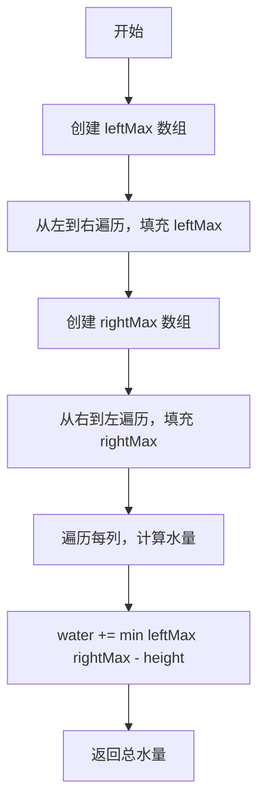
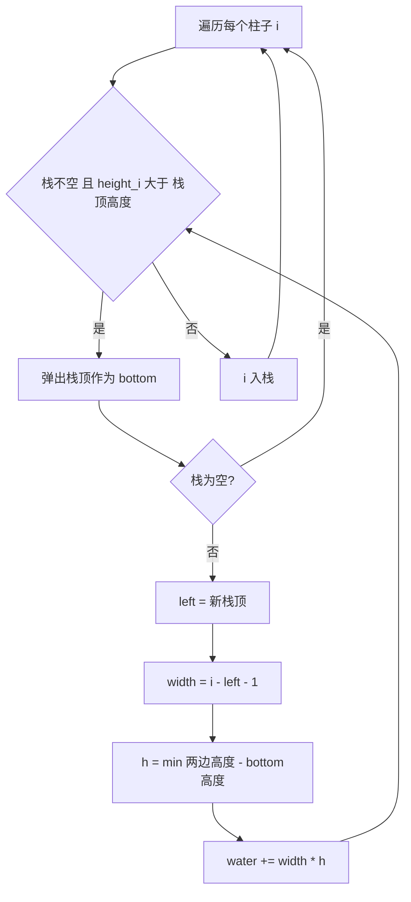
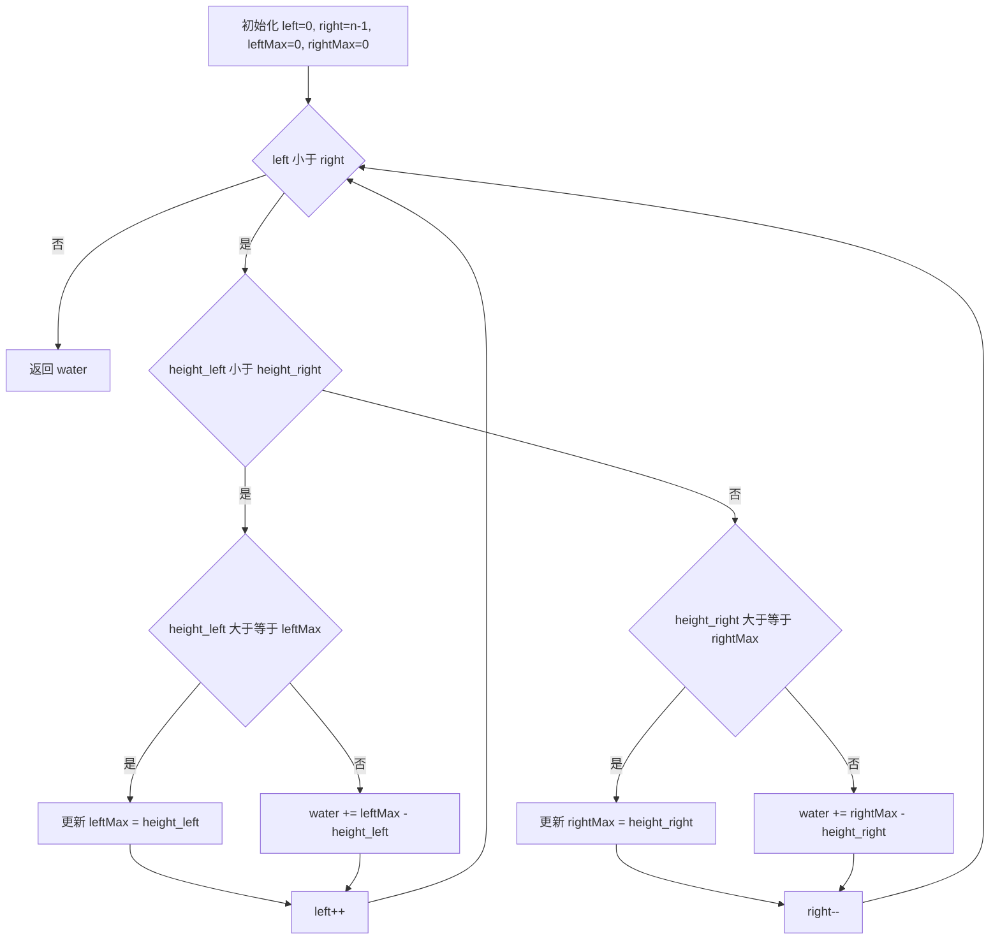

# LC42 接雨水 完整解法分析
## 题目描述
给定 `n` 个非负整数表示每个宽度为 1 的柱子的高度图，计算按此排列的柱子，下雨之后能接多少雨水。
**示例：**
- 输入：`height = [0,1,0,2,1,0,1,3,2,1,2,1]`
- 输出：`6`
**图示：**
```
索引:  0 1 2 3 4 5 6 7 8 9 10 11
高度:  0 1 0 2 1 0 1 3 2 1  2  1
              █
      █ ░ ░ █ █ ░ █ █
      █ █ ░ █ █ ░ █ █ █ ░ █
      █ █ ░ █ █ ░ █ █ █ █ █ █
```
其中 `█` 是柱子，`░` 是雨水，共 6 个单位。
---
## 解法总览
| 解法 | 时间复杂度 | 空间复杂度 | 面试推荐 |
|------|-----------|-----------|---------|
| 暴力法 | O(n²) | O(1) | ❌ 不推荐 |
| 动态规划预处理 | O(n) | O(n) | ✅ 推荐 |
| 单调栈 | O(n) | O(n) | ✅ 推荐 |
| **双指针** | O(n) | O(1) | ✅ **最优解** |
---
## 核心思想：按列计算
**无论哪种解法，核心思想都是一样的**：计算每一列能接多少水，然后累加。
**核心公式**：
```
第 i 列的水量 = max(0, min(左边最高, 右边最高) - height[i])
```
**原理（木桶效应）**：
```
    左边最高 leftMax          右边最高 rightMax
         ↓                        ↓
         █          水面          █
         █    ==================  █
         █    ==================  █
         █    ========█==========  █
                      ↑
                   第 i 列
水面高度 = min(leftMax, rightMax)
第 i 列水量 = 水面高度 - height[i]
```
---
## 解法一：暴力法
### 思路
对于每一列，分别向左、向右遍历，找到左边最高的柱子和右边最高的柱子，然后计算该列能接的水。
### 核心公式
```
对于第 i 列：
leftMax = max(height[0], height[1], ..., height[i-1])
rightMax = max(height[i+1], height[i+2], ..., height[n-1])
water[i] = max(0, min(leftMax, rightMax) - height[i])
```
### 图解过程
以 `height = [4, 2, 0, 3, 2, 5]` 为例，计算第 2 列（高度为 0）的水量：
```
索引:   0  1  2  3  4  5
高度:   4  2  0  3  2  5
        █        █     █
        █  █     █  █  █
        █  █     █  █  █
        █  █  ░  █  █  █
        █  █  ░  █  █  █
           ←  i  →
左边最高 = max(4, 2) = 4
右边最高 = max(3, 2, 5) = 5
水量 = min(4, 5) - 0 = 4
```
### 代码示例
```java
public int trap(int[] height) {
    int n = height.length;
    int water = 0;
    // 遍历每一列（首尾不接水）
    for (int i = 1; i < n - 1; i++) {
        // 找左边最高
        int leftMax = 0;
        for (int j = 0; j < i; j++) {
            leftMax = Math.max(leftMax, height[j]);
        }
        // 找右边最高
        int rightMax = 0;
        for (int j = i + 1; j < n; j++) {
            rightMax = Math.max(rightMax, height[j]);
        }
        // 计算当前列水量
        int level = Math.min(leftMax, rightMax);
        if (level > height[i]) {
            water += level - height[i];
        }
    }
    return water;
}
```
### 复杂度分析
- 时间复杂度：**O(n²)**，每列都要遍历左右找最大值
- 空间复杂度：**O(1)**，只用常数变量
### 优缺点
| 优点 | 缺点 |
|-----|------|
| 思路直观，容易理解 | 时间复杂度高，会超时 |
| 代码简单 | 大量重复计算 |
---
## 解法二：动态规划预处理
### 思路
暴力法的问题是：每次都重新遍历找左右最大值，存在大量重复计算。
**优化思路**：提前用两个数组，分别存储每个位置的「左边最大值」和「右边最大值」。
### 核心公式
```
leftMax[i] = max(leftMax[i-1], height[i-1])    // 从左到右遍历
rightMax[i] = max(rightMax[i+1], height[i+1])  // 从右到左遍历
water[i] = max(0, min(leftMax[i], rightMax[i]) - height[i])
```
### 图解过程
以 `height = [4, 2, 0, 3, 2, 5]` 为例：
```
索引:      0   1   2   3   4   5
height:    4   2   0   3   2   5
第一遍：从左到右，计算 leftMax
leftMax:   0   4   4   4   4   4
           ↑   ↑
          边界 max(0,4)=4
第二遍：从右到左，计算 rightMax
rightMax:  5   5   5   5   5   0
                             ↑
                            边界
第三遍：计算每列水量
min值:     0   4   4   4   4   0
水量:      0   2   4   1   2   0
总水量 = 2 + 4 + 1 + 2 = 9
```
### 算法流程图

### 代码示例
```java
public int trap(int[] height) {
    int n = height.length;
    if (n == 0) return 0;
    int water = 0;
    // 1. 预处理左边最高
    int[] leftMax = new int[n];
    for (int i = 1; i < n; i++) {
        leftMax[i] = Math.max(leftMax[i - 1], height[i - 1]);
    }
    // 2. 预处理右边最高
    int[] rightMax = new int[n];
    for (int i = n - 2; i >= 0; i--) {
        rightMax[i] = Math.max(rightMax[i + 1], height[i + 1]);
    }
    // 3. 计算每列水量
    for (int i = 1; i < n - 1; i++) {
        int level = Math.min(leftMax[i], rightMax[i]);
        if (level > height[i]) {
            water += level - height[i];
        }
    }
    return water;
}
```
### 复杂度分析
- 时间复杂度：**O(n)**，三次遍历
- 空间复杂度：**O(n)**，两个辅助数组
### 优缺点
| 优点 | 缺点 |
|-----|------|
| 时间复杂度优化到 O(n) | 需要 O(n) 额外空间 |
| 思路清晰，容易理解 | 需要三次遍历 |
| 面试时容易写对 | 不是最优空间复杂度 |
---
## 解法三：单调栈
### 思路
使用**单调递减栈**（从栈底到栈顶高度递减），存储柱子的索引。
当遇到比栈顶更高的柱子时，说明形成了一个**凹槽**，可以接水。
**与前两种解法的区别**：
- 前两种是**按列计算**（纵向累加）
- 单调栈是**按层计算**（横向累加）
### 核心公式
```
当 height[i] > height[stack.peek()] 时：
    bottom = stack.pop()           // 凹槽底部
    left = stack.peek()            // 左边界
    width = i - left - 1           // 凹槽宽度
    h = min(height[left], height[i]) - height[bottom]  // 水的高度
    water += width * h
```
### 图解过程
以 `height = [0,1,0,2,1,0,1,3,2,1,2,1]` 中的一部分为例：
```
当 i=3（高度为2）时，栈内有 [1, 2]（索引，对应高度 [1, 0]）
height[3]=2 > height[2]=0，形成凹槽：
索引:     1     2     3
高度:     1     0     2
                      █
          █     ░     █
          ↑     ↑     ↑
        left  bottom  i（右边界）
弹出 bottom=2（高度0）
left=1（高度1），i=3（高度2）
width = 3 - 1 - 1 = 1
h = min(1, 2) - 0 = 1
water += 1 * 1 = 1
```
### 算法流程图

### 代码示例
```java
public int trap(int[] height) {
    int n = height.length;
    int water = 0;
    Deque<Integer> stack = new ArrayDeque<>();
    for (int i = 0; i < n; i++) {
        // 当前柱子比栈顶高，形成凹槽
        while (!stack.isEmpty() && height[i] > height[stack.peek()]) {
            int bottom = stack.pop();  // 凹槽底部
            if (stack.isEmpty()) break; // 没有左边界
            int left = stack.peek();    // 左边界
            int width = i - left - 1;
            int h = Math.min(height[left], height[i]) - height[bottom];
            water += width * h;
        }
        stack.push(i);
    }
    return water;
}
```
### 复杂度分析
- 时间复杂度：**O(n)**，每个元素最多入栈出栈各一次
- 空间复杂度：**O(n)**，栈空间
### 优缺点
| 优点 | 缺点 |
|-----|------|
| 时间复杂度 O(n) | 理解难度较高 |
| 一次遍历完成 | 需要理解单调栈 |
| 思路新颖，体现栈的应用 | 代码相对复杂 |
---
## 解法四：双指针（最优解 ✅）
### 思路
动态规划需要两个数组存储左右最大值，但我们可以用**双指针**在一次遍历中完成，省去额外空间。
**核心洞察**：对于某个位置，我们只需要知道 `min(leftMax, rightMax)` 就能算出水量。
**关键观察**：
- 如果 `height[left] < height[right]`：左边较低，`left` 位置的水量由 `leftMax` 决定
- 如果 `height[left] >= height[right]`：右边较低，`right` 位置的水量由 `rightMax` 决定
**原因**：
```
当 height[left] < height[right] 时：
    右边至少有一个柱子 height[right] 比 height[left] 高
    所以 rightMax >= height[right] > height[left]
    因此 min(leftMax, rightMax) = leftMax
    left 位置的水量只取决于 leftMax
```
### 核心公式
```
while (left < right):
    if height[left] < height[right]:
        if height[left] >= leftMax:
            leftMax = height[left]
        else:
            water += leftMax - height[left]
        left++
    else:
        if height[right] >= rightMax:
            rightMax = height[right]
        else:
            water += rightMax - height[right]
        right--
```
### 图解过程
以 `height = [0,1,0,2,1,0,1,3,2,1,2,1]` 为例：
```
初始：left=0, right=11, leftMax=0, rightMax=0, water=0
索引:  0 1 2 3 4 5 6 7 8 9 10 11
高度:  0 1 0 2 1 0 1 3 2 1  2  1
       L                       R
Step 1: height[L]=0 < height[R]=1
        height[L]=0 >= leftMax=0，更新 leftMax=0
        left++
Step 2: height[L]=1 >= height[R]=1
        height[R]=1 >= rightMax=0，更新 rightMax=1
        right--
Step 3: height[L]=1 >= height[R]=2? 否
        height[L]=1 >= leftMax=0，更新 leftMax=1
        left++
...依次类推
```
### 算法流程图

### 代码示例
```java
public int trap(int[] height) {
    int n = height.length;
    if (n == 0) return 0;
    int water = 0;
    int left = 0, right = n - 1;
    int leftMax = 0, rightMax = 0;
    while (left < right) {
        if (height[left] < height[right]) {
            // 左边较低，处理左边
            if (height[left] >= leftMax) {
                leftMax = height[left];  // 更新左边最高
            } else {
                water += leftMax - height[left];  // 接水
            }
            left++;
        } else {
            // 右边较低，处理右边
            if (height[right] >= rightMax) {
                rightMax = height[right];  // 更新右边最高
            } else {
                water += rightMax - height[right];  // 接水
            }
            right--;
        }
    }
    return water;
}
```
### 简洁写法
```java
public int trap(int[] height) {
    int water = 0;
    int left = 0, right = height.length - 1;
    int leftMax = 0, rightMax = 0;
    while (left < right) {
        leftMax = Math.max(leftMax, height[left]);
        rightMax = Math.max(rightMax, height[right]);
        if (leftMax < rightMax) {
            water += leftMax - height[left];
            left++;
        } else {
            water += rightMax - height[right];
            right--;
        }
    }
    return water;
}
```
### 复杂度分析
- 时间复杂度：**O(n)**，一次遍历
- 空间复杂度：**O(1)**，只用常数变量
### 优缺点
| 优点 | 缺点 |
|-----|------|
| 时间 O(n)，空间 O(1)，最优 | 理解难度较高 |
| 代码简洁 | 需要理解双指针的正确性证明 |
| 一次遍历完成 | - |
---
## 解法对比总结
| 解法 | 时间 | 空间 | 核心思想 | 计算方式 |
|------|-----|------|---------|---------|
| 暴力法 | O(n²) | O(1) | 每列找左右最大 | 按列计算 |
| 动态规划 | O(n) | O(n) | 预处理左右最大 | 按列计算 |
| 单调栈 | O(n) | O(n) | 找凹槽边界 | 按层计算 |
| 双指针 | O(n) | O(1) | 哪边低处理哪边 | 按列计算 |
---
## 记忆口诀
```
接雨水，按列算
每列水量有公式：
min(左高, 右高) - 自身高
四种解法要记牢：
暴力法：每列找左右，O(n²) 太慢
预处理：提前存最高，O(n) 空间
单调栈：递减找凹槽，按层来计算
双指针：哪边低走哪边，O(1) 最优
```
---
## 面试建议
### 推荐讲解顺序
1. **先讲核心思想**：按列计算，木桶原理
2. **从暴力开始**：展示思考过程
3. **优化到预处理**：解决重复计算问题
4. **最优解双指针**：空间优化
### 常见追问
| 问题 | 回答要点 |
|-----|---------|
| 核心思想是什么？ | 按列计算，每列水量 = min(左右最高) - 自身高度 |
| 双指针为什么正确？ | 哪边低先处理哪边，因为另一边至少有一个更高的柱子 |
| 单调栈和其他解法区别？ | 单调栈按层计算，其他解法按列计算 |
| 还有什么变种题？ | LC11 盛水最多的容器、LC407 接雨水 II（3D） |
---
## 相关题目
| 题号 | 题目 | 关联 |
|-----|------|------|
| LC11 | 盛水最多的容器 | 双指针 |
| LC84 | 柱状图中最大的矩形 | 单调栈 |
| LC85 | 最大矩形 | 单调栈 + DP |
| LC407 | 接雨水 II | 3D版本，BFS |
