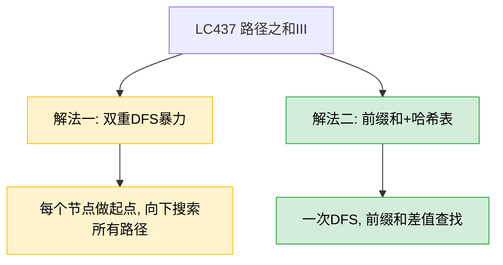
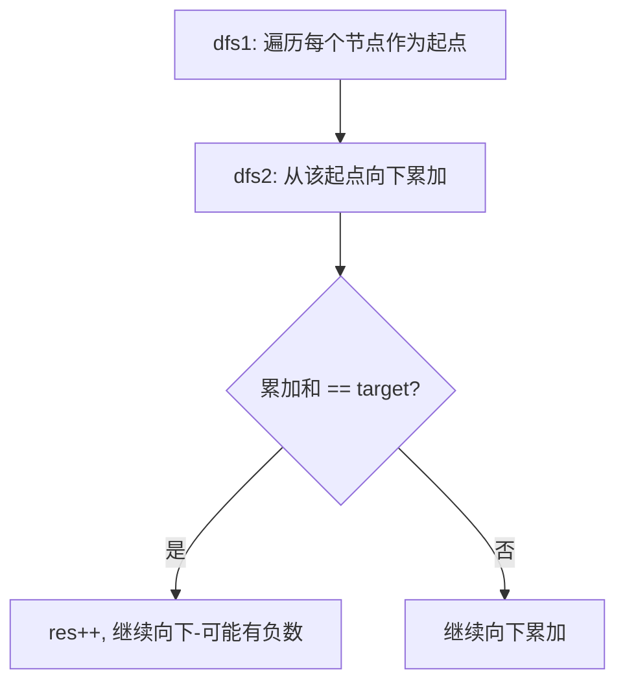
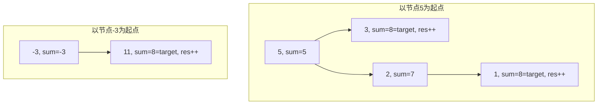
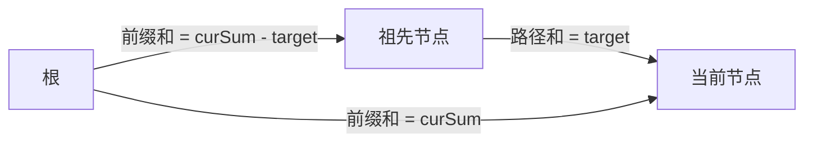
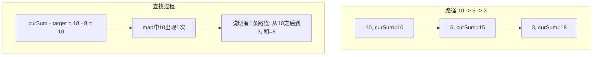

# LC437 路径之和III
## 一、题目描述
给定一个二叉树的根节点 root 和一个整数 targetSum，求该二叉树里节点值之和等于 targetSum 的**路径**的数目。
**路径**不需要从根节点开始，也不需要在叶子节点结束，但是路径方向必须是**向下的**（只能从父节点到子节点）。
**示例：** 输入 `root = [10,5,-3,3,2,null,11,3,-2,null,1], targetSum = 8`，输出 `3`
三条路径：`5→3`、`5→2→1`、`-3→11`
**约束：** 节点数 [0, 1000]，-10^9 <= Node.val <= 10^9，-1000 <= targetSum <= 1000
## 二、解法概览

| 解法 | 时间复杂度 | 空间复杂度 | 难度 | 面试推荐 |
|------|-----------|-----------|------|---------|
| 双重DFS暴力 | O(n²) | O(n) | ⭐⭐ | 普通解法，容易理解 |
| 前缀和+哈希表 | O(n) | O(n) | ⭐⭐⭐ | 最优解/面试首选 |
## 三、记忆口诀
> **暴力：每个节点当起点，向下累加找目标。**
> **最优：前缀和减目标值，哈希表里查有几个。**
## 四、解法一：双重DFS暴力（普通解法）
### 4.1 思路
两层 DFS：
- **外层 dfs1**：遍历每一个节点，把它当作路径的起点
- **内层 dfs2**：从这个起点向下累加路径和，等于 target 就计数 +1

### 4.2 核心公式
- dfs1 枚举起点：对每个节点调用 dfs2
- dfs2 从起点向下：累加路径和，等于 target 就 res++
### 4.3 图解过程
以 `targetSum = 8` 为例，部分过程：

### 4.4 代码示例
```java
private int target;
private int res;
public int pathSum(TreeNode root, int targetSum) {
    if (root == null) return 0;
    this.target = targetSum;
    res = 0;
    dfs1(root);
    return res;
}
// 外层：枚举每个节点作为起点
private void dfs1(TreeNode node) {
    if (node == null) return;
    dfs2(node, node.val);
    dfs1(node.left);
    dfs1(node.right);
}
// 内层：从起点向下累加
private void dfs2(TreeNode node, int sum) {
    if (node == null) return;
    if (sum == target) res++;
    if (node.left != null) dfs2(node.left, sum + node.left.val);
    if (node.right != null) dfs2(node.right, sum + node.right.val);
}
```
### 4.5 为什么 `sum == target` 后不能 return？
因为节点值可以是**负数**。比如路径 `5→3→(-3)→3`，在 `5→3` 时 sum=8 命中，但继续往下 `5→3→(-3)→3` 也是 sum=8。提前 return 就会漏掉后面的路径。
### 4.6 复杂度分析
- **时间复杂度：O(n²)**，n 个节点各做一次起点，每次最坏向下遍历 O(n)
- **空间复杂度：O(n)**，递归栈深度
### 4.7 优缺点
| 优点 | 缺点 |
|------|------|
| 思路直观，暴力枚举 | O(n²) 时间，大数据量慢 |
| 容易写，不易出错 | 面试官可能追问优化 |
## 五、解法二：前缀和+哈希表（最优解/面试首选）
### 5.1 思路
这是**前缀和**在树上的应用，和 LC560（和为K的子数组）是同一个思路。
**核心想法：** 从根到当前节点的路径和为 `curSum`，如果从根到某个祖先节点的路径和为 `curSum - target`，那么**从该祖先到当前节点的路径和就是 target**。

用哈希表存储从根到当前路径上**每个前缀和出现的次数**，查找 `curSum - target` 出现了几次，就有几条有效路径。
### 5.2 核心公式
```
curSum = 从根到当前节点的路径和
有效路径数 += map.get(curSum - target)
```
### 5.3 图解过程
以 `targetSum = 8` 为例，路径 `10→5→3`：
| 节点 | curSum | curSum - target | map中有？ | res变化 | map更新 |
|------|--------|----------------|----------|---------|--------|
| 初始 | - | - | - | - | {0:1} |
| 10 | 10 | 10-8=2 | 无 | 不变 | {0:1, 10:1} |
| 5 | 15 | 15-8=7 | 无 | 不变 | {0:1, 10:1, 15:1} |
| 3 | 18 | 18-8=10 | 有! 10出现1次 | res+1 | {0:1, 10:1, 15:1, 18:1} |
`curSum - target = 10` 在 map 中存在，说明从前缀和=10的节点（即节点10）到当前节点（3）的路径和 = 18 - 10 = 8 = target。这条路径是 `5→3`。

### 5.4 为什么要初始化 `map.put(0, 1)`？
处理从**根节点开始**的路径。比如根到当前节点的 curSum 恰好等于 target，此时 `curSum - target = 0`，需要 map 中有 `0:1` 才能计数。
### 5.5 为什么要回溯？
DFS 从左子树回到父节点后要去右子树，左子树路径上的前缀和**不能留在 map 中**影响右子树的计算。所以递归返回前，要把当前节点的 curSum 计数减 1。
```java
// 递归进入时：加入
map.put(sum, map.getOrDefault(sum, 0) + 1);

// 左右子树递归...

// 递归返回前：撤销
map.put(sum, map.getOrDefault(sum, 0) - 1);
```
### 5.6 代码示例
```java
private int target;
private Map<Long, Integer> map;
private int res;
public int pathSum(TreeNode root, int targetSum) {
    if (root == null) return 0;
    target = targetSum;
    map = new HashMap<>();
    map.put(0L, 1);
    res = 0;
    dfs(root, root.val);
    return res;
}
private void dfs(TreeNode node, long sum) {
    if (map.containsKey(sum - target)) {
        res += map.get(sum - target);
    }
    map.put(sum, map.getOrDefault(sum, 0) + 1);
    if (node.left != null) dfs(node.left, sum + node.left.val);
    if (node.right != null) dfs(node.right, sum + node.right.val);
    map.put(sum, map.getOrDefault(sum, 0) - 1);
}
```
**注意：** 题目中 Node.val 范围是 -10^9，节点数最多 1000，路径和可能溢出 int，建议用 `long`。
### 5.7 复杂度分析
- **时间复杂度：O(n)**，每个节点只访问一次，哈希表操作 O(1)
- **空间复杂度：O(n)**，哈希表最多存 n 个前缀和 + 递归栈 O(n)
### 5.8 优缺点
| 优点 | 缺点 |
|------|------|
| 时间最优 O(n)，比暴力快一个量级 | 前缀和思想需要理解 |
| 一次DFS搞定 | 需要回溯（容易忘） |
| 面试标准答案 | 用了成员变量 |
## 六、两种解法本质对比
| 对比项 | 双重DFS | 前缀和+哈希 |
|--------|--------|------------|
| 枚举方式 | 枚举起点，向下求和 | 枚举终点，向上找起点 |
| 时间 | O(n²) | O(n) |
| 核心技巧 | 纯暴力 | 前缀和差值 = 子路径和 |
| 类比一维 | LC1 暴力两层循环 | LC560 前缀和+哈希表 |
## 七、面试回答模板
> **面试官：** 找二叉树中路径和等于目标值的路径数量，路径不需要从根开始。
**回答要点：**
1. **先说暴力：** 双重DFS，外层遍历每个节点作为起点，内层从起点向下累加路径和。时间 O(n²)。注意不能在 sum==target 时提前 return，因为节点值可以是负数。
2. **引出最优解：** 用前缀和+哈希表优化。维护从根到当前节点的前缀和 curSum，如果 `curSum - target` 在哈希表中出现过 k 次，说明有 k 条路径的和等于 target。这和 LC560（和为K的子数组）是一个思路。
3. **关键细节：** 初始化 `map.put(0, 1)` 处理从根开始的路径；递归返回前要回溯，撤销当前前缀和的计数。
4. **复杂度：** 时间 O(n)，空间 O(n)。
## 八、相关题目
| 题目 | 关联点 |
|------|--------|
| LC112 路径总和 | 简化版：只判断根到叶子的路径 |
| LC113 路径总和II | 收集根到叶子的所有满足路径 |
| LC560 和为K的子数组 | **一维版本的前缀和+哈希表**，思路完全一致 |
| LC124 二叉树中的最大路径和 | 路径可以拐弯，更难 |
| LC129 求根节点到叶节点数字之和 | 根到叶子的路径和变形 |
