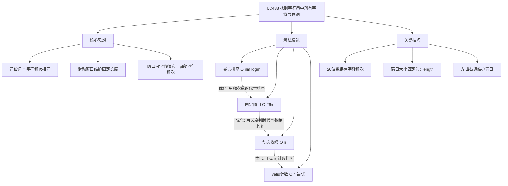

# LC438 找到字符串中所有字符异位词
## 一、题目描述
给定两个字符串 `s` 和 `p`，找到 `s` 中所有 `p` 的**异位词**的子串，返回这些子串的起始索引。
**异位词**：由相同字母重新排列形成的字符串（字符种类和数量完全相同）。
**示例：**
| 输入 | 输出 | 解释 |
|-----|------|------|
| s="cbaebabacd", p="abc" | [0, 6] | "cba" 和 "bac" 是 "abc" 的异位词 |
| s="abab", p="ab" | [0, 1, 2] | "ab"、"ba"、"ab" 都是 "ab" 的异位词 |
**约束**：s 和 p 仅包含小写字母
---
## 二、解法概览
### 解法对比表
| 解法 | 时间复杂度 | 空间复杂度 | 判断方式 | 面试推荐 |
|------|-----------|-----------|---------|---------|
| 暴力排序 | O(nm logm) | O(m) | 排序比较 | ❌ 不推荐 |
| 固定窗口+数组比较 | O(26n) | O(1) | 数组相等 | ✅ 推荐 |
| 滑动窗口+动态收缩 | O(n) | O(1) | 长度判断 | ✅ 推荐 |
| 滑动窗口+valid计数 | O(n) | O(1) | valid判断 | ✅ 最优 |
### 思维导图

---
## 三、记忆口诀
```
异位词题怎么做？滑动窗口是法宝
26位数组存频次，窗口大小等于p
固定窗口最直观，左出右进比数组
动态收缩更高效，超出次数就收缩
valid计数最优解，种类匹配就是答案
```
---
## 四、解法一：暴力排序（不推荐）
### 思路
对 s 中每个长度为 m 的子串排序，与排序后的 p 比较。
### 核心公式
```
for i in range(n - m + 1):
    if sorted(s[i:i+m]) == sorted(p):
        result.add(i)
```
### 图解过程
```
s = "cbaebabacd", p = "abc"
sorted(p) = "abc"
i=0: sorted("cba") = "abc" == "abc" ✓ → 结果[0]
i=1: sorted("bae") = "abe" ≠ "abc"
i=2: sorted("aeb") = "abe" ≠ "abc"
...
i=6: sorted("bac") = "abc" == "abc" ✓ → 结果[0,6]
```
### 代码示例
```java
public List<Integer> findAnagrams(String s, String p) {
    List<Integer> res = new ArrayList<>();
    int n = s.length(), m = p.length();
    if (n < m) return res;
    char[] pArr = p.toCharArray();
    Arrays.sort(pArr);
    String sortedP = new String(pArr);
    for (int i = 0; i <= n - m; i++) {
        char[] subArr = s.substring(i, i + m).toCharArray();
        Arrays.sort(subArr);
        if (new String(subArr).equals(sortedP)) {
            res.add(i);
        }
    }
    return res;
}
```
### 复杂度分析
- 时间复杂度：**O(n × m × logm)**，每个子串都要排序
- 空间复杂度：**O(m)**，存储子串
### 优缺点
| 优点 | 缺点 |
|-----|------|
| 思路直观易理解 | 时间复杂度高，会超时 |
---
## 五、解法二：固定窗口 + 数组比较（推荐 ✅）
### 思路
1. 用26位数组统计字符频次
2. 维护长度为 m 的固定窗口
3. 每次滑动：左边移出一个字符，右边移入一个字符
4. 比较两个数组是否相等
### 核心公式
```
初始化：统计 s[0..m-1] 和 p 的字符频次
滑动窗口（i 从 m 到 n-1）：
    sMap[s[i-m]]--    // 左边移出
    sMap[s[i]]++      // 右边移入
    if sMap == pMap → 找到异位词
```
### 图解过程
以 `s = "cbaebabacd"`, `p = "abc"` 为例：
```
p = "abc" → pMap = [1,1,1,0,...] (a=1,b=1,c=1)
初始窗口 [0,2]："cba"
  sMap = [1,1,1,0,...] = pMap ✓
  结果：[0]
窗口滑动到 [1,3]："bae"
  移出 'c'，移入 'e'
  sMap = [1,1,0,0,1,...] ≠ pMap
窗口滑动到 [2,4]："aeb"
  移出 'b'，移入 'b'
  sMap = [1,1,0,0,1,...] ≠ pMap
...
窗口滑动到 [6,8]："bac"
  sMap = [1,1,1,0,...] = pMap ✓
  结果：[0, 6]
```
### 代码示例
```java
public List<Integer> findAnagrams(String s, String p) {
    if (s == null || p.length() > s.length()) {
        return new ArrayList<>();
    }
    int m = s.length(), n = p.length();
    int[] sMap = new int[26];
    int[] pMap = new int[26];
    // 初始化
    for (int i = 0; i < n; i++) {
        sMap[s.charAt(i) - 'a']++;
        pMap[p.charAt(i) - 'a']++;
    }
    List<Integer> res = new ArrayList<>();
    if (Arrays.equals(sMap, pMap)) {
        res.add(0);
    }
    // 滑动窗口
    for (int i = n; i < m; i++) {
        sMap[s.charAt(i - n) - 'a']--;  // 移出左边
        sMap[s.charAt(i) - 'a']++;      // 移入右边
        if (Arrays.equals(sMap, pMap)) {
            res.add(i - n + 1);
        }
    }
    return res;
}
```
### 复杂度分析
- 时间复杂度：**O(26 × n) = O(n)**，每次比较26个元素
- 空间复杂度：**O(1)**，固定26大小数组
### 优缺点
| 优点 | 缺点 |
|-----|------|
| 思路清晰，代码简洁 | 每次都要比较26个元素 |
| 容易写对不出错 | 常数因子较大 |
---
## 六、解法三：滑动窗口 + 动态收缩（推荐 ✅）
### 思路
1. 维护可变长度窗口，确保窗口内每个字符的数量**不超过**p中的数量
2. 当某个字符超出时，收缩左边界
3. 当窗口长度等于p的长度时，找到异位词
### 核心公式
```
for i in range(n):
    sMap[s[i]]++
    while sMap[s[i]] > pMap[s[i]]:  // 超出就收缩
        sMap[s[left]]--
        left++
    if i - left + 1 == m:  // 长度相等就是答案
        result.add(left)
```
### 图解过程
以 `s = "cbaebabacd"`, `p = "abc"` 为例：
```
pMap = [1,1,1,0,...] (a=1,b=1,c=1)
━━━━━━━━━━━━━━━━━━━━━━━━━━━━━━━━━━━━
i=0, 'c': sMap[c]=1 ≤ pMap[c]=1 ✓
    窗口[0,0], 长度1 ≠ 3
i=1, 'b': sMap[b]=1 ≤ pMap[b]=1 ✓
    窗口[0,1], 长度2 ≠ 3
i=2, 'a': sMap[a]=1 ≤ pMap[a]=1 ✓
    窗口[0,2], 长度3 == 3 ✓
    结果：[0]
━━━━━━━━━━━━━━━━━━━━━━━━━━━━━━━━━━━━
i=3, 'e': sMap[e]=1 > pMap[e]=0
    收缩：移出'c','b','a','e', left=4
    窗口无效
i=4, 'b': 窗口[4,4], 长度1 ≠ 3
...
━━━━━━━━━━━━━━━━━━━━━━━━━━━━━━━━━━━━
i=8, 'c': sMap[c]=1 ≤ pMap[c]=1 ✓
    窗口[6,8], 长度3 == 3 ✓
    结果：[0, 6]
```
### 代码示例
```java
public List<Integer> findAnagrams(String s, String p) {
    if (s == null || p.length() > s.length()) {
        return new ArrayList<>();
    }
    int m = s.length(), n = p.length();
    int[] sMap = new int[26];
    int[] pMap = new int[26];
    for (int i = 0; i < n; i++) {
        pMap[p.charAt(i) - 'a']++;
    }
    List<Integer> res = new ArrayList<>();
    int left = 0;
    for (int i = 0; i < m; i++) {
        int idx = s.charAt(i) - 'a';
        sMap[idx]++;
        // 超出就收缩
        while (sMap[idx] > pMap[idx]) {
            sMap[s.charAt(left) - 'a']--;
            left++;
        }
        // 长度相等就是答案
        if (i - left + 1 == n) {
            res.add(left);
        }
    }
    return res;
}
```
### 复杂度分析
- 时间复杂度：**O(n)**，left和right各最多移动n次
- 空间复杂度：**O(1)**，固定26大小数组
### 优缺点
| 优点 | 缺点 |
|-----|------|
| 时间复杂度最优O(n) | 需要理解收缩逻辑 |
| 不需要比较整个数组 | 代码稍复杂 |
---
## 七、解法四：滑动窗口 + valid计数（最优解 ✅）
### 思路
用变量`valid`记录**已完全匹配的字符种类数**：
- 当某字符的窗口计数**刚好等于**需要的数量时，`valid++`
- 当某字符的窗口计数**从等于变成不等于**时，`valid--`
- 当`valid == needCount`时，所有字符种类都匹配，找到异位词
### 核心公式
```
// 右边进入
window[c]++
if window[c] == need[c]: valid++
// 左边移出（窗口超长时）
if window[d] == need[d]: valid--
window[d]--
// 判断
if valid == needCount: 找到异位词
```
### 图解过程
以 `s = "cbaebabacd"`, `p = "abc"` 为例：
```
p = "abc"
need = [1,1,1,0,...] (a=1,b=1,c=1)
needCount = 3 (3种不同字符)
━━━━━━━━━━━━━━━━━━━━━━━━━━━━━━━━━━━━━━━━━━
right=0, 'c'
    window[c]=1, window[c]==need[c]? ✓ valid=1
    窗口长度1 ≤ 3，不收缩
    valid=1 ≠ 3
    s: [c] b a e b a b a c d
━━━━━━━━━━━━━━━━━━━━━━━━━━━━━━━━━━━━━━━━━━
right=1, 'b'
    window[b]=1, window[b]==need[b]? ✓ valid=2
    窗口长度2 ≤ 3，不收缩
    valid=2 ≠ 3
    s: [c b] a e b a b a c d
━━━━━━━━━━━━━━━━━━━━━━━━━━━━━━━━━━━━━━━━━━
right=2, 'a'
    window[a]=1, window[a]==need[a]? ✓ valid=3
    窗口长度3 ≤ 3，不收缩
    valid=3 == 3 ✓ 找到异位词！
    结果：[0]
    s: [c b a] e b a b a c d
━━━━━━━━━━━━━━━━━━━━━━━━━━━━━━━━━━━━━━━━━━
right=3, 'e'
    window[e]=1, window[e]==need[e]=0? ✗ valid不变=3
    窗口长度4 > 3，收缩！
      移出'c': window[c]==need[c]? ✓ valid=2
      window[c]--, left=1
    valid=2 ≠ 3
    s: c [b a e] b a b a c d
━━━━━━━━━━━━━━━━━━━━━━━━━━━━━━━━━━━━━━━━━━
... 继续滑动 ...
━━━━━━━━━━━━━━━━━━━━━━━━━━━━━━━━━━━━━━━━━━
right=8, 'c'
    window[c]=1, window[c]==need[c]? ✓ valid=3
    窗口长度3 ≤ 3，不收缩
    valid=3 == 3 ✓ 找到异位词！
    结果：[0, 6]
    s: c b a e b a [b a c] d
最终结果：[0, 6]
```
### valid变化规则
| 操作 | 条件 | valid变化 |
|-----|------|----------|
| 字符进入窗口后 | `window[c] == need[c]` | valid++ |
| 字符离开窗口前 | `window[c] == need[c]` | valid-- |
**关键理解**：valid只在"刚好匹配"的临界点变化。
### 代码示例
```java
public List<Integer> findAnagrams(String s, String p) {
    List<Integer> res = new ArrayList<>();
    if (s.length() < p.length()) return res;
    int[] need = new int[26];
    int[] window = new int[26];
    int needCount = 0;
    // 统计p中的字符种类和数量
    for (char c : p.toCharArray()) {
        if (need[c - 'a'] == 0) needCount++;
        need[c - 'a']++;
    }
    int left = 0, valid = 0;
    for (int right = 0; right < s.length(); right++) {
        // 1.右边字符进入窗口
        char c = s.charAt(right);
        int idx = c - 'a';
        window[idx]++;
        if (window[idx] == need[idx]) {
            valid++;
        }
        // 2.窗口超长，左边字符离开
        while (right - left + 1 > p.length()) {
            char d = s.charAt(left);
            int dIdx = d - 'a';
            if (window[dIdx] == need[dIdx]) {
                valid--;
            }
            window[dIdx]--;
            left++;
        }
        // 3.所有字符种类都匹配
        if (valid == needCount) {
            res.add(left);
        }
    }
    return res;
}
```
### 复杂度分析
- 时间复杂度：**O(n)**，每个字符最多进出窗口一次
- 空间复杂度：**O(1)**，固定26大小数组
### 优缺点
| 优点 | 缺点 |
|-----|------|
| 判断只需O(1)，不需O(26) | 代码稍长 |
| 时间复杂度最优 | 需要理解valid含义 |
---
## 八、面试回答模板
### 1. 开场：理解题意
> 这道题要找s中所有p的异位词的起始位置。异位词就是字符种类和数量完全相同的字符串。
### 2. 思路：滑动窗口
> 我会用滑动窗口来解决。因为异位词长度固定为p.length，所以维护一个固定大小的窗口。
### 3. 核心逻辑
> 用26位数组统计字符频次。窗口滑动时，左边移出一个字符，右边移入一个字符。当窗口内的字符频次和p相同时，就找到了一个异位词。
### 4. 优化点（如果面试官问）
> 基础版每次要比较26个元素。可以优化成用valid变量记录匹配的字符种类数，判断只需O(1)。
### 5. 复杂度
> 时间复杂度O(n)，空间复杂度O(1)，因为数组大小固定为26。
---
## 九、相关题目
| 题号 | 题目 | 关系 | 难度 |
|-----|------|------|-----|
| LC3 | 无重复字符的最长子串 | 滑动窗口基础 | 中等 |
| LC76 | 最小覆盖子串 | 滑动窗口+valid | 困难 |
| LC242 | 有效的字母异位词 | 判断两字符串是否异位词 | 简单 |
| LC567 | 字符串的排列 | 本题简化版（返回true/false） | 中等 |
| LC30 | 串联所有单词的子串 | 滑动窗口变体 | 困难 |
