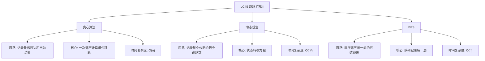

# 03-18-00-00 LC45_跳跃游戏II解法分析
## 题目描述
给定一个长度为 n 的 0 索引整数数组 nums。初始位置为 nums[0]。每个元素 nums[i] 表示从索引 i 向前跳转的最大长度。换句话说，如果你在 nums[i] 处，你可以跳转到任意 nums[i + j] 处：其中 0 <= j <= nums[i] 且 i + j < n。返回到达 nums[n - 1] 的最小跳跃次数。生成的测试用例可以到达 nums[n - 1]。
**示例：**
输入：nums = [2,3,1,1,4]
输出：2
解释：跳到最后一个位置的最小跳跃数是 2。从下标为 0 跳到下标为 1 的位置，跳 1 步，然后跳 3 步到达数组的最后一个位置。
输入：nums = [2,3,0,1,4]
输出：2
## 解法概览
### 思维导图

## 记忆口诀
**贪心算法：** 记录边界和最远，一次遍历算最少。
**动态规划：** 状态记录跳跃数，逐步更新每个位置。
**BFS：** 层序遍历每一步，计算到达终点的层数。
## 不同解法
### 解法一：贪心算法（最优解）
#### 思路
使用贪心算法，在遍历过程中记录当前可以到达的最远位置（maxReach）和当前跳跃的边界（end）。当遍历到边界时，说明需要进行一次跳跃，此时更新边界为当前的最远位置，并增加跳跃次数。
#### 核心公式
- maxReach：记录当前能够到达的最远位置
- end：记录当前跳跃的边界
- jumps：记录跳跃次数
- 对于每个位置 i：
  1. 更新 maxReach = max(maxReach, i + nums[i])
  2. 如果 i == end，说明需要进行一次跳跃，更新 end = maxReach，jumps++
  3. 如果 end >= nums.length - 1，返回 jumps
#### 图解过程
以输入 [2,3,1,1,4] 为例：
- 初始：maxReach=0, end=0, jumps=0
- 位置0：maxReach=max(0, 0+2)=2
- 位置0 == end → jumps=1, end=2
- 位置1：maxReach=max(2, 1+3)=4
- 位置1 < end → 无操作
- 位置2：maxReach=max(4, 2+1)=4
- 位置2 == end → jumps=2, end=4
- end=4 >= 4（最后一个下标）→ 返回2
#### 代码示例（带详细注释）
```java
public int jump(int[] nums) {
    if (nums == null || nums.length <= 1) {
        return 0;
    }
    
    int maxReach = 0; // 记录当前能够到达的最远位置
    int end = 0;      // 记录当前跳跃的边界
    int jumps = 0;    // 记录跳跃次数
    
    for (int i = 0; i < nums.length - 1; i++) {
        // 更新最远可达位置
        maxReach = Math.max(maxReach, i + nums[i]);
        
        // 当遍历到当前跳跃的边界时，需要进行一次跳跃
        if (i == end) {
            jumps++;
            end = maxReach;
            
            // 如果当前边界已经可以到达最后一个位置，提前返回
            if (end >= nums.length - 1) {
                break;
            }
        }
    }
    
    return jumps;
}
```
#### 复杂度分析
- 时间复杂度：O(n)，只需一次遍历数组
- 空间复杂度：O(1)，只需要常数级别的额外空间
#### 优缺点
- **优点：**
  - 时间复杂度最优，只需一次遍历
  - 空间复杂度低，适合处理大规模数据
  - 代码简洁，逻辑清晰
- **缺点：** 无明显缺点，是本题的最优解法
### 解法二：动态规划
#### 思路
使用动态规划，创建一个数组dp，其中dp[i]表示到达位置i所需的最少跳跃次数。初始化dp[0]=0，然后遍历数组，对于每个位置i，更新其可以到达的后续位置的dp值。
#### 核心公式
- dp[i]：表示到达位置i所需的最少跳跃次数
- 初始化：dp[0] = 0，其余为无穷大
- 对于每个位置i：
  - 如果dp[i]不是无穷大，那么对于j从i+1到i+nums[i]，设置dp[j] = min(dp[j], dp[i] + 1)
- 最终结果：dp[nums.length-1]
#### 图解过程
以输入 [2,3,1,1,4] 为例：
- 初始化：dp[0]=0, dp[1]=∞, dp[2]=∞, dp[3]=∞, dp[4]=∞
- 位置0：dp[0]=0，更新dp[1]=min(∞, 0+1)=1, dp[2]=min(∞, 0+1)=1
- 位置1：dp[1]=1，更新dp[2]=min(1, 1+1)=1, dp[3]=min(∞, 1+1)=2, dp[4]=min(∞, 1+1)=2
- 位置2：dp[2]=1，更新dp[3]=min(2, 1+1)=2
- 位置3：dp[3]=2，更新dp[4]=min(2, 2+1)=2
- 位置4：dp[4]=2 → 返回2
#### 代码示例
```java
public int jump(int[] nums) {
    if (nums == null || nums.length <= 1) {
        return 0;
    }
    
    int n = nums.length;
    int[] dp = new int[n];
    // 初始化dp数组为无穷大
    Arrays.fill(dp, Integer.MAX_VALUE);
    dp[0] = 0; // 初始位置不需要跳跃
    
    for (int i = 0; i < n; i++) {
        if (dp[i] != Integer.MAX_VALUE) {
            // 从位置i可以到达的最远位置
            int maxJump = Math.min(i + nums[i], n - 1);
            for (int j = i + 1; j <= maxJump; j++) {
                if (dp[j] > dp[i] + 1) {
                    dp[j] = dp[i] + 1;
                    // 如果已经到达最后一个位置，提前返回
                    if (j == n - 1) {
                        return dp[j];
                    }
                }
            }
        }
    }
    
    return dp[n - 1];
}
```
#### 复杂度分析
- 时间复杂度：O(n²)，最坏情况下需要遍历每个位置的可达范围
- 空间复杂度：O(n)，需要数组存储每个位置的最少跳跃次数
#### 优缺点
- 优点：逻辑清晰，易于理解
- 缺点：时间复杂度较高，不适合处理大规模数据
### 解法三：BFS
#### 思路
使用广度优先搜索（BFS），将每一步可以到达的位置视为一层，计算到达最后一个位置的层数，即最少跳跃次数。
#### 核心公式
- 使用队列记录每一层的位置
- 使用visited数组记录已经访问过的位置，避免重复处理
- 每处理完一层，跳跃次数加1
- 当找到最后一个位置时，返回当前的跳跃次数
#### 图解过程
以输入 [2,3,1,1,4] 为例：
- 初始层：[0]，跳跃次数0
- 处理层0：可以到达位置1,2 → 下一层[1,2]，跳跃次数1
- 处理层1：位置1可以到达3,4；位置2可以到达3 → 下一层[3,4]，跳跃次数2
- 处理层2：位置4是最后一个位置 → 返回2
#### 代码示例
```java
public int jump(int[] nums) {
    if (nums == null || nums.length <= 1) {
        return 0;
    }
    
    int n = nums.length;
    boolean[] visited = new boolean[n];
    Queue<Integer> queue = new LinkedList<>();
    queue.offer(0);
    visited[0] = true;
    int jumps = 0;
    
    while (!queue.isEmpty()) {
        int size = queue.size();
        jumps++;
        
        for (int i = 0; i < size; i++) {
            int current = queue.poll();
            int maxJump = current + nums[current];
            
            // 检查是否可以直接到达最后一个位置
            if (maxJump >= n - 1) {
                return jumps;
            }
            
            // 将当前位置可以到达的位置加入队列
            for (int j = current + 1; j <= maxJump; j++) {
                if (!visited[j]) {
                    visited[j] = true;
                    queue.offer(j);
                }
            }
        }
    }
    
    return jumps;
}
```
#### 复杂度分析
- 时间复杂度：O(n)，每个位置最多被访问一次
- 空间复杂度：O(n)，需要队列和 visited 数组
#### 优缺点
- 优点：逻辑直观，容易理解
- 缺点：空间复杂度较高，需要额外的队列和 visited 数组
## 面试回答模板
**问题：** 请计算到达数组最后一个位置的最少跳跃次数。
**回答：**
这是一道经典的贪心算法问题，主要有三种解法：
1. **贪心算法**：从左到右遍历数组，记录当前能够到达的最远位置和当前跳跃的边界。当遍历到边界时，说明需要进行一次跳跃，此时更新边界为当前的最远位置，并增加跳跃次数。时间复杂度O(n)，是本题的最优解。
2. **动态规划**：使用数组记录每个位置的最少跳跃次数，初始化第一个位置为0，然后遍历数组，对于每个可达的位置，更新其可以到达的后续位置的跳跃次数。时间复杂度O(n²)，逻辑清晰但效率较低。
3. **BFS**：将每一步可以到达的位置视为一层，使用广度优先搜索计算到达最后一个位置的层数，即最少跳跃次数。时间复杂度O(n)，逻辑直观但空间复杂度较高。
**最优选择：** 贪心算法是本题的最优解，因为它在保证时间复杂度O(n)的同时，空间复杂度为O(1)，代码简洁且易于理解。面试中推荐使用贪心算法，既展示了对问题的深入理解，又能高效解决问题。
## 相关题目
1. **LC55：跳跃游戏** - 判断是否可以到达终点
2. **LC1306：跳跃游戏 III** - 跳跃到指定位置
3. **LC1345：跳跃游戏 IV** - 最少跳跃次数（BFS）
4. **LC1696：跳跃游戏 VI** - 最大得分跳跃
这些题目都涉及到跳跃游戏的不同变体，与LC45_跳跃游戏II有一定的关联性。