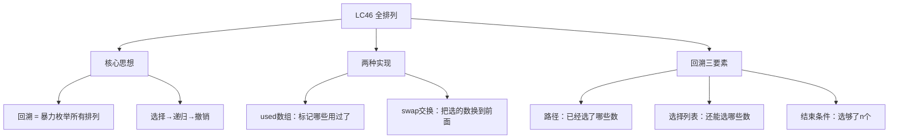

# LC46 全排列
## 一、题目描述
给定一个**不含重复数字**的数组 `nums`，返回其所有可能的**全排列**。可以按任意顺序返回答案。
**示例：**
```
输入：nums = [1,2,3]
输出：[[1,2,3],[1,3,2],[2,1,3],[2,3,1],[3,1,2],[3,2,1]]
共 3! = 6 种排列
```
**约束：**
- 1 <= nums.length <= 6
- nums 中的所有整数互不相同
---
## 二、解法概览
### 解法对比表
| 解法 | 时间复杂度 | 空间复杂度 | 面试推荐 |
|------|-----------|-----------|---------|
| **回溯 + used数组** | O(n×n!) | O(n) | ✅ **首选（通用模板）** |
| 回溯 + swap交换 | O(n×n!) | O(n) | ✅ 推荐（原地） |
### 思维导图

---
## 三、记忆口诀
```
全排列回溯来枚举，选择递归再撤销
used数组标记谁用过，path装满就收集
选了标true递归下一层，回来标false还原它
```
---
## 四、解法一：回溯 + used数组（首选 ✅ 通用模板）
### 思路
维护一个 `path`（当前已选的数）和 `used[]`（标记哪些数用过了）。每一层从所有数中选一个没用过的，加入 path，递归下一层，回来后撤销。
### 核心公式
```
backtrack(path, used):
  if path.size() == n → 收集结果
  for i = 0 to n-1:
    if used[i] → 跳过
    path.add(nums[i])      // 选择
    used[i] = true
    backtrack(path, used)   // 递归
    path.removeLast()       // 撤销
    used[i] = false
```
### 回溯怎么理解？
```
想象你有3个球：1号、2号、3号
你有3个盒子要依次放球：
第1个盒子：3个球都能放 → 选1号
  第2个盒子：剩2号3号 → 选2号
    第3个盒子：剩3号 → 放3号 → 得到 [1,2,3] ✅
    取出3号
  取出2号
  第2个盒子：剩2号3号 → 选3号
    第3个盒子：剩2号 → 放2号 → 得到 [1,3,2] ✅
    取出2号
  取出3号
取出1号
第1个盒子：选2号 → ...
每次"取出来"就是撤销选择 = 回溯
```
### 图解过程（决策树）
```
nums = [1, 2, 3]
                    []
            /        |        \
         [1]        [2]       [3]
        /   \      /   \     /   \
     [1,2] [1,3] [2,1] [2,3] [3,1] [3,2]
       |     |     |     |     |     |
   [1,2,3][1,3,2][2,1,3][2,3,1][3,1,2][3,2,1]
每条从根到叶的路径 = 一个排列
总共 3! = 6 个叶子节点 = 6 个排列
```
### 代码示例
```java
public List<List<Integer>> permute(int[] nums) {
    List<List<Integer>> res = new ArrayList<>();
    List<Integer> path = new ArrayList<>();
    boolean[] used = new boolean[nums.length];
    backtrack(nums, path, used, res);
    return res;
}
private void backtrack(int[] nums, List<Integer> path,
                       boolean[] used, List<List<Integer>> res) {
    // 终止条件：选够了
    if (path.size() == nums.length) {
        res.add(new ArrayList<>(path));  // 注意要new一个副本！
        return;
    }
    // 枚举所有选择
    for (int i = 0; i < nums.length; i++) {
        if (used[i]) continue;           // 用过了，跳过
        path.add(nums[i]);               // 选择
        used[i] = true;
        backtrack(nums, path, used, res); // 递归
        path.remove(path.size() - 1);    // 撤销选择
        used[i] = false;
    }
}
```
### 为什么 res.add 要 new ArrayList<>(path)？
```
path 是一个引用，回溯过程中会被不断修改
如果直接 res.add(path)，所有结果都指向同一个 path
最终 path 会被清空，res 里全是空列表
必须 new ArrayList<>(path) 创建一个快照/副本
```
### 复杂度分析
- 时间复杂度：**O(n × n!)**，n! 个排列，每个排列复制 O(n)
- 空间复杂度：**O(n)**，path + used + 递归栈
### 优缺点
| 优点 | 缺点 |
|-----|------|
| **通用模板**，适用于所有排列组合题 | 需要额外 used 数组 |
| 代码清晰，好理解 | 无 |
---
## 五、解法二：回溯 + swap交换（你的代码）
### 思路
不用 used 数组，而是通过**交换**来"选择"元素：把位置 i 和位置 j 交换，相当于选 nums[j] 放到第 i 个位置。递归处理 i+1 位置，回来后交换回去（撤销）。
### 核心公式
```
process(nums, i):
  if i == n → 收集nums（此时nums就是一个排列）
  for j = i to n-1:
    swap(nums, i, j)       // 选择：把j位置的数放到i位置
    process(nums, i + 1)    // 递归：处理下一个位置
    swap(nums, i, j)       // 撤销：交换回来
```
### 怎么理解交换法？
```
nums = [1, 2, 3]，处理位置 i=0
  j=0: swap(0,0)=[1,2,3] → 位置0放1 → 递归处理位置1
  j=1: swap(0,1)=[2,1,3] → 位置0放2 → 递归处理位置1
  j=2: swap(0,2)=[3,2,1] → 位置0放3 → 递归处理位置1
"位置i要放谁？" → 从i到末尾的每个数都试一次（通过交换放到位置i）
```
### 图解过程
```
nums = [1, 2, 3]
━━━━━━━━━━━━━━━━━━━━━━━━━━━━━━━━━━
i=0：位置0放谁？
  j=0: swap(0,0) → [1,2,3] → 递归i=1
    i=1：位置1放谁？
      j=1: swap(1,1) → [1,2,3] → 递归i=2
        i=2：j=2: swap(2,2) → [1,2,3] → i=3=n → 收集 ✅
      j=2: swap(1,2) → [1,3,2] → 递归i=2
        [1,3,2] → 收集 ✅
      swap回来 → [1,2,3]
  j=1: swap(0,1) → [2,1,3] → 递归i=1
    [2,1,3] → 收集 ✅
    [2,3,1] → 收集 ✅
    swap回来 → [1,2,3]
  j=2: swap(0,2) → [3,2,1] → 递归i=1
    [3,2,1] → 收集 ✅
    [3,1,2] → 收集 ✅
    swap回来 → [1,2,3]
━━━━━━━━━━━━━━━━━━━━━━━━━━━━━━━━━━
结果：[1,2,3],[1,3,2],[2,1,3],[2,3,1],[3,2,1],[3,1,2]
```
### 代码示例
```java
public List<List<Integer>> permute(int[] nums) {
    List<List<Integer>> res = new ArrayList<>();
    process(nums, 0, res);
    return res;
}
private void process(int[] nums, int i, List<List<Integer>> res) {
    if (i == nums.length) {
        List<Integer> temp = new ArrayList<>();
        for (int num : nums) temp.add(num);
        res.add(temp);
        return;
    }
    for (int j = i; j < nums.length; j++) {
        swap(nums, i, j);        // 选择：把j放到位置i
        process(nums, i + 1, res); // 递归
        swap(nums, i, j);        // 撤销：交换回来
    }
}
private void swap(int[] nums, int i, int j) {
    int temp = nums[i];
    nums[i] = nums[j];
    nums[j] = temp;
}
```
### 复杂度分析
- 时间复杂度：**O(n × n!)**
- 空间复杂度：**O(n)**，递归栈（不需要额外 used 数组和 path）
### 优缺点
| 优点 | 缺点 |
|-----|------|
| 不需要 used 数组和 path | 不够通用（组合/子集题不好用） |
| 原地操作 | 排列顺序和解法一不同 |
---
## 六、两种解法对比
| 对比 | used数组 | swap交换 |
|------|---------|---------|
| 额外空间 | used[] + path | 不需要 |
| 通用性 | **万能模板**，排列/组合/子集都行 | 只适合排列 |
| 代码 | 更标准 | 更巧妙 |
| 面试推荐 | **首选** | 进阶/追问 |
```
面试建议：
  先写 used数组版（通用模板，不容易出错）
  面试官追问"能不能不用额外空间" → 再写 swap版
```
---
## 七、回溯通用模板
```java
// 所有排列/组合/子集题都是这个框架
void backtrack(路径, 选择列表) {
    if (满足结束条件) {
        收集结果;
        return;
    }
    for (选择 : 选择列表) {
        做选择;        // path.add + used=true
        backtrack();   // 递归
        撤销选择;      // path.remove + used=false
    }
}
```
### 排列 vs 组合 vs 子集的区别
| 题型 | for循环起点 | 是否用used | 结束条件 |
|------|-----------|-----------|---------|
| **排列** | i = 0（每次都从头选） | 是 | path.size == n |
| **组合** | i = start（不回头选） | 否 | path.size == k |
| **子集** | i = start（不回头选） | 否 | 每个节点都收集 |
```
排列：[1,2] 和 [2,1] 是不同的 → 每次从头开始选，用 used 防重复
组合：[1,2] 和 [2,1] 是相同的 → 用 start 保证只往后选，天然不重复
```
---
## 八、面试回答模板
### 1. 开场：理解题意
> 全排列就是把数组中所有数字排成不同的顺序，n 个数共有 n! 种排列。
### 2. 思路：回溯
> 用回溯法枚举所有排列。维护一个 path 和 used 数组，每层从所有未使用的数中选一个加入 path，递归下一层，回来后撤销选择。path 长度等于 n 时收集结果。
### 3. 关键细节
> 收集结果时要 new ArrayList<>(path) 创建副本，因为 path 会被回溯修改。for 循环从 0 开始（不是 start），因为排列中每个位置都可以放任意未使用的数。
### 4. 复杂度
> 时间 O(n×n!)，空间 O(n)。
---
## 九、相关题目
| 题号 | 题目 | 关系 | 难度 |
|-----|------|------|-----|
| LC47 | 全排列II | 有重复数字，需剪枝 | 中等 |
| LC77 | 组合 | 回溯模板：组合版 | 中等 |
| LC78 | 子集 | 回溯模板：子集版 | 中等 |
| LC39 | 组合总和 | 回溯+剪枝 | 中等 |
| LC79 | 单词搜索 | 回溯在网格上 | 中等 |
| LC51 | N皇后 | 回溯经典 | 困难 |