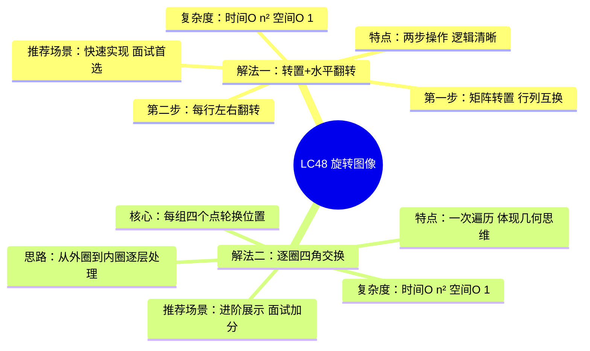
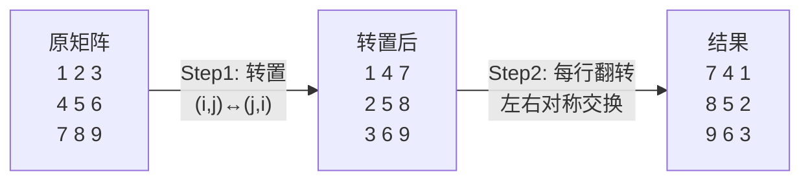
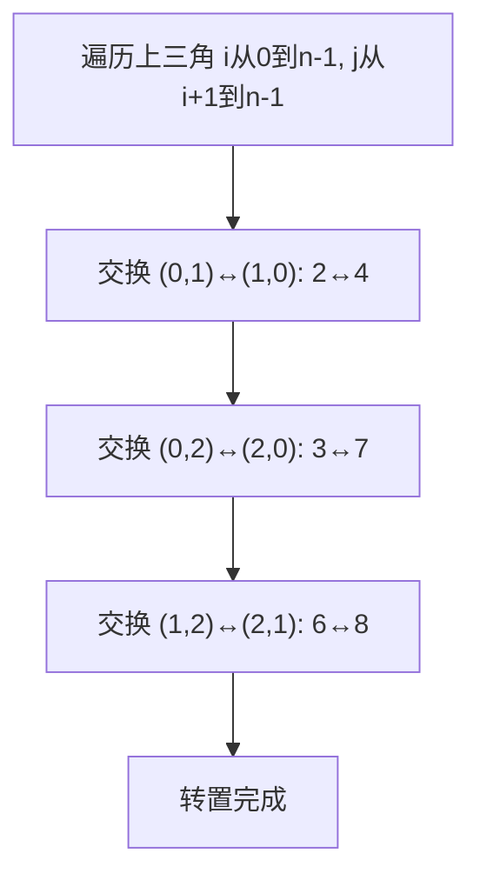
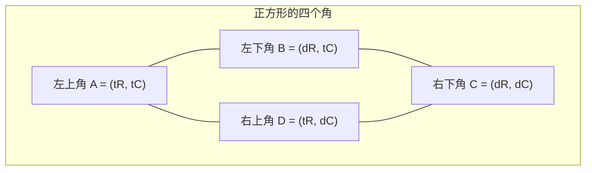
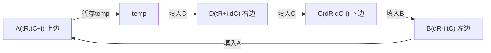
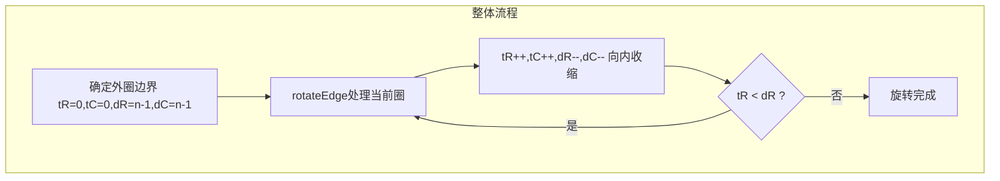
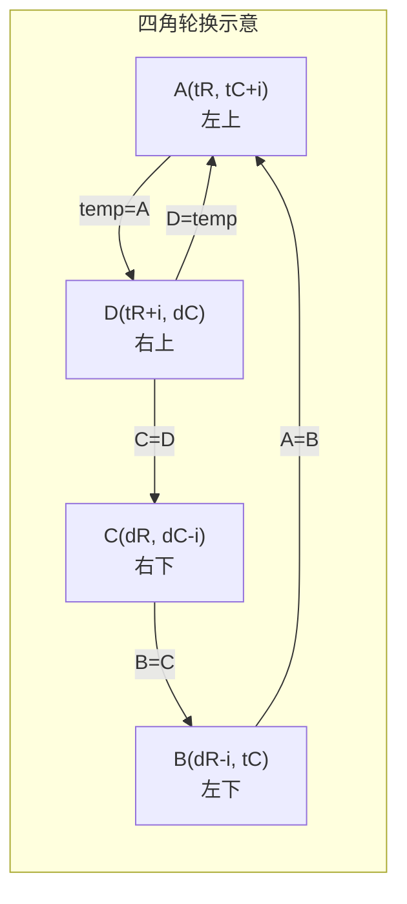
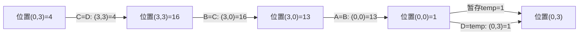

# LC48 旋转图像
## 一、题目描述
给定一个 n × n 的二维矩阵 matrix 表示一个图像，请你将图像**顺时针旋转 90 度**。**必须原地旋转**，不能使用额外矩阵。
**示例1：** 输入 `[[1,2,3],[4,5,6],[7,8,9]]`，输出 `[[7,4,1],[8,5,2],[9,6,3]]`
**示例2：** 输入 `[[1,2],[3,4]]`，输出 `[[3,1],[4,2]]`
**约束：** n == matrix.length == matrix[i].length，1 ≤ n ≤ 20，-1000 ≤ matrix[i][j] ≤ 1000
## 二、解法概览

| 解法 | 时间复杂度 | 空间复杂度 | 难度 | 面试推荐 |
|------|-----------|-----------|------|---------|
| 转置+水平翻转 | O(n²) | O(1) | ⭐⭐ | 首选普通解法 |
| 逐圈四角交换 | O(n²) | O(1) | ⭐⭐⭐ | 最优解/加分项 |
## 三、记忆口诀
> **转置翻行最直观，四角轮换圈圈转。**
> **先转后翻两步走，逐圈交换更精炼。**
- 转置+翻转：「**先转置、再翻行**」，两步操作，简单不出错
- 四角交换：「**定四角、存一个、转三个、填回来**」，一圈一圈往里缩
## 四、解法一：转置 + 水平翻转（面试首选）
### 4.1 思路
观察规律：顺时针旋转90°的效果 = **先转置** + **再水平翻转每行**。
- 转置：把第 i 行第 j 列的元素放到第 j 行第 i 列
- 水平翻转：把每行元素左右对称交换
### 4.2 核心公式
**转置操作（上三角交换）：** `matrix[i][j] ↔ matrix[j][i]`，其中 `i < j`
**水平翻转（每行左右交换）：** `matrix[i][j] ↔ matrix[i][n-1-j]`，其中 `j < n/2`
### 4.3 图解过程

**转置细节（上三角遍历）：**

### 4.4 代码示例
```java
public void rotate(int[][] matrix) {
    int n = matrix.length;
    // Step1: 转置——遍历上三角，交换 matrix[i][j] 和 matrix[j][i]
    for (int i = 0; i < n; i++) {
        for (int j = i + 1; j < n; j++) {
            int temp = matrix[i][j];
            matrix[i][j] = matrix[j][i];
            matrix[j][i] = temp;
        }
    }
    // Step2: 水平翻转——每行左右交换
    for (int i = 0; i < n; i++) {
        for (int j = 0; j < n / 2; j++) {
            int temp = matrix[i][j];
            matrix[i][j] = matrix[i][n - 1 - j];
            matrix[i][n - 1 - j] = temp;
        }
    }
}
```
### 4.5 复杂度分析
- **时间复杂度：O(n²)**，转置遍历 n(n-1)/2 次，翻转遍历 n·⌊n/2⌋ 次，总共 O(n²)
- **空间复杂度：O(1)**，只用了一个 temp 变量
### 4.6 优缺点
| 优点 | 缺点 |
|------|------|
| 逻辑简单，两步独立操作 | 需要遍历两遍矩阵 |
| 代码短，不容易写错 | 对几何直觉的展示不够 |
| 面试中可快速实现 | 常数因子比四角交换稍大 |
## 补充：为什么转置和水平翻转的 swap 不能直接复用？
### 问题本质
转置和水平翻转虽然都是"交换两个元素"，但**交换的坐标对完全不同**：
| 操作 | 交换的两个位置 | 行为 |
|------|--------------|------|
| 转置 | `(i,j)` ↔ `(j,i)` | 行列互换，坐标关于对角线对称 |
| 水平翻转 | `(i,j)` ↔ `(i,n-1-j)` | 同一行内，列号左右对称 |
如果你写一个 `swap(matrix, i, j)` 内部固定执行 `matrix[i][j] ↔ matrix[j][i]`，那它只能做转置。拿来做水平翻转时，传入 `swap(matrix, i, newJ)` 实际执行的是 `matrix[i][newJ] ↔ matrix[newJ][i]`——这变成了**跨行交换**，根本不是同一行内的左右翻转。
### 具体例子
以 3×3 矩阵为例，水平翻转第1行时要交换 `(1,0)` 和 `(1,2)`：
```
正确：matrix[1][0] ↔ matrix[1][2]   → 同一行，列号对称
错误：matrix[1][2] ↔ matrix[2][1]   → 变成了跨行交换，完全不是翻转
```
### 如何正确抽象？
如果一定要抽象，需要传**4个坐标参数**而非2个：
```java
// 通用swap：交换任意两个位置
private void swap(int[][] matrix, int r1, int c1, int r2, int c2) {
    int temp = matrix[r1][c1];
    matrix[r1][c1] = matrix[r2][c2];
    matrix[r2][c2] = temp;
}
// 转置调用：swap(matrix, i, j, j, i)
// 水平翻转调用：swap(matrix, i, j, i, n-1-j)
```
但实际上这样抽象后代码反而更长，不如直接内联写交换更清晰。**结论：两个参数的 swap 无法复用，四个参数的 swap 可以复用但不如内联直观。**
## 五、解法二：逐圈四角交换（最优解）
### 5.1 思路
把矩阵看作一圈一圈的"框"，从最外圈到最内圈依次处理。每一圈内，按照上→右→下→左的顺序，把四个对应位置的元素做一次轮换。
- 用左上角 `(tR, tC)` 和右下角 `(dR, dC)` 标定一圈
- 每圈需要交换 `times = dR - tR` 组四元素
- 处理完一圈后，向内收缩：`tR++, tC++, dR--, dC--`
### 5.2 核心公式
每组四元素轮换（顺时针方向 A←B←C←D←A）：
```
temp        = matrix[tR][tC+i]       // A 左上→暂存
matrix[tR][tC+i]   = matrix[dR-i][tC]      // B 左下→A 左上
matrix[dR-i][tC]   = matrix[dR][dC-i]      // C 右下→B 左下
matrix[dR][dC-i]   = matrix[tR+i][dC]      // D 右上→C 右下
matrix[tR+i][dC]   = temp                  // A 暂存→D 右上
```
### 5.3 坐标速记技巧：如何快速记住四角交换？
**核心思路：把正方形的一圈想象成4条边，每个点都在某条边上滑动。**
**第一步：记住4个角的坐标（i=0时的位置）**

**第二步：理解 i 的含义——每个点沿着自己所在的边滑动 i 步**
| 点 | 所在边 | 角坐标 | 滑动方向 | 加上偏移i后 |
|----|--------|--------|---------|------------|
| A | 上边（行固定=tR） | (tR, tC) | 向右滑 → 列+i | **(tR, tC+i)** |
| B | 左边（列固定=tC） | (dR, tC) | 向上滑 → 行-i | **(dR-i, tC)** |
| C | 下边（行固定=dR） | (dR, dC) | 向左滑 → 列-i | **(dR, dC-i)** |
| D | 右边（列固定=dC） | (tR, dC) | 向下滑 → 行+i | **(tR+i, dC)** |
**速记口诀：「上右、左上、下左、右下」——每个点在哪条边，就沿那条边滑 i 步。**
**第三步：记住赋值顺序——逆时针取值、顺时针填入**

赋值链：`temp=A → A=B → B=C → C=D → D=temp`，按**左→下→右→上（逆时针）**的顺序取值。
**总结速记法：**
1. 画正方形，标出四个角 `(tR,tC)` `(tR,dC)` `(dR,tC)` `(dR,dC)`
2. 每个点沿自己所在边滑 i 步：固定的坐标不动，活动的坐标 ±i
3. 赋值顺序：存A、A←B、B←C、C←D、D←存，逆时针取值填入
### 5.4 图解过程（整体流程）


**以 4×4 矩阵为例（外圈第一组 i=0）：**

### 5.5 代码示例
```java
public void rotate(int[][] matrix) {
    if (matrix == null || matrix.length < 2) {
        return;
    }
    // 左上角和右下角坐标
    int tR = 0, tC = 0;
    int dR = matrix.length - 1, dC = matrix[0].length - 1;
    // 从外圈到内圈逐层旋转
    while (tR < dR) {
        rotateEdge(matrix, tR++, tC++, dR--, dC--);
    }
}
private void rotateEdge(int[][] matrix, int tR, int tC, int dR, int dC) {
    int times = dR - tR; // 当前圈需要交换的组数
    for (int i = 0; i < times; i++) {
        int temp = matrix[tR][tC + i];           // 暂存A(左上)
        matrix[tR][tC + i] = matrix[dR - i][tC];       // B(左下) → A(左上)
        matrix[dR - i][tC] = matrix[dR][dC - i];       // C(右下) → B(左下)
        matrix[dR][dC - i] = matrix[tR + i][dC];       // D(右上) → C(右下)
        matrix[tR + i][dC] = temp;                      // A(暂存) → D(右上)
    }
}
```
### 5.6 复杂度分析
- **时间复杂度：O(n²)**，每个元素恰好被交换一次，总操作数 = n²-中心点（n为奇数时）
- **空间复杂度：O(1)**，只用了一个 temp 变量
### 5.7 优缺点
| 优点 | 缺点 |
|------|------|
| 一次遍历完成，常数因子小 | 下标推导复杂，容易写错 |
| 体现几何分层思维，面试加分 | 需要画图辅助理解 |
| 代码结构清晰（分层+轮换） | 初学者不易记忆 |
## 六、面试回答模板
> **面试官：** 如何原地将 n×n 矩阵顺时针旋转 90 度？
**回答要点：**
1. **先说思路：** 旋转图像有两种经典做法。第一种是"转置+水平翻转"，顺时针旋转90°等价于先对矩阵做转置再对每行做水平翻转，逻辑简单两步搞定。第二种是"逐圈四角交换"，把矩阵看成一圈圈的框，从外向内每圈取四个对应位置做轮换。
2. **分析复杂度：** 两种方法时间复杂度都是 O(n²)，空间复杂度都是 O(1)，满足原地旋转的要求。
3. **写代码：** 推荐先用转置+翻转法快速实现，代码清晰不易出错。如果面试官想看更精巧的做法，再补充逐圈四角交换法。
4. **延伸：** 逆时针旋转90°可以用"转置+垂直翻转"实现；旋转180°可以用"水平翻转+垂直翻转"实现。
## 七、相关题目
| 题目 | 关联点 |
|------|--------|
| LC54 螺旋矩阵 | 同样是逐圈处理矩阵，遍历方向不同 |
| LC59 螺旋矩阵II | 逐圈填充，与旋转图像的分圈思想一致 |
| LC189 轮转数组 | 一维旋转，使用翻转法（类似转置+翻转思想） |
| LC867 转置矩阵 | 矩阵转置操作，是解法一的核心步骤 |
| 剑指Offer 29 顺时针打印矩阵 | 逐圈遍历思想与解法二相同 |
