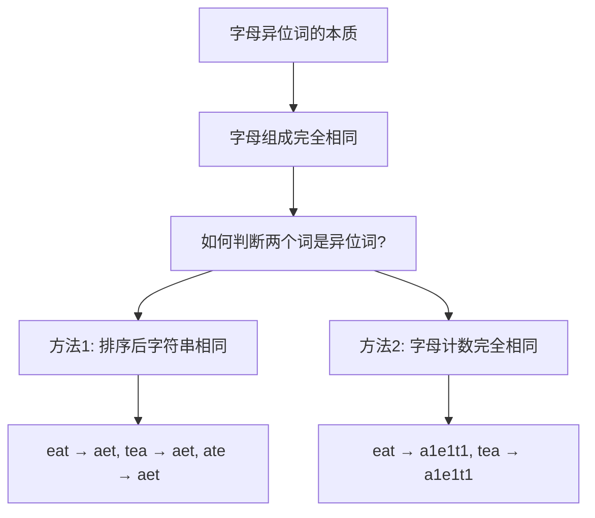
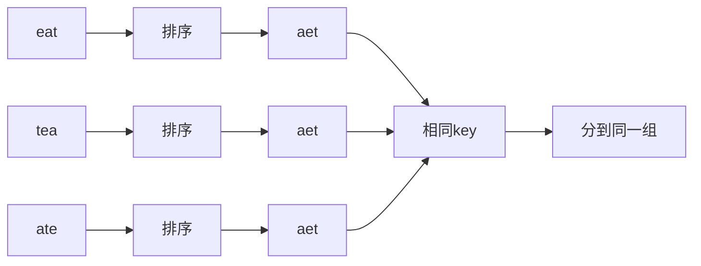
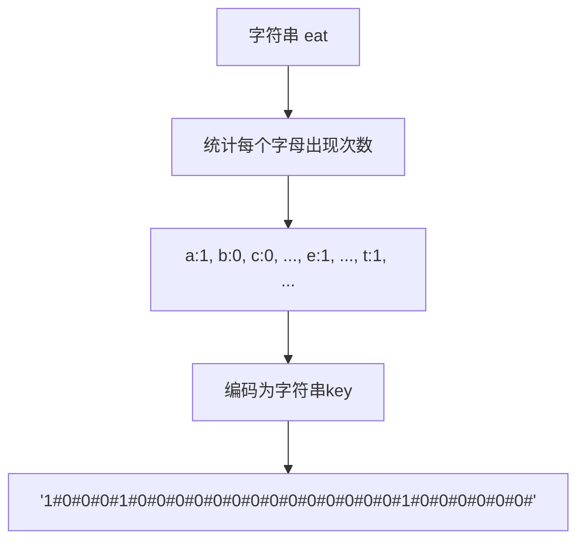
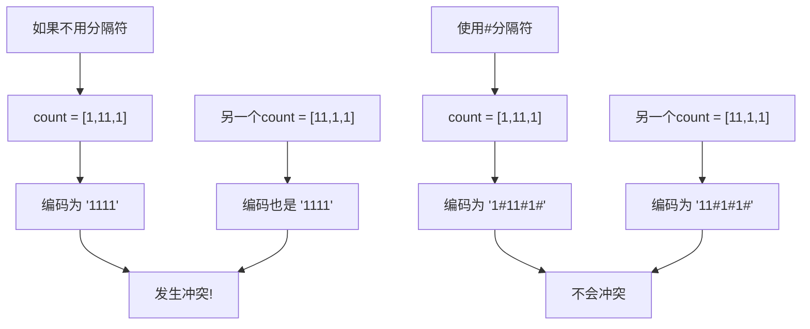
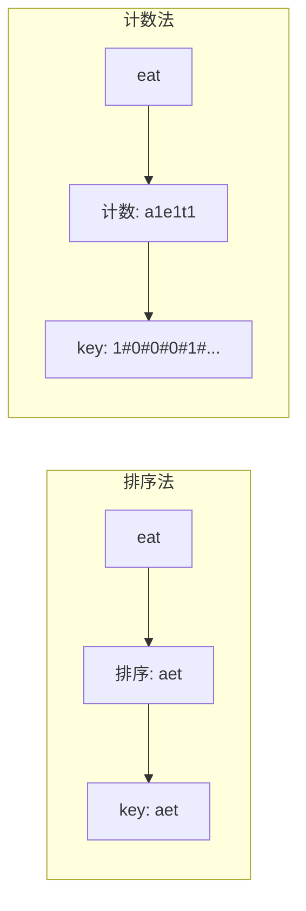

# LC49 字母异位词分组 - 面试题解
## 一、题目描述
给你一个字符串数组，请你将**字母异位词**组合在一起。可以按任意顺序返回结果列表。
**字母异位词**：由重新排列源单词的所有字母得到的一个新单词（字母相同，顺序不同）。
**示例**：
```
输入: strs = ["eat", "tea", "tan", "ate", "nat", "bat"]
输出: [["bat"],["nat","tan"],["ate","eat","tea"]]
```
## 二、解题核心思想

**核心问题**：如何设计一个key，使得所有异位词映射到同一个key？
| 方法 | Key设计 | 示例 |
|------|---------|------|
| 排序法 | 排序后的字符串 | "eat" → "aet" |
| 计数法 | 字母计数编码 | "eat" → "a1e1t1" 或 "1#0#0#0#1#...#1#..." |
## 三、解法一：排序法（你现有代码）
### 3.1 思路分析

### 3.2 代码实现
```java
public List<List<String>> groupAnagrams(String[] strs) {
    Map<String, List<String>> map = new HashMap<>();
    for (String s : strs) {
        char[] charArray = s.toCharArray();
        Arrays.sort(charArray);  // 排序
        String key = new String(charArray);
        map.computeIfAbsent(key, k -> new ArrayList<>()).add(s);
    }
    return new ArrayList<>(map.values());
}
```
### 3.3 复杂度分析
| 复杂度 | 分析 |
|--------|------|
| 时间 | O(n × k × logk)，n是字符串数量，k是字符串最大长度 |
| 空间 | O(n × k)，存储所有字符串 |
## 四、解法二：计数法（面试官不让用排序API）
### 4.1 核心思想
**不用排序，如何生成唯一key？** → 统计每个字母出现的次数！

### 4.2 为什么这个方法有效？
| 对比 | eat | tea | ate |
|------|-----|-----|-----|
| a出现次数 | 1 | 1 | 1 |
| e出现次数 | 1 | 1 | 1 |
| t出现次数 | 1 | 1 | 1 |
| 其他字母 | 0 | 0 | 0 |
| 计数编码 | 相同 | 相同 | 相同 |
**结论**：异位词的字母计数一定完全相同！
### 4.3 代码实现
```java
public List<List<String>> groupAnagrams(String[] strs) {
    Map<String, List<String>> map = new HashMap<>();
    for (String s : strs) {
        // 统计每个字母出现次数
        int[] count = new int[26];
        for (char c : s.toCharArray()) {
            count[c - 'a']++;
        }
        // 将计数数组编码为字符串key
        StringBuilder sb = new StringBuilder();
        for (int i = 0; i < 26; i++) {
            sb.append(count[i]).append('#');  // 用#分隔，防止"1""11"和"11""1"混淆
        }
        String key = sb.toString();
        map.computeIfAbsent(key, k -> new ArrayList<>()).add(s);
    }
    return new ArrayList<>(map.values());
}
```
### 4.4 为什么要用分隔符#？

### 4.5 复杂度分析
| 复杂度 | 分析 |
|--------|------|
| 时间 | O(n × k)，n是字符串数量，k是字符串最大长度 |
| 空间 | O(n × k) |
**对比排序法**：计数法时间复杂度更优（省去了排序的logk）！
## 五、面试回答模板
### 5.1 第一反应：排序法
> "我的第一反应是排序法。异位词的本质是字母组成相同，那排序后的字符串一定相同。我可以用排序后的字符串作为HashMap的key，把所有异位词分到同一组。时间复杂度是O(n × k × logk)。"
### 5.2 追问：不用排序API怎么办？
> "如果不能用排序，我可以换一个思路：统计每个字母出现的次数。因为异位词的字母计数一定完全相同，我可以把计数数组编码成字符串作为key。比如'eat'的计数编码是'1#0#0#0#1#...#1#...'，表示a出现1次、e出现1次、t出现1次。这样时间复杂度反而更优，是O(n × k)，因为省去了排序。"
### 5.3 面试官可能的追问
| 追问 | 回答要点 |
|------|----------|
| 为什么用#分隔？ | 防止数字拼接产生歧义，如"1""11"和"11""1" |
| 能否用int[]直接作为key？ | 不行，Java中数组的equals比较的是引用，不是内容 |
| 计数法的空间开销？ | 每个key是26个数字+26个分隔符，常数空间 |
| 哪种方法更好？ | 计数法时间更优，但排序法代码更简洁直观 |
## 六、两种方法对比

| 维度 | 排序法 | 计数法 |
|------|--------|--------|
| 时间复杂度 | O(n × k × logk) | O(n × k) |
| 空间复杂度 | O(n × k) | O(n × k) |
| 代码简洁度 | 更简洁 | 稍复杂 |
| 是否依赖API | 依赖Arrays.sort | 不依赖 |
| 面试推荐 | 先说这个 | 追问时展示 |
## 七、完整代码（两种解法）
```java
package com.ssl.note.leetcode.编号刷题.LC49_字母异位词分组;
import java.util.*;
public class Solution {
    // 解法一：排序法
    public List<List<String>> groupAnagrams_Sort(String[] strs) {
        Map<String, List<String>> map = new HashMap<>();
        for (String s : strs) {
            char[] chars = s.toCharArray();
            Arrays.sort(chars);
            String key = new String(chars);
            map.computeIfAbsent(key, k -> new ArrayList<>()).add(s);
        }
        return new ArrayList<>(map.values());
    }
    // 解法二：计数法（不依赖排序API）
    public List<List<String>> groupAnagrams_Count(String[] strs) {
        Map<String, List<String>> map = new HashMap<>();
        for (String s : strs) {
            int[] count = new int[26];
            for (char c : s.toCharArray()) {
                count[c - 'a']++;
            }
            StringBuilder sb = new StringBuilder();
            for (int i = 0; i < 26; i++) {
                sb.append(count[i]).append('#');
            }
            String key = sb.toString();
            map.computeIfAbsent(key, k -> new ArrayList<>()).add(s);
        }
        return new ArrayList<>(map.values());
    }
}
```
## 八、记忆口诀
```
异位词分组两条路，
排序计数任你选。
排序简单复杂高，
计数高效不用排。
关键在于设计key，
相同字母同一组。
```
