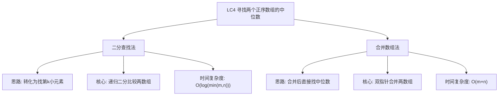

# 03-14-12-00 寻找两个正序数组的中位数解法分析
## 题目描述
给定两个大小分别为 m 和 n 的正序（从小到大）数组 nums1 和 nums2。请你找出并返回这两个正序数组的中位数。
算法的时间复杂度应该为 O(log (m+n)) 。
**示例：**
输入：nums1 = [1,3], nums2 = [2]
输出：2.00000
解释：合并数组 = [1,2,3] ，中位数是 2
输入：nums1 = [1,2], nums2 = [3,4]
输出：2.50000
解释：合并数组 = [1,2,3,4] ，中位数是 (2 + 3) / 2 = 2.5
## 解法概览
### 思维导图

## 记忆口诀
**寻找两个正序数组的中位数：** 二分查找找第k小，短数组优先比较；相等直接返回，不等缩小范围；偶数取平均，奇数取中间。
## 不同解法
### 解法一：二分查找法（最优解）
#### 思路
将问题转化为寻找两个有序数组的第 k 小元素，其中 k 为 (m+n+1)/2。通过递归二分的方式，每次比较两个数组的中间元素，排除不可能的部分，逐步缩小搜索范围。
#### 核心公式
- 第 k 小元素的位置：k = (m+n+1)/2
- 中位数计算：
  - 奇数：第 k 小元素
  - 偶数：(第 k 小元素 + 第 k+1 小元素) / 2
- 二分比较逻辑：
  - 比较两数组的中间元素
  - 排除不可能包含第 k 小元素的部分
  - 递归查找剩余部分
#### 图解过程
以 nums1 = [1,2], nums2 = [3,4] 为例：
1. 总长度 4，k = (4+1)/2 = 2，需要找第 2 小和第 3 小元素
2. 比较两数组的前 k/2 = 1 个元素：
   - nums1[0] = 1, nums2[0] = 3
   - 1 < 3，排除 nums1 的前 1 个元素
3. 新的 k = 2-1 = 1，比较剩余元素：
   - nums1[1] = 2, nums2[0] = 3
   - 2 < 3，第 2 小元素是 2
4. 找第 3 小元素：
   - 排除 nums1 的前 1 个元素
   - 新的 k = 3-1 = 2
   - 比较剩余元素，找到第 3 小元素是 3
5. 中位数 = (2 + 3) / 2 = 2.5
#### 代码示例
```java
public double findMedianSortedArrays(int[] nums1, int[] nums2) {
    int size = nums1.length + nums2.length;
    boolean even = (size & 1) == 0;
    if (nums1.length != 0 && nums2.length != 0) {
        if (even) {
            return (double) ((findKthNum(nums1, nums2, size / 2)) + (findKthNum(nums1, nums2, size / 2 + 1))) / 2d;
        } else {
            return findKthNum(nums1, nums2, size / 2 + 1);
        }
    } else if (nums1.length != 0) {
        if (even) {
            return (double) (nums1[(size - 1) / 2] + nums1[size / 2]) / 2;
        } else {
            return nums1[size / 2];
        }
    } else if (nums2.length != 0) {
        if (even) {
            return (double) (nums2[(size - 1) / 2] + nums2[size / 2]) / 2;
        } else {
            return nums2[size / 2];
        }
    } else {
        return 0;
    }
}

private int findKthNum(int[] arr1, int[] arr2, int k) {
    int[] longs = arr1.length >= arr2.length ? arr1 : arr2;
    int[] shorts = arr1.length < arr2.length ? arr1 : arr2;
    int l = longs.length;
    int s = shorts.length;
    
    if (k <= s) {
        return getUpMedian(shorts, 0, k - 1, longs, 0, k - 1);
    }
    
    if (k > l) {
        if (shorts[k - l - 1] >= longs[l - 1]) {
            return shorts[k - l - 1];
        }
        if (longs[k - s - 1] >= shorts[s - 1]) {
            return longs[k - s - 1];
        }
        return getUpMedian(shorts, k - l, s - 1, longs, k - s, l - 1);
    }
    
    if (shorts[s - 1] <= longs[k - s - 1]) {
        return longs[k - s - 1];
    }
    return getUpMedian(shorts, 0, s - 1, longs, k - s, k - 1);
}

private int getUpMedian(int[] nums1, int s1, int e1, int[] nums2, int s2, int e2) {
    int mid1 = 0;
    int mid2 = 0;
    while (s1 < e1) {
        mid1 = s1 + (e1 - s1) / 2;
        mid2 = s2 + (e2 - s2) / 2;
        
        if (nums1[mid1] == nums2[mid2]) {
            return nums1[mid1];
        }
        
        if (((e1 - s1 + 1) & 1) == 0) {
            if (nums1[mid1] > nums2[mid2]) {
                e1 = mid1;
                s2 = mid2 + 1;
            } else {
                e2 = mid2;
                s1 = mid1 + 1;
            }
        } else {
            if (nums1[mid1] > nums2[mid2]) {
                if (nums2[mid2] >= nums1[mid1 - 1]) {
                    return nums2[mid2];
                }
                e1 = mid1 - 1;
                s2 = mid2 + 1;
            } else {
                if (nums1[mid1] >= nums2[mid2 - 1]) {
                    return nums1[mid1];
                }
                e2 = mid2 - 1;
                s1 = mid1 + 1;
            }
        }
    }
    return Math.min(nums1[s1], nums2[s2]);
}
```
#### 复杂度分析
- 时间复杂度：O(log(min(m,n)))，每次递归都将搜索范围缩小一半
- 空间复杂度：O(1)，只使用了常数个变量
#### 优缺点
- 优点：时间复杂度最优，符合题目要求的 O(log (m+n))
- 缺点：代码复杂，逻辑判断较多，理解和实现难度较大
### 解法二：合并数组法（普通解法）
#### 思路
使用双指针合并两个有序数组，然后直接找到合并后数组的中位数。
#### 核心公式
- 合并两个有序数组：使用双指针分别遍历两个数组，按顺序合并
- 中位数位置：
  - 奇数：(m+n-1)/2
  - 偶数：[(m+n-1)/2 + (m+n)/2] / 2
#### 图解过程
以 nums1 = [1,2], nums2 = [3,4] 为例：
1. 初始化指针 i=0, j=0，合并数组 result
2. 比较 nums1[i] 和 nums2[j]：
   - 1 < 3，result 添加 1，i=1
   - 2 < 3，result 添加 2，i=2
   - i 越界，添加 nums2[j]=3, j=1
   - 添加 nums2[j]=4, j=2
3. 合并数组 result = [1,2,3,4]
4. 总长度 4 为偶数，中位数 = (2 + 3) / 2 = 2.5
#### 代码示例
```java
public double findMedianSortedArrays(int[] nums1, int[] nums2) {
    int m = nums1.length;
    int n = nums2.length;
    int[] merged = new int[m + n];
    int i = 0, j = 0, k = 0;
    
    while (i < m && j < n) {
        if (nums1[i] < nums2[j]) {
            merged[k++] = nums1[i++];
        } else {
            merged[k++] = nums2[j++];
        }
    }
    
    while (i < m) {
        merged[k++] = nums1[i++];
    }
    
    while (j < n) {
        merged[k++] = nums2[j++];
    }
    
    int total = m + n;
    if (total % 2 == 1) {
        return merged[total / 2];
    } else {
        return (double) (merged[total / 2 - 1] + merged[total / 2]) / 2;
    }
}
```
#### 复杂度分析
- 时间复杂度：O(m+n)，需要遍历两个数组
- 空间复杂度：O(m+n)，需要额外的空间存储合并后的数组
#### 优缺点
- 优点：代码简单，逻辑清晰，容易理解和实现
- 缺点：时间复杂度和空间复杂度较高，不满足题目要求的 O(log (m+n))
## 面试回答模板
**问题：** 请在两个正序数组中寻找中位数，要求时间复杂度为 O(log (m+n))。
**回答：**
这是一道经典的二分查找应用题。我主要使用二分查找的解法，时间复杂度为 O(log (m+n))。
具体思路是：
1. 将问题转化为寻找两个有序数组的第 k 小元素，其中 k 为 (m+n+1)/2
2. 通过递归二分的方式，每次比较两个数组的中间元素，排除不可能包含第 k 小元素的部分
3. 逐步缩小搜索范围，直到找到第 k 小元素
4. 根据总长度的奇偶性，计算中位数：
   - 奇数：直接返回第 k 小元素
   - 偶数：返回第 k 小元素和第 k+1 小元素的平均值
**示例：** 对于 nums1 = [1,2], nums2 = [3,4]，总长度为 4，k=2，找到第 2 小元素 2 和第 3 小元素 3，中位数为 (2+3)/2=2.5。
这种方法的优势在于时间复杂度最优，通过二分查找显著减少了比较次数，符合题目要求。
## 相关题目
1. **LC21：合并两个有序链表** - 双指针合并有序序列
2. **LC34：在排序数组中查找第一个和最后一个位置** - 二分查找变种
3. **LC35：搜索插入位置** - 二分查找基础
4. **LC153：寻找旋转排序数组中的最小值** - 二分查找应用
这些题目都涉及到有序数组的处理和二分查找的应用，与LC4_寻找两个正序数组的中位数有一定的关联性。