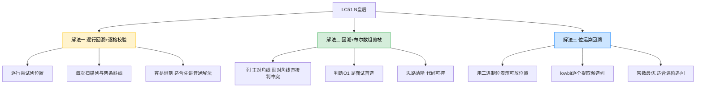
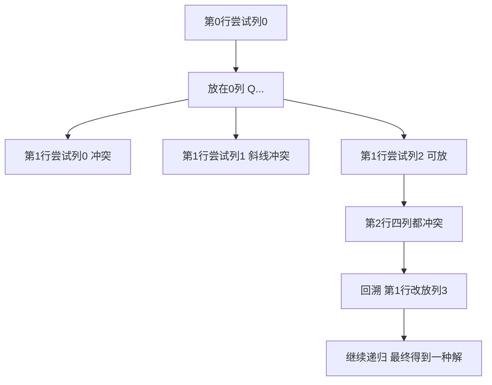
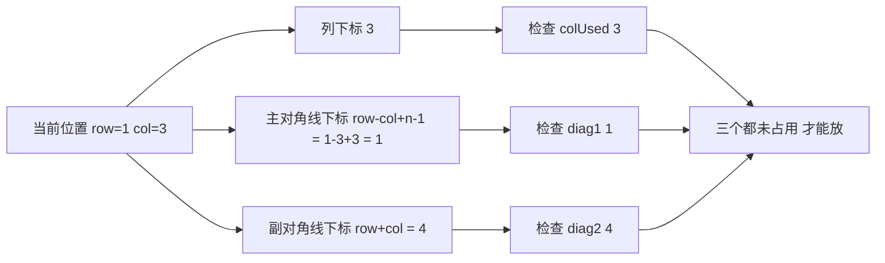
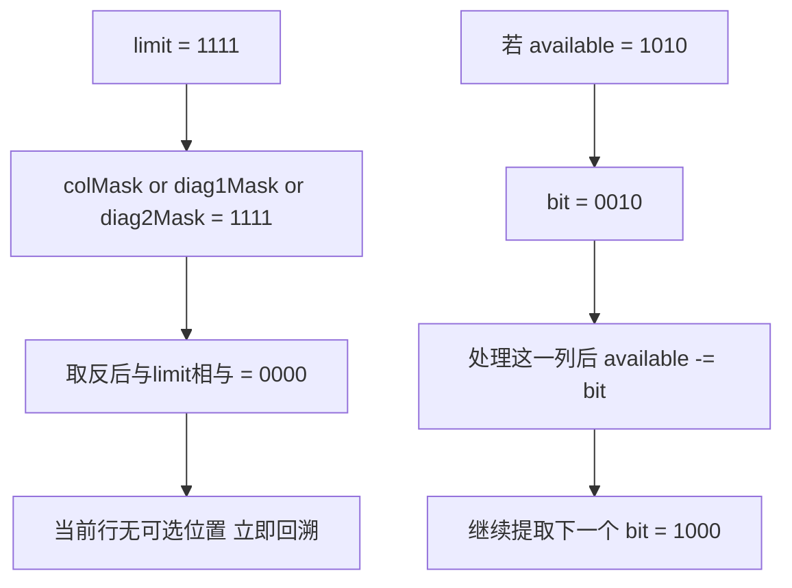

# LC51_N皇后
## 题目描述
N 皇后问题要求把 `n` 个皇后放到 `n x n` 的棋盘上，并且任意两个皇后都不能互相攻击。
皇后的攻击范围包括：同一行、同一列、同一条主对角线、同一条副对角线。
题目要求返回所有不同的摆放方案，每种方案使用字符串数组表示，`Q` 表示皇后，`.` 表示空位。
示例：输入 `n = 4`，输出 `[[".Q..","...Q","Q...","..Q."],["..Q.","Q...","...Q",".Q.."]]`。
数据范围通常不大，因此核心考点不是数学推导，而是"回溯 + 剪枝"的设计能力。
## 解法概览（思维导图）

| 解法 | 核心思想 | 时间复杂度 | 空间复杂度 | 面试定位 |
|------|----------|------------|------------|----------|
| 逐行回溯+逐格校验 | 每放一个皇后就扫描列和对角线 | `O(n! * n)` | `O(n^2)` | 普通解法 |
| 回溯+布尔数组剪枝 | 用数组记录列/主对角线/副对角线是否被占用 | `O(n!)` | `O(n)` | 面试首选 |
| 位运算回溯 | 用 bitmask 批量维护可选列并快速枚举 | `O(n!)` | `O(n)` | 最优解/进阶 |
说明：三种解法本质上都是"逐行放皇后"，差别主要在"如何判断当前位置能不能放"。
## 记忆口诀
一行只放一个后，按行递归往下走。
列冲突、主斜冲突、副斜冲突，三者任一命中就回头。
普通写法靠扫描，面试常用表来扣。
若问性能再升级，位运算把状态收。
## 解法一：逐行回溯+逐格校验（普通解法）
### 思路
从第 `0` 行开始，逐行尝试把皇后放在某一列。
如果当前位置不和前面已经摆好的皇后冲突，就先放下，再递归处理下一行。
如果某一行所有列都放不了，说明之前的决策有问题，需要回溯到上一行重新选位置。
因为我们是"按行放置"，所以每一层递归天然只会放一个皇后，行冲突不用额外判断，只需要检查列、主对角线、副对角线。
这也是项目 `Solution.java` 中已经采用的写法，适合作为最容易讲清楚的普通解法。
### 核心公式
设当前准备在 `(row, col)` 放皇后，则合法条件为：
`valid(row, col) = colOk && mainDiagOk && antiDiagOk`
其中：
`colOk: 对任意 0 <= r < row，都有 board[r][col] != 'Q'`
`mainDiagOk: 对任意 (r, c) 沿左上方向递减，都没有 'Q'`
`antiDiagOk: 对任意 (r, c) 沿右上方向递减，都没有 'Q'`
递归终止条件：`row == n`，说明前 `n` 行都已成功放置，得到一个完整解。
### 图解过程
以 `n = 4` 为例：

### 代码示例
```java
public class Solution {
  List<List<String>> res = new ArrayList<>();
  public List<List<String>> solveNQueens(int n) {
    char[][] board = new char[n][n];
    for (char[] row : board) {
      Arrays.fill(row, '.');
    }
    backTrack(board, 0, n);
    return res;
  }
  public void backTrack(char[][] board, int row, int n) {
    if (row == n) {
      res.add(char2List(board));
      return;
    }
    for (int col = 0; col < n; col++) {
      if (!isValid(board, row, col, n)) {
        continue;
      }
      board[row][col] = 'Q';
      backTrack(board, row + 1, n);
      board[row][col] = '.';
    }
  }
  public boolean isValid(char[][] board, int row, int col, int n) {
    for (int r = 0; r < n; r++) {
      if (board[r][col] == 'Q') {
        return false;
      }
    }
    for (int r = row - 1, c = col - 1; r >= 0 && c >= 0; r--, c--) {
      if (board[r][c] == 'Q') {
        return false;
      }
    }
    for (int r = row - 1, c = col + 1; r >= 0 && c < n; r--, c++) {
      if (board[r][c] == 'Q') {
        return false;
      }
    }
    return true;
  }
}
```
### 复杂度分析
时间复杂度：`O(n! * n)`。
原因：回溯树的主规模接近排列枚举，每次判断一个位置是否合法需要扫描列和斜线，单次判断约 `O(n)`。
空间复杂度：`O(n^2)`。
其中棋盘本身需要 `O(n^2)`，递归深度为 `O(n)`。
### 优缺点
优点：
1. 最直观，最容易从暴力思路自然过渡出来。
2. 非常适合第一次讲清楚 N 皇后的搜索过程。
3. 能直接对应项目现有代码，便于记忆。
缺点：
1. 每次放置前都要重复扫描，常数开销偏大。
2. `isValid` 逻辑稍长，写多了容易漏边界。
3. 真正面试时，如果只答这一版，亮点还不够。
## 解法二：回溯+布尔数组剪枝（面试首选）
### 思路
普通回溯慢在"每次都重新扫描"。
我们可以把"列是否被占用""主对角线是否被占用""副对角线是否被占用"直接记录下来，这样判断 `(row, col)` 能不能放就只要 `O(1)`。
主对角线可以用 `row - col + n - 1` 唯一表示，副对角线可以用 `row + col` 唯一表示。
递归时：
如果某列和两条对角线都没被占用，就先标记为已占用，递归下一行；
回溯回来时再撤销标记。
这版代码结构清楚、剪枝直接、性能足够好，是面试中最推荐的标准答案。
### 核心公式
令：
`colUsed[col]` 表示列 `col` 是否已有皇后。
`diag1[row - col + n - 1]` 表示主对角线是否已有皇后。
`diag2[row + col]` 表示副对角线是否已有皇后。
则 `(row, col)` 可放条件为：
`!colUsed[col] && !diag1[row - col + n - 1] && !diag2[row + col]`
放置后的状态更新为：
`colUsed[col] = true`
`diag1[row - col + n - 1] = true`
`diag2[row + col] = true`
回溯撤销时再全部改回 `false`。
### 图解过程
以 `n = 4`、在 `(1, 3)` 放皇后为例：

### 代码示例
```java
public List<List<String>> solveNQueens(int n) {
  List<List<String>> ans = new ArrayList<>();
  char[][] board = new char[n][n];
  for (char[] row : board) {
    Arrays.fill(row, '.');
  }
  boolean[] colUsed = new boolean[n];
  boolean[] diag1 = new boolean[2 * n - 1];
  boolean[] diag2 = new boolean[2 * n - 1];
  dfs(0, n, board, colUsed, diag1, diag2, ans);
  return ans;
}
private void dfs(int row, int n, char[][] board, boolean[] colUsed, boolean[] diag1, boolean[] diag2, List<List<String>> ans) {
  if (row == n) {
    List<String> path = new ArrayList<>();
    for (char[] chars : board) {
      path.add(new String(chars));
    }
    ans.add(path);
    return;
  }
  for (int col = 0; col < n; col++) {
    int d1 = row - col + n - 1;
    int d2 = row + col;
    if (colUsed[col] || diag1[d1] || diag2[d2]) {
      continue;
    }
    board[row][col] = 'Q';
    colUsed[col] = true;
    diag1[d1] = true;
    diag2[d2] = true;
    dfs(row + 1, n, board, colUsed, diag1, diag2, ans);
    board[row][col] = '.';
    colUsed[col] = false;
    diag1[d1] = false;
    diag2[d2] = false;
  }
}
```
### 复杂度分析
时间复杂度：`O(n!)`。
虽然最坏情况下搜索树规模依旧没有改变数量级，但每次判断合法性已经从扫描 `O(n)` 降为 `O(1)`，实际运行明显更快。
空间复杂度：`O(n)`。
额外使用列和对角线标记数组，以及 `O(n)` 的递归栈；如果把棋盘结果存储算上，输出空间不计入辅助空间。
### 优缺点
优点：
1. 剪枝非常自然，代码也不绕。
2. 面试表达最好讲，性能和可读性平衡最佳。
3. 下标设计有通用性，很多棋盘 DFS 题都能借鉴。
缺点：
1. 需要记住两条对角线的映射方式。
2. 相比普通回溯，多了状态数组，初学者容易写错回溯撤销。
## 解法三：位运算回溯（最优解）
### 思路
当 `n` 不大时，列和对角线是否可用都可以压缩进一个整数的二进制位里。
例如第 `k` 位为 `1`，表示第 `k` 列当前不可用或当前候选存在该列。
对某一行而言：
先把已经被列、主对角线、副对角线占据的位置合并起来；
再取反并与 `limit` 相与，就能得到当前行所有可放皇后的列集合；
之后利用 `lowbit` 技巧，每次取出最右侧的一个 `1`，递归处理即可。
这种写法把大量数组访问变成了位操作，常数最小，是同类解法里的性能最优版本。
### 核心公式
设 `limit = (1 << n) - 1`，低 `n` 位全为 `1`。
设：
`colMask` 表示已占用列。
`diag1Mask` 表示下一行会被主对角线攻击的位置。
`diag2Mask` 表示下一行会被副对角线攻击的位置。
则当前行可放位置为：
`available = limit & ~(colMask | diag1Mask | diag2Mask)`
每次取出一个候选位置：
`bit = available & -available`
转移到下一行：
`nextCol = colMask | bit`
`nextDiag1 = (diag1Mask | bit) << 1`
`nextDiag2 = (diag2Mask | bit) >> 1`
### 图解过程
以 `n = 4` 为例，假设当前：`colMask = 0101`，`diag1Mask = 1000`，`diag2Mask = 0010`：

### 代码示例
```java
public List<List<String>> solveNQueens(int n) {
  List<List<String>> ans = new ArrayList<>();
  char[][] board = new char[n][n];
  for (char[] row : board) {
    Arrays.fill(row, '.');
  }
  int limit = (1 << n) - 1;
  dfs(0, n, limit, 0, 0, 0, board, ans);
  return ans;
}
private void dfs(int row, int n, int limit, int colMask, int diag1Mask, int diag2Mask, char[][] board, List<List<String>> ans) {
  if (row == n) {
    List<String> path = new ArrayList<>();
    for (char[] chars : board) {
      path.add(new String(chars));
    }
    ans.add(path);
    return;
  }
  int available = limit & ~(colMask | diag1Mask | diag2Mask);
  while (available != 0) {
    int bit = available & -available;
    int col = Integer.numberOfTrailingZeros(bit);
    board[row][col] = 'Q';
    dfs(row + 1, n, limit, colMask | bit, ((diag1Mask | bit) << 1) & limit, (diag2Mask | bit) >> 1, board, ans);
    board[row][col] = '.';
    available -= bit;
  }
}
```
### 复杂度分析
时间复杂度：`O(n!)`。
搜索规模的数量级没有变，但单步状态更新与枚举候选列都更高效，常数最优。
空间复杂度：`O(n)`。
主要是递归深度和棋盘路径记录；若仅统计方案数量，空间还能进一步压缩。
### 优缺点
优点：
1. 性能最好，尤其适合 `LC52 N皇后 II` 这种只求数量的题。
2. 位运算可以快速批量得到当前所有可选位置。
3. 面试追问"还能更快吗"时很加分。
缺点：
1. 可读性不如布尔数组写法。
2. 对位操作不熟时，容易把左移右移和下标转换写错。
3. 若面试更重视代码稳定性，直接写这版风险略高。
## 面试回答模板
这题本质是回溯搜索。因为每一行只能放一个皇后，所以我按行递归，第 `row` 行去尝试每一列。判断 `(row, col)` 能否放置时，只要保证当前列、主对角线、副对角线没有之前的皇后即可。普通写法是每次扫描棋盘，容易想到但会重复检查；更好的写法是用 `colUsed`、`diag1`、`diag2` 三个状态表把判断降到 `O(1)`，这是面试里最推荐的版本。若继续追求性能，还可以把这三个状态压成 bitmask，用位运算求当前行的所有可选列，常数更小，属于最优解。整体搜索数量级通常写作 `O(n!)`，辅助空间主要是递归深度 `O(n)`。
## 相关题目
| 题目 | 关联点 |
|------|--------|
| LC52 N皇后 II | 同一模型，只是从"返回方案"变成"统计方案数" |
| LC37 解数独 | 棋盘型回溯，核心也是状态约束与剪枝 |
| LC46 全排列 | 逐层做选择、递归、撤销选择的经典模板 |
| LC77 组合 | 回溯树与剪枝边界控制 |
| LC22 括号生成 | 合法前缀剪枝思想，和本题的"冲突剪枝"相通 |
| LC79 单词搜索 | DFS 回溯中状态恢复的标准练习 |