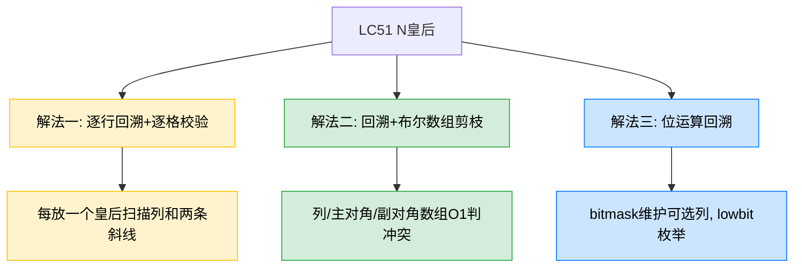
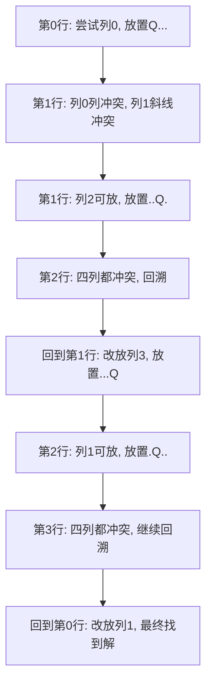
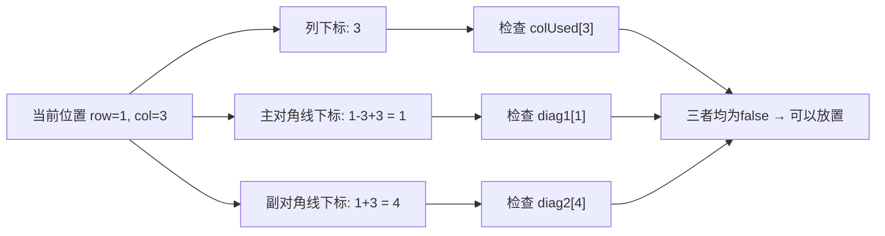
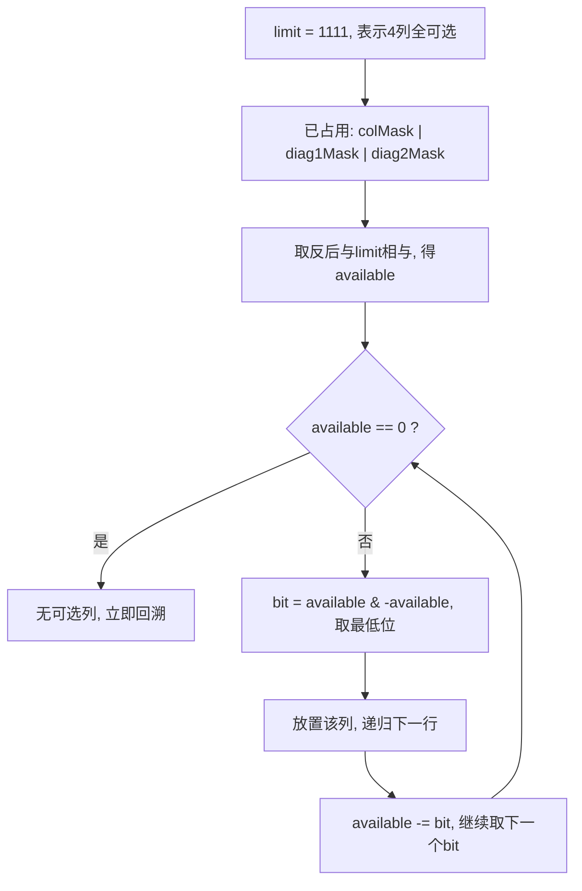

# LC51 N皇后
## 一、题目描述
按照国际象棋规则，皇后可以攻击与之处在同一行、同一列、同一斜线上的棋子。N 皇后问题研究的是如何将 `n` 个皇后放置在 `n×n` 的棋盘上，并且使皇后彼此之间不能相互攻击。
给你一个整数 `n`，返回所有不同的 N 皇后问题的解决方案。每种方案中 `'Q'` 表示皇后，`'.'` 表示空位。
示例：输入 `n = 4`，输出 `[[".Q..","...Q","Q...","..Q."],["..Q.","Q...","...Q",".Q.."]]`。
约束：`1 <= n <= 9`。核心考点是回溯 + 剪枝的设计能力。
## 二、解法概览（思维导图）

| 解法 | 时间复杂度 | 空间复杂度 | 难度 | 面试推荐 |
|------|-----------|-----------|------|---------|
| 逐行回溯+逐格校验 | O(n!·n) | O(n²) | ⭐ | 普通解法（用于对比） |
| 回溯+布尔数组剪枝 | O(n!) | O(n) | ⭐⭐ | 面试首选 |
| 位运算回溯 | O(n!) | O(n) | ⭐⭐⭐ | 最优解/进阶 |
说明：三种解法本质都是"逐行放皇后"，差别在于"如何判断当前位置能不能放"。
## 三、记忆口诀
一行只放一个后，按行递归往下走。
列冲突、主斜冲突、副斜冲突，三者任一命中就回头。
普通写法靠扫描，面试常用表来扣。
若问性能再升级，位运算把状态收。
## 四、解法一：逐行回溯+逐格校验（普通解法）
### 4.1 思路
从第 `0` 行开始，逐行尝试把皇后放在某一列。放置前检查该位置是否与已放皇后产生冲突（列冲突、主对角线冲突、副对角线冲突），若不冲突则放置并递归下一行；若某行所有列都不可放则回溯到上一行重新选择。
因为是逐行放置，行冲突天然不存在，只需检查列、主对角线（左上→右下）、副对角线（右上→左下）三个方向。
### 4.2 核心公式
合法充要条件：
1. `colOk`：对任意 `0 <= r < row`，有 `board[r][col] != 'Q'`
2. `mainDiagOk`：沿 `(row, col)` 左上方向逐步检查，无 `'Q'`
3. `antiDiagOk`：沿 `(row, col)` 右上方向逐步检查，无 `'Q'`
递归终止：`row == n` 说明前 `n` 行都已成功放置，得到一个完整解。
### 4.3 图解过程
以 `n = 4` 为例：

### 4.4 代码示例
```java
public List<List<String>> solveNQueens(int n) {
    char[][] board = new char[n][n];
    for (char[] c : board) Arrays.fill(c, '.');
    List<List<String>> res = new ArrayList<>();
    backtrack(board, 0, n, res);
    return res;
}
private void backtrack(char[][] board, int row, int n, List<List<String>> res) {
    if (row == n) {
        List<String> temp = new ArrayList<>();
        for (char[] cs : board) temp.add(new String(cs));
        res.add(temp);
        return;
    }
    for (int col = 0; col < n; col++) {
        if (!isValid(board, row, col, n)) continue;
        board[row][col] = 'Q';
        backtrack(board, row + 1, n, res);
        board[row][col] = '.';
    }
}
private boolean isValid(char[][] board, int row, int col, int n) {
    for (int i = 0; i < row; i++)
        if (board[i][col] == 'Q') return false;
    for (int i = row - 1, j = col - 1; i >= 0 && j >= 0; i--, j--)
        if (board[i][j] == 'Q') return false;
    for (int i = row - 1, j = col + 1; i >= 0 && j < n; i--, j++)
        if (board[i][j] == 'Q') return false;
    return true;
}
```
### 4.5 复杂度分析
时间复杂度 `O(n!·n)`：回溯树规模接近排列级，每次 `isValid` 扫描列和两条斜线约 `O(n)`。
空间复杂度 `O(n²)`：棋盘 `O(n²)`，递归深度 `O(n)`。
### 4.6 优缺点
优点：最直观，从暴力搜索自然过渡；适合第一次讲清 N 皇后搜索流程；对应项目现有 `Solution.java` 写法便于记忆。
缺点：每次放置前重复扫描列和斜线，常数开销偏大；`isValid` 逻辑稍长，写多了容易漏边界。
## 五、解法二：回溯+布尔数组剪枝（面试首选）
### 5.1 思路
普通回溯慢在"每次都从头扫描"。优化思路是把"列是否被占""主对角线是否被占""副对角线是否被占"分别用布尔数组记录，判断 `(row, col)` 能否放置只需 `O(1)`。
主对角线特征：同一主对角线上 `row - col` 值相同，映射为 `row - col + n - 1` 保证下标非负。
副对角线特征：同一副对角线上 `row + col` 值相同，直接用作下标。
递归时标记三个数组为 `true`，回溯时恢复为 `false`。
### 5.2 核心公式
状态定义：
1. `colUsed[col]`：列 `col` 是否已有皇后
2. `diag1[row - col + n - 1]`：主对角线是否已有皇后
3. `diag2[row + col]`：副对角线是否已有皇后
可放条件：`!colUsed[col] && !diag1[row - col + n - 1] && !diag2[row + col]`
放置后：三个标志位置 `true`；回溯时置 `false`。
### 5.3 图解过程
以 `n = 4`，在 `(1, 3)` 放皇后为例，展示 O(1) 判断过程：

### 5.4 代码示例
```java
public List<List<String>> solveNQueens(int n) {
    List<List<String>> ans = new ArrayList<>();
    char[][] board = new char[n][n];
    for (char[] row : board) Arrays.fill(row, '.');
    boolean[] colUsed = new boolean[n];
    boolean[] diag1 = new boolean[2 * n - 1];
    boolean[] diag2 = new boolean[2 * n - 1];
    dfs(0, n, board, colUsed, diag1, diag2, ans);
    return ans;
}
private void dfs(int row, int n, char[][] board, boolean[] colUsed, boolean[] diag1, boolean[] diag2, List<List<String>> ans) {
    if (row == n) {
        List<String> path = new ArrayList<>();
        for (char[] chars : board) path.add(new String(chars));
        ans.add(path);
        return;
    }
    for (int col = 0; col < n; col++) {
        int d1 = row - col + n - 1, d2 = row + col;
        if (colUsed[col] || diag1[d1] || diag2[d2]) continue;
        board[row][col] = 'Q';
        colUsed[col] = true; diag1[d1] = true; diag2[d2] = true;
        dfs(row + 1, n, board, colUsed, diag1, diag2, ans);
        board[row][col] = '.';
        colUsed[col] = false; diag1[d1] = false; diag2[d2] = false;
    }
}
```
### 5.5 复杂度分析
时间复杂度 `O(n!)`：搜索树规模不变，但每次判断合法性由 `O(n)` 降为 `O(1)`，实际运行明显更快。
空间复杂度 `O(n)`：三个标记数组总大小 `O(n)`，递归深度 `O(n)`。
### 5.6 优缺点
优点：剪枝自然、代码不绕；面试表达最清晰，性能与可读性平衡最佳；对角线映射设计可复用到其他棋盘 DFS 题。
缺点：需记住两条对角线的映射公式；多了状态数组，回溯撤销时容易漏写。
## 六、解法三：位运算回溯（最优解）
### 6.1 思路
当 `n <= 32` 时，列和两条对角线是否可用都可以压进一个整型的二进制位里。
对某一行：先把已被列、主对角线、副对角线占据的位置合并，取反再与 `limit` 相与，得到当前行所有可放位置的集合；用 `lowbit` 技巧每次取出最右侧的 `1` 进行递归。
大量数组访问变为位操作，常数最小，是同类解法里的性能最优版本。
### 6.2 核心公式
设 `limit = (1 << n) - 1`，低 `n` 位全为 `1`。
1. 当前行可放位置：`available = limit & ~(colMask | diag1Mask | diag2Mask)`
2. 取最低位候选：`bit = available & -available`
3. 列号转换：`col = Integer.numberOfTrailingZeros(bit)`
4. 下一行状态转移：`nextCol = colMask | bit`，`nextDiag1 = (diag1Mask | bit) << 1`，`nextDiag2 = (diag2Mask | bit) >> 1`
### 6.3 图解过程

### 6.4 代码示例
```java
public List<List<String>> solveNQueens(int n) {
    List<List<String>> ans = new ArrayList<>();
    char[][] board = new char[n][n];
    for (char[] row : board) Arrays.fill(row, '.');
    int limit = (1 << n) - 1;
    dfs(0, n, limit, 0, 0, 0, board, ans);
    return ans;
}
private void dfs(int row, int n, int limit, int colMask, int diag1Mask, int diag2Mask, char[][] board, List<List<String>> ans) {
    if (row == n) {
        List<String> path = new ArrayList<>();
        for (char[] chars : board) path.add(new String(chars));
        ans.add(path);
        return;
    }
    int available = limit & ~(colMask | diag1Mask | diag2Mask);
    while (available != 0) {
        int bit = available & -available;
        int col = Integer.numberOfTrailingZeros(bit);
        board[row][col] = 'Q';
        dfs(row + 1, n, limit,
            colMask | bit,
            ((diag1Mask | bit) << 1) & limit,
            (diag2Mask | bit) >> 1,
            board, ans);
        board[row][col] = '.';
        available -= bit;
    }
}
```
### 6.5 复杂度分析
时间复杂度 `O(n!)`：搜索规模数量级不变，但单步状态更新与候选列枚举都更高效，常数最优。
空间复杂度 `O(n)`：主要是递归深度和棋盘路径记录；若仅统计数量（LC52），空间可进一步压缩。
### 6.6 优缺点
优点：性能最好，尤其适合 LC52 N皇后 II 只求数量的变种；位运算可批量获取所有可选位置；面试追问"还能更快吗"时很加分。
缺点：可读性不如布尔数组写法；对位操作不熟时容易把左移右移和下标转换搞混；面试求稳时直接写此版风险略高。
## 七、面试回答模板
面试官：如何解决 N 皇后问题？
回答：这题本质是回溯搜索。因为每行只能放一个皇后，所以我按行递归，第 `row` 行去尝试每一列。判断 `(row, col)` 能否放置时，需要保证当前列、主对角线（`row-col` 相同）、副对角线（`row+col` 相同）都没有已放的皇后。普通写法是每次扫描棋盘检查冲突，时间 `O(n!·n)`；更优的写法是用 `colUsed`、`diag1`、`diag2` 三个布尔数组把冲突判断降到 `O(1)`，整体时间 `O(n!)`，这是面试最推荐的版本。若继续追求极致性能，还可以把三个状态压成 bitmask，用 `lowbit` 枚举当前行所有可选列，常数更小，属于最优解。辅助空间主要是递归深度 `O(n)`。
## 八、相关题目
| 题目 | 关联点 |
|------|--------|
| LC52 N皇后 II | 同一模型，只统计方案数量，位运算解法更显优势 |
| LC37 解数独 | 棋盘型回溯，核心也是状态约束与剪枝 |
| LC46 全排列 | 逐层做选择、递归、撤销的经典回溯模板 |
| LC77 组合 | 回溯树与剪枝边界控制 |
| LC22 括号生成 | 合法前缀剪枝思想，与本题冲突剪枝相通 |
| LC79 单词搜索 | DFS 回溯中状态恢复的标准练习 |