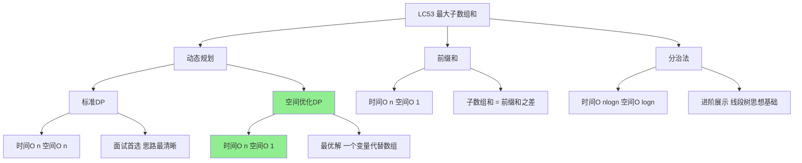
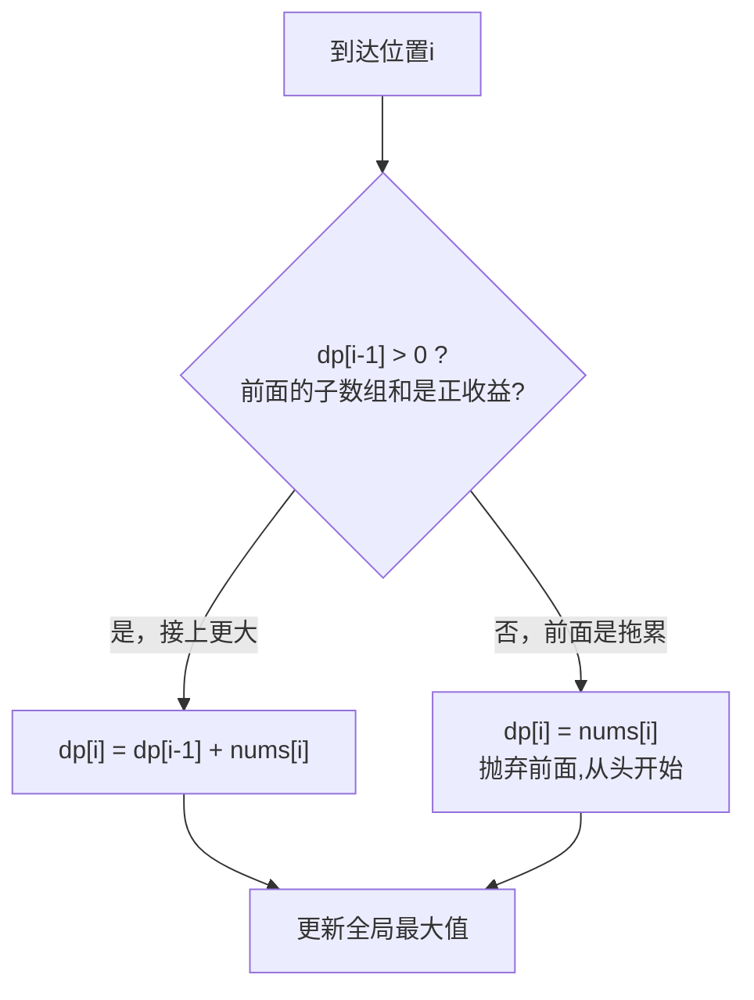
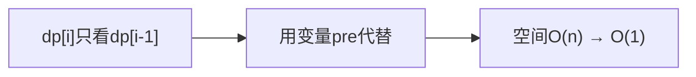
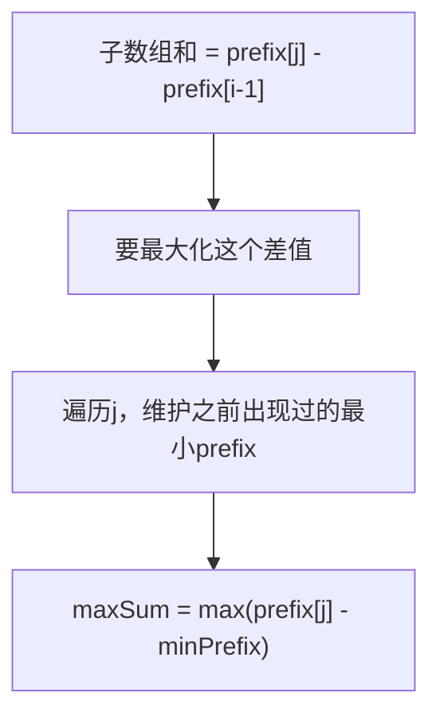
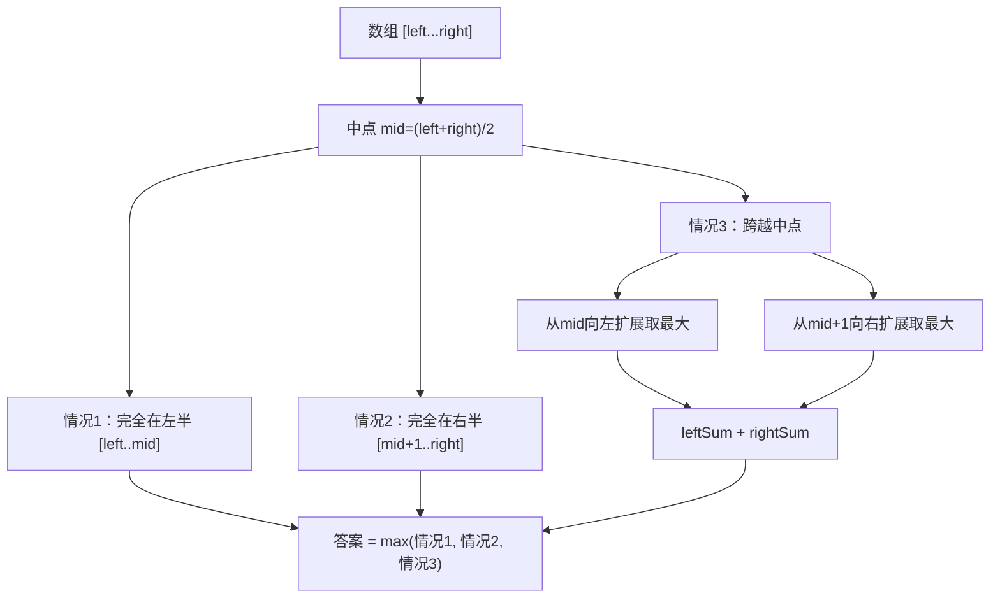
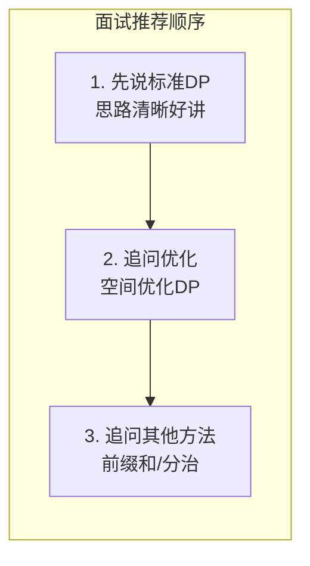

# LC53 最大子数组和 - 面试题解V2
## 一、题目描述
给你一个整数数组 `nums`，请你找出一个具有**最大和**的连续子数组（子数组最少包含一个元素），返回其最大和。
```
输入：nums = [-2, 1, -3, 4, -1, 2, 1, -5, 4]
输出：6
解释：连续子数组 [4, -1, 2, 1] 的和最大，为 6
```
**进阶**：尝试使用分治法求解。
## 二、解法概览

| 解法 | 时间 | 空间 | 面试推荐 | 适合场景 |
|------|------|------|----------|----------|
| 标准DP | O(n) | O(n) | ✅ 首选 | 思路清晰好讲解 |
| **空间优化DP** | **O(n)** | **O(1)** | ✅ **最优解** | 追问优化时展示 |
| 前缀和 | O(n) | O(1) | ⚠️ 变体 | 换个视角理解 |
| 分治法 | O(nlogn) | O(logn) | ⚠️ 进阶 | 问"还有别的方法吗" |
## 三、记忆口诀
```
最大子数组和题，
动态规划最经典。
前面若是拖后腿，
不如从头再开始。
dp[i]两个选择：
接上前面或重来。
max(dp[i-1]+num, num)，
全局最大记下来。
```
## 四、解法一：标准动态规划（面试首选）
### 4.1 思路
定义 `dp[i]`：以 `nums[i]` 为**结尾**的连续子数组的最大和。
到达位置 `i` 时只有两种选择：

### 4.2 核心公式
```
dp[i] = max(dp[i-1] + nums[i], nums[i])
答案 = max(dp[0], dp[1], ..., dp[n-1])
```
### 4.3 图解过程
```
数组:  [-2,  1, -3,  4, -1,  2,  1, -5,  4]
索引:    0   1   2   3   4   5   6   7   8
i=0: dp[0] = -2（基础情况）                           max = -2
i=1: dp[1] = max(dp[0]+1, 1) = max(-1, 1) = 1        max = 1
         → -2是拖累，从1重新开始
i=2: dp[2] = max(dp[1]+(-3), -3) = max(-2, -3) = -2  max = 1
         → 1有正收益，接上，但和变负了
i=3: dp[3] = max(dp[2]+4, 4) = max(2, 4) = 4         max = 4
         → -2是拖累，从4重新开始
i=4: dp[4] = max(dp[3]+(-1), -1) = max(3, -1) = 3    max = 4
         → 4有正收益，接上
i=5: dp[5] = max(dp[4]+2, 2) = max(5, 2) = 5         max = 5
         → 3有正收益，接上
i=6: dp[6] = max(dp[5]+1, 1) = max(6, 1) = 6         max = 6 ✅
         → 5有正收益，接上
i=7: dp[7] = max(dp[6]+(-5), -5) = max(1, -5) = 1    max = 6
         → 6有正收益，接上，但和缩水了
i=8: dp[8] = max(dp[7]+4, 4) = max(5, 4) = 5         max = 6
         → 1有正收益，接上
汇总：
  nums: [-2,  1, -3,  4, -1,  2,  1, -5,  4]
  dp:   [-2,  1, -2,  4,  3,  5,  6,  1,  5]
  max:  [-2,  1,  1,  4,  4,  5,  6,  6,  6]
  最大子数组: nums[3..6] = [4, -1, 2, 1]，和为6
```
### 4.4 代码实现
```java
public int maxSubArray(int[] nums) {
    int n = nums.length;
    int[] dp = new int[n];
    dp[0] = nums[0];
    int max = dp[0];
    for (int i = 1; i < n; i++) {
        dp[i] = Math.max(dp[i - 1] + nums[i], nums[i]);
        max = Math.max(max, dp[i]);
    }
    return max;
}
```
### 4.5 复杂度分析
| 复杂度 | 分析 |
|--------|------|
| 时间 | O(n)，一次遍历 |
| 空间 | O(n)，dp数组 |
### 4.6 优缺点
| 优点 | 缺点 |
|------|------|
| 思路最清晰，面试容易讲明白 | 空间O(n)可以继续优化 |
| 标准DP模板，举一反三 | - |
| 你现有代码就是这个解法 | - |
## 五、解法二：空间优化DP（最优解）
### 5.1 思路
`dp[i]` 只依赖 `dp[i-1]`，用一个变量 `pre` 代替整个dp数组。

核心逻辑：`pre < 0` 时丢弃前面，重新从当前元素开始。
### 5.2 核心公式
```
pre = max(pre + nums[i], nums[i])
    = max(pre, 0) + nums[i]     // 等价写法：负数就归零
maxSum = max(maxSum, pre)
```
### 5.3 图解过程
```
nums: [-2,  1, -3,  4, -1,  2,  1, -5,  4]
  pre: -2 → 归0 →  1 → -2 → 归0 →  4 →  3 →  5 →  6 →  1 →  5
  max: -2        1    1        4    4    5    6    6    6
过程分解：
  i=0: pre=0+(-2)=-2,  max=-2
  i=1: pre<0归0, pre=0+1=1,  max=1
  i=2: pre=1+(-3)=-2,  max=1
  i=3: pre<0归0, pre=0+4=4,  max=4   ← 从4重新开始
  i=4: pre=4+(-1)=3,   max=4
  i=5: pre=3+2=5,      max=5
  i=6: pre=5+1=6,      max=6 ✅
  i=7: pre=6+(-5)=1,   max=6
  i=8: pre=1+4=5,      max=6
```
### 5.4 代码实现
```java
// 写法一：if判断
public int maxSubArray(int[] nums) {
    int max = Integer.MIN_VALUE;
    int pre = 0;
    for (int num : nums) {
        if (pre < 0) pre = 0;  // 前面是负收益就丢弃
        pre += num;
        max = Math.max(max, pre);
    }
    return max;
}
// 写法二：Math.max（更简洁）
public int maxSubArray(int[] nums) {
    int max = nums[0];
    int pre = 0;
    for (int num : nums) {
        pre = Math.max(pre, 0) + num;
        max = Math.max(max, pre);
    }
    return max;
}
```
### 5.5 复杂度分析
| 复杂度 | 分析 |
|--------|------|
| 时间 | O(n)，一次遍历 |
| 空间 | **O(1)**，只用2个变量 |
### 5.6 优缺点
| 优点 | 缺点 |
|------|------|
| 时间O(n)空间O(1)，最优 | 不如标准DP直观 |
| 代码极简 | 需要理解"丢弃负前缀" |
## 六、解法三：前缀和（另一个视角）
### 6.1 思路
连续子数组 `nums[i..j]` 的和 = `prefix[j] - prefix[i-1]`
要让子数组和最大 → `prefix[j]` 尽量大，`prefix[i-1]` 尽量小
→ 遍历时维护当前前缀和与历史最小前缀和的差即可

### 6.2 核心公式
```
prefix[j] = nums[0] + nums[1] + ... + nums[j]
maxSum = max(prefix[j] - minPrefix)，对所有j
minPrefix = min(minPrefix, prefix[j])
注意：先更新maxSum，再更新minPrefix
```
### 6.3 图解过程
```
nums:      [-2,  1, -3,  4, -1,  2,  1, -5,  4]
prefix:    [-2, -1, -4,  0, -1,  1,  2, -3,  1]
minPrefix: [ 0, -2, -2, -4, -4, -4, -4, -4, -4]
差值:      [-2,  1, -2,  4,  3,  5,  6,  1,  5]
                                       ↑ max=6
详细过程：
  i=0: prefix=-2, maxSum=-2-0=-2,    minPrefix=min(0,-2)=-2
  i=1: prefix=-1, maxSum=-1-(-2)=1,  minPrefix=min(-2,-1)=-2
  i=2: prefix=-4, maxSum=-4-(-2)=-2, minPrefix=min(-2,-4)=-4
  i=3: prefix=0,  maxSum=0-(-4)=4,   minPrefix=min(-4,0)=-4
  i=4: prefix=-1, maxSum=-1-(-4)=3,  minPrefix=-4
  i=5: prefix=1,  maxSum=1-(-4)=5,   minPrefix=-4
  i=6: prefix=2,  maxSum=2-(-4)=6,   minPrefix=-4  ✅
  i=7: prefix=-3, maxSum=-3-(-4)=1,  minPrefix=-4
  i=8: prefix=1,  maxSum=1-(-4)=5,   minPrefix=-4
```
### 6.4 代码实现
```java
public int maxSubArray(int[] nums) {
    int maxSum = Integer.MIN_VALUE;
    int prefix = 0;
    int minPrefix = 0;  // 历史最小前缀和（初始为0，表示不选任何元素）
    for (int num : nums) {
        prefix += num;
        maxSum = Math.max(maxSum, prefix - minPrefix);  // 先更新答案
        minPrefix = Math.min(minPrefix, prefix);         // 再更新最小前缀
    }
    return maxSum;
}
```
### 6.5 复杂度分析
| 复杂度 | 分析 |
|--------|------|
| 时间 | O(n)，一次遍历 |
| 空间 | O(1) |
### 6.6 优缺点
| 优点 | 缺点 |
|------|------|
| 前缀和思想通用性强 | 理解门槛比DP高 |
| 可扩展到LC121买卖股票 | 面试不如DP好讲 |
| 与DP本质等价 | - |
## 七、解法四：分治法（进阶展示）
### 7.1 思路
将数组从中点一分为二，最大子数组只可能出现在三个位置：

### 7.2 核心公式
```
maxSub(left, right) = max(
    maxSub(left, mid),        // 左半最大
    maxSub(mid+1, right),     // 右半最大
    crossMax(left, mid, right) // 跨越中点最大
)
```
### 7.3 图解过程
```
nums = [-2, 1, -3, 4, -1, 2, 1, -5, 4]
        0   1   2  3   4  5  6   7  8
                       ↑ mid=4, nums[4]=-1
左半 [0..4] = [-2, 1, -3, 4, -1]
右半 [5..8] = [2, 1, -5, 4]
跨越中点：
  左扩（从nums[4]=-1开始向左累加，记录最大值）：
    i=4: sum = -1,            最大 = -1
    i=3: sum = -1+4 = 3,      最大 = 3
    i=2: sum = 3+(-3) = 0,    最大 = 3
    i=1: sum = 0+1 = 1,       最大 = 3
    i=0: sum = 1+(-2) = -1,   最大 = 3  → leftSum = 3
  右扩（从nums[5]=2开始向右累加，记录最大值）：
    i=5: sum = 2,              最大 = 2
    i=6: sum = 2+1 = 3,        最大 = 3
    i=7: sum = 3+(-5) = -2,    最大 = 3
    i=8: sum = -2+4 = 2,       最大 = 3  → rightSum = 3
  跨越最大 = leftSum + rightSum = 3 + 3 = 6
答案 = max(左半最大, 右半最大, 跨越最大) = max(4, 4, 6) = 6
```
### 7.4 代码实现
```java
public int maxSubArray(int[] nums) {
    return divide(nums, 0, nums.length - 1);
}
private int divide(int[] nums, int left, int right) {
    // 递归终止
    if (left == right) return nums[left];
    int mid = left + (right - left) / 2;
    int leftMax = divide(nums, left, mid);       // 左半最大
    int rightMax = divide(nums, mid + 1, right); // 右半最大
    int crossMax = crossMax(nums, left, mid, right); // 跨越最大
    return Math.max(Math.max(leftMax, rightMax), crossMax);
}
private int crossMax(int[] nums, int left, int mid, int right) {
    // 从mid向左扩展
    int leftSum = Integer.MIN_VALUE;
    int sum = 0;
    for (int i = mid; i >= left; i--) {
        sum += nums[i];
        leftSum = Math.max(leftSum, sum);
    }
    // 从mid+1向右扩展
    int rightSum = Integer.MIN_VALUE;
    sum = 0;
    for (int i = mid + 1; i <= right; i++) {
        sum += nums[i];
        rightSum = Math.max(rightSum, sum);
    }
    return leftSum + rightSum;
}
```
### 7.5 复杂度分析
| 复杂度 | 分析 |
|--------|------|
| 时间 | O(n logn)，递推式 T(n)=2T(n/2)+O(n) |
| 空间 | O(logn)，递归栈深度 |
### 7.6 优缺点
| 优点 | 缺点 |
|------|------|
| 分治思想经典，展示算法功底 | 时间O(nlogn)不如DP |
| 可扩展到线段树 | 代码量大 |
| 面试追问时的加分项 | 不易讲清楚 |
## 八、四种解法完整对比

| 维度 | 标准DP | 空间优化DP | 前缀和 | 分治 |
|------|--------|------------|--------|------|
| 时间 | O(n) | O(n) | O(n) | O(nlogn) |
| 空间 | O(n) | **O(1)** | **O(1)** | O(logn) |
| 代码量 | 中 | **少** | 少 | 多 |
| 理解难度 | ★★☆☆ | ★★☆☆ | ★★★☆ | ★★★★ |
| 面试推荐 | 先讲 | **追问优化** | 变体展示 | 进阶展示 |
## 九、面试回答模板
### 9.1 第一反应：标准DP
> "这道题用动态规划。定义dp[i]为以nums[i]结尾的最大子数组和。状态转移：`dp[i] = max(dp[i-1] + nums[i], nums[i])`，含义是如果前面的子数组和是正收益就接上，否则从当前元素重新开始。遍历过程中维护全局最大值就是答案。时间O(n)，空间O(n)。"
### 9.2 追问：能否优化空间？
> "可以。dp[i]只依赖dp[i-1]，我用一个变量pre代替dp数组。如果pre小于0说明前面是负收益直接丢弃归零，再加上当前元素。空间从O(n)优化到O(1)。"
### 9.3 追问：还有别的方法吗？
> "还可以用前缀和的思路：子数组和等于前缀和之差，维护历史最小前缀和就能O(n)求解。另外也可以用分治法：将数组一分为二，最大子数组在左半、右半或跨越中点三种情况取最大，时间O(nlogn)。"
## 十、相关题目
| 题号 | 题目 | 关联思路 | 难度 |
|------|------|----------|------|
| LC152 | 乘积最大子数组 | DP同时维护最大最小值 | 中等 |
| LC918 | 环形子数组的最大和 | 最大子数组和 + 取反求最小 | 中等 |
| LC560 | 和为K的子数组 | 前缀和+HashMap | 中等 |
| LC121 | 买卖股票的最佳时机 | 等价于最大子数组和（差分） | 简单 |
| LC198 | 打家劫舍 | DP空间优化思路相同 | 中等 |
| LC238 | 除自身以外数组的乘积 | 前缀积思想 | 中等 |
