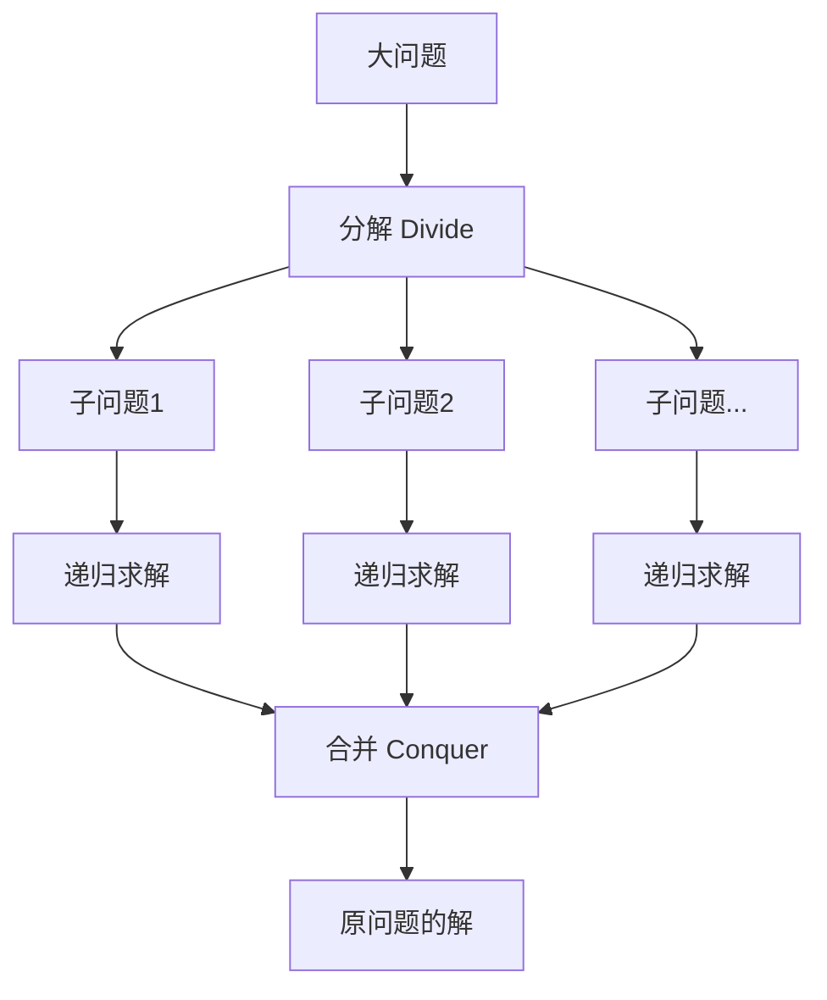
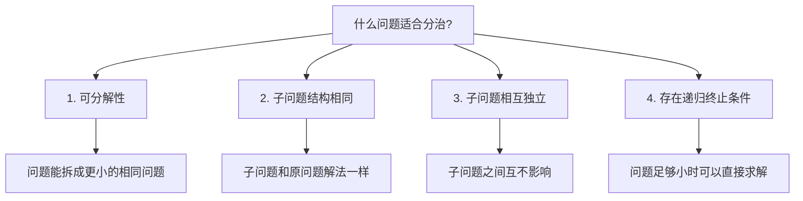
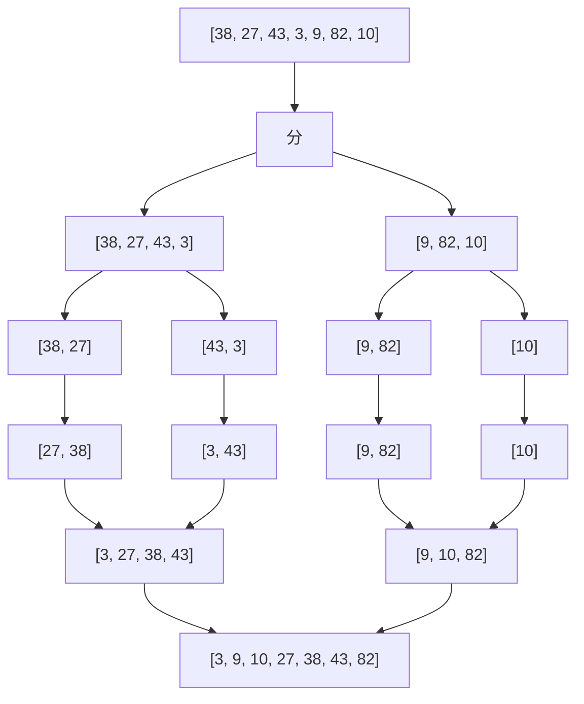
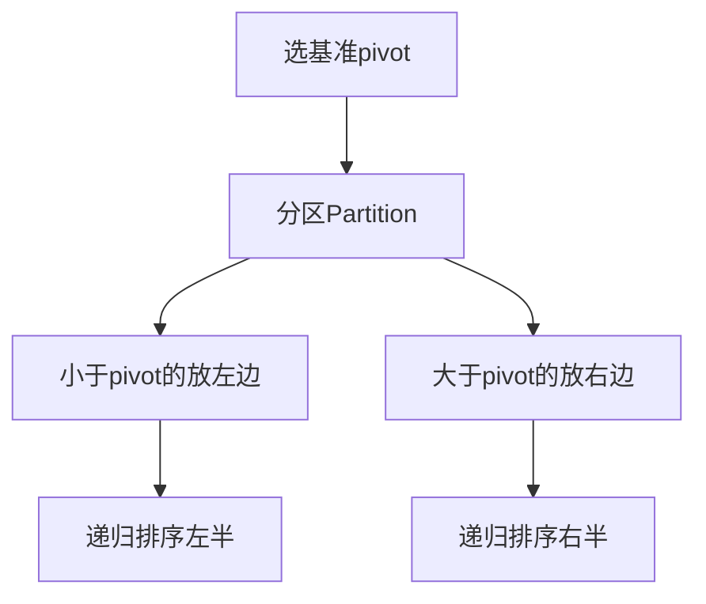
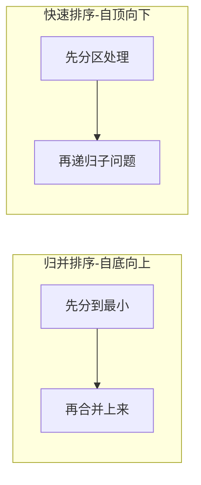
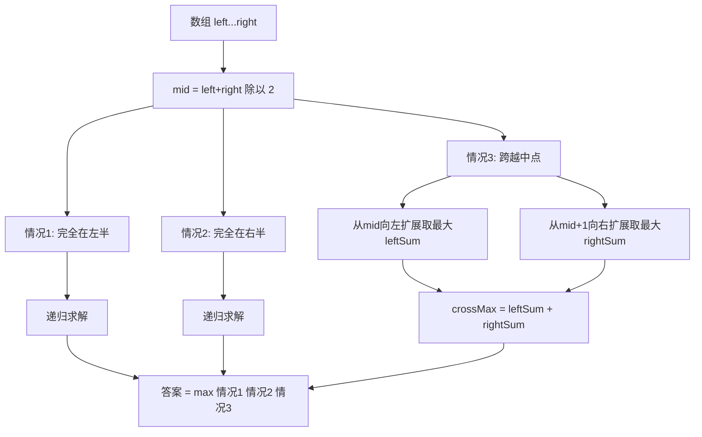
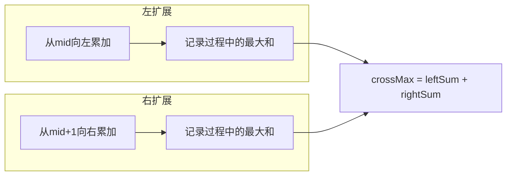

# 分治法知识点与LC53实战
## 一、分治法概述
### 1.1 什么是分治法
**分治法（Divide and Conquer）**：将一个大问题**分解**成若干个规模更小的**相同子问题**，递归求解子问题，再将子问题的解**合并**成原问题的解。

### 1.2 三个步骤
| 步骤 | 英文 | 含义 | 类比 |
|------|------|------|------|
| **分** | Divide | 把问题拆成更小的子问题 | 把一摞试卷分成两半 |
| **治** | Conquer | 递归解决每个子问题 | 分别批改每一半 |
| **合** | Combine | 把子问题的解合并 | 把批改好的合在一起 |
### 1.3 适用条件

## 二、分治法代码模板
```java
public Result divideAndConquer(Problem problem) {
    // 1. 递归终止条件（问题足够小，直接求解）
    if (problem.size <= threshold) {
        return directSolve(problem);
    }
    // 2. 分解（Divide）
    SubProblem[] subProblems = divide(problem);
    // 3. 递归求解（Conquer）
    Result[] subResults = new Result[subProblems.length];
    for (int i = 0; i < subProblems.length; i++) {
        subResults[i] = divideAndConquer(subProblems[i]);
    }
    // 4. 合并（Combine）
    return combine(subResults);
}
```
## 三、经典案例：归并排序
### 3.1 思路

### 3.2 代码
```java
public void mergeSort(int[] arr, int left, int right) {
    if (left >= right) return;  // 终止条件
    int mid = left + (right - left) / 2;
    mergeSort(arr, left, mid);       // 分：左半
    mergeSort(arr, mid + 1, right);  // 分：右半
    merge(arr, left, mid, right);    // 合：合并两个有序数组
}
private void merge(int[] arr, int left, int mid, int right) {
    int[] temp = new int[right - left + 1];
    int i = left, j = mid + 1, k = 0;
    while (i <= mid && j <= right) {
        temp[k++] = arr[i] <= arr[j] ? arr[i++] : arr[j++];
    }
    while (i <= mid) temp[k++] = arr[i++];
    while (j <= right) temp[k++] = arr[j++];
    System.arraycopy(temp, 0, arr, left, temp.length);
}
```
### 3.3 复杂度
```
T(n) = 2T(n/2) + O(n)
     → 时间 O(n logn)，空间 O(n)
```
## 四、经典案例：快速排序
### 4.1 思路

### 4.2 代码
```java
public void quickSort(int[] arr, int left, int right) {
    if (left >= right) return;
    int pivotIndex = partition(arr, left, right);
    quickSort(arr, left, pivotIndex - 1);   // 左半
    quickSort(arr, pivotIndex + 1, right);  // 右半
}
private int partition(int[] arr, int left, int right) {
    int pivot = arr[right];  // 选最右元素为基准
    int i = left;
    for (int j = left; j < right; j++) {
        if (arr[j] < pivot) {
            swap(arr, i++, j);
        }
    }
    swap(arr, i, right);
    return i;
}
```
### 4.3 复杂度
```
最好/平均: T(n) = 2T(n/2) + O(n) → O(n logn)
最坏:     T(n) = T(n-1) + O(n)   → O(n²)
```
## 五、归并排序 vs 快速排序
| 维度 | 归并排序 | 快速排序 |
|------|----------|----------|
| 分的过程 | 简单（取中点） | 复杂（partition） |
| 合的过程 | 复杂（merge） | 简单（不需要） |
| 执行顺序 | **先递归再合并**（后序） | **先分区再递归**（前序） |
| 稳定性 | 稳定 | 不稳定 |
| 空间 | O(n) | O(logn) |
| 最坏时间 | O(nlogn) | O(n²) |

## 六、LC53 最大子数组和 - 分治法实战
### 6.1 题目
```
输入：nums = [-2, 1, -3, 4, -1, 2, 1, -5, 4]
输出：6
解释：连续子数组 [4, -1, 2, 1] 的和最大
```
### 6.2 分治思路
最大子数组只可能出现在三个位置：

### 6.3 关键：跨越中点怎么算

**为什么必须从中点出发？** 因为跨越中点的子数组一定同时包含 `nums[mid]` 和 `nums[mid+1]`，从中间向两边扩展就能保证这一点。
### 6.4 图解过程
```
nums = [-2, 1, -3, 4, -1, 2, 1, -5, 4]
        0   1   2  3   4  5  6   7  8
                       ↑ mid=4
左半 [0..4] = [-2, 1, -3, 4, -1]
右半 [5..8] = [2, 1, -5, 4]
--- 计算跨越中点 ---
左扩（从 nums[4]=-1 开始向左累加）：
  i=4: sum = -1,            最大 = -1
  i=3: sum = -1 + 4 = 3,    最大 = 3
  i=2: sum = 3 + (-3) = 0,  最大 = 3
  i=1: sum = 0 + 1 = 1,     最大 = 3
  i=0: sum = 1 + (-2) = -1, 最大 = 3  → leftSum = 3
右扩（从 nums[5]=2 开始向右累加）：
  i=5: sum = 2,              最大 = 2
  i=6: sum = 2 + 1 = 3,      最大 = 3
  i=7: sum = 3 + (-5) = -2,  最大 = 3
  i=8: sum = -2 + 4 = 2,     最大 = 3  → rightSum = 3
crossMax = 3 + 3 = 6
--- 三种情况取最大 ---
情况1（左半最大）：递归得到 4
情况2（右半最大）：递归得到 4
情况3（跨越中点）：6
答案 = max(4, 4, 6) = 6 ✅
```
### 6.5 代码实现
```java
public int maxSubArray(int[] nums) {
    return divide(nums, 0, nums.length - 1);
}
private int divide(int[] nums, int left, int right) {
    // 终止条件：只剩一个元素
    if (left == right) return nums[left];
    // 1. 分
    int mid = left + (right - left) / 2;
    // 2. 治（递归求解）
    int leftMax = divide(nums, left, mid);
    int rightMax = divide(nums, mid + 1, right);
    // 3. 合（计算跨越中点的最大值）
    int crossMax = crossMax(nums, left, mid, right);
    return Math.max(Math.max(leftMax, rightMax), crossMax);
}
private int crossMax(int[] nums, int left, int mid, int right) {
    // 从mid向左扩展
    int leftSum = Integer.MIN_VALUE;
    int sum = 0;
    for (int i = mid; i >= left; i--) {
        sum += nums[i];
        leftSum = Math.max(leftSum, sum);
    }
    // 从mid+1向右扩展
    int rightSum = Integer.MIN_VALUE;
    sum = 0;
    for (int i = mid + 1; i <= right; i++) {
        sum += nums[i];
        rightSum = Math.max(rightSum, sum);
    }
    return leftSum + rightSum;
}
```
### 6.6 复杂度分析
```
递推式：T(n) = 2T(n/2) + O(n)
  每层分2个子问题，每层合并O(n)
  共logn层
  总时间 = O(n logn)
递归深度 = O(logn)
```
| 复杂度 | 分析 |
|--------|------|
| 时间 | O(n logn) |
| 空间 | O(logn)，递归栈 |
## 七、Master定理（分治复杂度分析工具）
分治法的时间复杂度通用递推式：`T(n) = aT(n/b) + O(n^d)`
- `a`：子问题个数
- `b`：子问题缩小倍数
- `d`：合并步骤的复杂度指数
| 条件 | 时间复杂度 | 例子 |
|------|------------|------|
| d < log_b(a) | O(n^log_b(a)) | - |
| **d = log_b(a)** | **O(n^d × logn)** | **归并排序 a=2,b=2,d=1** |
| d > log_b(a) | O(n^d) | - |
**常见分治算法的Master定理分析**：
| 算法 | 递推式 | a | b | d | 结果 |
|------|--------|---|---|---|------|
| 归并排序 | T=2T(n/2)+O(n) | 2 | 2 | 1 | O(nlogn) |
| 快速排序(均) | T=2T(n/2)+O(n) | 2 | 2 | 1 | O(nlogn) |
| 二分查找 | T=T(n/2)+O(1) | 1 | 2 | 0 | O(logn) |
| LC53分治 | T=2T(n/2)+O(n) | 2 | 2 | 1 | O(nlogn) |
## 八、分治法经典题目
| 题号 | 题目 | 分治思路 | 难度 |
|------|------|----------|------|
| LC53 | 最大子数组和 | 左半/右半/跨中点取最大 | 中等 |
| LC148 | 排序链表 | 归并排序 | 中等 |
| LC23 | 合并K个升序链表 | 两两分治合并 | 困难 |
| LC4 | 寻找两个正序数组中位数 | 二分排除 | 困难 |
| LC215 | 数组中第K大元素 | 快速选择 | 中等 |
| LC169 | 多数元素 | 分治投票 | 简单 |
| LC240 | 搜索二维矩阵II | 分治排除区域 | 中等 |
| LC105 | 从前序与中序构造二叉树 | 递归分治构建 | 中等 |
## 九、面试话术
### 9.1 介绍分治法
> "分治法的核心是三步：分、治、合。把大问题拆成若干个结构相同的子问题，递归求解，再把子问题的解合并成原问题的解。经典应用有归并排序、快速排序、二分查找等。"
### 9.2 分治 vs 动态规划
> "分治和DP都是把大问题拆小，区别在于：分治的子问题**相互独立**，DP的子问题**有重叠**。如果子问题重叠，用分治会重复计算，这时候就应该用DP加记忆化。"
| 维度 | 分治法 | 动态规划 |
|------|--------|----------|
| 子问题关系 | 相互独立 | 有重叠 |
| 求解方向 | 自顶向下（递归） | 自底向上（迭代）或记忆化 |
| 典型应用 | 排序/查找 | 最优化问题 |
| LC53 | O(nlogn) | O(n) 更优 |
## 十、记忆口诀
```
分治三步要记牢，
分治合并不能少。
大问题拆成小问题，
递归求解再合好。
归并排序先分后合，
快排先分区再递归。
Master定理算复杂度，
a b d三个参数找。
```
