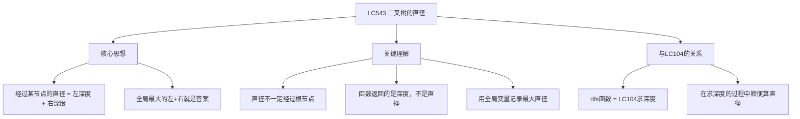
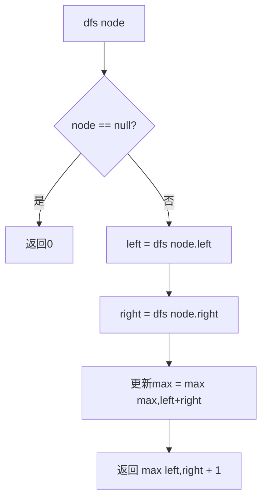

# LC543 二叉树的直径
## 一、题目描述
给你一棵二叉树的根节点，返回该树的**直径**。二叉树的直径是任意两个节点之间最长路径的**边数**（不一定经过根节点）。
**示例1：**
```
       1
      / \
     2   3
    / \
   4   5
  直径 = 3（路径：4→2→1→3 或 5→2→1→3，经过3条边）
```
**示例2：**
```
       1
      /
     2
  直径 = 1（路径：2→1，1条边）
```
**关键点：**
- 直径 = **边数**，不是节点数（3条边连接4个节点）
- 最长路径**不一定经过根节点**
**约束：**
- 树的节点数范围 [1, 10^4]
---
## 二、解法概览
### 解法对比表
| 解法 | 时间复杂度 | 空间复杂度 | 面试推荐 |
|------|-----------|-----------|---------|
| **DFS后序遍历 + 全局变量** | O(n) | O(h) | ✅ **标准解法** |
### 思维导图

---
## 三、记忆口诀
```
直径等于左加右，经过某节点的路径长
dfs求的是深度，左加右更新最大值
函数返回max加一，全局变量存答案
本质就是LC104，顺便记录左加右
```
---
## 四、解法：DFS后序遍历 + 全局变量
### 思路
**核心观察**：经过任意节点的最长路径 = 该节点的**左子树深度 + 右子树深度**。
遍历所有节点，取最大的 `左深度 + 右深度` 就是直径。
### 为什么是左深度 + 右深度？
```
       1
      / \
     2   3
    / \
   4   5
经过节点1的路径：左深度2 + 右深度1 = 3（4→2→1→3）
经过节点2的路径：左深度1 + 右深度1 = 2（4→2→5）
最大的是3 → 直径=3
```
```
"深度"是往下走的最长边数：
  节点1的左深度 = 2（1→2→4 或 1→2→5，2条边）
  节点1的右深度 = 1（1→3，1条边）
  经过节点1的路径 = 2 + 1 = 3 条边
```
### 为什么直径不一定经过根节点？
```
         1
        /
       2
      / \
     3   4
    /     \
   5       6
经过根节点1的路径：左深度4 + 右深度0 = 4
经过节点2的路径：  左深度2 + 右深度2 = 4
经过节点3的路径：  左深度1 + 右深度0 = 1
直径可能在树的中间某个节点取到最大值！
所以必须遍历所有节点，用全局变量记录最大值
```
### 核心公式
```
dfs函数做两件事：
  1. 返回值 = 当前节点的深度 = max(左深度, 右深度) + 1（给父节点用）
  2. 副作用 = 更新全局最大直径 = max(max, 左深度 + 右深度)
```
### 函数返回的是深度，而不是直径
```
这是最容易混淆的地方：
  返回值：深度 = max(左, 右) + 1  ← 和 LC104 完全一样
  全局变量：直径 = max(max, 左+右) ← 在求深度的过程中"顺便"更新
两者一个是给父节点用的（返回），一个是记录答案的（全局变量）
```
### 图解过程
```
       1
      / \
     2   3
    / \
   4   5
━━━━━━━━━━━━━━━━━━━━━━━━━━━━━━━━━━
dfs(4)：左=0，右=0
  直径候选：0+0=0 → max=0
  返回深度：max(0,0)+1 = 1
━━━━━━━━━━━━━━━━━━━━━━━━━━━━━━━━━━
dfs(5)：左=0，右=0
  直径候选：0+0=0 → max=0
  返回深度：max(0,0)+1 = 1
━━━━━━━━━━━━━━━━━━━━━━━━━━━━━━━━━━
dfs(2)：左=1(来自4)，右=1(来自5)
  直径候选：1+1=2 → max=2
  返回深度：max(1,1)+1 = 2
━━━━━━━━━━━━━━━━━━━━━━━━━━━━━━━━━━
dfs(3)：左=0，右=0
  直径候选：0+0=0 → max=2（不更新）
  返回深度：max(0,0)+1 = 1
━━━━━━━━━━━━━━━━━━━━━━━━━━━━━━━━━━
dfs(1)：左=2(来自2)，右=1(来自3)
  直径候选：2+1=3 → max=3 ← 更新！
  返回深度：max(2,1)+1 = 3（但这个返回值没人用了）
━━━━━━━━━━━━━━━━━━━━━━━━━━━━━━━━━━
每个节点的返回值（深度）和直径候选：
       1  深度3  直径候选=2+1=3 ← max
      / \
     2   3  深度2/1  直径候选=1+1=2 / 0+0=0
    / \
   4   5  深度1/1  直径候选=0+0=0 / 0+0=0
最终 max = 3 ✅
```
### 算法流程图

### 代码示例
```java
private int max = 0;
public int diameterOfBinaryTree(TreeNode root) {
    dfs(root);
    return max;
}
private int dfs(TreeNode node) {
    if (node == null) return 0;
    int left = dfs(node.left);     // 左子树深度
    int right = dfs(node.right);   // 右子树深度
    max = Math.max(max, left + right);  // 更新最大直径
    return Math.max(left, right) + 1;   // 返回深度（和LC104一样）
}
```
### 和 LC104 的代码对比
```java
// LC104 求最大深度（返回深度）
int maxDepth(TreeNode root) {
    if (root == null) return 0;
    int left = maxDepth(root.left);
    int right = maxDepth(root.right);
    return Math.max(left, right) + 1;          // 只返回深度
}
// LC543 求直径（在LC104基础上加一行）
int dfs(TreeNode node) {
    if (node == null) return 0;
    int left = dfs(node.left);
    int right = dfs(node.right);
    max = Math.max(max, left + right);          // ← 就多了这一行！
    return Math.max(left, right) + 1;
}
```
> **LC543 = LC104 + 一行代码**。在求深度的过程中，顺便用 `left + right` 更新全局最大直径。
### 复杂度分析
- 时间复杂度：**O(n)**，每个节点访问一次
- 空间复杂度：**O(h)**，递归栈深度
### 优缺点
| 优点 | 缺点 |
|-----|------|
| 一次遍历搞定 | 需要全局变量 |
| 本质就是 LC104 | 返回值和答案不是同一个东西 |
### 关键点总结
| 关键点 | 说明 |
|-------|------|
| 直径 = 什么？ | 经过某节点的最长路径 = 左深度 + 右深度 |
| 直径是边数还是节点数？ | **边数**（左深度+右深度就是边数） |
| 经过根节点吗？ | 不一定，所以要遍历所有节点取最大值 |
| 函数返回什么？ | **深度**（不是直径！） |
| 直径存在哪？ | 全局变量 max |
| 和 LC104 的关系 | 完全一样，就多了一行 `max = max(max, left+right)` |
---
## 五、面试回答模板
### 1. 开场：理解题意
> 直径是任意两个节点之间的最长路径的边数，不一定经过根节点。
### 2. 思路
> 经过任意节点的最长路径等于该节点的左子树深度加右子树深度。所以在 DFS 求深度的过程中，用全局变量记录每个节点的 `左深度+右深度` 的最大值。
### 3. 和 LC104 的关系
> 本质就是 LC104 求深度的代码，只是多加一行 `max = max(max, left + right)` 来记录最大直径。
### 4. 复杂度
> 时间 O(n)，空间 O(h)。
---
## 六、相关题目
| 题号 | 题目 | 关系 | 难度 |
|-----|------|------|-----|
| LC104 | 二叉树的最大深度 | 基础：dfs 函数一模一样 | 简单 |
| LC124 | 二叉树中的最大路径和 | 同样思路：dfs返回值+全局变量 | 困难 |
| LC110 | 平衡二叉树 | 同样在求深度时做额外判断 | 简单 |
| LC687 | 最长同值路径 | 直径变体：要求路径上值相同 | 中等 |
| LC1245 | 树的直径 | 通用树的直径 | 中等 |