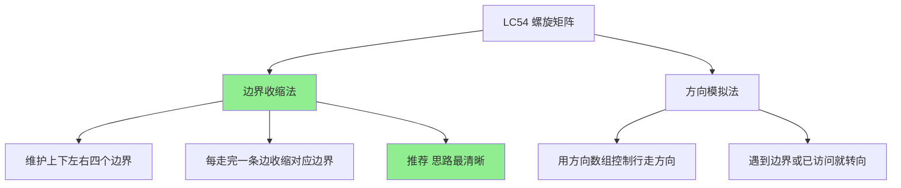
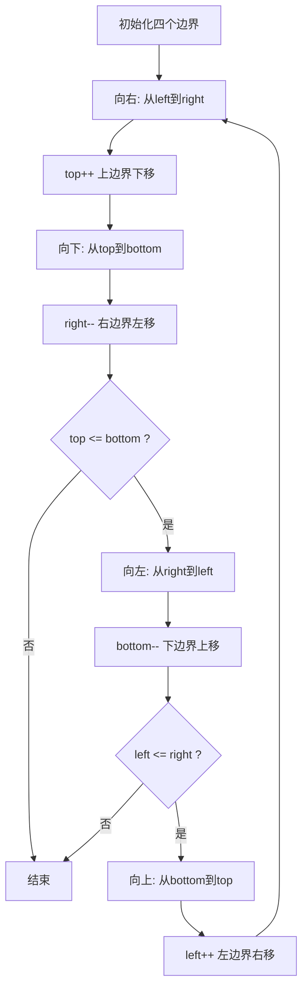
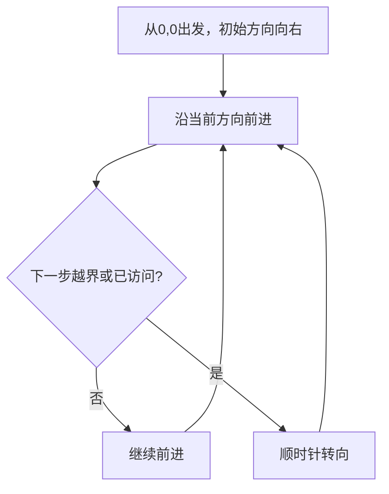

# LC54 螺旋矩阵 - 面试题解
## 一、题目描述
给你一个 m 行 n 列的矩阵 matrix，请按照**顺时针螺旋顺序**，返回矩阵中的所有元素。
```
示例1:
输入: matrix = [[1,2,3],[4,5,6],[7,8,9]]
输出: [1,2,3,6,9,8,7,4,5]
  1 → 2 → 3
            ↓
  4 → 5   6
  ↑       ↓
  7 ← 8 ← 9
示例2:
输入: matrix = [[1,2,3,4],[5,6,7,8],[9,10,11,12]]
输出: [1,2,3,4,8,12,11,10,9,5,6,7]
  1 →  2 →  3 → 4
                  ↓
  5 →  6 →  7    8
  ↑              ↓
  9 ← 10 ← 11 ← 12
```
## 二、解法概览

| 序号 | 解法 | 时间复杂度 | 空间复杂度 | 面试推荐 |
|------|------|------------|------------|----------|
| 1 | 边界收缩法 | O(m x n) | O(1) | 最推荐 |
| 2 | 方向模拟法 | O(m x n) | O(m x n) | 备选 |
## 三、记忆口诀
```
螺旋矩阵四边界，
上下左右要记清。
先右再下接着左，
最后向上转一圈。
走完一边缩边界，
上加下减左加右减。
循环条件双判断，
上小下左小右才继续。
```
## 四、解法一：边界收缩法（最优解）
### 4.1 思路
维护**上下左右**四个边界，按顺时针方向依次遍历：右 → 下 → 左 → 上，每走完一条边就收缩对应边界。

### 4.2 核心公式
```
四个边界: top=0, bottom=m-1, left=0, right=n-1
一圈四步:
  向右: 遍历 matrix[top][left..right]，然后 top++
  向下: 遍历 matrix[top..bottom][right]，然后 right--
  向左: 遍历 matrix[bottom][right..left]，然后 bottom--（需判断 top<=bottom）
  向上: 遍历 matrix[bottom..top][left]，然后 left++（需判断 left<=right）
终止条件: top > bottom 或 left > right
```
### 4.3 图解过程
```
matrix:
  1   2   3   4
  5   6   7   8
  9  10  11  12
初始边界: top=0, bottom=2, left=0, right=3
第一圈:
  向右: matrix[0][0→3] = 1,2,3,4     → top=0→1
    1 → 2 → 3 → 4
  向下: matrix[1→2][3] = 8,12        → right=3→2
                    8
                    ↓
                   12
  向左: matrix[2][2→0] = 11,10,9     → bottom=2→1（判断top=1<=bottom=2，通过）
    9 ← 10 ← 11
  向上: matrix[1][0] = 5             → left=0→1（判断left=0<=right=2，通过）
    5
    ↑
边界变化: top=1, bottom=1, left=1, right=2
第二圈:
  向右: matrix[1][1→2] = 6,7         → top=1→2
    6 → 7
  向下: top=2 > bottom=1             → 终止！
最终结果: [1,2,3,4,8,12,11,10,9,5,6,7] ✅
```
用矩阵标注走过的顺序：
```
  1  →  2  →  3  →  4
                      ↓
  5  → [6] → [7]     8
  ↑                   ↓
  9  ← 10  ← 11  ← 12
顺序: 1,2,3,4,8,12,11,10,9,5,6,7
```
### 4.4 为什么向左和向上需要额外判断
```
考虑单行矩阵: [[1,2,3]]
  top=0, bottom=0, left=0, right=2
第一圈:
  向右: 1,2,3 → top=0→1
  向下: top=1 > bottom=0 → 无元素可走
  向左: 如果不判断top<=bottom，会反向重复遍历!
  所以必须判断，避免重复
考虑单列矩阵: [[1],[2],[3]]
  向右: 1 → top++
  向下: 2,3 → right--
  向左: 判断top<=bottom通过 → 无新元素（left=right已经交叉）
  向上: 如果不判断left<=right，会反向重复遍历!
```
### 4.5 代码实现
```java
public List<Integer> spiralOrder(int[][] matrix) {
    List<Integer> res = new ArrayList<>();
    int top = 0, bottom = matrix.length - 1;
    int left = 0, right = matrix[0].length - 1;
    while (top <= bottom && left <= right) {
        // 向右: 遍历上边
        for (int j = left; j <= right; j++) {
            res.add(matrix[top][j]);
        }
        top++;
        // 向下: 遍历右边
        for (int i = top; i <= bottom; i++) {
            res.add(matrix[i][right]);
        }
        right--;
        // 向左: 遍历下边（需判断还有行）
        if (top <= bottom) {
            for (int j = right; j >= left; j--) {
                res.add(matrix[bottom][j]);
            }
            bottom--;
        }
        // 向上: 遍历左边（需判断还有列）
        if (left <= right) {
            for (int i = bottom; i >= top; i--) {
                res.add(matrix[i][left]);
            }
            left++;
        }
    }
    return res;
}
```
### 4.6 复杂度分析
| 复杂度 | 分析 |
|--------|------|
| 时间 | O(m x n)，每个元素访问一次 |
| 空间 | O(1)，不算结果数组，只用了4个变量 |
### 4.7 优缺点
| 优点 | 缺点 |
|------|------|
| 思路清晰，四步循环 | 向左向上需要额外判断 |
| 空间O(1)，最优 | 边界更新容易写错 |
| 面试最推荐 | - |
### 4.8 快速记忆法：剥洋葱+画口字
#### 核心比喻：剥洋葱
一圈一圈从外往里剥，每剥一条边，那条边就没了（边界收缩）。
#### 第一步：只记4个变量和收缩方向
```
走完上边 → 上边没了 → top++（往里缩）
走完右边 → 右边没了 → right--（往里缩）
走完下边 → 下边没了 → bottom--（往里缩）
走完左边 → 左边没了 → left++（往里缩）
```
记法：走完哪条边，哪条边就往里缩一格。上下是行号，往里缩就是上加下减。左右是列号，往里缩就是左加右减。
#### 第二步：走的顺序就是写"口"字的笔画
```
→ → → →   右：固定top行，j从left到right
        ↓  下：固定right列，i从top到bottom
← ← ← ←   左：固定bottom行，j从right到left
↑          上：固定left列，i从bottom到top
```
每一步固定的维度就是当前要走的那条边界，遍历的维度就是另一个方向从一端到另一端。
#### 第三步：只记一个特殊点
向右和向下是打头阵的，一定会执行。向左和向上是收尾的，可能已经没有东西可走了，所以要检查一下。
```
向左前判断 top <= bottom（防单行重复遍历）
向上前判断 left <= right（防单列重复遍历）
```
#### 面试时脑子里过的过程
```
1. 写4个边界变量: top bottom left right
2. while(top <= bottom && left <= right) 开始剥洋葱
3. 脑子里画一个口字:
   → 向右走一横 → top没了 top++
   ↓ 向下走一竖 → right没了 right--
   ← 向左走一横 → 还有东西吗? 判断一下 → bottom没了 bottom--
   ↑ 向上走一竖 → 还有东西吗? 判断一下 → left没了 left++
4. 回到while判断
```
#### 30秒默写模板
```java
while (top <= bottom && left <= right) {
    for (j = left;   j <= right;  j++) res.add(matrix[top][j]);      top++;
    for (i = top;    i <= bottom; i++) res.add(matrix[i][right]);     right--;
    if (top <= bottom)
    for (j = right;  j >= left;   j--) res.add(matrix[bottom][j]);   bottom--;
    if (left <= right)
    for (i = bottom; i >= top;    i--) res.add(matrix[i][left]);     left++;
}
```
每一行规律相同：固定当前边界，遍历另一个方向，走完收缩。
#### 练习建议
不要背代码，闭上眼在脑子里画一个3x3矩阵，用手指在空中顺时针画：
```
第1圈: → → → ↓ ↓ ← ← ↑
第2圈: 就剩中间一个5
```
画3遍之后代码自然就写出来了。会画就会写。
## 五、解法二：方向模拟法
### 5.1 思路
用方向数组控制行走方向（右→下→左→上），遇到边界或已访问过的格子就顺时针转向。

### 5.2 核心公式
```
方向数组:
  dirs = {{0,1}, {1,0}, {0,-1}, {-1,0}}
         右      下      左       上
转向: dir = (dir + 1) % 4
标记已访问: visited[i][j] = true
终止: 已收集 m x n 个元素
```
### 5.3 图解过程
```
matrix:
  1  2  3
  4  5  6
  7  8  9
方向: 右(0) → 下(1) → 左(2) → 上(3)
出发(0,0) 方向=右:
  (0,0)=1 → (0,1)=2 → (0,2)=3 → 下一步(0,3)越界 → 转向=下
方向=下:
  (1,2)=6 → (2,2)=9 → 下一步(3,2)越界 → 转向=左
方向=左:
  (2,1)=8 → (2,0)=7 → 下一步(2,-1)越界 → 转向=上
方向=上:
  (1,0)=4 → 下一步(0,0)已访问 → 转向=右
方向=右:
  (1,1)=5 → 下一步(1,2)已访问 → 结束(已收集9个)
结果: [1,2,3,6,9,8,7,4,5] ✅
```
### 5.4 代码实现
```java
public List<Integer> spiralOrder(int[][] matrix) {
    int m = matrix.length, n = matrix[0].length;
    List<Integer> res = new ArrayList<>();
    boolean[][] visited = new boolean[m][n];
    // 方向数组: 右、下、左、上
    int[][] dirs = {{0, 1}, {1, 0}, {0, -1}, {-1, 0}};
    int dir = 0;  // 初始方向=右
    int row = 0, col = 0;
    for (int k = 0; k < m * n; k++) {
        res.add(matrix[row][col]);
        visited[row][col] = true;
        // 计算下一步
        int nextRow = row + dirs[dir][0];
        int nextCol = col + dirs[dir][1];
        // 如果越界或已访问，转向
        if (nextRow < 0 || nextRow >= m || nextCol < 0 || nextCol >= n
            || visited[nextRow][nextCol]) {
            dir = (dir + 1) % 4;  // 顺时针转向
        }
        row += dirs[dir][0];
        col += dirs[dir][1];
    }
    return res;
}
```
### 5.5 复杂度分析
| 复杂度 | 分析 |
|--------|------|
| 时间 | O(m x n)，每个元素访问一次 |
| 空间 | O(m x n)，需要visited数组 |
### 5.6 优缺点
| 优点 | 缺点 |
|------|------|
| 不用管边界条件 | 需要O(m x n)额外空间 |
| 方向数组思路通用 | 比边界收缩法多一个visited数组 |
| 适合变体题目 | - |
## 六、两种解法对比
| 维度 | 边界收缩法 | 方向模拟法 |
|------|------------|------------|
| 空间 | O(1) | O(m x n) |
| 代码量 | 中等 | 稍多 |
| 思维方式 | 四边界依次收缩 | 方向数组+转向 |
| 易错点 | 向左向上需额外判断 | 越界和已访问判断 |
| 面试推荐 | 首选 | 备选 |
| 扩展性 | 限于螺旋 | 可扩展到蛇形等 |
## 七、面试回答模板
### 7.1 描述思路
> 这道题用边界收缩法。维护上下左右四个边界，按顺时针方向走四条边：先向右遍历上边，然后向下遍历右边，再向左遍历下边，最后向上遍历左边。每走完一条边就收缩对应边界。当上边界超过下边界或左边界超过右边界时结束。
### 7.2 面试官可能追问
| 序号 | 追问 | 回答要点 |
|------|------|----------|
| 1 | 为什么向左和向上需要额外判断 | 单行或单列矩阵会导致重复遍历 |
| 2 | 能否不用额外空间 | 边界收缩法只用4个变量，空间O(1) |
| 3 | 如果矩阵不是矩形呢 | 题目保证是矩形，如果是锯齿形需要其他方法 |
| 4 | 和LC59螺旋矩阵II的区别 | LC54是读取，LC59是填充，边界收缩思路一样 |
## 八、相关题目
| 序号 | 题号 | 题目 | 关联思路 | 难度 |
|------|------|------|----------|------|
| 1 | LC59 | 螺旋矩阵II | 同样边界收缩，填充而非读取 | 中等 |
| 2 | LC48 | 旋转图像 | 矩阵操作 | 中等 |
| 3 | LC73 | 矩阵置零 | 矩阵遍历+标记 | 中等 |
| 4 | LC885 | 螺旋矩阵III | 螺旋遍历变体 | 中等 |
| 5 | LC2326 | 螺旋矩阵IV | 螺旋填充链表 | 中等 |
## 九、完整代码
```java
package com.ssl.note.leetcode.编号刷题.LC54_螺旋矩阵;
import java.util.*;
public class Solution {
    /**
     * 螺旋矩阵 - 边界收缩法（推荐）
     * 时间O(m*n)，空间O(1)
     */
    public List<Integer> spiralOrder(int[][] matrix) {
        List<Integer> res = new ArrayList<>();
        int top = 0, bottom = matrix.length - 1;
        int left = 0, right = matrix[0].length - 1;
        while (top <= bottom && left <= right) {
            // 1.向右: 遍历上边
            for (int j = left; j <= right; j++) {
                res.add(matrix[top][j]);
            }
            top++;
            // 2.向下: 遍历右边
            for (int i = top; i <= bottom; i++) {
                res.add(matrix[i][right]);
            }
            right--;
            // 3.向左: 遍历下边
            if (top <= bottom) {
                for (int j = right; j >= left; j--) {
                    res.add(matrix[bottom][j]);
                }
                bottom--;
            }
            // 4.向上: 遍历左边
            if (left <= right) {
                for (int i = bottom; i >= top; i--) {
                    res.add(matrix[i][left]);
                }
                left++;
            }
        }
        return res;
    }
    public static void main(String[] args) {
        Solution solution = new Solution();
        int[][] matrix = {{1, 2, 3}, {4, 5, 6}, {7, 8, 9}};
        System.out.println(solution.spiralOrder(matrix));
        // [1, 2, 3, 6, 9, 8, 7, 4, 5]
    }
}
```
