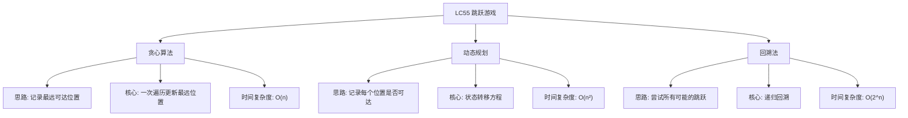

# 03-18-00-00 LC55_跳跃游戏解法分析
## 题目描述
给定一个非负整数数组 nums，你最初位于数组的第一个下标。数组中的每个元素代表你在该位置可以跳跃的最大长度。判断你是否能够到达最后一个下标。
**示例：**
输入：nums = [2,3,1,1,4]
输出：true
解释：可以先跳 1 步，从下标 0 到达下标 1, 然后再从下标 1 跳 3 步到达最后一个下标。
输入：nums = [3,2,1,0,4]
输出：false
解释：无论怎样，总会到达下标为 3 的位置。但该位置的最大跳跃长度是 0 ，所以永远不可能到达最后一个下标。
## 解法概览
### 思维导图

## 记忆口诀
**贪心算法：** 记录最远可达，一次遍历判断。
**动态规划：** 状态记录可达，逐步验证每个位置。
**回溯法：** 尝试所有路径，递归判断可能性。
## 不同解法
### 解法一：贪心算法（最优解）
#### 思路
使用贪心算法，从左到右遍历数组，记录当前能够到达的最远位置。如果在遍历过程中发现最远位置大于等于最后一个下标，则返回true；如果遍历到某个位置时，发现该位置不可达（即当前位置大于最远位置），则返回false。
#### 核心公式
- maxReach：记录当前能够到达的最远位置
- 对于每个位置 i：
  1. 如果 i > maxReach，说明该位置不可达，返回false
  2. 更新 maxReach = max(maxReach, i + nums[i])
  3. 如果 maxReach >= nums.length - 1，返回true
#### 图解过程
以输入 [2,3,1,1,4] 为例：
- 初始：maxReach=0
- 位置0：0 <= 0 → maxReach=max(0, 0+2)=2
- 位置1：1 <= 2 → maxReach=max(2, 1+3)=4，4 >= 4（最后一个下标）→ 返回true

以输入 [3,2,1,0,4] 为例：
- 初始：maxReach=0
- 位置0：0 <= 0 → maxReach=max(0, 0+3)=3
- 位置1：1 <= 3 → maxReach=max(3, 1+2)=3
- 位置2：2 <= 3 → maxReach=max(3, 2+1)=3
- 位置3：3 <= 3 → maxReach=max(3, 3+0)=3
- 位置4：4 > 3 → 返回false
#### 代码示例（带详细注释）
```java
public boolean canJump(int[] nums) {
    if (nums == null || nums.length == 0) {
        return false;
    }
    
    int maxReach = 0; // 记录当前能够到达的最远位置
    
    for (int i = 0; i < nums.length; i++) {
        // 如果当前位置不可达，直接返回false
        if (i > maxReach) {
            return false;
        }
        
        // 更新最远可达位置
        maxReach = Math.max(maxReach, i + nums[i]);
        
        // 如果已经可以到达最后一个位置，直接返回true
        if (maxReach >= nums.length - 1) {
            return true;
        }
    }
    
    // 遍历完所有位置，检查是否可以到达最后一个位置
    return maxReach >= nums.length - 1;
}
```
#### 复杂度分析
- 时间复杂度：O(n)，只需一次遍历数组
- 空间复杂度：O(1)，只需要常数级别的额外空间
#### 优缺点
- **优点：**
  - 时间复杂度最优，只需一次遍历
  - 空间复杂度低，适合处理大规模数据
  - 代码简洁，逻辑清晰
- **缺点：** 无明显缺点，是本题的最优解法
### 解法二：动态规划
#### 思路
使用动态规划，创建一个布尔数组dp，其中dp[i]表示是否可以到达位置i。初始化dp[0]=true，然后遍历数组，对于每个可达的位置i，更新其可以到达的后续位置。
#### 核心公式
- dp[i]：表示是否可以到达位置i
- 初始化：dp[0] = true
- 对于每个位置i：
  - 如果dp[i]为true，那么对于j从i+1到i+nums[i]，设置dp[j] = true
- 最终结果：dp[nums.length-1]
#### 图解过程
以输入 [2,3,1,1,4] 为例：
- 初始化：dp[0]=true
- 位置0：dp[0]=true，更新dp[1]=true, dp[2]=true
- 位置1：dp[1]=true，更新dp[2]=true, dp[3]=true, dp[4]=true → 发现dp[4]=true，返回true

以输入 [3,2,1,0,4] 为例：
- 初始化：dp[0]=true
- 位置0：dp[0]=true，更新dp[1]=true, dp[2]=true, dp[3]=true
- 位置1：dp[1]=true，更新dp[2]=true, dp[3]=true
- 位置2：dp[2]=true，更新dp[3]=true
- 位置3：dp[3]=true，无法更新后续位置
- 位置4：dp[4]=false → 返回false
#### 代码示例
```java
public boolean canJump(int[] nums) {
    if (nums == null || nums.length == 0) {
        return false;
    }
    
    int n = nums.length;
    boolean[] dp = new boolean[n];
    dp[0] = true; // 初始位置可达
    
    for (int i = 0; i < n; i++) {
        if (dp[i]) {
            // 从位置i可以到达的最远位置
            int maxJump = Math.min(i + nums[i], n - 1);
            for (int j = i + 1; j <= maxJump; j++) {
                dp[j] = true;
                // 如果已经可以到达最后一个位置，直接返回true
                if (j == n - 1) {
                    return true;
                }
            }
        }
    }
    
    return dp[n - 1];
}
```
#### 复杂度分析
- 时间复杂度：O(n²)，最坏情况下需要遍历每个位置的可达范围
- 空间复杂度：O(n)，需要布尔数组存储每个位置的可达性
#### 优缺点
- 优点：逻辑清晰，易于理解
- 缺点：时间复杂度较高，不适合处理大规模数据
### 解法三：回溯法
#### 思路
使用回溯法，从初始位置开始，尝试所有可能的跳跃长度，递归判断是否可以到达最后一个位置。
#### 核心公式
- 递归函数：canJumpFromPosition(position, nums)
- 终止条件：
  - 如果 position >= nums.length - 1，返回true
  - 如果 nums[position] == 0，返回false
- 递归过程：
  - 尝试从position跳1到nums[position]步，对于每个可能的跳跃长度j，递归调用canJumpFromPosition(position + j, nums)
  - 如果任何一个递归调用返回true，则返回true
#### 图解过程
以输入 [2,3,1,1,4] 为例：
- 从位置0开始，尝试跳1步到位置1，再从位置1跳3步到位置4 → 成功

以输入 [3,2,1,0,4] 为例：
- 从位置0开始，尝试跳1步到位置1，再跳2步到位置3，无法继续；
- 尝试跳2步到位置2，再跳1步到位置3，无法继续；
- 尝试跳3步到位置3，无法继续；
- 所有路径都无法到达位置4 → 失败
#### 代码示例
```java
public boolean canJump(int[] nums) {
    if (nums == null || nums.length == 0) {
        return false;
    }
    return canJumpFromPosition(0, nums);
}

private boolean canJumpFromPosition(int position, int[] nums) {
    // 已经到达或超过最后一个位置
    if (position >= nums.length - 1) {
        return true;
    }
    
    // 当前位置无法跳跃
    if (nums[position] == 0) {
        return false;
    }
    
    // 尝试所有可能的跳跃长度
    int maxJump = Math.min(position + nums[position], nums.length - 1);
    for (int j = maxJump; j > position; j--) {
        if (canJumpFromPosition(j, nums)) {
            return true;
        }
    }
    
    return false;
}
```
#### 复杂度分析
- 时间复杂度：O(2^n)，最坏情况下需要尝试所有可能的跳跃路径
- 空间复杂度：O(n)，递归栈的深度
#### 优缺点
- 优点：逻辑直观，容易理解
- 缺点：时间复杂度指数级，不适合处理大规模数据
## 面试回答模板
**问题：** 请判断是否可以从数组的第一个位置跳到最后一个位置。
**回答：**
这是一道经典的贪心算法问题，主要有三种解法：
1. **贪心算法**：从左到右遍历数组，记录当前能够到达的最远位置。如果在遍历过程中发现最远位置大于等于最后一个下标，则返回true；如果遍历到某个位置时，发现该位置不可达，则返回false。时间复杂度O(n)，是本题的最优解。
2. **动态规划**：使用布尔数组记录每个位置是否可达，初始化第一个位置为可达，然后遍历数组，对于每个可达的位置，更新其可以到达的后续位置。时间复杂度O(n²)，逻辑清晰但效率较低。
3. **回溯法**：从初始位置开始，尝试所有可能的跳跃长度，递归判断是否可以到达最后一个位置。时间复杂度O(2^n)，逻辑直观但效率最低。
**最优选择：** 贪心算法是本题的最优解，因为它在保证时间复杂度O(n)的同时，空间复杂度为O(1)，代码简洁且易于理解。面试中推荐使用贪心算法，既展示了对问题的深入理解，又能高效解决问题。
## 相关题目
1. **LC45：跳跃游戏 II** - 最少跳跃次数
2. **LC1306：跳跃游戏 III** - 跳跃到指定位置
3. **LC1345：跳跃游戏 IV** - 最少跳跃次数（BFS）
4. **LC1696：跳跃游戏 VI** - 最大得分跳跃
这些题目都涉及到跳跃游戏的不同变体，与LC55_跳跃游戏有一定的关联性。