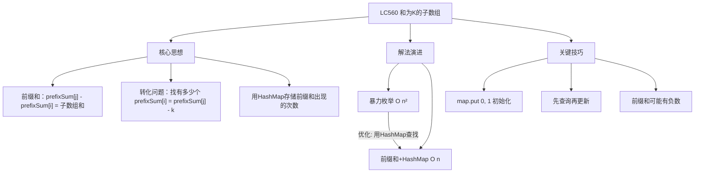
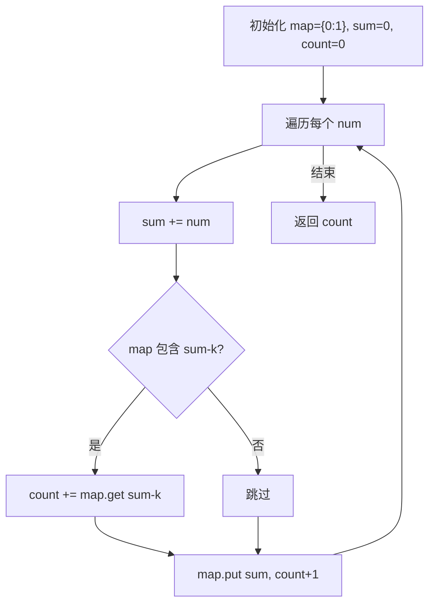

# LC560 和为K的子数组
## 一、题目描述
给你一个整数数组 `nums` 和一个整数 `k`，请你统计并返回该数组中**和为 `k` 的连续子数组**的个数。
**示例：**
| 输入 | 输出 | 解释 |
|-----|------|------|
| nums=[1,1,1], k=2 | 2 | [1,1] 出现2次 |
| nums=[1,2,3], k=3 | 2 | [1,2] 和 [3] |
| nums=[1,-1,0], k=0 | 3 | [1,-1], [-1,0,1...不对], [0] 等 |
**注意**：
- 数组中可能包含**负数**
- 子数组是**连续**的
- 不能用滑动窗口（因为有负数，窗口大小不确定）
---
## 二、解法概览
### 解法对比表
| 解法 | 时间复杂度 | 空间复杂度 | 面试推荐 |
|------|-----------|-----------|---------|
| 暴力枚举 | O(n²) | O(1) | ❌ 不推荐 |
| **前缀和 + HashMap** | O(n) | O(n) | ✅ **最优解** |
### 思维导图

---
## 三、记忆口诀
```
和为K子数组，前缀和来解决
当前和减去K，之前出现几次
HashMap存次数，初始化0放1
先查再更新，一遍就搞定
```
---
## 四、解法一：暴力枚举（不推荐）
### 思路
枚举所有子数组的起点和终点，计算每个子数组的和，判断是否等于 k。
### 核心公式
```
for i in range(n):
    sum = 0
    for j in range(i, n):
        sum += nums[j]
        if sum == k:
            count++
```
### 图解过程
以 `nums = [1, 2, 3]`, `k = 3` 为例：
```
i=0: [1]=1, [1,2]=3✓, [1,2,3]=6
i=1: [2]=2, [2,3]=5
i=2: [3]=3✓
count = 2
```
### 代码示例
```java
public int subarraySum(int[] nums, int k) {
    int count = 0;
    int n = nums.length;
    for (int i = 0; i < n; i++) {
        int sum = 0;
        for (int j = i; j < n; j++) {
            sum += nums[j];
            if (sum == k) {
                count++;
            }
        }
    }
    return count;
}
```
### 复杂度分析
- 时间复杂度：**O(n²)**，两层循环
- 空间复杂度：**O(1)**
### 优缺点
| 优点 | 缺点 |
|-----|------|
| 思路直观 | 时间复杂度高 |
| 容易理解 | 大数据量会超时 |
---
## 五、解法二：前缀和 + HashMap（最优解 ✅）
### 思路
**前缀和定义**：
```
prefixSum[0] = 0                           （空数组的和）
prefixSum[1] = nums[0]
prefixSum[2] = nums[0] + nums[1]
prefixSum[i] = nums[0] + nums[1] + ... + nums[i-1]
```
**子数组和公式**：
子数组 `nums[i..j]`（从索引 i 到 j）的和：
```
sum(i, j) = nums[i] + nums[i+1] + ... + nums[j]
          = prefixSum[j+1] - prefixSum[i]
```
**示例**：
```
nums = [1, 2, 3, 4]
prefixSum = [0, 1, 3, 6, 10]
             ↑  ↑  ↑  ↑  ↑
             0  1  2  3  4
sum(1, 2) = nums[1] + nums[2] = 2 + 3 = 5
          = prefixSum[3] - prefixSum[1] = 6 - 1 = 5 ✓
```
### 问题转化（详细推导）
我们要找：有多少个子数组的和等于 k
即：有多少对 (i, j) 满足 `sum(i, j) = k`
```
sum(i, j) = k
prefixSum[j+1] - prefixSum[i] = k
```
**在代码中的简化**：
我们不显式创建 prefixSum 数组，而是用变量 `sum` 表示当前位置的前缀和：
```java
int sum = 0;
for (int j = 0; j < nums.length; j++) {
    sum += nums[j];  // 此时 sum 就是 prefixSum[j+1]
}
```
**关键对应关系**：
```
代码中的 sum = prefixSum[j+1] = nums[0] + nums[1] + ... + nums[j]
```
**完整推导**：
```
我们要找：prefixSum[j+1] - prefixSum[i] = k
移项得：  prefixSum[i] = prefixSum[j+1] - k
在代码中：sum = prefixSum[j+1]
所以：    prefixSum[i] = sum - k
```
**结论**：对于当前位置 j，我们需要查找之前有多少个位置 i，使得 `prefixSum[i] = sum - k`
**图解**：
```
nums:      [1,  2,  3,  4]
索引:        0   1   2   3
prefixSum: [0,  1,  3,  6, 10]
索引:        0   1   2   3   4
             ↑           ↑
         prefixSum[i]  prefixSum[j+1] = sum
如果 k = 5，当 j = 2 时：
    sum = prefixSum[3] = 6
    sum - k = 6 - 5 = 1
    查找 prefixSum[i] = 1，找到 i = 1
    子数组 nums[1..2] = [2, 3]，和 = 5 ✓
```
**解决方案**：用 HashMap 存储每个前缀和出现的次数，遍历时查询 `sum - k` 出现了几次。
### 核心公式
```
map: 存储 <前缀和, 出现次数>
map.put(0, 1)  // 初始化：前缀和为0出现1次
for num in nums:
    sum += num
    count += map.get(sum - k)  // 查询：有多少个前缀和等于 sum-k
    map.put(sum, map.get(sum) + 1)  // 更新：当前前缀和次数+1
```
### 图解过程
以 `nums = [1, 2, 3]`, `k = 3` 为例：
```
初始：map = {0: 1}, sum = 0, count = 0
━━━━━━━━━━━━━━━━━━━━━━━━━━━━━━━━━━━━━━━━━━
i=0, num=1
    sum = 0 + 1 = 1
    查询：sum - k = 1 - 3 = -2
    map.get(-2) = 0，count += 0
    更新：map = {0:1, 1:1}
    
    前缀和数组：[0, 1, ...]
                 ↑  ↑
                起点 当前
━━━━━━━━━━━━━━━━━━━━━━━━━━━━━━━━━━━━━━━━━━
i=1, num=2
    sum = 1 + 2 = 3
    查询：sum - k = 3 - 3 = 0
    map.get(0) = 1，count += 1 ✓
    （说明存在前缀和为0的位置，从那到现在的和为3）
    更新：map = {0:1, 1:1, 3:1}
    
    子数组 [1,2] 的和 = prefixSum[2] - prefixSum[0] = 3 - 0 = 3 ✓
━━━━━━━━━━━━━━━━━━━━━━━━━━━━━━━━━━━━━━━━━━
i=2, num=3
    sum = 3 + 3 = 6
    查询：sum - k = 6 - 3 = 3
    map.get(3) = 1，count += 1 ✓
    （说明存在前缀和为3的位置，从那到现在的和为3）
    更新：map = {0:1, 1:1, 3:1, 6:1}
    
    子数组 [3] 的和 = prefixSum[3] - prefixSum[2] = 6 - 3 = 3 ✓
━━━━━━━━━━━━━━━━━━━━━━━━━━━━━━━━━━━━━━━━━━
最终：count = 2
```
### 为什么初始化 map.put(0, 1)？
```
当前缀和恰好等于 k 时：
  sum = k
  sum - k = 0
  需要查询前缀和为 0 的次数
如果不初始化 {0: 1}，就会漏掉从数组开头开始的子数组。
例如：nums = [3], k = 3
  sum = 3
  sum - k = 0
  如果 map 中没有 0，就找不到这个解
```
### 算法流程图

### 代码示例
```java
public int subarraySum(int[] nums, int k) {
    // <前缀和, 该前缀和出现的次数>
    Map<Integer, Integer> map = new HashMap<>();
    // 初始化：前缀和为0出现1次
    // 为什么？当 sum == k 时，sum - k = 0，需要能查到
    map.put(0, 1);
    int sum = 0;
    int count = 0;
    for (int num : nums) {
        sum += num;
        // 查询：有多少个前缀和等于 sum - k
        if (map.containsKey(sum - k)) {
            count += map.get(sum - k);
        }
        // 更新：当前前缀和的次数 + 1
        map.put(sum, map.getOrDefault(sum, 0) + 1);
    }
    return count;
}
```
### 复杂度分析
- 时间复杂度：**O(n)**，一次遍历
- 空间复杂度：**O(n)**，HashMap 存储前缀和
### 优缺点
| 优点 | 缺点 |
|-----|------|
| 时间复杂度最优 O(n) | 需要 O(n) 额外空间 |
| 能处理负数 | 需要理解前缀和 |
### 关键点总结
| 关键点 | 说明 |
|-------|------|
| 为什么用前缀和？ | 子数组和 = 两个前缀和的差 |
| 为什么用 HashMap？ | O(1) 查询某个前缀和出现了几次 |
| 为什么初始化 {0:1}？ | 处理从数组开头开始的子数组 |
| 为什么先查询再更新？ | 避免自己和自己配对 |
| 为什么不能用滑动窗口？ | 数组有负数，窗口大小不确定 |
---
## 六、为什么不能用滑动窗口？
滑动窗口适用于：**元素都是正数**的情况。
**原因**：
- 正数数组：窗口扩大时和增大，窗口缩小时和减小，有单调性
- 有负数时：窗口扩大可能和减小，无法确定移动方向
**示例**：
```
nums = [1, -1, 1], k = 1
如果用滑动窗口：
  [1] = 1 ✓
  [1, -1] = 0，和变小了，应该扩大还是缩小？
  无法判断！
正确答案：[1], [1, -1, 1], [1] 共3个
```
---
## 七、面试回答模板
### 1. 开场：理解题意
> 这道题要统计和为 k 的连续子数组的个数。注意数组中可能有负数，所以不能用滑动窗口。
### 2. 思路：前缀和 + HashMap
> 我用前缀和来解决。子数组的和等于两个前缀和的差。问题转化为：对于每个位置 j，有多少个位置 i 的前缀和等于 prefixSum[j] - k。
### 3. 核心逻辑
> 用 HashMap 存储每个前缀和出现的次数。遍历时，先查询 sum - k 出现了几次，再更新当前前缀和的次数。
### 4. 关键细节（如果面试官问）
> 初始化 map.put(0, 1) 是为了处理从数组开头开始、和恰好等于 k 的子数组。
### 5. 复杂度
> 时间复杂度 O(n)，空间复杂度 O(n)。
---
## 八、相关题目
| 题号 | 题目 | 关系 | 难度 |
|-----|------|------|-----|
| LC1 | 两数之和 | HashMap 查找配对 | 简单 |
| LC303 | 区域和检索-数组不可变 | 前缀和基础 | 简单 |
| LC325 | 和等于K的最长子数组长度 | 前缀和+HashMap | 中等 |
| LC523 | 连续的子数组和 | 前缀和+取模 | 中等 |
| LC974 | 和可被K整除的子数组 | 前缀和+取模 | 中等 |
| LC1248 | 统计优美子数组 | 前缀和变体 | 中等 |
