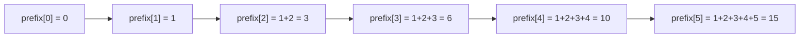
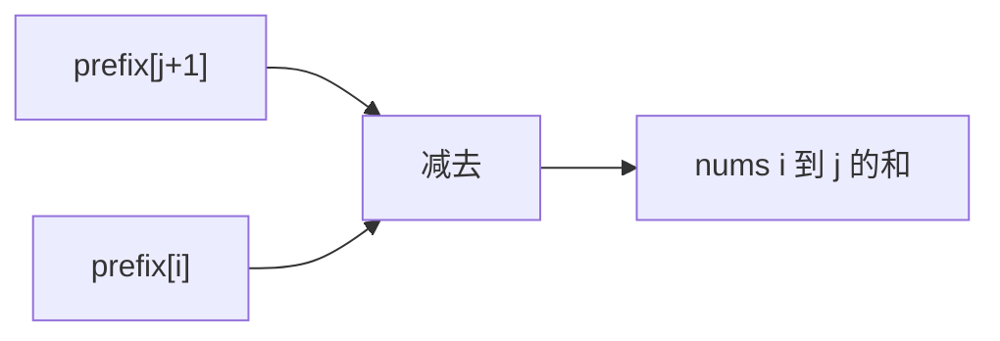
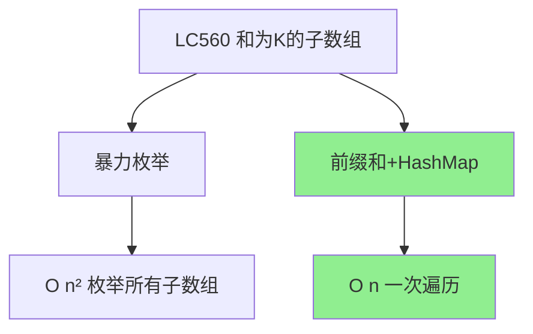
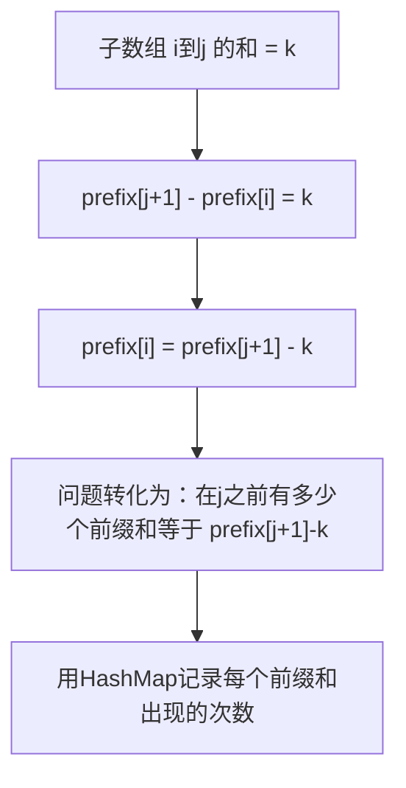
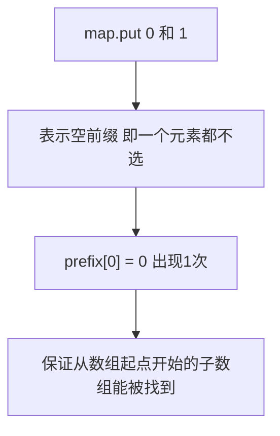
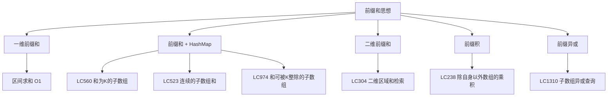

# 前缀和知识点与LC560实战
## 一、什么是前缀和
**前缀和（Prefix Sum）**：一个数组中，前 `i` 个元素的累加和。
```
原数组:   nums = [1,  2,  3,  4,  5]
前缀和: prefix = [0,  1,  3,  6, 10, 15]
                  ↑
              prefix[0]=0（哨兵，表示一个元素都不选）
```

### 1.1 核心公式
```
prefix[i] = nums[0] + nums[1] + ... + nums[i-1]
子数组 nums[i..j] 的和 = prefix[j+1] - prefix[i]
```
### 1.2 核心优势
**O(1) 时间**求任意区间的和，不需要重复累加。
| 场景 | 不用前缀和 | 用前缀和 |
|------|------------|----------|
| 求一次区间和 | O(n) 遍历 | O(1) 减法 |
| 求m次区间和 | O(m × n) | **O(n) 预处理 + O(m)** |
### 1.3 图解区间和
```
求 nums[2..4] 的和（即 3+4+5 = 12）
prefix = [0, 1, 3, 6, 10, 15]
                  ↑           ↑
              prefix[2]=3   prefix[5]=15
nums[2..4] 的和 = prefix[5] - prefix[2] = 15 - 3 = 12 ✅
```

## 二、前缀和通用模板
### 2.1 一维前缀和（基础模板）
```java
// 构建前缀和数组
int[] prefix = new int[nums.length + 1];  // 多一位，prefix[0]=0
for (int i = 0; i < nums.length; i++) {
    prefix[i + 1] = prefix[i] + nums[i];
}
// 查询区间 [i, j] 的和
int rangeSum = prefix[j + 1] - prefix[i];
```
### 2.2 前缀和 + HashMap（统计型模板）
**适用场景**：统计满足条件的子数组个数（如和为k、和能被k整除等）。
```java
// 通用模板：统计子数组和等于k的个数
public int subarraySum(int[] nums, int k) {
    // key=前缀和，value=出现次数
    Map<Integer, Integer> map = new HashMap<>();
    map.put(0, 1);  // 前缀和为0出现1次（哨兵）
    int prefix = 0;
    int count = 0;
    for (int num : nums) {
        prefix += num;                     // 当前前缀和
        count += map.getOrDefault(prefix - k, 0);  // 查找目标前缀和
        map.put(prefix, map.getOrDefault(prefix, 0) + 1);  // 记录
    }
    return count;
}
```
### 2.3 二维前缀和（进阶模板）
```java
// 构建二维前缀和
int[][] prefix = new int[m + 1][n + 1];
for (int i = 1; i <= m; i++) {
    for (int j = 1; j <= n; j++) {
        prefix[i][j] = matrix[i-1][j-1]
                     + prefix[i-1][j]
                     + prefix[i][j-1]
                     - prefix[i-1][j-1];
    }
}
// 查询子矩阵 (r1,c1) 到 (r2,c2) 的和
int sum = prefix[r2+1][c2+1] - prefix[r1][c2+1]
        - prefix[r2+1][c1] + prefix[r1][c1];
```
## 三、LC560 和为K的子数组
### 3.1 题目描述
给你一个整数数组 `nums` 和一个整数 `k`，统计并返回该数组中和为 `k` 的**连续子数组**的个数。
```
输入：nums = [1, 2, 3], k = 3
输出：2
解释：[1,2] 和 [3] 两个子数组的和为3
```
### 3.2 解法概览

| 解法 | 时间 | 空间 | 推荐 |
|------|------|------|------|
| 暴力枚举 | O(n²) | O(1) | ❌ |
| **前缀和+HashMap** | **O(n)** | O(n) | ✅ **最优解** |
### 3.3 暴力解法（了解即可）
```java
public int subarraySum(int[] nums, int k) {
    int count = 0;
    for (int i = 0; i < nums.length; i++) {
        int sum = 0;
        for (int j = i; j < nums.length; j++) {
            sum += nums[j];
            if (sum == k) count++;
        }
    }
    return count;
}
```
### 3.4 前缀和+HashMap（最优解）
#### 3.4.1 思路

**关键转化**：
```
子数组和 = k
→ prefix[j+1] - prefix[i] = k
→ prefix[i] = prefix[j+1] - k
→ 在当前位置之前，有多少个前缀和 = 当前前缀和 - k？
```
#### 3.4.2 为什么 `map.put(0, 1)` ？
```
含义：前缀和为0出现了1次
作用：处理从数组起点开始的子数组
例子：nums = [3], k = 3
  prefix = 3, 查找 prefix - k = 0
  如果没有 map.put(0,1)，就找不到这个子数组
  有了 map.put(0,1)，count += 1，正确！
```

#### 3.4.3 图解过程
```
nums = [1, 2, 3], k = 3
初始: map = {0: 1}, prefix = 0, count = 0
i=0, num=1:
  prefix = 0 + 1 = 1
  查找 prefix - k = 1 - 3 = -2，map中没有 → count = 0
  map = {0:1, 1:1}
i=1, num=2:
  prefix = 1 + 2 = 3
  查找 prefix - k = 3 - 3 = 0，map中有！次数=1 → count = 0+1 = 1
  含义：prefix[0..1]=3, prefix[哨兵]=0, 差值=3=k → 子数组[1,2]
  map = {0:1, 1:1, 3:1}
i=2, num=3:
  prefix = 3 + 3 = 6
  查找 prefix - k = 6 - 3 = 3，map中有！次数=1 → count = 1+1 = 2
  含义：prefix[0..2]=6, prefix[0..1]=3, 差值=3=k → 子数组[3]
  map = {0:1, 1:1, 3:1, 6:1}
最终 count = 2 ✅（子数组 [1,2] 和 [3]）
```
#### 3.4.4 代码实现（你现有代码优化版）
```java
public int subarraySum(int[] nums, int k) {
    Map<Integer, Integer> map = new HashMap<>();
    map.put(0, 1);  // 哨兵：前缀和为0出现1次
    int prefix = 0;
    int count = 0;
    for (int num : nums) {
        prefix += num;                                       // 当前前缀和
        count += map.getOrDefault(prefix - k, 0);            // 查找目标
        map.put(prefix, map.getOrDefault(prefix, 0) + 1);   // 记录当前前缀和
    }
    return count;
}
```
#### 3.4.5 复杂度分析
| 复杂度 | 分析 |
|--------|------|
| 时间 | O(n)，一次遍历 |
| 空间 | O(n)，HashMap存储前缀和 |
### 3.5 面试回答模板
#### 第一反应
> "这道题要找和为k的子数组个数。子数组和可以用前缀和之差来表示：`prefix[j] - prefix[i] = k`，转化为 `prefix[i] = prefix[j] - k`。所以问题变成：在遍历过程中，之前出现过多少个前缀和等于 `当前前缀和 - k`，用HashMap记录即可。时间O(n)。"
#### 追问：为什么初始化 `map.put(0, 1)`
> "这是一个哨兵值。前缀和为0表示不选任何元素，出现1次。它保证了从数组起点开始的子数组也能被正确统计。比如 `nums=[3], k=3`，当前前缀和是3，查找 `3-3=0`，如果不初始化就会漏掉。"
#### 追问：能用滑动窗口吗
> "不能。滑动窗口要求数组元素为正数时才能保证窗口的单调性。这道题nums包含负数，窗口收缩时和可能增大也可能减小，无法确定收缩方向。所以只能用前缀和+HashMap。"
## 四、前缀和思想的变体应用

## 五、前缀和经典题目
| 题号 | 题目 | 前缀和用法 | 难度 |
|------|------|------------|------|
| LC303 | 区域和检索 | 基础一维前缀和 | 简单 |
| LC304 | 二维区域和检索 | 二维前缀和 | 中等 |
| LC560 | 和为K的子数组 | 前缀和+HashMap | 中等 |
| LC523 | 连续的子数组和 | 前缀和取模+HashMap | 中等 |
| LC974 | 和可被K整除的子数组 | 前缀和取模+计数 | 中等 |
| LC238 | 除自身以外数组的乘积 | 前缀积+后缀积 | 中等 |
| LC53 | 最大子数组和 | 前缀和-最小前缀和 | 中等 |
| LC437 | 路径总和III | 树上前缀和+HashMap | 中等 |
| LC1480 | 数组的动态和 | 最基础的前缀和 | 简单 |
## 六、三种模板总结
| 模板 | 适用场景 | 核心代码 |
|------|----------|----------|
| 基础前缀和 | 多次查询区间和 | `prefix[j+1] - prefix[i]` |
| 前缀和+HashMap | 统计满足条件的子数组个数 | `map.getOrDefault(prefix-k, 0)` |
| 二维前缀和 | 多次查询子矩阵和 | 容斥原理 |
## 七、记忆口诀
```
前缀和，记累加，
区间求和减一下。
子数组和等于k，
前缀差值HashMap查。
map初始零和一，
哨兵保证不遗漏。
边加边查边记录，
一次遍历O n解。
```
