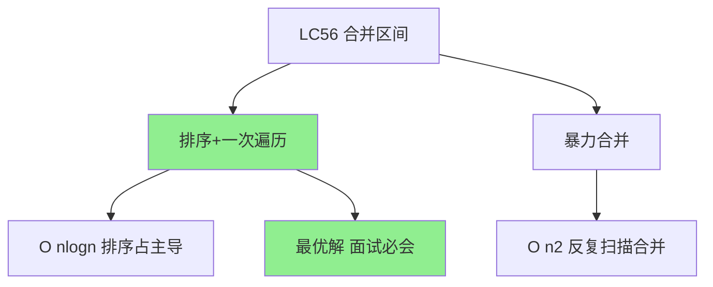
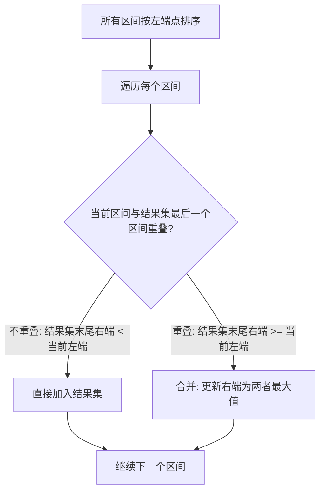
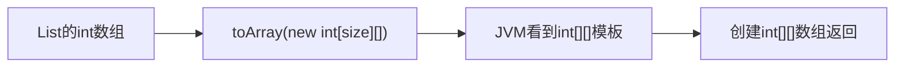
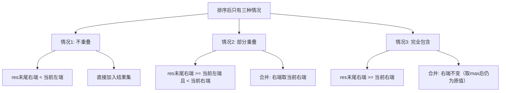

# LC56 合并区间 - 面试题解
## 一、题目描述
以数组 intervals 表示若干个区间的集合，其中单个区间为 intervals[i] = [starti, endi]。请你合并所有重叠的区间，并返回一个不重叠的区间数组，该数组需恰好覆盖输入中的所有区间。
```
输入: intervals = [[1,3],[2,6],[8,10],[15,18]]
输出: [[1,6],[8,10],[15,18]]
解释: 区间 [1,3] 和 [2,6] 重叠，合并为 [1,6]
```
```
输入: intervals = [[1,4],[4,5]]
输出: [[1,5]]
解释: 区间 [1,4] 和 [4,5] 可被视为重叠区间
```
## 二、解法概览

| 序号 | 解法 | 时间复杂度 | 空间复杂度 | 面试推荐 |
|------|------|------------|------------|----------|
| 1 | 排序+一次遍历 | O(nlogn) | O(n) | 最优解 |
| 2 | 暴力合并 | O(n2) | O(n) | 不推荐 |
## 三、记忆口诀
```
合并区间先排序，
按左端点小到大。
遍历每个新区间，
和结果集末尾比。
不重叠就直接加，
重叠取右端最大。
排序遍历两步走，
面试写出没问题。
```
## 四、解法一：排序+一次遍历（最优解）
### 4.1 思路

**核心洞察**：排序后，所有可能重叠的区间一定是相邻的，只需要一次遍历就能完成合并。
### 4.2 核心公式
```
排序: 按 interval[0] 升序排列
判断重叠: res末尾右端 >= 当前左端
合并: res末尾右端 = max(res末尾右端, 当前右端)
```
### 4.3 图解过程
```
原始输入: [[1,3], [2,6], [8,10], [15,18]]
Step 0: 按左端点排序(本例已有序)
        [[1,3], [2,6], [8,10], [15,18]]
Step 1: 处理 [1,3]
        res为空，直接加入
        res = [[1,3]]
Step 2: 处理 [2,6]
        res末尾 [1,3]，右端3 >= 左端2 → 重叠!
        合并: 右端 = max(3, 6) = 6
        res = [[1,6]]
Step 3: 处理 [8,10]
        res末尾 [1,6]，右端6 < 左端8 → 不重叠
        直接加入
        res = [[1,6], [8,10]]
Step 4: 处理 [15,18]
        res末尾 [8,10]，右端10 < 左端15 → 不重叠
        直接加入
        res = [[1,6], [8,10], [15,18]]
最终结果: [[1,6], [8,10], [15,18]]
```
用数轴图示理解：
```
排序前:
  [1----3]
     [2--------6]
                   [8---10]
                              [15---18]
合并后:
  [1--------6]  [8---10]  [15---18]
```
### 4.4 代码实现
#### 写法一：内部用List操作，最后转int[][]返回（贴近工作习惯，容易记API）
```java
public int[][] merge(int[][] intervals) {
    // 1. 转为List方便操作
    List<List<Integer>> list = new ArrayList<>();
    for (int[] interval : intervals) {
        list.add(new ArrayList<>(Arrays.asList(interval[0], interval[1])));
    }
    // 2. 按左端点排序
    list.sort((a, b) -> a.get(0) - b.get(0));
    List<List<Integer>> res = new ArrayList<>();
    // 3. 遍历每个区间
    for (List<Integer> interval : list) {
        int left = interval.get(0);
        int right = interval.get(1);
        // 4. 判断是否重叠
        if (res.isEmpty() || res.get(res.size() - 1).get(1) < left) {
            // 不重叠，直接加入
            res.add(new ArrayList<>(Arrays.asList(left, right)));
        } else {
            // 重叠，合并：更新右端为最大值
            List<Integer> last = res.get(res.size() - 1);
            last.set(1, Math.max(last.get(1), right));
        }
    }
    // 5. 转为int[][]返回
    return res.stream().map(r -> new int[]{r.get(0), r.get(1)}).toArray(int[][]::new);
}
```
#### 写法二：int数组（LeetCode原题签名）
```java
public int[][] merge(int[][] intervals) {
    // 1. 按左端点排序
    Arrays.sort(intervals, (a, b) -> a[0] - b[0]);
    List<int[]> res = new ArrayList<>();
    // 2. 遍历每个区间
    for (int[] interval : intervals) {
        int left = interval[0];
        int right = interval[1];
        // 3. 判断是否重叠
        if (res.isEmpty() || res.get(res.size() - 1)[1] < left) {
            res.add(new int[]{left, right});
        } else {
            res.get(res.size() - 1)[1] = Math.max(res.get(res.size() - 1)[1], right);
        }
    }
    return res.toArray(new int[res.size()][]);
}
```
#### toArray转换详解
```java
// res类型: List<int[]>，需要转为 int[][]
// 写法一：传入目标类型数组（推荐）
return res.toArray(new int[res.size()][]);
// 写法二：等价写法，传空数组也行（JVM自动创建正确大小）
return res.toArray(new int[0][]);
```
toArray的参数作用：告诉JVM你想要什么类型的数组。
| 序号 | 场景 | toArray写法 | 说明 |
|------|------|-------------|------|
| 1 | List转int[][] | res.toArray(new int[res.size()][]) | 参数指定返回int二维数组 |
| 2 | List转String[] | list.toArray(new String[0]) | 参数指定返回String数组 |
| 3 | 不传参数 | res.toArray() | 返回Object[]，通常需要强转，不推荐 |
为什么不能直接写res.toArray()？因为Java泛型擦除，运行时不知道List里装的是什么类型，必须传一个目标类型的数组作为模板，JVM才知道创建什么类型的数组。

#### 两种写法API对比
| 操作 | int[]写法 | List写法 |
|------|-----------|----------|
| 排序 | Arrays.sort(arr, lambda) | list.sort(lambda) |
| 取左端点 | interval[0] | interval.get(0) |
| 取右端点 | interval[1] | interval.get(1) |
| 创建区间 | new int[]{left, right} | new ArrayList<>(Arrays.asList(left, right)) |
| 更新右端 | last[1] = val | last.set(1, val) |
| 转返回值 | res.toArray(new int[size][]) | 直接返回res |
### 4.5 复杂度分析
| 复杂度 | 分析 |
|--------|------|
| 时间 | O(nlogn)，排序占主导 |
| 空间 | O(n)，结果集存储 |
### 4.6 优缺点
| 优点 | 缺点 |
|------|------|
| 思路清晰简洁 | 需要排序，改变原数组顺序 |
| 一次遍历完成合并 | 时间下界就是O(nlogn) |
| 面试最优解 | - |
## 五、重叠的三种情况详解
排序后，当前区间与结果集末尾区间只有三种关系：

```
情况1-不重叠:      [1--3]        [8--10]    → 直接加入
情况2-部分重叠:    [1--3]                    → 合并为 [1,6]
                      [2------6]
情况3-完全包含:    [1--------6]              → 合并为 [1,6]
                     [2--4]
```
**关键**：情况2和情况3都用 `max(res右端, 当前右端)` 统一处理，不需要分别讨论。
## 六、易错点分析
### 6.1 为什么排序后只需和结果集末尾比较
排序后，所有区间按左端点递增。如果当前区间和结果集末尾不重叠，那当前区间也不可能和结果集中更早的区间重叠（因为更早的区间左端点更小，右端点也更小）。
### 6.2 为什么用 max 取右端
```
反例: [[1,4], [2,3]]
不取max: 合并为 [1,3] → 错误！丢失了4
取max:   合并为 [1, max(4,3)] = [1,4] → 正确！
```
### 6.3 排序的Lambda写法
```java
// 写法1: Lambda
Arrays.sort(intervals, (a, b) -> a[0] - b[0]);
// 写法2: Comparator
Arrays.sort(intervals, Comparator.comparingInt(a -> a[0]));
// 注意: a[0]-b[0] 在极端值时可能溢出，更安全的写法:
Arrays.sort(intervals, (a, b) -> Integer.compare(a[0], b[0]));
```
## 七、面试回答模板
### 7.1 描述思路
> 这道题的核心是先排序再一次遍历。按左端点排序后，所有可能重叠的区间一定相邻。遍历时，每个区间和结果集的最后一个区间比较：如果不重叠就直接加入，重叠就合并，取右端的最大值。时间复杂度O(nlogn)，由排序决定。
### 7.2 面试官可能追问
| 序号 | 追问 | 回答要点 |
|------|------|----------|
| 1 | 为什么只和末尾比较 | 排序后保证了左端点递增，不重叠就不可能和更早的重叠 |
| 2 | 能否O(n)解决 | 不能，合并前必须排序，比较排序下界就是O(nlogn) |
| 3 | 如果已经排好序了呢 | 那遍历部分就是O(n)，但总体取决于输入是否有序 |
| 4 | toArray参数是什么意思 | 指定返回数组的类型，传入new int[size][]让JVM知道创建int二维数组 |
## 八、相关题目
| 序号 | 题号 | 题目 | 关联思路 | 难度 |
|------|------|------|----------|------|
| 1 | LC57 | 插入区间 | 在有序区间中插入并合并 | 中等 |
| 2 | LC253 | 会议室II | 排序+优先队列统计重叠数 | 中等 |
| 3 | LC435 | 无重叠区间 | 贪心，按右端点排序 | 中等 |
| 4 | LC452 | 用最少箭引爆气球 | 贪心，区间重叠变体 | 中等 |
| 5 | LC986 | 区间列表的交集 | 双指针求交集 | 中等 |
## 九、完整代码
```java
package com.ssl.note.leetcode.编号刷题.LC56_合并区间;
import java.util.*;
public class Solution {
    /**
     * 合并区间 - 排序+一次遍历
     * 核心：排序后重叠区间一定相邻，只需和结果集末尾比较
     * 时间O(nlogn)，空间O(n)
     */
    public int[][] merge(int[][] intervals) {
        // 1. 按左端点排序
        Arrays.sort(intervals, (a, b) -> Integer.compare(a[0], b[0]));
        List<int[]> res = new ArrayList<>();
        for (int[] interval : intervals) {
            int left = interval[0];
            int right = interval[1];
            int last = res.size() - 1;
            // 2. 不重叠：直接加入
            if (res.isEmpty() || res.get(last)[1] < left) {
                res.add(new int[]{left, right});
            } else {
                // 3. 重叠：合并，右端取最大值
                res.get(last)[1] = Math.max(res.get(last)[1], right);
            }
        }
        return res.toArray(new int[res.size()][]);
    }
    public static void main(String[] args) {
        Solution solution = new Solution();
        int[][] nums = {{1, 3}, {2, 6}, {8, 10}, {15, 18}};
        System.out.println(Arrays.deepToString(solution.merge(nums)));
    }
}
```
