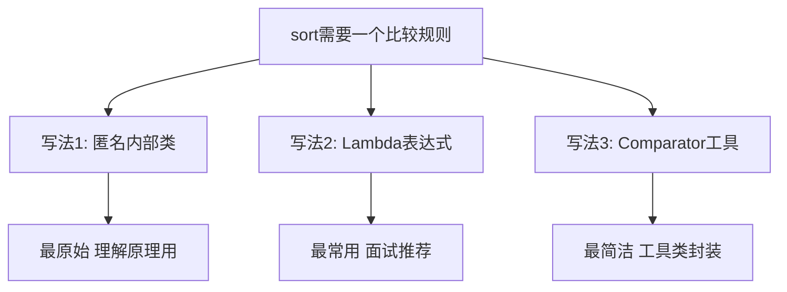
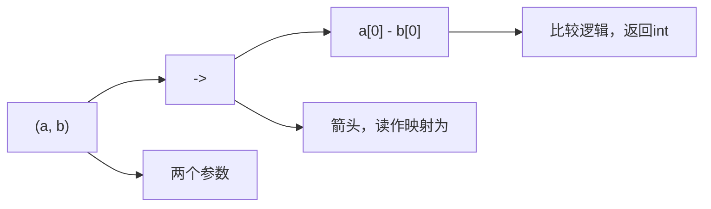

# Java排序Lambda写法详解
## 一、排序的本质
排序的本质是比较两个元素谁大谁小。Lambda就是告诉sort方法：给你两个元素a和b，返回一个int值决定谁排前面。

## 二、返回值规则（核心，只记这一条）
| 返回值 | 含义 | 结果 |
|--------|------|------|
| 负数 | a排前面 | a在b前 |
| 正数 | b排前面 | b在a前 |
| 零 | 相等 | 位置不变 |
所以 a-b 就是升序，b-a 就是降序：
| 序号 | 表达式 | 举例a=1且b=3 | 结果 | 含义 |
|------|--------|-------------|------|------|
| 1 | a - b | 1-3=-2 负数 | a排前面 | 小的在前=升序 |
| 2 | b - a | 3-1=2 正数 | b排前面 | 大的在前=降序 |
**口诀：a-b升序，b-a降序**
## 三、从冗长到简洁的4种写法
以二维数组按左端点排序为例：
```java
int[][] intervals = {{2,6},{1,3},{8,10}};
```
### 3.1 写法1：匿名内部类（理解原理用）
```java
Arrays.sort(intervals, new Comparator<int[]>() {
    @Override
    public int compare(int[] a, int[] b) {
        return a[0] - b[0];
    }
});
```
### 3.2 写法2：Lambda表达式（面试推荐）
```java
Arrays.sort(intervals, (a, b) -> a[0] - b[0]);
```
### 3.3 写法3：Integer.compare（防溢出）
```java
Arrays.sort(intervals, (a, b) -> Integer.compare(a[0], b[0]));
```
### 3.4 写法4：Comparator工具类（最简洁）
```java
Arrays.sort(intervals, Comparator.comparingInt(a -> a[0]));
```
### 3.5 四种写法对比
| 序号 | 写法 | 简洁度 | 面试推荐 |
|------|------|--------|----------|
| 1 | 匿名内部类 | 最冗长 | 不推荐，理解用 |
| 2 | Lambda | 简洁 | 最推荐 |
| 3 | Integer.compare | 稍长 | 追问溢出时用 |
| 4 | Comparator工具 | 最简洁 | 简单排序可用 |
## 四、Lambda箭头怎么读
```java
(a, b) -> a[0] - b[0]
```

读法：拿到a和b两个元素，用a的第0个值减b的第0个值来决定顺序。
## 五、常见排序场景速查表
### 5.1 数组排序
| 序号 | 场景 | 代码 |
|------|------|------|
| 1 | 一维数组升序 | Arrays.sort(arr) |
| 2 | 一维数组降序 | Arrays.sort(arr, (a,b) -> b-a)，需要Integer类型 |
| 3 | 二维数组按左端点升序 | Arrays.sort(arr, (a,b) -> a[0]-b[0]) |
| 4 | 二维数组按右端点升序 | Arrays.sort(arr, (a,b) -> a[1]-b[1]) |
| 5 | 二维数组按左端点升序相同则右端点降序 | Arrays.sort(arr, (a,b) -> a[0]!=b[0] ? a[0]-b[0] : b[1]-a[1]) |
### 5.2 字符串排序
| 序号 | 场景 | 代码 |
|------|------|------|
| 1 | 按字典序升序 | Arrays.sort(strs, (a,b) -> a.compareTo(b)) |
| 2 | 按长度升序 | Arrays.sort(strs, (a,b) -> a.length()-b.length()) |
| 3 | 按长度升序-工具类写法 | Arrays.sort(strs, Comparator.comparingInt(String::length)) |
### 5.3 集合排序
| 序号 | 场景 | 代码 |
|------|------|------|
| 1 | List按元素升序 | list.sort((a,b) -> a-b) |
| 2 | List按对象字段排序 | list.sort(Comparator.comparingInt(o -> o.val)) |
| 3 | List多字段排序 | list.sort(Comparator.comparingInt(Student::getAge).thenComparing(Student::getName)) |
### 5.4 优先队列
| 序号 | 场景 | 代码 |
|------|------|------|
| 1 | 小顶堆（默认） | new PriorityQueue<>() |
| 2 | 小顶堆-显式写法 | new PriorityQueue<>((a,b) -> a-b) |
| 3 | 大顶堆 | new PriorityQueue<>((a,b) -> b-a) |
| 4 | 按数组第一个元素小顶堆 | new PriorityQueue<>((a,b) -> a[0]-b[0]) |
## 六、a-b的溢出陷阱
```java
// 当a和b的值很极端时，a-b可能整数溢出！
int a = Integer.MAX_VALUE;  // 2147483647
int b = -1;
// a - b = 2147483647 - (-1) = 2147483648 → 溢出变成负数！
```
| 序号 | 写法 | 简洁度 | 安全性 | 使用建议 |
|------|------|--------|--------|----------|
| 1 | a-b | 最简洁 | 可能溢出 | 值在正常范围内可用 |
| 2 | Integer.compare(a,b) | 稍长 | 不会溢出 | 更安全推荐 |
面试策略：先写a-b，面试官追问溢出时再改为Integer.compare，展示深度。
## 七、刷题常用排序代码（直接背）
### 7.1 合并区间LC56
```java
Arrays.sort(intervals, (a, b) -> a[0] - b[0]);
```
### 7.2 会议室LC253
```java
Arrays.sort(intervals, (a, b) -> a[0] - b[0]);
PriorityQueue<Integer> pq = new PriorityQueue<>();  // 小顶堆存结束时间
```
### 7.3 三数之和LC15
```java
Arrays.sort(nums);  // 基本类型直接升序
```
### 7.4 前K个高频元素LC347
```java
PriorityQueue<int[]> pq = new PriorityQueue<>((a, b) -> a[1] - b[1]);  // 按频率小顶堆
```
### 7.5 合并K个链表LC23
```java
PriorityQueue<ListNode> pq = new PriorityQueue<>((a, b) -> a.val - b.val);  // 按节点值小顶堆
```
### 7.6 字母异位词LC49
```java
char[] chars = str.toCharArray();
Arrays.sort(chars);  // 字符数组排序
String key = new String(chars);
```
## 八、记忆口诀
```
Lambda排序要记牢，
a减b来升序跑，
b减a就降序到，
箭头左边两参数，
箭头右边比大小。
溢出风险要知道，
Integer.compare更可靠。
面试先写a减b，
追问再改不迟到。
```
