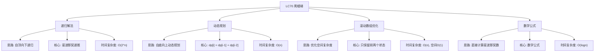

# 03-19-00-00 LC70_爬楼梯解法分析
## 题目描述
假设你正在爬楼梯。需要 n 阶你才能到达楼顶。每次你可以爬 1 或 2 个台阶。你有多少种不同的方法可以爬到楼顶？
**示例：**
输入：n = 2
输出：2
解释：有两种方法可以爬到楼顶。1. 1 阶 + 1 阶 2. 2 阶
输入：n = 3
输出：3
解释：有三种方法可以爬到楼顶。1. 1 阶 + 1 阶 + 1 阶 2. 1 阶 + 2 阶 3. 2 阶 + 1 阶
## 解法概览
### 思维导图

## 记忆口诀
**递归解法：** 自顶向下分解，斐波那契递推。
**动态规划：** 自底向上计算，状态转移方程。
**滚动数组：** 优化空间使用，只存前两个状态。
**数学公式：** 直接计算结果，时间复杂度最优。
## 不同解法
### 解法一：递归解法（普通解法）
#### 思路
使用递归的方法，自顶向下地分解问题。对于第n阶楼梯，到达它的方法数等于到达第n-1阶的方法数加上到达第n-2阶的方法数，因为每次可以爬1或2个台阶。
#### 核心公式
- 递归基：f(1) = 1, f(2) = 2
- 递归公式：f(n) = f(n-1) + f(n-2)
#### 图解过程
以n=3为例：
- f(3) = f(2) + f(1) = 2 + 1 = 3
- f(2) = 2
- f(1) = 1
#### 代码示例
```java
public int climbStairs(int n) {
    if (n == 1) {
        return 1;
    }
    if (n == 2) {
        return 2;
    }
    return climbStairs(n - 1) + climbStairs(n - 2);
}
```
#### 复杂度分析
- 时间复杂度：O(2^n)，因为每个递归调用都会产生两个子调用，导致指数级的时间复杂度
- 空间复杂度：O(n)，递归栈的深度为n
#### 优缺点
- 优点：代码简洁，易于理解
- 缺点：时间复杂度指数级，会超时，不适合处理较大的n
### 解法二：动态规划（最优解）
#### 思路
使用动态规划的方法，自底向上地计算。创建一个dp数组，其中dp[i]表示到达第i阶楼梯的方法数。根据递推关系，dp[i] = dp[i-1] + dp[i-2]。
#### 核心公式
- 状态定义：dp[i] 表示到达第i阶楼梯的方法数
- 状态转移方程：dp[i] = dp[i-1] + dp[i-2]
- 初始条件：dp[1] = 1, dp[2] = 2
#### 图解过程
以n=3为例：
- dp[1] = 1
- dp[2] = 2
- dp[3] = dp[2] + dp[1] = 2 + 1 = 3
#### 代码示例（带详细注释）
```java
public int climbStairs(int n) {
    if (n == 1) {
        return 1;
    }
    // 创建dp数组，dp[i]表示到达第i阶楼梯的方法数
    int[] dp = new int[n + 1];
    // 初始条件
    dp[1] = 1;
    dp[2] = 2;
    // 自底向上计算
    for (int i = 3; i <= n; i++) {
        // 状态转移方程：到达第i阶的方法数等于到达第i-1阶和第i-2阶的方法数之和
        dp[i] = dp[i - 1] + dp[i - 2];
    }
    return dp[n];
}
```
#### 复杂度分析
- 时间复杂度：O(n)，只需一次遍历
- 空间复杂度：O(n)，需要数组存储状态
#### 优缺点
- **优点：**
  - 时间复杂度线性，效率高
  - 逻辑清晰，易于理解
- **缺点：** 空间复杂度为O(n)，可以进一步优化
### 解法三：滚动数组优化
#### 思路
注意到动态规划中，计算dp[i]只需要用到dp[i-1]和dp[i-2]，因此可以使用滚动数组的方法，只保留前两个状态，从而将空间复杂度优化到O(1)。
#### 核心公式
- 状态定义：使用三个变量a, b, c分别表示前两个状态和当前状态
- 状态转移：c = a + b
- 滚动更新：a = b, b = c
#### 图解过程
以n=3为例：
- 初始：a=1（表示dp[1]）, b=2（表示dp[2]）
- 计算dp[3]：c = a + b = 1 + 2 = 3
- 更新：a=2, b=3
- 返回b=3
#### 代码示例
```java
public int climbStairs(int n) {
    if (n == 1) {
        return 1;
    }
    if (n == 2) {
        return 2;
    }
    // a表示dp[i-2]，b表示dp[i-1]
    int a = 1, b = 2;
    for (int i = 3; i <= n; i++) {
        // 计算dp[i] = dp[i-1] + dp[i-2]
        int c = a + b;
        // 滚动更新
        a = b;
        b = c;
    }
    return b;
}
```
#### 复杂度分析
- 时间复杂度：O(n)，只需一次遍历
- 空间复杂度：O(1)，只需要常数级别的额外空间
#### 优缺点
- **优点：**
  - 时间复杂度线性，效率高
  - 空间复杂度最优，适合处理大规模数据
- **缺点：** 代码可读性略低于动态规划解法
### 解法四：数学公式
#### 思路
爬楼梯问题本质上是一个斐波那契数列问题，第n阶的方法数等于斐波那契数列的第n+1项。可以使用数学公式直接计算斐波那契数列的第n项。
#### 核心公式
- 斐波那契数列的通项公式：F(n) = [((1+√5)/2)^(n+1) - ((1-√5)/2)^(n+1)] / √5
- 由于结果是整数，可以取整得到最终结果
#### 图解过程
以n=3为例：
- 计算F(4) = [((1+√5)/2)^4 - ((1-√5)/2)^4] / √5 ≈ 3
#### 代码示例
```java
public int climbStairs(int n) {
    double sqrt5 = Math.sqrt(5);
    double fibn = Math.pow((1 + sqrt5) / 2, n + 1) - Math.pow((1 - sqrt5) / 2, n + 1);
    return (int) Math.round(fibn / sqrt5);
}
```
#### 复杂度分析
- 时间复杂度：O(logn)，因为Math.pow的时间复杂度是O(logn)
- 空间复杂度：O(1)，只需要常数级别的额外空间
#### 优缺点
- **优点：**
  - 时间复杂度最优，适合处理非常大的n
  - 空间复杂度低
- **缺点：**
  - 代码可读性差
  - 涉及浮点数计算，可能存在精度问题
## 面试回答模板
**问题：** 请计算爬楼梯的不同方法数。
**回答：**
这是一道经典的动态规划问题，主要有四种解法：
1. **递归解法**：自顶向下地分解问题，使用斐波那契递推公式。时间复杂度O(2^n)，会超时，不适合处理较大的n。
2. **动态规划**：自底向上地计算，使用dp数组存储每个台阶的方法数。时间复杂度O(n)，空间复杂度O(n)，逻辑清晰易于理解。
3. **滚动数组优化**：注意到计算只需要前两个状态，使用滚动数组将空间复杂度优化到O(1)。时间复杂度O(n)，空间复杂度O(1)，是面试中的推荐解法。
4. **数学公式**：使用斐波那契数列的通项公式直接计算。时间复杂度O(logn)，空间复杂度O(1)，但代码可读性差，可能存在精度问题。
**最优选择：** 滚动数组优化的动态规划解法是面试中的最优选择，因为它在保证时间复杂度O(n)的同时，空间复杂度为O(1)，代码简洁且易于理解。
## 相关题目
1. **LC509：斐波那契数** - 直接计算斐波那契数列
2. **LC746：使用最小花费爬楼梯** - 爬楼梯的变种，加入了花费
3. **LC198：打家劫舍** - 动态规划的经典应用
4. **LC213：打家劫舍 II** - 打家劫舍的环形变种
这些题目都涉及到动态规划的思想，与LC70_爬楼梯有一定的关联性。