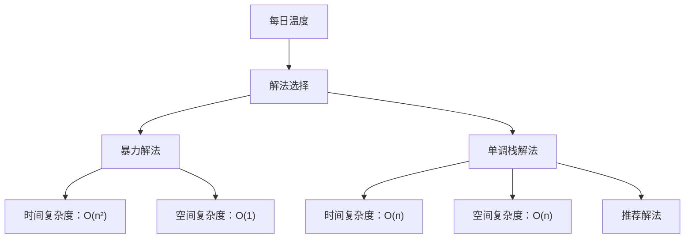

# LC739_每日温度解法分析
## 题目描述
给定一个整数数组 `temperatures`，表示每天的温度，返回一个数组 `answer`，其中 `answer[i]` 是指对于第 `i` 天，下一个更高温度出现在几天后。如果气温在这之后都不会升高，请在该位置用 `0` 来代替。
**示例：**
- 输入: temperatures = [73,74,75,71,69,72,76,73]
- 输出: [1,1,4,2,1,1,0,0]
**提示：**
- 1 ≤ temperatures.length ≤ 10^5
- 30 ≤ temperatures[i] ≤ 100
## 解法概览

## 记忆口诀
**暴力解法**：双重循环逐个找，时间复杂度有点高
**单调栈**：递减栈来维护，遇到高温就计算
## 解法一：暴力解法
### 思路
对于每个温度，遍历其后面的所有温度，找到第一个比它高的温度，计算两者之间的天数差。如果遍历完所有后面的温度都没有找到更高的，则置为0。
### 核心公式
对于每个 i (0 ≤ i < n)：
- 遍历 j 从 i+1 到 n-1
- 找到第一个 temperatures[j] > temperatures[i] 的位置
- answer[i] = j - i
- 如果没有找到，answer[i] = 0
### 图解过程
```
temperatures = [73,74,75,71,69,72,76,73]
i=0 (73):
- j=1, 74>73 → answer[0]=1
i=1 (74):
- j=2, 75>74 → answer[1]=1
i=2 (75):
- j=3, 71<75
- j=4, 69<75
- j=5, 72<75
- j=6, 76>75 → answer[2]=4
i=3 (71):
- j=4, 69<71
- j=5, 72>71 → answer[3]=2
i=4 (69):
- j=5, 72>69 → answer[4]=1
i=5 (72):
- j=6, 76>72 → answer[5]=1
i=6 (76):
- 无后续温度 → answer[6]=0
i=7 (73):
- 无后续温度 → answer[7]=0
```
### 代码示例
```java
public int[] dailyTemperatures(int[] temperatures) {
    if (temperatures == null) {
        return new int[]{};
    }
    int n = temperatures.length;
    int[] answer = new int[n];
    for (int i = 0; i < n; i++) {
        for (int j = i + 1; j < n; j++) {
            if (temperatures[j] > temperatures[i]) {
                answer[i] = j - i;
                break;
            }
        }
        // 如果没有找到，answer[i] 保持为0
    }
    return answer;
}
```
### 复杂度分析
- **时间复杂度**：O(n²)，其中 n 是温度数组的长度。最坏情况下，每个元素都需要遍历后面的所有元素。
- **空间复杂度**：O(1)，只使用了常数级别的额外空间。
### 优缺点
- **优点**：实现简单，容易理解。
- **缺点**：时间复杂度较高，对于大规模输入（如题目提示中的 10^5 长度）会超时。
## 解法二：单调栈解法
### 思路
使用一个单调递减栈来维护温度的索引。遍历温度数组，对于每个温度，如果当前温度大于栈顶索引对应的温度，则弹出栈顶元素并计算天数差，直到栈为空或当前温度小于等于栈顶索引对应的温度，然后将当前索引压入栈中。
### 核心公式
- 栈中存储的是温度的索引，对应温度值单调递减
- 当遇到比栈顶温度高的温度时，弹出栈顶元素并计算天数差：`answer[栈顶索引] = 当前索引 - 栈顶索引`
- 继续检查新的栈顶元素，直到栈为空或当前温度小于等于栈顶温度
- 将当前索引压入栈中
### 图解过程
```
temperatures = [73,74,75,71,69,72,76,73]
stack = [], answer = [0,0,0,0,0,0,0,0]
i=0 (73):
- 栈空，压入0 → stack = [0]
i=1 (74):
- 74>73，弹出0 → answer[0]=1-0=1
- 栈空，压入1 → stack = [1]
i=2 (75):
- 75>74，弹出1 → answer[1]=2-1=1
- 栈空，压入2 → stack = [2]
i=3 (71):
- 71<75，压入3 → stack = [2,3]
i=4 (69):
- 69<71，压入4 → stack = [2,3,4]
i=5 (72):
- 72>69，弹出4 → answer[4]=5-4=1
- 72>71，弹出3 → answer[3]=5-3=2
- 72<75，压入5 → stack = [2,5]
i=6 (76):
- 76>72，弹出5 → answer[5]=6-5=1
- 76>75，弹出2 → answer[2]=6-2=4
- 栈空，压入6 → stack = [6]
i=7 (73):
- 73<76，压入7 → stack = [6,7]
最终 answer = [1,1,4,2,1,1,0,0]
```
### 代码示例
```java
public int[] dailyTemperatures(int[] temperatures) {
    if (temperatures == null) {
        return new int[]{};
    }
    int[] res = new int[temperatures.length];
    Deque<Integer> stack = new LinkedList<>();
    for (int i = 0; i < temperatures.length; i++) {
        while (!stack.isEmpty() && temperatures[i] > temperatures[stack.peek()]) {
            int index = stack.pop();
            res[index] = i - index;
        }
        stack.push(i);
    }
    return res;
}
```
### 复杂度分析
- **时间复杂度**：O(n)，其中 n 是温度数组的长度。每个元素最多入栈和出栈一次。
- **空间复杂度**：O(n)，最坏情况下，栈需要存储所有元素的索引。
### 优缺点
- **优点**：时间复杂度低，适用于大规模输入。
- **缺点**：需要额外的栈空间，实现相对复杂一些。
## 面试回答模板
**问题**：请你解决 LC739_每日温度 问题。
**回答**：
这个问题是要找出每个温度之后第一个更高温度的天数。我可以提供两种解法：
首先，最直接的暴力解法是双重循环，对于每个温度，遍历其后面的所有温度，找到第一个更高的温度并计算天数差。这种方法实现简单，但时间复杂度是 O(n²)，对于大规模输入可能会超时。
更优的解法是使用单调栈。我们维护一个单调递减栈，存储温度的索引。遍历温度数组时，对于每个温度，如果它大于栈顶索引对应的温度，就弹出栈顶元素并计算天数差，直到栈为空或当前温度不大于栈顶温度，然后将当前索引压入栈中。这种方法的时间复杂度是 O(n)，空间复杂度是 O(n)，适用于处理大规模输入。
我推荐使用单调栈解法，因为它在时间复杂度上更优，而且对于这种需要找到下一个更大元素的问题，单调栈是一种常见且有效的方法。
## 相关题目
1. **LC496_下一个更大元素 I**：寻找数组中每个元素的下一个更大元素。
2. **LC503_下一个更大元素 II**：循环数组中的下一个更大元素。
3. **LC901_股票价格跨度**：计算股票价格的跨度，类似寻找连续小于等于当前价格的天数。
4. **LC84_柱状图中最大的矩形**：使用单调栈找到每个柱子左右两侧的第一个更小元素。
5. **LC85_最大矩形**：在二维矩阵中找到最大的矩形，可使用单调栈扩展 LC84 的思路。