# 单调递减栈原理解释
## 为什么要用单调递减栈？
### 问题本质
我们需要为每个温度找到**下一个更高温度**的位置。
### 暴力解法的问题
暴力解法是双重循环：
- 对于每个位置 i，向后遍历所有 j > i
- 找到第一个 temperatures[j] > temperatures[i] 的位置
- 时间复杂度：O(n²)
**问题**：存在大量重复比较
### 关键观察
当我们从左到右遍历温度数组时：
- 如果当前温度比之前的某个温度高，它可能是那个温度的答案
- 如果当前温度比之前的某个温度低，它需要等待未来更高的温度
### 单调递减栈的工作原理
#### 栈的特性
- **栈中存储的是索引**，对应温度值**从栈底到栈顶递减**
- **后进先出**：新元素从栈顶比较，匹配成功后从栈顶弹出
#### 工作过程图解

```mermaid
flowchart TD
    subgraph 遍历过程
        A["初始状态"] --> B["处理第一个元素"]
        B --> C["处理第二个元素"]
        C --> D["处理后续元素"]
        D --> E["完成遍历"]
    end
    subgraph 栈的变化
        A1["栈：空"] --> B1["栈：[0]"]
        B1 --> C1["栈：[1]"]
        C1 --> D1["栈：[2,3,4]"]
        D1 --> E1["栈：[6,7]"]
    end
    subgraph 答案生成
        A2["答案：[0,0,0,0,0,0,0,0]"] --> B2["答案：[1,0,0,0,0,0,0,0]"]
        B2 --> C2["答案：[1,1,0,0,0,0,0,0]"]
        C2 --> D2["答案：[1,1,4,2,1,1,0,0]"]
        D2 --> E2["答案：[1,1,4,2,1,1,0,0]"]
    end
```

### 详细过程演示
#### 输入：[73, 74, 75, 71, 69, 72, 76, 73]
| 步骤 | 当前温度 | 温度值 | 栈状态 | 操作 | 答案数组 |
|------|---------|--------|--------|------|----------|
| 1 | i=0 | 73 | [] | 栈空，入栈 | [0,0,0,0,0,0,0,0] |
| 2 | i=1 | 74 | [0] | 74>73，弹出0，计算1-0=1 | [1,0,0,0,0,0,0,0] |
| 3 | i=1 | 74 | [] | 栈空，入栈 | [1,0,0,0,0,0,0,0] |
| 4 | i=2 | 75 | [1] | 75>74，弹出1，计算2-1=1 | [1,1,0,0,0,0,0,0] |
| 5 | i=2 | 75 | [] | 栈空，入栈 | [1,1,0,0,0,0,0,0] |
| 6 | i=3 | 71 | [2] | 71<75，入栈 | [1,1,0,0,0,0,0,0] |
| 7 | i=4 | 69 | [2,3] | 69<71，入栈 | [1,1,0,0,0,0,0,0] |
| 8 | i=5 | 72 | [2,3,4] | 72>69，弹出4，计算5-4=1 | [1,1,0,0,1,0,0,0] |
| 9 | i=5 | 72 | [2,3] | 72>71，弹出3，计算5-3=2 | [1,1,0,2,1,0,0,0] |
| 10 | i=5 | 72 | [2] | 72<75，入栈 | [1,1,0,2,1,0,0,0] |
| 11 | i=6 | 76 | [2,5] | 76>72，弹出5，计算6-5=1 | [1,1,0,2,1,1,0,0] |
| 12 | i=6 | 76 | [2] | 76>75，弹出2，计算6-2=4 | [1,1,4,2,1,1,0,0] |
| 13 | i=6 | 76 | [] | 栈空，入栈 | [1,1,4,2,1,1,0,0] |
| 14 | i=7 | 73 | [6] | 73<76，入栈 | [1,1,4,2,1,1,0,0] |
### 为什么是递减栈？
**关键原因**：
1. **后进先出**：栈的特性使得我们总是从最近的元素开始比较
2. **递减顺序**：保证了栈中的元素都在等待一个更高的温度
3. **高效匹配**：遇到高温时，能一次性处理所有等待它的低温
#### 递减栈的优势
- **时间复杂度**：O(n)，每个元素最多入栈出栈一次
- **空间复杂度**：O(n)，最坏情况（温度递减）需要存储所有元素
- **直观性**：栈的状态直接反映了"等待状态"，易于理解
### 对比其他数据结构
| 数据结构 | 时间复杂度 | 空间复杂度 | 优缺点 |
|----------|------------|------------|--------|
| 暴力解法 | O(n²) | O(1) | 简单但慢 |
| 单调递减栈 | O(n) | O(n) | 高效但需要额外空间 |
| 其他栈结构 | O(n) | O(n) | 不符合问题特性 |
### 适用场景
单调递减栈适用于：
1. **下一个更大元素**问题
2. **下一个更高温度**问题
3. **寻找右侧第一个更大元素**问题
### 记忆方法
**口诀**：
- 找"下一个更大" → 用递减栈
- 栈顶元素最小，遇到更大的就弹出
- 一次处理所有能处理的元素
### 代码实现
```java
public int[] dailyTemperatures(int[] temperatures) {
    if (temperatures == null) {
        return new int[]{};
    }
    int[] res = new int[temperatures.length];
    Deque<Integer> stack = new LinkedList<>();
    for (int i = 0; i < temperatures.length; i++) {
        while (!stack.isEmpty() && temperatures[i] > temperatures[stack.peek()]) {
            int index = stack.pop();
            res[index] = i - index;
        }
        stack.push(i);
    }
    return res;
}
```
## 总结
单调递减栈是解决"下一个更大元素"问题的最优选择，因为：
1. 它利用栈的后进先出特性，从最近的元素开始比较
2. 它维护递减顺序，确保栈中的元素都在等待更高的温度
3. 它能一次性处理所有匹配的元素，避免重复比较
4. 它的时间复杂度是 O(n)，远优于暴力解法
通过观察数据的规律性和问题的特性，我们自然地推导出了使用单调递减栈的解法。