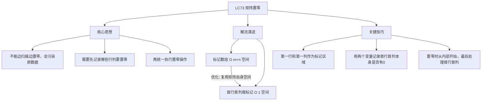
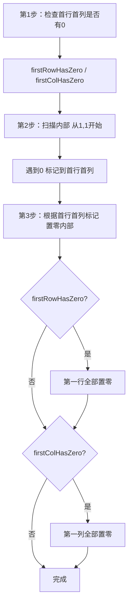

# LC73 矩阵置零
## 一、题目描述
给定一个 `m x n` 的矩阵，如果一个元素为 0，则将其所在**行**和**列**的所有元素都设为 0。请使用**原地**算法。
**示例1：**
```
输入：matrix = [[1,1,1],[1,0,1],[1,1,1]]
输出：[[1,0,1],[0,0,0],[1,0,1]]
  1 1 1      1 0 1
  1 0 1  →   0 0 0
  1 1 1      1 0 1
```
**示例2：**
```
输入：matrix = [[0,1,2,0],[3,4,5,2],[1,3,1,5]]
输出：[[0,0,0,0],[0,4,5,0],[0,3,1,0]]
  0 1 2 0      0 0 0 0
  3 4 5 2  →   0 4 5 0
  1 3 1 5      0 3 1 0
```
**约束：**
- m == matrix.length，n == matrix[0].length
- 1 <= m, n <= 200
- **进阶**：使用 O(1) 额外空间
---
## 二、解法概览
### 解法对比表
| 解法 | 时间复杂度 | 空间复杂度 | 面试推荐 |
|------|-----------|-----------|---------|
| 标记数组 | O(m×n) | O(m+n) | ✅ 普通解法 |
| **首行首列做标记** | O(m×n) | O(1) | ✅ **最优解** |
### 思维导图

---
## 三、记忆口诀
```
矩阵置零分两步，先标记来后置零
首行首列当标记，省掉额外的空间
两个变量记自身，最后再处理第一行列
从内到外来置零，顺序不能搞反了
```
---
## 四、解法一：标记数组
### 思路
用两个数组分别记录哪些行、哪些列需要置零：
1. 第一遍扫描：遇到 0 就标记对应的行和列
2. 第二遍扫描：根据标记将对应行列置零
### 核心公式
```
boolean[] rowZero = new boolean[m]  // 记录哪些行要置零
boolean[] colZero = new boolean[n]  // 记录哪些列要置零
第1遍：if matrix[i][j]==0 → rowZero[i]=true, colZero[j]=true
第2遍：if rowZero[i] || colZero[j] → matrix[i][j]=0
```
### 图解过程
```
matrix:          标记结果：          置零后：
  1 1 1          rowZero=[F,T,F]     1 0 1
  1 0 1          colZero=[F,T,F]     0 0 0
  1 1 1                              1 0 1
━━━━━━━━━━━━━━━━━━━━━━━━━━━━━━━━━━
第1遍扫描：
  i=1,j=1: matrix[1][1]=0
  → rowZero[1]=true, colZero[1]=true
━━━━━━━━━━━━━━━━━━━━━━━━━━━━━━━━━━
第2遍扫描：
  i=0: rowZero[0]=F
    j=0: colZero[0]=F → 不变(1)
    j=1: colZero[1]=T → 置零(0)  ← 第1列要置零
    j=2: colZero[2]=F → 不变(1)
  i=1: rowZero[1]=T → 整行置零   ← 第1行要置零
    j=0: 0  j=1: 0  j=2: 0
  i=2: rowZero[2]=F
    j=0: 不变(1)  j=1: 置零(0)  j=2: 不变(1)
```
### 代码示例
```java
public void setZeroes(int[][] matrix) {
    int m = matrix.length, n = matrix[0].length;
    boolean[] rowZero = new boolean[m];
    boolean[] colZero = new boolean[n];
    // 第1遍：标记哪些行列需要置零
    for (int i = 0; i < m; i++) {
        for (int j = 0; j < n; j++) {
            if (matrix[i][j] == 0) {
                rowZero[i] = true;
                colZero[j] = true;
            }
        }
    }
    // 第2遍：根据标记置零
    for (int i = 0; i < m; i++) {
        for (int j = 0; j < n; j++) {
            if (rowZero[i] || colZero[j]) {
                matrix[i][j] = 0;
            }
        }
    }
}
```
### 复杂度分析
- 时间复杂度：**O(m×n)**，两次遍历矩阵
- 空间复杂度：**O(m+n)**，两个标记数组
### 优缺点
| 优点 | 缺点 |
|-----|------|
| 思路直观、不容易出错 | 需要 O(m+n) 额外空间 |
| 面试中快速写出 | 不满足 O(1) 进阶要求 |
---
## 五、解法二：首行首列做标记（最优解 ✅）
### 思路
把解法一中的 `rowZero[]` 和 `colZero[]` **存到矩阵的第一行和第一列中**，省掉额外空间。
但第一行和第一列本身也可能要置零，所以需要**两个额外变量**先记录。
**四步走：**
1. 用两个变量记录第一行、第一列本身是否有 0
2. 用第一行、第一列作为标记区域（从 [1,1] 开始扫描）
3. 根据标记，从内部置零（不动第一行列）
4. 最后根据变量处理第一行和第一列
### 核心公式
```
firstRowHasZero：第一行本身是否有0
firstColHasZero：第一列本身是否有0
标记：matrix[i][j]==0 → matrix[i][0]=0, matrix[0][j]=0
置零：matrix[i][0]==0 || matrix[0][j]==0 → matrix[i][j]=0
最后：根据 firstRowHasZero/firstColHasZero 处理首行首列
```
### 为什么要先记录首行首列？
```
因为首行首列被复用为标记区域，标记过程会修改它们的值。
如果不提前记录，就无法区分：
  "首行某个0是原本就有的" vs "首行某个0是被标记上去的"
```
### 为什么置零要从内部开始，最后处理首行首列？
```
如果先把第一行置零了，那标记信息就丢了！
比如 matrix[0][2]=0 是标记"第2列要置零"
如果先处理首行把它变成0，后面就分不清了
所以必须：先用标记处理内部 → 最后处理首行首列
```
### 图解过程
原始矩阵与区域划分：
```
         列0  列1  列2  列3
行0  →  [ 0    1    2    0 ]  ← 首行（作为"列标记区域"）
行1  →  [ 3    4    5    2 ]
行2  →  [ 1    3    1    5 ]
         ↑
       首列（作为"行标记区域"）
首行首列的作用：
  matrix[0][j] = 0  表示"第j列需要置零"（列标记）
  matrix[i][0] = 0  表示"第i行需要置零"（行标记）
```
#### 第1步：记录首行首列本身是否有0
```
扫描首行 [0,1,2,0]：发现有0 → firstRowHasZero = true
扫描首列 [0,3,1]：  发现有0 → firstColHasZero = true
这两个变量单独存好，后面标记过程会修改首行首列的值
```
#### 第2步：扫描内部，遇到0就在首行首列做标记
```
扫描范围：i从1开始，j从1开始（跳过首行首列）
         列0  列1  列2  列3
行0       0    1    2    0       ← 标记区域，不扫描
行1       3   [4]  [5]  [2]     ← 扫描这些格子
行2       1   [3]  [1]  [5]     ← 扫描这些格子
逐个检查：
  [1][1]=4 不是0，跳过
  [1][2]=5 不是0，跳过
  [1][3]=2 不是0，跳过
  [2][1]=3 不是0，跳过
  [2][2]=1 不是0，跳过
  [2][3]=5 不是0，跳过
内部没有0 → 首行首列的标记没有变化
矩阵不变：
  0  1  2  0
  3  4  5  2
  1  3  1  5
```
#### 第3步：根据首行首列的标记，置零内部
```
对每个内部格子 [i][j]，检查两个标记：
  行标记 matrix[i][0] == 0 ？ → 整行要置零
  列标记 matrix[0][j] == 0 ？ → 整列要置零
  任一成立就置零
当前首行首列的标记值：
  首行：[0, 1, 2, 0]
         ↑         ↑
       列0标记=0  列3标记=0   → 第0列和第3列要置零
  首列：[0, 3, 1]
         ↑
       行0标记=0              → 第0行要置零（但第0行是首行，第4步处理）
注意：内部格子从i=1,j=1开始，所以行0标记和列0标记在这步不影响内部
逐个处理内部格子：
  [1][1]: 行标记 matrix[1][0]=3≠0, 列标记 matrix[0][1]=1≠0 → 不变(4)
  [1][2]: 行标记 matrix[1][0]=3≠0, 列标记 matrix[0][2]=2≠0 → 不变(5)
  [1][3]: 行标记 matrix[1][0]=3≠0, 列标记 matrix[0][3]=0   → 列标记命中！置零
  [2][1]: 行标记 matrix[2][0]=1≠0, 列标记 matrix[0][1]=1≠0 → 不变(3)
  [2][2]: 行标记 matrix[2][0]=1≠0, 列标记 matrix[0][2]=2≠0 → 不变(1)
  [2][3]: 行标记 matrix[2][0]=1≠0, 列标记 matrix[0][3]=0   → 列标记命中！置零
第3步后的矩阵：
  0  1  2  0       首行首列还没动
  3  4  5  0  ←  [1][3]因为列3标记=0被置零
  1  3  1  0  ←  [2][3]因为列3标记=0被置零
```
#### 第4步：根据变量处理首行首列本身
```
firstRowHasZero = true → 第一行全部置零
  行0: [0,1,2,0] → [0,0,0,0]
firstColHasZero = true → 第一列全部置零
  列0: [0,3,1] → [0,0,0]
最终矩阵：
  0  0  0  0  ←  首行被全部置零
  0  4  5  0  ←  首列[1][0]被置零
  0  3  1  0  ←  首列[2][0]被置零
与期望输出 [[0,0,0,0],[0,4,5,0],[0,3,1,0]] 一致 ✅
```
#### 四步汇总
```
原始:         第1步记录:           第2步标记:         第3步内部置零:     第4步首行首列:
0 1 2 0       firstRow=true       无变化(内部没0)     0 1 2 0            0 0 0 0
3 4 5 2  →    firstCol=true  →    0 1 2 0        →   3 4 5 0        →   0 4 5 0
1 3 1 5                           3 4 5 2            1 3 1 0            0 3 1 0
                                  1 3 1 5                               最终结果 ✅
```
### 算法流程图

### 代码示例
```java
public void setZeroes(int[][] matrix) {
    int m = matrix.length, n = matrix[0].length;
    // 第1步：记录首行、首列本身是否有0
    boolean firstRowHasZero = false;
    boolean firstColHasZero = false;
    for (int j = 0; j < n; j++) {
        if (matrix[0][j] == 0) {
            firstRowHasZero = true;
            break;
        }
    }
    for (int i = 0; i < m; i++) {
        if (matrix[i][0] == 0) {
            firstColHasZero = true;
            break;
        }
    }
    // 第2步：扫描内部，用首行首列做标记
    for (int i = 1; i < m; i++) {
        for (int j = 1; j < n; j++) {
            if (matrix[i][j] == 0) {
                matrix[i][0] = 0;  // 标记该行
                matrix[0][j] = 0;  // 标记该列
            }
        }
    }
    // 第3步：根据标记，置零内部
    for (int i = 1; i < m; i++) {
        for (int j = 1; j < n; j++) {
            if (matrix[i][0] == 0 || matrix[0][j] == 0) {
                matrix[i][j] = 0;
            }
        }
    }
    // 第4步：处理首行首列本身
    if (firstRowHasZero) {
        for (int j = 0; j < n; j++) {
            matrix[0][j] = 0;
        }
    }
    if (firstColHasZero) {
        for (int i = 0; i < m; i++) {
            matrix[i][0] = 0;
        }
    }
}
```
### 复杂度分析
- 时间复杂度：**O(m×n)**，常数次遍历矩阵
- 空间复杂度：**O(1)**，只用了两个布尔变量
### 优缺点
| 优点 | 缺点 |
|-----|------|
| 空间 O(1)，满足进阶要求 | 步骤多，容易遗漏 |
| 面试首选 | 需要理解"复用首行首列"的思想 |
| 不需要额外数组 | 置零顺序不能搞错 |
### 关键点总结
| 关键点 | 说明 |
|-------|------|
| 为什么不能边扫描边置零？ | 新产生的0会污染后续判断 |
| 为什么用首行首列做标记？ | 替代额外的 rowZero/colZero 数组 |
| 为什么需要两个额外变量？ | 首行首列被复用，需要提前记录它们自身是否有0 |
| 为什么先置零内部？ | 如果先处理首行首列，标记信息会丢失 |
---
## 六、面试回答模板
### 1. 开场：理解题意
> 这道题要求原地修改矩阵，把包含 0 的行和列全部置零。关键是不能边扫描边置零，否则会污染原始数据。
### 2. 思路：首行首列做标记
> 我把矩阵的第一行和第一列作为标记区域，替代额外的标记数组。先用两个变量记录首行首列本身是否有 0，然后扫描内部，遇到 0 就在首行首列对应位置做标记。
### 3. 四步走
> 第一步记录首行首列是否有0，第二步扫描内部做标记，第三步根据标记置零内部，第四步处理首行首列本身。
### 4. 关键细节（如果面试官问）
> 置零顺序很重要：必须先置零内部，最后处理首行首列。如果先处理首行首列，标记信息就丢了。
### 5. 复杂度
> 时间 O(m×n)，空间 O(1)，只用了两个布尔变量。
---
## 七、相关题目
| 题号 | 题目 | 关系 | 难度 |
|-----|------|------|-----|
| LC289 | 生命游戏 | 同样原地标记思想 | 中等 |
| LC48 | 旋转图像 | 矩阵原地操作 | 中等 |
| LC54 | 螺旋矩阵 | 矩阵遍历 | 中等 |
| LC36 | 有效的数独 | 矩阵行列标记 | 中等 |
| LC130 | 被围绕的区域 | 矩阵标记+置换 | 中等 |