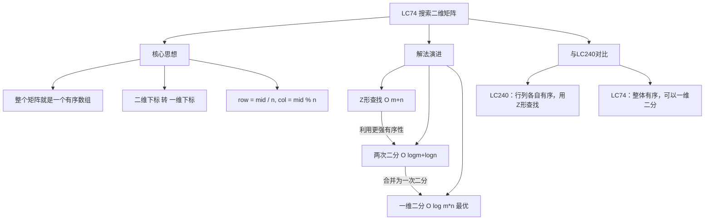
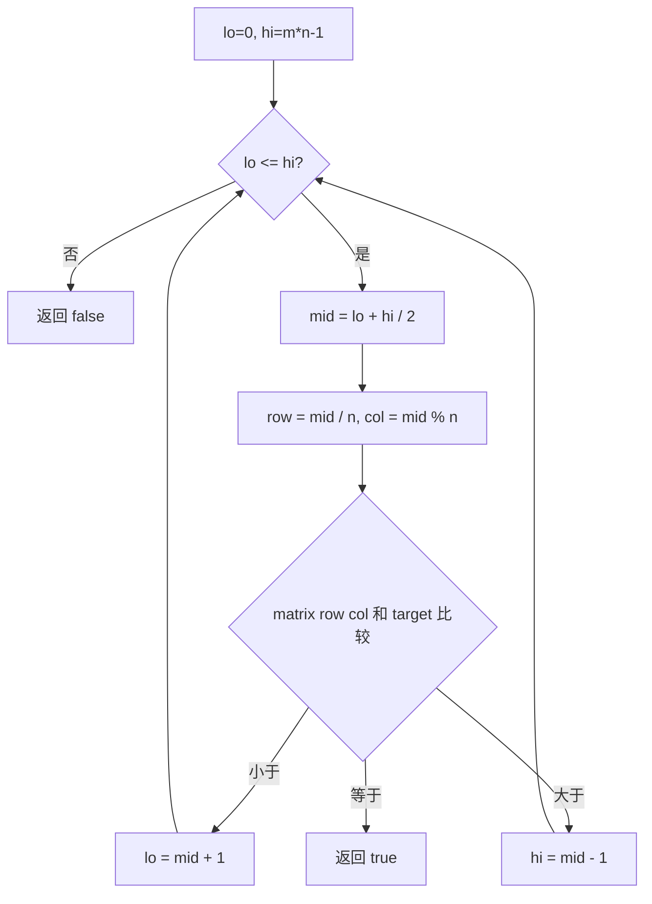

# LC74 搜索二维矩阵
## 一、题目描述
给你一个满足下述两条属性的 `m x n` 整数矩阵：
- 每行中的整数从左到右按非严格递增顺序排列
- 每行的第一个整数**大于**前一行的最后一个整数
给你一个整数 `target`，如果 `target` 在矩阵中，返回 `true`；否则返回 `false`。
**示例1：**
```
matrix = [[1,3,5,7],[10,11,16,20],[23,30,34,60]]
target = 3 → true
  1   3   5   7
  10  11  16  20
  23  30  34  60
整个矩阵展开就是一个严格递增的一维数组
```
**示例2：**
```
matrix = [[1,3,5,7],[10,11,16,20],[23,30,34,60]]
target = 13 → false
```
**约束：**
- m == matrix.length，n == matrix[i].length
- 1 <= m, n <= 100
**与 LC240 的区别：**
```
LC240：每行递增 + 每列递增（行与行之间有交叉）
LC74 ：每行递增 + 下一行首 > 上一行尾（整体严格递增）
LC74 的有序性更强，可以展开为一维数组做二分
```
---
## 二、解法概览
### 解法对比表
| 解法 | 时间复杂度 | 空间复杂度 | 面试推荐 |
|------|-----------|-----------|---------|
| Z形查找（右上角） | O(m+n) | O(1) | ✅ 通用解法 |
| 两次二分 | O(logm + logn) | O(1) | ✅ 推荐 |
| **展开为一维二分** | O(log(m×n)) | O(1) | ✅ **最优解** |
### 思维导图

---
## 三、记忆口诀
```
搜索矩阵看条件，下行首大于上行尾
整体有序展一维，一次二分最高效
mid除n得行号，mid模n得列号
二维变一维，二分老套路
```
---
## 四、解法一：Z形查找（右上角出发）
### 思路
和 LC240 一样，从右上角出发：大了往左，小了往下。LC74 的有序性更强，这个方法也能用，但没有充分利用"整体有序"的特性。
### 核心公式
```
从右上角 (0, n-1) 出发
matrix[i][j] > target → j--
matrix[i][j] < target → i++
matrix[i][j] == target → 找到
```
### 图解过程
```
matrix = [[1,3,5,7],[10,11,16,20],[23,30,34,60]]
target = 11
起点(0,3)=7:  7<11 → i++
(1,3)=20:    20>11 → j--
(1,2)=16:    16>11 → j--
(1,1)=11:    11==11 → 找到 ✅
```
### 代码示例
```java
public boolean searchMatrix(int[][] matrix, int target) {
    int m = matrix.length, n = matrix[0].length;
    int i = 0, j = n - 1;
    while (i < m && j >= 0) {
        if (matrix[i][j] > target) {
            j--;
        } else if (matrix[i][j] < target) {
            i++;
        } else {
            return true;
        }
    }
    return false;
}
```
### 复杂度分析
- 时间复杂度：**O(m+n)**，最多走 m+n 步
- 空间复杂度：**O(1)**
### 优缺点
| 优点 | 缺点 |
|-----|------|
| LC240也能用，通用 | 没充分利用整体有序 |
| 代码简单 | 不是最优 |
---
## 五、解法二：两次二分查找
### 思路
先二分确定 target 在哪一行，再在那一行中二分查找 target。
- 第一次二分：找最后一个首元素 <= target 的行
- 第二次二分：在该行内查找 target
### 核心公式
```
第1次二分：找 target 所在的行
  比较 matrix[mid][0] 和 target
第2次二分：在该行内查找
  比较 matrix[row][mid] 和 target
```
### 图解过程
```
matrix = [[1,3,5,7],[10,11,16,20],[23,30,34,60]]
target = 11
━━━━━━━━━━━━━━━━━━━━━━━━━━━━━━━━━━
第1次二分：确定行（比较每行首元素）
  行首元素：[1, 10, 23]
  lo=0, hi=2, mid=1: matrix[1][0]=10 <= 11 → lo=2
  lo=2, hi=2, mid=2: matrix[2][0]=23 > 11  → hi=1
  lo=2 > hi=1，退出。row = hi = 1（第1行）
━━━━━━━━━━━━━━━━━━━━━━━━━━━━━━━━━━
第2次二分：在第1行 [10, 11, 16, 20] 中查找
  lo=0, hi=3, mid=1: matrix[1][1]=11 == 11 → 找到 ✅
```
### 代码示例
```java
public boolean searchMatrix(int[][] matrix, int target) {
    int m = matrix.length, n = matrix[0].length;
    // 第1次二分：确定行
    int lo = 0, hi = m - 1;
    while (lo <= hi) {
        int mid = lo + (hi - lo) / 2;
        if (matrix[mid][0] <= target) {
            lo = mid + 1;
        } else {
            hi = mid - 1;
        }
    }
    // hi 就是 target 所在的行（最后一个首元素 <= target 的行）
    if (hi < 0) return false;
    int row = hi;
    // 第2次二分：在该行内查找
    lo = 0;
    hi = n - 1;
    while (lo <= hi) {
        int mid = lo + (hi - lo) / 2;
        if (matrix[row][mid] == target) {
            return true;
        } else if (matrix[row][mid] < target) {
            lo = mid + 1;
        } else {
            hi = mid - 1;
        }
    }
    return false;
}
```
### 复杂度分析
- 时间复杂度：**O(logm + logn)**，两次二分
- 空间复杂度：**O(1)**
### 优缺点
| 优点 | 缺点 |
|-----|------|
| 思路直观：先定行再定列 | 代码较长 |
| 比Z形查找更快 | 不如一维二分简洁 |
---
## 六、解法三：展开为一维二分（最优解 ✅）
### 思路
因为"下一行首 > 上一行尾"，整个矩阵按行展开就是一个**严格递增的一维数组**。直接对这个"虚拟一维数组"做二分，通过**下标转换**访问二维矩阵。
### 核心公式
```
把 m×n 的矩阵看作长度为 m*n 的一维数组
一维下标 mid → 二维下标：
  row = mid / n
  col = mid % n
```
### 下标转换怎么理解？
**电影院找座位**：假设每排 n=4 个座位，座位从0开始编号：
```
第0排：座位0   座位1   座位2   座位3
第1排：座位4   座位5   座位6   座位7
第2排：座位8   座位9   座位10  座位11
```
你的票是**座位7**，怎么找到在哪排哪列？
```
row = 7 / 4 = 1  → 第1排（7个座位填满1整排还剩3个）
col = 7 % 4 = 3  → 第3列（填完整排后剩下的就是列号）
座位7 = 第1排第3列 ✅
```
**除法和取余的本质：**
```
mid / n = 填满了几整排  → 行号
mid % n = 填完整排后剩几个 → 列号
```
验证所有下标：
```
每排 n=4 个座位
mid=0:  0/4=0, 0%4=0  → [0][0] ✅ 第一个
mid=3:  3/4=0, 3%4=3  → [0][3] ✅ 第一排最后一个
mid=4:  4/4=1, 4%4=0  → [1][0] ✅ 第二排第一个（刚好换行）
mid=5:  5/4=1, 5%4=1  → [1][1] ✅
mid=10: 10/4=2, 10%4=2 → [2][2] ✅
mid=11: 11/4=2, 11%4=3 → [2][3] ✅ 最后一个
```
**反向理解：二维转一维**
```
二维 → 一维：mid = row × n + col
一维 → 二维：row = mid / n, col = mid % n
它们互为逆运算：
  matrix[1][2]，n=4
  → 一维下标 = 1×4 + 2 = 6
  → 反推：6/4=1(行), 6%4=2(列) → 回到了 [1][2] ✅
```
> 一句话记忆：**除法定行，取余定列**。就像知道每排几个座位，算你坐第几排第几个。
### 图解过程
```
matrix = [[1,3,5,7],[10,11,16,20],[23,30,34,60]]
m=3, n=4, 展开为一维：[1,3,5,7,10,11,16,20,23,30,34,60]
target = 11
━━━━━━━━━━━━━━━━━━━━━━━━━━━━━━━━━━
lo=0, hi=11, mid=5
  row=5/4=1, col=5%4=1 → matrix[1][1]=11
  11 == 11 → 找到 ✅
一步命中！
━━━━━━━━━━━━━━━━━━━━━━━━━━━━━━━━━━
另一个例子 target=16：
lo=0, hi=11, mid=5 → matrix[1][1]=11 < 16 → lo=6
lo=6, hi=11, mid=8 → matrix[2][0]=23 > 16 → hi=7
lo=6, hi=7,  mid=6 → matrix[1][2]=16 == 16 → 找到 ✅
```
### 算法流程图

### 代码示例
```java
public boolean searchMatrix(int[][] matrix, int target) {
    int m = matrix.length, n = matrix[0].length;
    int lo = 0, hi = m * n - 1;
    while (lo <= hi) {
        int mid = lo + (hi - lo) / 2;
        // 一维下标 → 二维下标
        int row = mid / n;
        int col = mid % n;
        if (matrix[row][col] == target) {
            return true;
        } else if (matrix[row][col] < target) {
            lo = mid + 1;
        } else {
            hi = mid - 1;
        }
    }
    return false;
}
```
### 复杂度分析
- 时间复杂度：**O(log(m×n))**，等价于 O(logm + logn)，一次二分
- 空间复杂度：**O(1)**
### 优缺点
| 优点 | 缺点 |
|-----|------|
| 代码最简洁 | 需要理解下标转换 |
| 一次二分搞定 | 只适用于整体有序的矩阵 |
| 面试首选 | 不适用于LC240 |
### 关键点总结
| 关键点 | 说明 |
|-------|------|
| 前提条件 | 下一行首 > 上一行尾，整体严格递增 |
| 下标转换 | row = mid / n，col = mid % n |
| 为什么除以 n？ | 每行 n 个元素，第 mid 个元素在第 mid/n 行 |
| 与LC240区别 | LC240 只是行列各自有序，不能展开为一维 |
---
## 七、面试回答模板
### 1. 开场：理解题意
> 这道题的矩阵有一个关键特性：每行首元素大于上一行尾元素，所以整个矩阵按行展开就是一个严格递增的一维数组。
### 2. 思路：一维二分
> 直接对虚拟的一维数组做二分查找，通过 `row = mid / n, col = mid % n` 将一维下标转换为二维下标来访问矩阵。
### 3. 与LC240的区别
> LC240 只是行列各自有序，行与行之间有交叉，不能展开为一维，只能用 Z 形查找 O(m+n)。LC74 整体严格递增，可以一维二分 O(log(m×n))。
### 4. 复杂度
> 时间 O(log(m×n))，一次二分查找。空间 O(1)。
---
## 八、相关题目
| 题号 | 题目 | 关系 | 难度 |
|-----|------|------|-----|
| LC240 | 搜索二维矩阵II | 弱有序版本，用Z形查找 | 中等 |
| LC33 | 搜索旋转排序数组 | 二分查找变体 | 中等 |
| LC34 | 在排序数组中查找首尾位置 | 标准二分查找 | 中等 |
| LC378 | 有序矩阵中第K小的元素 | 行列有序矩阵 | 中等 |
| LC162 | 寻找峰值 | 二分查找变体 | 中等 |