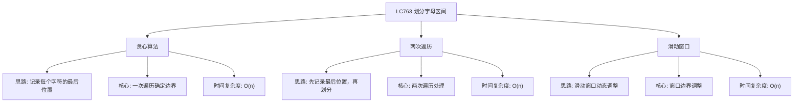

# 03-18-00-00 LC763_划分字母区间解法分析
## 题目描述
字符串 S 由小写字母组成。我们要把这个字符串划分为尽可能多的片段，同一字母最多出现在一个片段中。返回一个表示每个字符串片段的长度的列表。
**示例：**
输入：S = "ababcbacadefegdehijhklij"
输出：[9,7,8]
解释：
划分结果为 "ababcbaca", "defegde", "hijhklij"。
每个字母最多出现在一个片段中。
像 "ababcbacadefegde", "hijhklij" 的划分是错误的，因为划分的片段数较少。
## 解法概览
### 思维导图

## 记忆口诀
**贪心算法：** 记录字符最后位置，一次遍历确定边界。
**两次遍历：** 先记录后划分，两次遍历解决问题。
**滑动窗口：** 动态调整窗口，确保字符不重复。
## 不同解法
### 解法一：贪心算法（最优解）
#### 思路
使用贪心算法，首先记录每个字符在字符串中出现的最后位置。然后遍历字符串，维护当前片段的起始位置和结束位置。对于每个字符，更新当前片段的结束位置为该字符的最后位置和当前结束位置的最大值。当遍历到当前片段的结束位置时，完成一个片段的划分。
#### 核心公式
- last：记录每个字符的最后位置
- start：当前片段的起始位置
- end：当前片段的结束位置
- 对于每个字符 i：
  1. end = max(end, last[S.charAt(i) - 'a'])
  2. 如果 i == end，说明当前片段结束，添加片段长度 end - start + 1，更新 start = i + 1
#### 图解过程
以输入 "ababcbacadefegdehijhklij" 为例：
- 记录每个字符的最后位置：a:8, b:5, c:7, d:14, e:15, f:11, g:13, h:19, i:22, j:23, k:20, l:21
- 遍历过程：
  - i=0 (a): end=8
  - i=1 (b): end=8
  - i=2 (a): end=8
  - i=3 (b): end=8
  - i=4 (c): end=8
  - i=5 (b): end=8
  - i=6 (a): end=8
  - i=7 (c): end=8
  - i=8 (a): end=8，i==end → 添加9，start=9
  - i=9 (d): end=14
  - i=10 (e): end=15
  - i=11 (f): end=15
  - i=12 (e): end=15
  - i=13 (g): end=15
  - i=14 (d): end=15
  - i=15 (e): end=15，i==end → 添加7，start=16
  - i=16 (h): end=19
  - i=17 (i): end=22
  - i=18 (j): end=23
  - i=19 (h): end=23
  - i=20 (k): end=23
  - i=21 (l): end=23
  - i=22 (i): end=23
  - i=23 (j): end=23，i==end → 添加8
- 最终结果：[9,7,8]
#### 代码示例（带详细注释）
```java
public List<Integer> partitionLabels(String S) {
    List<Integer> result = new ArrayList<>();
    if (S == null || S.length() == 0) {
        return result;
    }
    
    // 记录每个字符的最后位置
    int[] last = new int[26];
    for (int i = 0; i < S.length(); i++) {
        last[S.charAt(i) - 'a'] = i;
    }
    
    int start = 0; // 当前片段的起始位置
    int end = 0;   // 当前片段的结束位置
    
    for (int i = 0; i < S.length(); i++) {
        // 更新当前片段的结束位置为该字符的最后位置
        end = Math.max(end, last[S.charAt(i) - 'a']);
        
        // 当遍历到当前片段的结束位置时，完成一个片段的划分
        if (i == end) {
            result.add(end - start + 1);
            start = i + 1;
        }
    }
    
    return result;
}
```
#### 复杂度分析
- 时间复杂度：O(n)，只需一次遍历字符串
- 空间复杂度：O(1)，只需要固定大小的数组存储字符最后位置
#### 优缺点
- **优点：**
  - 时间复杂度最优，只需一次遍历
  - 空间复杂度低，适合处理大规模数据
  - 代码简洁，逻辑清晰
- **缺点：** 无明显缺点，是本题的最优解法
### 解法二：两次遍历
#### 思路
首先遍历字符串，记录每个字符的最后位置。然后再次遍历字符串，维护当前片段的起始位置和结束位置，当遍历到当前片段的结束位置时，完成一个片段的划分。
#### 核心公式
- last：记录每个字符的最后位置
- start：当前片段的起始位置
- end：当前片段的结束位置
- 第一次遍历：记录每个字符的最后位置
- 第二次遍历：对于每个字符 i，更新 end = max(end, last[S.charAt(i) - 'a'])，当 i == end 时，添加片段长度
#### 图解过程
与解法一相同，只是将记录最后位置和划分片段分成两次遍历。
#### 代码示例
```java
public List<Integer> partitionLabels(String S) {
    List<Integer> result = new ArrayList<>();
    if (S == null || S.length() == 0) {
        return result;
    }
    
    // 第一次遍历：记录每个字符的最后位置
    int[] last = new int[26];
    for (int i = 0; i < S.length(); i++) {
        last[S.charAt(i) - 'a'] = i;
    }
    
    // 第二次遍历：划分片段
    int start = 0;
    int end = 0;
    for (int i = 0; i < S.length(); i++) {
        end = Math.max(end, last[S.charAt(i) - 'a']);
        if (i == end) {
            result.add(end - start + 1);
            start = i + 1;
        }
    }
    
    return result;
}
```
#### 复杂度分析
- 时间复杂度：O(n)，两次遍历字符串
- 空间复杂度：O(1)，只需要固定大小的数组存储字符最后位置
#### 优缺点
- 优点：逻辑清晰，易于理解
- 缺点：需要两次遍历，效率略低于解法一
### 解法三：滑动窗口
#### 思路
使用滑动窗口的思想，维护一个窗口，确保窗口内的所有字符的最后位置都在窗口内。当窗口的右边界等于当前窗口内所有字符的最远最后位置时，完成一个片段的划分。
#### 核心公式
- last：记录每个字符的最后位置
- left：窗口的左边界
- right：窗口的右边界
- 对于窗口内的每个字符，更新 right 为该字符最后位置的最大值
- 当 right == 当前位置时，完成一个片段的划分
#### 图解过程
与解法一类似，只是从滑动窗口的角度理解。
#### 代码示例
```java
public List<Integer> partitionLabels(String S) {
    List<Integer> result = new ArrayList<>();
    if (S == null || S.length() == 0) {
        return result;
    }
    
    // 记录每个字符的最后位置
    int[] last = new int[26];
    for (int i = 0; i < S.length(); i++) {
        last[S.charAt(i) - 'a'] = i;
    }
    
    int left = 0;
    int right = 0;
    
    for (int i = 0; i < S.length(); i++) {
        // 扩展窗口右边界
        right = Math.max(right, last[S.charAt(i) - 'a']);
        
        // 当窗口右边界等于当前位置时，完成一个片段的划分
        if (i == right) {
            result.add(right - left + 1);
            left = i + 1;
        }
    }
    
    return result;
}
```
#### 复杂度分析
- 时间复杂度：O(n)，只需一次遍历字符串
- 空间复杂度：O(1)，只需要固定大小的数组存储字符最后位置
#### 优缺点
- 优点：逻辑直观，容易理解
- 缺点：与解法一本质相同，只是理解角度不同
## 面试回答模板
**问题：** 请将字符串划分为尽可能多的片段，使得同一字母最多出现在一个片段中。
**回答：**
这是一道经典的贪心算法问题，主要有三种解法：
1. **贪心算法**：首先记录每个字符在字符串中出现的最后位置，然后遍历字符串，维护当前片段的起始位置和结束位置。对于每个字符，更新当前片段的结束位置为该字符的最后位置和当前结束位置的最大值。当遍历到当前片段的结束位置时，完成一个片段的划分。时间复杂度O(n)，是本题的最优解。
2. **两次遍历**：首先遍历字符串记录每个字符的最后位置，然后再次遍历字符串进行片段划分。时间复杂度O(n)，逻辑清晰但需要两次遍历。
3. **滑动窗口**：使用滑动窗口的思想，维护一个窗口，确保窗口内的所有字符的最后位置都在窗口内。当窗口的右边界等于当前窗口内所有字符的最远最后位置时，完成一个片段的划分。时间复杂度O(n)，逻辑直观。
**最优选择：** 贪心算法是本题的最优解，因为它在保证时间复杂度O(n)的同时，代码简洁且易于理解。面试中推荐使用贪心算法，既展示了对问题的深入理解，又能高效解决问题。
## 相关题目
1. **LC56：合并区间** - 区间合并问题
2. **LC435：无重叠区间** - 区间选择问题
3. **LC452：用最少数量的箭引爆气球** - 区间覆盖问题
4. **LC986：区间列表的交集** - 区间交集问题
这些题目都涉及到区间处理的思想，与LC763_划分字母区间有一定的关联性。