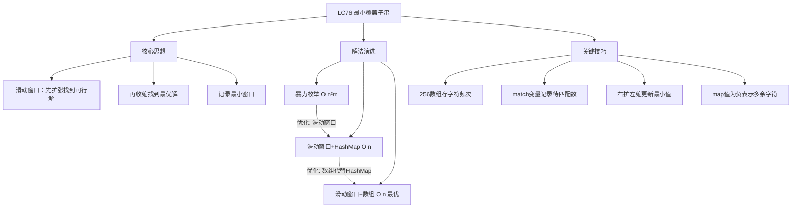
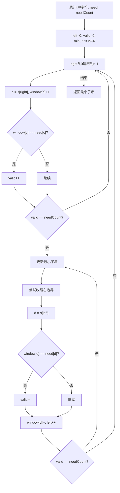

# LC76 最小覆盖子串
## 一、题目描述
给你一个字符串 `s`、一个字符串 `t`。返回 `s` 中涵盖 `t` 所有字符的**最小子串**。如果 `s` 中不存在涵盖 `t` 所有字符的子串，则返回空字符串 `""`。
**注意**：
- 如果 `s` 中存在这样的子串，我们保证它是唯一的答案
- `t` 中可能包含重复字符，子串中该字符数量必须不少于 `t` 中该字符数量
**示例：**
| 输入 | 输出 | 解释 |
|-----|------|------|
| s="ADOBECODEBANC", t="ABC" | "BANC" | 包含A、B、C的最小子串 |
| s="a", t="a" | "a" | 完全匹配 |
| s="a", t="aa" | "" | s中只有1个a，不够 |
**约束**：s 和 t 由英文字母组成
---
## 二、解法概览
### 解法对比表
| 解法 | 时间复杂度 | 空间复杂度 | 面试推荐 |
|------|-----------|-----------|---------|
| 暴力枚举 | O(n²×m) | O(m) | ❌ 不推荐 |
| 滑动窗口+HashMap | O(n+m) | O(m) | ✅ 推荐 |
| **滑动窗口+数组+match计数** | O(n+m) | O(1) | ✅ **最优解** |
> 注：n = s.length(), m = t.length()
### 思维导图

---
## 三、记忆口诀
```
最小覆盖子串怎么做？滑动窗口先扩后缩
右指针扩张找可行，左指针收缩找最优
match记录待匹配数，map存储字符频次
match为0说明覆盖了，收缩窗口找最小
map为负说明多余了，移动左边去掉它
```
---
## 四、解法一：暴力枚举（不推荐）
### 思路
枚举所有子串，检查每个子串是否包含t的所有字符，记录最小的那个。
### 核心公式
```
for i in range(n):
    for j in range(i, n):
        if contains(s[i:j+1], t):
            更新最小子串
```
### 图解过程
```
s = "ADOBECODEBANC", t = "ABC"
枚举所有子串：
i=0: "A", "AD", "ADO", "ADOB", "ADOBE", "ADOBEC"✓ ...
i=1: "D", "DO", ...
...
找到所有包含ABC的子串，取最小的
效率极低，会超时
```
### 代码示例
```java
public String minWindow(String s, String t) {
    int n = s.length(), m = t.length();
    String res = "";
    for (int i = 0; i < n; i++) {
        for (int j = i + m - 1; j < n; j++) {
            String sub = s.substring(i, j + 1);
            if (contains(sub, t)) {
                if (res.isEmpty() || sub.length() < res.length()) {
                    res = sub;
                }
                break;  // 找到最小的就break
            }
        }
    }
    return res;
}
private boolean contains(String sub, String t) {
    int[] count = new int[256];
    for (char c : t.toCharArray()) count[c]++;
    for (char c : sub.toCharArray()) count[c]--;
    for (int c : count) if (c > 0) return false;
    return true;
}
```
### 复杂度分析
- 时间复杂度：**O(n² × m)**，枚举子串O(n²)×检查O(m)
- 空间复杂度：**O(m)**，存储子串
### 优缺点
| 优点 | 缺点 |
|-----|------|
| 思路直观 | 时间复杂度高，会超时 |
---
## 五、解法二：滑动窗口 + HashMap（推荐 ✅）
### 思路
1. 用HashMap记录t中每个字符需要的数量
2. 右指针扩张窗口，直到包含t的所有字符
3. 左指针收缩窗口，找到最小的覆盖子串
4. 重复步骤2-3，直到右指针到达末尾
### 核心公式
```
need: t中每个字符需要的数量
window: 当前窗口中每个字符的数量
valid: 已满足条件的字符种类数
// 扩张
window[c]++
if window[c] == need[c]: valid++
// 收缩（当valid == need.size时）
if window[d] == need[d]: valid--
window[d]--
```
### 图解过程
以 `s = "ADOBECODEBANC"`, `t = "ABC"` 为例：
```
s的索引：A  D  O  B  E  C  O  D  E  B  A  N  C
         0  1  2  3  4  5  6  7  8  9  10 11 12
need = {A:1, B:1, C:1}, needCount = 3
━━━━━━━━━━━━━━━━━━━━━━━━━━━━━━━━━━━━━━━━━━━━━━━
第一阶段：右指针扩张，找到第一个可行解
right=0, 'A': A在need中，window={A:1}, valid=1
right=1, 'D': D不在need中，跳过，valid=1
right=2, 'O': O不在need中，跳过，valid=1
right=3, 'B': B在need中，window={A:1,B:1}, valid=2
right=4, 'E': E不在need中，跳过，valid=2
right=5, 'C': C在need中，window={A:1,B:1,C:1}, valid=3 ✓
  valid==needCount，找到可行解！
  当前窗口 "ADOBEC"，长度6，更新结果
  s: [A D O B E C] O D E B A N C
      ↑         ↑
    left=0   right=5
━━━━━━━━━━━━━━━━━━━━━━━━━━━━━━━━━━━━━━━━━━━━━━━
第二阶段：尝试收缩左边界
left=0, 移出'A': 
  window[A]=1 == need[A]=1，valid-- → valid=2
  window={A:0,B:1,C:1}
  valid=2 ≠ 3，停止收缩
  继续扩张右指针
━━━━━━━━━━━━━━━━━━━━━━━━━━━━━━━━━━━━━━━━━━━━━━━
继续扩张...
right=6, 'O': 不在need中，跳过
right=7, 'D': 不在need中，跳过
right=8, 'E': 不在need中，跳过
right=9, 'B': window={A:0,B:2,C:1}, valid=2（B超了不加valid）
right=10, 'A': window={A:1,B:2,C:1}, valid=3 ✓
  valid==needCount，找到可行解！
  s: A [D O B E C O D E B A] N C
      ↑                   ↑
    left=1             right=10
  尝试收缩...
━━━━━━━━━━━━━━━━━━━━━━━━━━━━━━━━━━━━━━━━━━━━━━━
收缩过程：
left=1, 'D': 不在need中，直接移出，left=2
left=2, 'O': 不在need中，直接移出，left=3
left=3, 'B': window[B]=2 > need[B]=1，移出后仍满足
  window={A:1,B:1,C:1}, valid=3，继续收缩，left=4
left=4, 'E': 不在need中，直接移出，left=5
left=5, 'C': window[C]=1 == need[C]=1
  移出会导致valid--，停止收缩前记录结果
  当前窗口 [5,10] = "CODEBANC"? 不对，需要重新算
  实际是 left=5 时还没移出C，窗口是 "CODEBA"
  ...继续扩张
━━━━━━━━━━━━━━━━━━━━━━━━━━━━━━━━━━━━━━━━━━━━━━━
right=11, 'N': 不在need中
right=12, 'C': window={A:1,B:1,C:2}, valid=3
  尝试收缩...
  一直收缩到 left=9
  窗口 [9,12] = "BANC"，长度4 < 6 ✓
  更新最小子串 = "BANC"
━━━━━━━━━━━━━━━━━━━━━━━━━━━━━━━━━━━━━━━━━━━━━━━
最终结果："BANC"
```
### 算法流程图

### 代码示例
```java
public String minWindow(String s, String t) {
    if (s.length() < t.length()) return "";
    Map<Character, Integer> need = new HashMap<>();
    Map<Character, Integer> window = new HashMap<>();
    for (char c : t.toCharArray()) {
        need.put(c, need.getOrDefault(c, 0) + 1);
    }
    int left = 0, valid = 0;
    int start = 0, minLen = Integer.MAX_VALUE;
    for (int right = 0; right < s.length(); right++) {
        char c = s.charAt(right);
        // 扩张窗口
        if (need.containsKey(c)) {
            window.put(c, window.getOrDefault(c, 0) + 1);
            if (window.get(c).equals(need.get(c))) {
                valid++;
            }
        }
        // 收缩窗口
        while (valid == need.size()) {
            // 更新最小子串
            if (right - left + 1 < minLen) {
                start = left;
                minLen = right - left + 1;
            }
            char d = s.charAt(left);
            if (need.containsKey(d)) {
                if (window.get(d).equals(need.get(d))) {
                    valid--;
                }
                window.put(d, window.get(d) - 1);
            }
            left++;
        }
    }
    return minLen == Integer.MAX_VALUE ? "" : s.substring(start, start + minLen);
}
```
### 复杂度分析
- 时间复杂度：**O(n + m)**，left和right各遍历一次
- 空间复杂度：**O(m)**，HashMap存储字符
### 优缺点
| 优点 | 缺点 |
|-----|------|
| 时间复杂度最优O(n) | HashMap有额外开销 |
| 逻辑清晰 | 代码较长 |
---
## 六、解法三：滑动窗口 + 数组 + match计数（最优解 ✅）
### 思路
用数组代替HashMap，用`match`变量记录**还需要匹配的字符总数**：
- 初始时`match = t.length()`
- 每匹配一个需要的字符，`match--`
- 当`match == 0`时，说明已经覆盖了t的所有字符
- 收缩窗口时，如果移出的是需要的字符，`match++`
**关键技巧**：
- `map[c] > 0`：字符c还需要匹配
- `map[c] == 0`：字符c刚好匹配
- `map[c] < 0`：字符c多余了
### 核心公式
```
// 初始化：map记录t中每个字符需要的数量，match = t.length()
// 扩张
if --map[c] >= 0: match--  // 匹配到需要的字符
// 收缩（当match == 0时）
while match == 0 && map[s[left]] < 0:  // 移除多余字符
    map[s[left]]++
    left++
if match == 0:  // 更新最小子串
    更新结果
```
### 图解过程
以 `s = "ADOBECODEBANC"`, `t = "ABC"` 为例：
```
初始：map[A]=1, map[B]=1, map[C]=1, 其他=0
      match = 3 (还需要匹配3个字符)
━━━━━━━━━━━━━━━━━━━━━━━━━━━━━━━━━━━━━━━━━━━━━━━
right=0, 'A'
    --map[A] = 0 >= 0 ✓ match=2
    s: [A] D O B E C O D E B A N C
        ↑
      left,right
━━━━━━━━━━━━━━━━━━━━━━━━━━━━━━━━━━━━━━━━━━━━━━━
right=1, 'D'
    --map[D] = -1 < 0，不是需要的字符
    match=2 不变
right=2, 'O'
    --map[O] = -1 < 0，不是需要的字符
    match=2 不变
━━━━━━━━━━━━━━━━━━━━━━━━━━━━━━━━━━━━━━━━━━━━━━━
right=3, 'B'
    --map[B] = 0 >= 0 ✓ match=1
right=4, 'E'
    --map[E] = -1 < 0
    match=1 不变
━━━━━━━━━━━━━━━━━━━━━━━━━━━━━━━━━━━━━━━━━━━━━━━
right=5, 'C'
    --map[C] = 0 >= 0 ✓ match=0
    match==0，找到可行解！
    检查是否有多余字符：
      map[A]=0, 不是<0，停止收缩
    更新结果 = "ADOBEC"，长度6
    s: [A D O B E C] O D E B A N C
        ↑         ↑
      left      right
━━━━━━━━━━━━━━━━━━━━━━━━━━━━━━━━━━━━━━━━━━━━━━━
right=6, 'O'
    --map[O] = -2
    match=0，仍然覆盖
    检查多余：map[A]=0，不是<0，停止
    更新结果 = "ADOBEC"（长度7>6，不更新）
... 继续 ...
━━━━━━━━━━━━━━━━━━━━━━━━━━━━━━━━━━━━━━━━━━━━━━━
right=9, 'B'
    --map[B] = -1
    match=0
    检查多余：map[A]=0，停止
    窗口 = "ADOBECODEB"
right=10, 'A'
    --map[A] = -1
    match=0
    检查多余：map[A]=-1 < 0 ✓
      map[A]++, left=1
      map[D]=-1 < 0 ✓
      map[D]++, left=2
      ...一直收缩...
      left=9, map[B]=0，停止
    更新结果 = "BANC"，长度4 < 6 ✓
    s: A D O B E C O D E [B A N C]
                          ↑     ↑
                        left  right
━━━━━━━━━━━━━━━━━━━━━━━━━━━━━━━━━━━━━━━━━━━━━━━
最终结果："BANC"
```
### map值的含义
| map[c]的值 | 含义 |
|-----------|------|
| > 0 | 字符c还需要匹配map[c]个 |
| == 0 | 字符c刚好匹配完 |
| < 0 | 字符c多余了\|map[c]\|个 |
### 代码示例
```java
public String minWindow(String s, String t) {
    if (s == null || t == null || s.length() < t.length()) {
      return "";
    }
    // 初始化：记录需要的数量
    int[] map = new int[256];
    for (char c : t.toCharArray()) {
      map[c]++;
    }

    int left = 0;
    int matchCount = t.length();// 字符总数（不去重）
    int start = 0, minLen = Integer.MAX_VALUE;

    for (int i = 0; i < s.length(); i++) {
      char c = s.charAt(i);

      // 扩张：如果是需要的字符，match--
      if (map[c] > 0) {
        matchCount--;
      }
      map[c]--;

      // 当所有字符都匹配上时，尝试收缩
      while (matchCount == 0) {
        // 更新最小窗口
        if (i - left + 1 < minLen) {
          start = left;
          minLen = i - left + 1;
        }

        // 收缩：移出左边字符
        char d = s.charAt(left);
        map[d]++;
        if (map[d] > 0) {
          // 移出后 map[d] > 0，说明又缺这个字符了
          matchCount++;
        }
        left++;
      }
    }

    return minLen == Integer.MAX_VALUE ? "" : s.substring(start, start + minLen);
}
```
### 复杂度分析
- 时间复杂度：**O(n + m)**，left和right各遍历一次
- 空间复杂度：**O(1)**，固定256大小数组
### 优缺点
| 优点 | 缺点 |
|-----|------|
| 时间O(n)，空间O(1) | 需要理解map负值含义 |
| 代码简洁高效 | 逻辑稍复杂 |
| 数组访问比HashMap快 | - |
### 与HashMap版本的对比
| 对比项 | HashMap版本 | 数组版本 |
|-------|------------|---------|
| 判断覆盖 | valid == need.size() | match == 0 |
| 判断多余 | window[c] > need[c] | map[c] < 0 |
| 空间 | O(m) | O(1) 固定256 |
| 速度 | 较慢 | 更快 |
---
## 七、面试回答模板
### 1. 开场：理解题意
> 这道题要在s中找一个最短的子串，使得这个子串包含t中所有字符（包括重复的）。
### 2. 思路：滑动窗口
> 我用滑动窗口来解决。核心思想是"先扩张找可行解，再收缩找最优解"。
### 3. 核心逻辑
> 用一个数组记录t中每个字符需要的数量。右指针扩张窗口，每遇到需要的字符就减少待匹配数。当待匹配数为0时，说明已经覆盖了t的所有字符。这时尝试收缩左指针，移除多余字符，更新最小子串。
### 4. 关键技巧（如果面试官问）
> map数组的值有三种状态：正数表示还需要匹配，0表示刚好匹配，负数表示多余了。这样可以快速判断是否需要收缩。
### 5. 复杂度
> 时间复杂度O(n+m)，因为左右指针各遍历一次。空间复杂度O(1)，使用固定大小256的数组。
---
## 八、相关题目
| 题号 | 题目 | 关系 | 难度 |
|-----|------|------|-----|
| LC3 | 无重复字符的最长子串 | 滑动窗口基础 | 中等 |
| LC209 | 长度最小的子数组 | 滑动窗口找最小 | 中等 |
| LC438 | 找到字符串中所有字母异位词 | 固定窗口滑动 | 中等 |
| LC567 | 字符串的排列 | 判断是否包含排列 | 中等 |
| LC30 | 串联所有单词的子串 | 滑动窗口变体 | 困难 |
