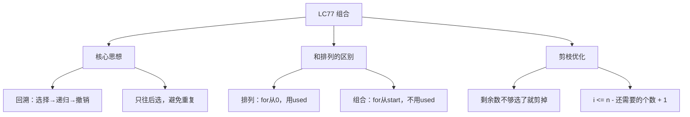
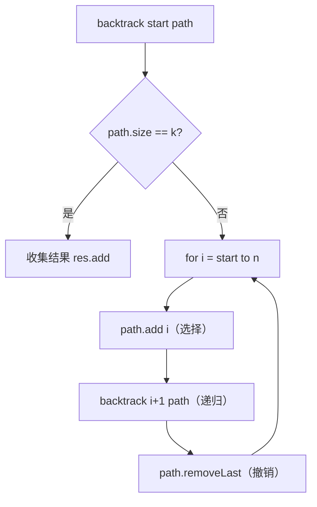

# LC77 组合
## 一、题目描述
给定两个整数 `n` 和 `k`，返回范围 `[1, n]` 中所有可能的 `k` 个数的组合。可以按任何顺序返回答案。
**示例：**
```
输入：n = 4, k = 2
输出：[[1,2],[1,3],[1,4],[2,3],[2,4],[3,4]]
从1到4中选2个数，不考虑顺序，共C(4,2)=6种
注意：[1,2]和[2,1]是同一个组合，只出现一次
```
**约束：**
- 1 <= n <= 20
- 1 <= k <= n
---
## 二、解法概览
### 解法对比表
| 解法 | 时间复杂度 | 空间复杂度 | 面试推荐 |
|------|-----------|-----------|---------|
| **回溯（基础版）** | O(C(n,k)×k) | O(k) | ✅ **首选** |
| 回溯 + 剪枝 | O(C(n,k)×k) | O(k) | ✅ **最优** |
### 与 LC46（全排列）的区别
```
LC46 排列：[1,2] 和 [2,1] 不同 → for从0开始 + used标记
LC77 组合：[1,2] 和 [2,1] 相同 → for从start开始（只往后选）
只改了 for 循环的起点，框架完全一样
```
### 思维导图

---
## 三、记忆口诀
```
组合回溯从start选，只往后面不回头
选够k个就收集，回溯撤销试下一个
剪枝优化看剩余，不够选了就别试
```
---
## 四、解法一：回溯基础版（首选 ✅）
### 思路
和排列的回溯框架一样，唯一区别是 **for 循环从 start 开始**，保证只往后选，避免 [1,2] 和 [2,1] 重复。
### 核心公式
```
backtrack(start, path):
  if path.size() == k → 收集结果
  for i = start to n:        ← 从start开始，不回头
    path.add(i)              // 选择
    backtrack(i + 1, path)   // 递归（下一层从i+1开始）
    path.removeLast()        // 撤销
```
### 为什么 for 从 start 开始就不会重复？
```
n=4, k=2
如果 for 从 1 开始（排列方式）：
  选1 → 选2 → [1,2]
  选2 → 选1 → [2,1]  ← 重复了！
如果 for 从 start 开始（组合方式）：
  start=1: 选1 → start变2 → 只能选2,3,4
  start=2: 选2 → start变3 → 只能选3,4
  选了1之后，永远不会回头选比1小的 → 不会出现[2,1]
就像排队：选了第2个人之后，只从第3个人开始看，不回头
```
### 图解过程（决策树）
```
n=4, k=2
                        []
            /       /      \       \
          [1]     [2]      [3]     [4]
        / | \    / \        |
     [1,2][1,3][1,4] [2,3][2,4]  [3,4]
每条从根到叶的路径（path.size==k）= 一个组合
注意：[2]后面只能选3,4（不能回头选1）
      [3]后面只能选4
      [4]后面没得选了
结果：[1,2],[1,3],[1,4],[2,3],[2,4],[3,4] → 6个 = C(4,2)
```
### 算法流程图

### 代码示例
```java
public List<List<Integer>> combine(int n, int k) {
    List<List<Integer>> res = new ArrayList<>();
    List<Integer> path = new ArrayList<>();
    backtrack(n, k, 1, path, res);
    return res;
}
private void backtrack(int n, int k, int start,
                       List<Integer> path, List<List<Integer>> res) {
    // 选够了k个，收集结果
    if (path.size() == k) {
        res.add(new ArrayList<>(path));
        return;
    }
    // 从start开始，只往后选
    for (int i = start; i <= n; i++) {
        path.add(i);                          // 选择
        backtrack(n, k, i + 1, path, res);    // 递归（下一层从i+1开始）
        path.remove(path.size() - 1);         // 撤销
    }
}
```
### 复杂度分析
- 时间复杂度：**O(C(n,k) × k)**，C(n,k)个组合，每个复制O(k)
- 空间复杂度：**O(k)**，path + 递归栈深度
### 优缺点
| 优点 | 缺点 |
|-----|------|
| 代码简单 | 有些分支明显不可能成功也会尝试 |
| 通用模板 | 可以剪枝优化 |
---
## 五、解法二：回溯 + 剪枝（最优 ✅）
### 思路
在基础版上加一个**剪枝**：如果剩余的数不够凑齐 k 个了，直接跳过不用递归。
### 剪枝条件怎么推导？
```
当前已选了 path.size() 个
还需要选 k - path.size() 个
从 i 到 n 还有 n - i + 1 个数可选
如果 n - i + 1 < k - path.size()：剩余的不够选了，剪掉！
等价于：i > n - (k - path.size()) + 1 时就可以停了
简化：for 循环的上界从 n 变成 n - (k - path.size()) + 1
```
### 图解剪枝效果
```
n=4, k=3（选3个）
不剪枝的决策树：               剪枝后：
      []                           []
   / / \ \                      / / \
  1  2  3  4                   1  2  ×(3和4开头凑不齐3个)
 /|\ /\  |
1,2 .. 2,3 3,4               1   1
 |                           /|\  |
...                         1,2 1,3 1,4  2,3 2,4
                             |    |   ×    |    ×
                           1,2,3 1,3,4   2,3,4
start=3 时，还需要选3个但只剩3,4两个数 → 不够 → 剪掉
start=4 时，只剩4一个数 → 更不够 → 剪掉
```
### 代码示例
```java
public List<List<Integer>> combine(int n, int k) {
    List<List<Integer>> res = new ArrayList<>();
    List<Integer> path = new ArrayList<>();
    backtrack(n, k, 1, path, res);
    return res;
}
private void backtrack(int n, int k, int start,
                       List<Integer> path, List<List<Integer>> res) {
    if (path.size() == k) {
        res.add(new ArrayList<>(path));
        return;
    }
    // 剪枝：i 最大只能到 n - (还需要选的个数) + 1
    int need = k - path.size();  // 还需要选几个
    for (int i = start; i <= n - need + 1; i++) {  // ← 上界缩小了
        path.add(i);
        backtrack(n, k, i + 1, path, res);
        path.remove(path.size() - 1);
    }
}
```
### 剪枝前后对比
```
n=20, k=3
不剪枝：for i = start to 20
  当 start=19 时还会尝试，但最多只能选19,20两个，凑不齐3个 → 浪费
剪枝：for i = start to 20 - (3 - path.size()) + 1
  当 path.size=0, need=3 → i 最大到 18（18,19,20刚好3个）
  当 path.size=1, need=2 → i 最大到 19（19,20刚好2个）
  当 path.size=2, need=1 → i 最大到 20（20刚好1个）
```
### 复杂度分析
- 时间复杂度：**O(C(n,k) × k)**，剪枝减少了无效递归但不改变量级
- 空间复杂度：**O(k)**
### 优缺点
| 优点 | 缺点 |
|-----|------|
| 实际运行更快 | 剪枝条件需要推导 |
| 减少无效递归 | 无 |
---
## 六、排列 vs 组合 代码对比
```java
// LC46 排列                           // LC77 组合
for (int i = 0; i < n; i++) {         for (int i = start; i <= n; i++) {
    if (used[i]) continue;                path.add(i);
    path.add(nums[i]);                    backtrack(i+1, path);
    used[i] = true;                       path.removeLast();
    backtrack(path, used);            }
    path.removeLast();
    used[i] = false;
}
```
| 区别 | 排列 | 组合 |
|------|------|------|
| for起点 | `i=0`（从头选） | `i=start`（不回头） |
| 防重复 | `used[i]` | 天然不重复 |
| 原因 | [1,2]≠[2,1]，每个位置都能选任何未用的 | [1,2]=[2,1]，只往后选 |
---
## 七、面试回答模板
### 1. 开场：理解题意
> 从1到n中选k个数的所有组合，不考虑顺序，[1,2]和[2,1]算同一个。
### 2. 思路：回溯
> 回溯框架，和排列的区别是 for 循环从 start 开始只往后选，保证不重复。每层选一个数，递归下一层从 i+1 开始，选够 k 个就收集。
### 3. 剪枝优化
> 如果剩余的数不够凑齐 k 个，直接跳过。for 循环上界从 n 改为 `n - (k - path.size()) + 1`。
### 4. 复杂度
> 时间 O(C(n,k)×k)，空间 O(k)。
---
## 八、相关题目
| 题号 | 题目 | 关系 | 难度 |
|-----|------|------|-----|
| LC46 | 全排列 | 排列版（for从0+used） | 中等 |
| LC78 | 子集 | 子集版（每个节点都收集） | 中等 |
| LC39 | 组合总和 | 组合+可重复选 | 中等 |
| LC40 | 组合总和II | 组合+有重复元素 | 中等 |
| LC216 | 组合总和III | 1-9中选k个和为n | 中等 |
| LC17 | 电话号码的字母组合 | 多组选择的组合 | 中等 |